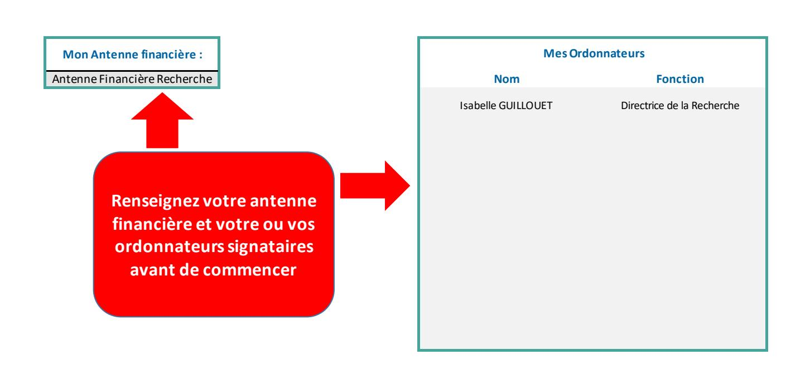
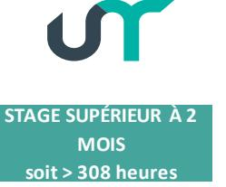

## Certificat administratif

Gratification de stage en milieu professionnel aux étudiants de l'enseignement supérieur

| No                              |                                                                                      |                                                 |                                                                                                                    |                                                                                     |                                                                       |               |  |
|---------------------------------|--------------------------------------------------------------------------------------|-------------------------------------------------|--------------------------------------------------------------------------------------------------------------------|-------------------------------------------------------------------------------------|-----------------------------------------------------------------------|---------------|--|
| Eta                             | riode du stage                                                                       | 01/01/2026                                      | au                                                                                                                 | 15/04/2026                                                                          |                                                                       | Janvier       |  |
| Etablissement d'origine         |                                                                                      |                                                 | <del>-</del> \                                                                                                     |                                                                                     |                                                                       |               |  |
|                                 | R d'origine (si étudiant : ructure d'accueil à l'un                               |                                                 |                                                                                                                    | ŀ                                                                                   |                                                                       |               |  |
|                                 | mbre total d'heures du                                                               | i                                               | 510                                                                                                                | ] '                                                                                 | Convention datée du                                                   |               |  |
| ▶ Le                            | stage déclenche des g                                                                | ratifications. C                                | hoisir le mod                                                                                                      | e de paiement                                                                       |                                                                       |               |  |
|                                 |                                                                                      |                                                 |                                                                                                                    |                                                                                     | Choix du mode c                                                       | ·             |  |
|                                 |                                                                                      |                                                 |                                                                                                                    |                                                                                     | Paiement lissé  Paiement réel                                         |               |  |
|                                 | Taux horaire en vigueu                                                               | r (01/01/2026)                                  | 4,50 €                                                                                                             |                                                                                     | Palement reel                                                         |               |  |
|                                 | OPTION PA                                                                            | IEMENT LISSE                                    |                                                                                                                    |                                                                                     | OPTION PAIEMENT REEI                                                  |               |  |
|                                 | ordonnateur choisit de rép ersant tous les mois le mê de                       | 0                                               | L'ordonnateur choisit de verser chaque mois le montant exact des heures réellement effectuées par le stagiaire. |                                                                                     |                                                                       |               |  |
| No                              | mbre de mois de la pé                                                                | riode 3                                         |                                                                                                                    | Nombre d'heur                                                                       | 154                                                                   |               |  |
| Мо                              |                                                                                      | mois                                            | - €                                                                                                                | Montant à vers                                                                      | 693,00 €                                                              |               |  |
| 104                             | d.04€ par mois. Ontant à rembourser au UR À 2 Eures Si le stag l'ordonna | pedom DEDOM NE PERME ge a une durée co | IMAGEMENT ST PAS LE VER                                                                                            | erné  SI LE NOMBRE D SEMENT DE GR. In minimum de 15: dédommagement temporis au-delà | ATIFICATION  4 heures et un maximum de de 200 euros pour 154 heure  . | e 308 heures, |  |
|                                 | TOTAL DU                                                                             | VERSEMENT                                       | A EFFECTUE                                                                                                         | R                                                                                   | 693,00 €                                                              |               |  |
| D 1                             |                                                                                      |                                                 | Ī                                                                                                                  | D                                                                                   | ate de signature                                                      | _             |  |
| Bon de comma Centre Financie |                                                                                      |                                                 |                                                                                                                    |                                                                                     |                                                                       |               |  |
| PFI                             |                                                                                      |                                                 |                                                                                                                    |                                                                                     | L'ordonnateur                                                         |               |  |
| Imput. Gratificat               |                                                                                      | ar XD32                                         |                                                                                                                    | Isal                                                                                | belle GUILLOUET                                                       |               |  |
| Imput. Trajet                   |                                                                                      | par XD35                                        |                                                                                                                    |                                                                                     |                                                                       |               |  |
| Imput. Dédomma                  | agement 6214 p                                                                       | ar XD32                                         |                                                                                                                    |                                                                                     |                                                                       |               |  |
|                                 |                                                                                      |                                                 |                                                                                                                    |                                                                                     |                                                                       |               |  |

## Certificat administratif

Pour frais de réception compte 6257 GM AA.64 Services de restauration extérieurs (restaurants) GM AA.63 Services Traiteurs / Plateaux repas GM CB.21 Communication : Traiteur pour manif événementielles GM CB.22 Communication : Restauration pour manif événementielles

Je sousigné.e, Isabelle GUILLOUET, Directrice de la Recherche de l'Université de Tours, certifie qu'il y a lieu de procéder au règlement de la facture relative à la réception suivante :

| Date de la réception :             | 01/01/2025 jj/mm/aaaa               |  |  |  |  |  |
|------------------------------------|-------------------------------------|--|--|--|--|--|
| Motif:                             | Réception du comité de              |  |  |  |  |  |
| N° du bon de commande :            | 4500350350 4500xxxxxx               |  |  |  |  |  |
| Nom du fournisseur :               | 1748 - La Guinguette de Rochecorbon |  |  |  |  |  |
| Liste des participants (NOM Prénor |                                     |  |  |  |  |  |
| Personnel de l'Université          | e : Personnes extérieures :         |  |  |  |  |  |
| Informations complémentaires :     |                                     |  |  |  |  |  |
|                                    | Date de signature                   |  |  |  |  |  |
|                                    | 01/01/2025                          |  |  |  |  |  |
|                                    | L'ordonnateur                       |  |  |  |  |  |
|                                    |                                     |  |  |  |  |  |

## Liquidation directe c/65781100, c/65781200, c/65781800

| Fournisseur | Nº fournisseur SIFAC | compte général | code TVA | Centre de coûts | Domaine d'activité | Eotp | Fonds | Domaine fonctionnel | Montant |
|-------------|----------------------|----------------|----------|-----------------|-----------------------|------|-------|------------------------|---------|
|             |                      |                |          |                 |                       |      |       |                        |         |
|             |                      |                |          |                 |                       |      |       |                        |         |
|             |                      |                |          |                 |                       |      |       |                        |         |
|             |                      |                |          |                 |                       |      |       |                        |         |
|             |                      |                |          |                 |                       |      |       |                        |         |
|             |                      |                |          |                 |                       |      |       |                        |         |
|             |                      |                |          |                 |                       |      |       |                        |         |
|             |                      |                |          |                 |                       |      |       |                        |         |
|             |                      |                |          |                 |                       |      |       |                        |         |
|             |                      |                |          |                 |                       |      |       |                        |         |

- €