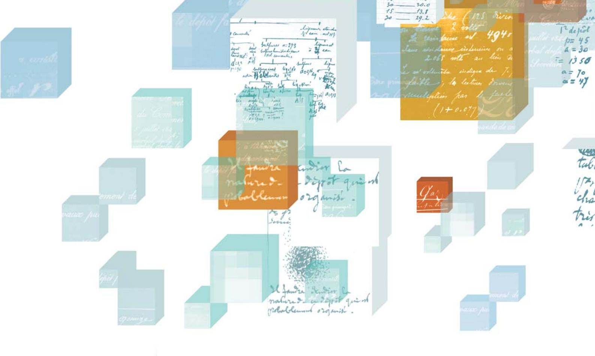

# Le cahier de laboratoire national Pourquoi l'utiliser?

# Un outil multiple et complet, au service de toutes les facettes de la recherche

Le cahier de laboratoire est l'un des outils quotidiens du chercheur. Il lui permet d'enregistrer au jour le jour tous ses travaux: il rend compte du cheminement et de l'expérimentation scientifique, de l'idée à la conclusion.

Le cahier de laboratoire est d'abord et avant tout un moyen d'assurer la traçabilité des travaux de recherche, composante reconnue des bonnes pratiques de recherche. De par cette fonction, le cahier de laboratoire remplit plusieurs objectifs.

Il s'agit du « cahier d'expérience », du « cahier de manip » ou encore du « cahier d'enregistrement », traditionnel et familier au chercheur mais sous une présentation plus complète dans son contenu, et plus formalisée, afin de répondre au mieux aux exigences de la recherche internationale.

| Outil scientifique, il p | ermet: |
|--------------------------|--------|
|--------------------------|--------|

| de capitaliser les savoirs et les savoir-faire d'un chercheur, d'un laboratoire; c'est un outil |
|-------------------------------------------------------------------------------------------------|
| de <b>mémoire</b> des choix effectués, des expériences infructueuses ou des hypothèses          |
| abandonnées ; il évite de recommencer des expériences déjà faites ou les pertes                 |
| d'informations, par exemple liées au départ d'un stagiaire, d'un doctorant;                     |
| de favoriser et faciliter la transmission des connaissances, des méthodes, des compétences      |
| que ce soit en interne entre chercheurs et étudiants, ou vers l'extérieur en facilitant la      |
| rédaction des publications, exposés, thèses, rapports d'activité ou encore des brevets;         |
| de garantir <b>la continuité</b> des travaux et du cheminement intellectuel.                    |

# Outil de « bonnes pratiques de partenariat », il permet:

| _ |                                                                                           |
|---|-------------------------------------------------------------------------------------------|
|   | d'identifier des connaissances ou savoir-faire préexistants à un contrat et développés    |
|   | durant ce contrat (par exemple pour les contrats européens);                              |
|   | d'estimer plus précisément la contribution scientifique et technique de chaque partenaire |
|   | dans le cadre d'une collaboration;                                                        |
|   | de justifier des <b>moyens</b> engagés en termes de personnels, de temps, de financement, |
|   | et donc de démontrer l'exécution des engagements de chaque partenaire. Il s'agit d'une    |
|   | exigence accrue – et justifiée – des financeurs publics comme privés.                     |

Outil juridique, le cahier de laboratoire, utilisé de façon rigoureuse, est, par son formalisme, un élément de preuve de l'authenticité, de l'originalité et de la paternité des résultats. Il permet:

| d'établir la date d'acquisition des résultats;                     |
|--------------------------------------------------------------------|
| ☐ de justifier de la qualité <b>d'inventeur</b> ou d'auteur;       |
| de déterminer la propriété des droits sur un résultat de recherche |

Il peut donc être utilisé en cas de litige pour une publication, un brevet, voire une contrefaçon.

En droit de la propriété industrielle, le titulaire d'un brevet bénéficie du monopole d'exploitation de l'invention décrite dans le brevet, pour un territoire considéré. En Europe, une invention appartient au premier déposant d'un brevet, d'où l'importance de ne pas divulguer les travaux que l'on souhaite protéger. Aux États-Unis, l'invention appartient au premier inventeur. Lorsqu'une même invention est revendiquée par deux entités différentes, l'Office américain des brevets peut être amené à utiliser les cahiers de laboratoire pour déterminer qui est le premier inventeur, et donc l'entité qui sera titulaire du brevet (procédure dite d'interférence).

Il permet de justifier, si nécessaire, les parts de propriété de l'invention, et donc la prise en charge respective des coûts de la propriété industrielle et la répartition des retours financiers entre les bénéficiaires (inventeurs, laboratoires, établissements).

Outil d'une démarche qualité en recherche, il permet de garantir la manière dont les résultats ont été obtenus, même et surtout s'ils sont inattendus, et d'assurer la reproductibilité des expérimentations.

### Queloues exemples de l'intérêt du cahier de laboratoire

#### Des témoignages au quotidien

#### François, chercheur, bioinformatique (Clermont-Ferrand)

« Pour un modélisateur, plus souvent devant son ordinateur qu'à la paillasse ou sur le terrain, l'usage du cahier de laboratoire peut surprendre. Pourtant, après deux ans d'utilisation, je peux confirmer que les cahiers m'aident à faire un travail de recherche de meilleure qualité. À mon sens, pour un informaticien, l'intérêt principal du cahier de laboratoire est d'assurer la traçabilité des programmes développés et des simulations réalisées. À chaque projet son cahier, sur lequel je garde trace de chaque simulation ou calcul effectué: avec quel code de calcul, quels paramètres, et dans quels fichiers sont sauvés les résultats. C'est indispensable pour s'y retrouver quand on lance un grand nombre de calculs. Si, six mois plus tard, j'ai besoin de ces résultats pour rédiger un rapport ou un article, je gagne du temps pour les retrouver et je suis sûr de ne pas me tromper. Pour le développement de programmes, de la même façon, ie garde trace des différentes versions et des bugs corrigés. Je concois également le cahier de laboratoire comme le lieu où conserver la mémoire des concepts, des guestions, des idées apparus dans un projet. Pour un modélisateur, l'étape de conception du modèle est essentielle : bien avant les questions techniques, c'est là que se posent les questions scientifiques, et que se jouent l'objectif du modèle, le choix des objets et de leurs relations. Après, on risque de se perdre dans les contraintes informatiques et d'oublier certains de ces points. J'aime noter dans le cahier les débats d'idées, les pistes explorées puis abandonnées, les choix réalisés, qui donnent sens à un projet. Et si le projet doit changer de main, ces informations seront inestimables... c'est tellement pénible de devoir reprendre un projet à zéro, suite au départ d'un collègue, sans aucune information! »

#### Tiphaine, chercheuse, biophysique (Rennes)

« Bien qu'un grand nombre de mesures et le paramétrage de leur acquisition soient aujourd'hui enregistrés de manière électronique, il reste encore un certain nombre de données à relever à la main. Le rôle du cahier de laboratoire est de les consigner, assurant ainsi une fonction "mémoire" au moment des analyses ultérieures. Ces données sont, chez nous, en grande partie enregistrées dans des tableaux pré-établis, afin de quider la saisie et d'éviter les oublis ; les feuilles volantes sont ensuite collées dans le cahier de laboratoire. Mais d'autres types de données ne peuvent pas être enregistrés de cette facon et elles sont directement écrites sur les pages du cahier: la localisation de prélèvements (avec un croquis et des relevés de dimension), des observations visuelles, des anomalies en cours d'expérimentation, la signalisation d'étapes accomplies avec succès dans le protocole, etc. Dans ce contexte, le cahier de laboratoire a une fonction de "document maître", dans lequel nous suivons l'expérimentation, de ses objectifs et protocoles (impression et collage de documents électroniques) jusqu'à ses résultats (avec la spécification de l'emplacement des fichiers "résultats" dans l'arborescence informatique) en passant par sa réalisation. »

#### Mireille, technicienne, ingénierie (Rennes)

« Dans notre équipe, nous utilisons les cahiers de laboratoire depuis 2002 (avant, c'était sur des cahiers du commerce). Bien pratique car rattaché à un projet ou une expérimentation, le cahier permet un meilleur suivi et donc une bonne tracabilité. Utile et indispensable pour l'encadrement des stagiaires qui sont tenus également de le remplir, facilitant ainsi le retour sur les données acquises par le stagiaire une fois celui-ci parti. Nous le joignons d'ailleurs au livret d'accueil. »

#### Pierre, stagiaire Master

« Au cours de mon stage, la phase d'acquisition de données puis celle de leur traitement ont fait l'objet, chaque jour, de notes précieuses. Quel confort de travail lorsqu'il faut analyser ces données! Le cahier, s'il est bien renseigné, est la mémoire fidèle du travail fait sur le terrain, notamment lorsqu'il faut rédiger le rapport de stage. »

#### De la nécessité d'avoir un cahier de laboratoire

Si ces exemples sont « anonymés » pour des raisons de confidentialité, ils n'en sont pas moins authentiques.

Un chercheur du laboratoire « Découverte » constate, en lisant des articles qui lui sont soumis pour revue, qu'il s'agit de résultats présentés par l'un de ses anciens doctorants, parti en post-doc à l'étranger l'année précédente. Bien que les articles portent sur ses travaux de thèse, il n'est fait aucune mention du laboratoire « Découverte » mais uniquement du laboratoire d'accueil actuel. Renseignements pris, six publications sur ces mêmes sujets sont en cours de validation, toujours sans mention du laboratoire « Découverte ». Après vérification, les cahiers de laboratoire numérotés 133 à 140, remis au doctorant au cours de sa thèse, ne figurent pas dans les archives du laboratoire : il est donc parti avec les originaux et non avec une simple copie personnelle. Lors d'un contact avec l'intéressé, celui-ci déclare ne pas avoir utilisé les cahiers pour son travail de thèse. La restitution des cahiers vierges lui est donc demandée : il reconnaît alors s'en être servi. Le laboratoire étranger est contacté pour l'informer de la situation. Finalement, le laboratoire « Découverte » a été rétabli dans ses droits et a été cité sur les six publications.

Dans le cadre d'une collaboration avec un industriel, des résultats sont obtenus par le laboratoire « Savoir-faire ». L'entreprise est informée grâce aux échanges réguliers qu'elle a avec les chercheurs. Lors d'une discussion à propos d'une exploitation potentielle, la société déclare qu'elle connaissait déjà ces résultats avant cette collaboration : surprise des chercheurs, qui n'avaient jamais eu connaissance que l'entreprise ait en sa possession de telles données. Le laboratoire « Savoir-faire » signale qu'il utilise des cahiers de laboratoire pour tous ses travaux et qu'il peut donc prouver à quelles dates et dans quelles conditions les résultats ont été obtenus. La société est invitée à apporter les preuves de la possession antérieure desdits résultats ainsi que de leur date d'obtention. Finalement, les représentants de l'entreprise reconnaissent que certains résultats pourraient être nouveaux et des négociations pour leur exploitation sont alors engagées.

## Pourquoi un cahier de laboratoire national?

Le cahier de laboratoire fait partie des outils classiques du chercheur. Il est déjà en place depuis plusieurs années dans différents établissements de recherche publics, laboratoires et universités.

Alors pourquoi concevoir un cahier de laboratoire national?

Cette action permet d'adresser un message fort à la communauté scientifique pour l'adoption de cet outil de traçabilité. Elle a pour objectif d'aider à généraliser et à harmoniser l'utilisation du cahier de laboratoire, afin de répondre à plusieurs enjeux très sensibles pour la recherche française.

Par l'image de rigueur, de fiabilité, de responsabilité qu'il véhicule, il place les laboratoires dans une position d'éligibilité renforcée dans un contexte de forte compétitivité scientifique:

- □ il répond à un standard international en termes de bonnes pratiques professionnelles,
- □ il donne confiance aux commanditaires nationaux et internationaux de la recherche,
- □ il contribue à l'image d'excellence de la recherche française.

Le cahier de laboratoire national répond aussi à un enjeu d'identification, de capitalisation et de conservation du patrimoine intellectuel des établissements de recherche français.

C'est un élément clé d'une politique de protection et de valorisation des résultats de la recherche. Le cahier de laboratoire fait d'ailleurs partie des préconisations du ministère délégué à l'Enseignement supérieur et à la recherche, dans le cadre de l'adoption d'une Charte de la propriété intellectuelle par les organismes.

## Contacts

Cette plaquette, la plaquette intitulée « Le cahier de laboratoire national: comment l'utiliser? », une présentation projetable (et modifiable) « PowerPoint », ainsi que des renseignements sur les démarches qualité en recherche ou les démarches de valorisation de vos établissements sont disponibles sur les sites suivants:

Site du ministère de la Recherche: www.recherche.gouv.fr

Sites des services de valorisation ou des services qualité des établissements de recherche publics (CNRS, Inra, Inserm, universités...)

Site de l'Inoi:

www.inpi.fr/Découvrir la propriété industrielle/Recherche et propriété industrielle

