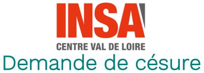
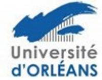
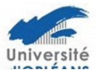

## Demande de césure aux conditions générales de réalisation du doctorat

Sur demande motivée du doctorant/de la doctorante, une année de césure peut être accordée par décision du Choisissez un élément. sur avis du directeur/de la directrice de thèse et du directeur/de la directrice de l'école doctorale (arrêté du 25 mai 2016, modifié le 26 août 2022, article 14).

La césure est insécable, d'une durée maximale d'une année et non renouvelable.

Cette période de césure n'est pas destinée au travail de recherche au sein du laboratoire de rattachement.

L'établissement garantit la réinscription du doctorant/de la doctorante au sein de la formation doctorale à l'issue de cette période.

L'année de césure n'est pas comptabilisée dans la durée de la thèse.

Toute demande devra faire l'objet d'une étude par le bureau de l'école doctorale.

| Ecole doctorale : ☐ EMSTU ☐ H&L ☐ MIPTIS ☐ SSBCV ☐ SSTED                                                                                          |                                |             |                                      |  |
|---------------------------------------------------------------------------------------------------------------------------------------------------|--------------------------------|-------------|--------------------------------------|--|
| Nom du ou des directeur(s)/directrice(s) de thèse : Cliquez ici pour taper du texte.                                                              |                                |             |                                      |  |
| Discipline du doctorat : Cliquez ici pour taper du texte.                                                                                         |                                |             |                                      |  |
| Unité de recherche : Cliquez ici pour taper du texte.                                                                                             |                                |             |                                      |  |
| Nom du directeur/directrice d'unité de recherche : Cliquez ici pour taper du texte.                                                               |                                |             |                                      |  |
| Type de financement                                                                                                                               | :                              |             |                                      |  |
| ☐ Contrat doctoral ☐ Autre                                                                                                                     | ☐ Convention☐ Sans financement |             | ☐ Contrat IGE                        |  |
| Si cotutelle de thèse nom de l'université partenaire : <i>(Avenant à la cotutelle à fournir)</i>                                                  |                                |             |                                      |  |
| N° étudiant(e) : Cliquez ici pour taper du texte.                                                                                                 |                                |             |                                      |  |
| Nom: Cliquez ici pour tap                                                                                                                         | er du texte.                   | Nom d'usage | e : Cliquez ici pour taper du texte. |  |
| Prénom : Cliquez ici pour taper du texte.                                                                                                         |                                |             |                                      |  |
| Email (obligatoire) : Cliquez ici pour taper du texte.                                                                                            |                                |             |                                      |  |
| Demande de césure (insécable d'un an maximum) pour l'année universitaire : 20 Cliquez ici pour taper du texte./20Cliquez ici pour taper du texte. |                                |             |                                      |  |
| Date de 1ère inscription en doctorat : Cliquez ici pour entrer une date.                                                                          |                                |             |                                      |  |
| Durée de la césure : Cliquez ici pour taper du texte. mois                                                                                        |                                |             |                                      |  |
| Date de début de la césure : Cliquez ici pour entrer une date. Date de fin de la césure : Cliquez ici pour entrer une date.                       |                                |             |                                      |  |

## Documents à joindre à votre demande :

- > demande argumentée du doctorant/de la doctorante ;
- état d'avancement de la thèse ;
- > lettre de soutien argumentée du directeur/de la directrice de thèse.

| Signature du doctorant/de la doctorante :                                                                                | Avis du directeur/de la directrice de thèse :  ☐ Favorable ☐ Défavorable  Motif si avis défavorable :             |  |  |
|--------------------------------------------------------------------------------------------------------------------------|-------------------------------------------------------------------------------------------------------------------|--|--|
|                                                                                                                          | Date et signature :                                                                                               |  |  |
| Avis du directeur/de la directrice d'unité de recherche : ☐ Favorable ☐ Défavorable Motif si avis défavorable : | Avis du directeur/de la directrice de l'école doctorale :  ☐ Favorable ☐ Défavorable  Motif si avis défavorable : |  |  |
| Date et Signature :                                                                                                      | Date et Signature :                                                                                               |  |  |
| Avis du :  □ Favorable □ Défavorable  Motif si avis défavorable :                                                        |                                                                                                                   |  |  |
| Date et S                                                                                                                | ignature :                                                                                                        |  |  |