9 Fluor


17 Cl Chlore

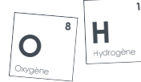

1

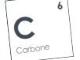

N


7 AzoteF


35 Brome


GUIDE DE

 DÉCARBONATION DE LA **RECHERCHE**
Édition **2026**
Univer s ité de **Tour** s SOMMAIRE

03 Édito

| 04   | Pourquoi réaliser ce guide            |
|------|---------------------------------------|
| 05   | Composiition du guide                 |
| 06   | Un cadre règlementaire de référence   |
| 06   | Une gouvernance renforcée             |
| 07   | Bilan carbone des unités de recherche |
| 09   | Former à la transition écologique     |
| 11   | Pincipales mesures de l'établissement |
| 13   | Leviers d'action                      |
| 20   | Infographies                          |
| 24   | Contacts                              |


# Édito


La Transition Écologique et Sociale (TES) constitue aujourd'hui un enjeu stratégique majeur pour l'Université de Tours. Dotée d'un schéma directeur nommé ASTRES, l'université poursuit une transformation progressive et structurée de ses missions et de son fonctionnement autour de trois objectifs prioritaires : réduire son empreinte carbone, diminuer ses consommations énergétiques et préserver le vivant et la biodiversité. La recherche occupe une place centrale dans cette dynamique. Productrice de connaissances indispensables pour comprendre et accompagner les transformations environnementales, sociales et économiques en cours, elle est également une activité institutionnelle dont les pratiques - mobilité scientifique, usages numériques, équipements, infrastructures, achats - génèrent des impacts mesurables. Inscrire chaque unité de recherche dans une trajectoire de décarbonation constitue donc une étape déterminante. Il ne s'agit pas uniquement de réduire des émissions, mais d'engager une évolution progressive des mentalités et des pratiques scientifiques, organisationnelles et logistiques, en cohérence avec les savoirs produits et les valeurs portées par la communauté académique. Le présent guide s'inscrit dans cette ambition. Il propose des repères méthodologiques, des leviers d'action et un cadre commun afin d'accompagner les unités dans l'analyse de leurs impacts et la définition de trajectoires adaptées à leurs spécificités disciplinaires. Ce travail repose sur une démarche collective. Il a été élaboré en étroite collaboration avec les correspondants TES des unités de recherche, avec l'appui du Service du Pilotage de la Transition Écologique (SPoTE) et de la Direction de la Recherche et de la Valorisation (DRV). Il témoigne d'une volonté partagée d'inscrire la recherche de l'Université de Tours dans une dynamique de responsabilité et d'amélioration continue. La transition ne constitue pas une contrainte périphérique à l'activité scientifique : elle en est désormais une composante structurante. Ce guide a vocation à en être un outil opérationnel et évolutif pour accompagner nos activités de recherches.

Daniel Alquier, vice-président en charge de la **recherche** Olivier Pichon, vice-président à la transition écologique et **sociétale**

03


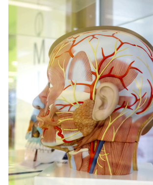

# Pourquoi **Réaliser** Ce **Guide**

## Identifier Et Agir **Collectivement**

Réduire l'empreinte carbone de la recherche suppose avant tout de bien identifier les leviers d'action à la disposition des laboratoires. Cela passe par un engagement en faveur de pratiques plus sobres et responsables, inscrit dans une politique de laboratoire volontaire et partagée par l'ensemble des équipes. Les actions proposées s'inscrivent dans une démarche progressive, allant de l'initiation à des niveaux plus avancés, afin de s'adapter à la diversité des laboratoires : leur taille, leur domaine de recherche, leur niveau de maturité, leurs contraintes spécifiques et leurs avancées déjà engagées.

## Mesurer Pour **Progresser**

L'analyse de l'évolution des émissions entre deux bilans carbone constitue à cet égard un outil central. Le premier bilan carbone, réceptionné en juin 2024 pour chaque laboratoire de recherche, sert de référence pour identifier les postes les plus émetteurs et prioriser les actions à mettre en œuvre. Une fois ces actions déployées, les bilans carbone des laboratoires seront à nouveau réalisés afin de mesurer les effets des démarches engagées, objectiver les réductions d'émissions obtenues et ajuster, si nécessaire, les stratégies mises en place.

Cette approche engage la transformation bas

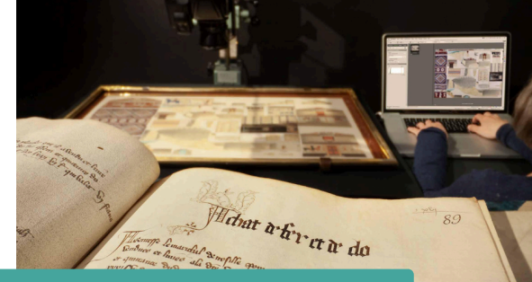

carbone de la recherche dans une dynamique d'amélioration continue, fondée sur des indicateurs mesurables et comparables dans le temps.

Ce guide de décarbonation de la recherche de l'université de Tours s'inscrit dans la continuité des réflexions menées par l'université de Rennes 2. Nous remercions leurs équipes pour le guide qu'elles ont élaboré, dont l'approche a nourri et inspiré ce projet.

# Composition Du **Guide**

Après avoir exposé le cadre réglementaire et la gouvernance de l'université de Tours, le guide présente les bilans carbone réceptionnés par les unités de recherche en juin 2024. Ces premiers résultats constituent un état des lieux de référence, permettant d'identifier les principaux postes d'émissions et de mieux comprendre les enjeux spécifiques liés aux activités de recherche. Le guide met également en lumière les formations à la transition écologique proposées par l'établissement, conçues pour renforcer les connaissances, développer les compétences et soutenir l'évolution des pratiques professionnelles des personnels de recherche.

Il détaille ensuite les mesures pilotées par l'établissement suivies des leviers d'action mobilisables à l'échelle des laboratoires, offrant une vision complémentaire et cohérente des actions déjà engagées et celles à mettre en œuvre. Ces actions s'inscrivent dans 7 thématiques structurantes : gouvernance et stratégie, achats, numérique et équipements, déchets, déplacements professionnels, événementiel, énergie. Enfin, à l'issue des fiches actions, des infographies

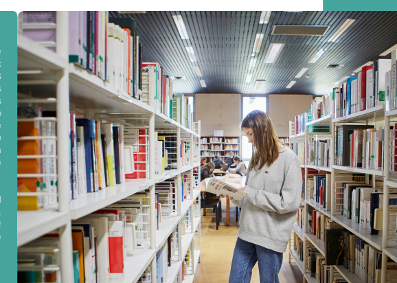 viennent compléter l'ensemble afin d'apporter des éléments de compréhension et de mise en perspective des enjeux de décarbonation.

05

## Des Actions Concrètes Et **Adaptables**

Chaque unité de recherche choisit les actions qu'elle souhaite mettre en place, classées par thématique et selon 3 niveaux d'engagement : initiation, maîtrise et exemplarité. Les actions proposées, indépendantes les unes des autres, s'inscrivent ainsi dans une démarche progressive, tenant compte de la diversité des laboratoires et de leurs spécificités. Un volet « comment faire » permet d'identifier rapidement les outils et les étapes clefs pour une mise en œuvre concrète et facilitée. Elles pourront être adaptées ou appliquées au fil du temps et ne sont pas exhaustives : toute action jugée pertinente par une unité de recherche peut rejoindre cette liste. Les propositions présentes dans ce guide sont issues d'un travail collectif approfondi mené au sein de groupes de travail dédiés, rassemblant enseignantes-chercheuses, enseignants-chercheurs et personnels des unités de recherche, témoignant d'une dynamique collaborative forte et d'un engagement partagé.

## Un Cadre **Règlementaire** De **Référence**

La décarbonation des activités de recherche s'inscrit dans un cadre réglementaire et stratégique structurant. A l'international, l'Accord de Paris vise à limiter le réchauffement climatique en dessous de 2 °C par rapport aux niveaux préindustriels. En France, la loi Climat et Résilience de **2021** fixe un nouvel objectif de réduction des émissions de gaz à effet de serre (GES) de 55 % d'ici à 2030 par rapport à 1990, en cohérence avec cet engagement mondial. Elle réaffirme sa volonté d'atteindre la neutralité carbone à l'horizon 2050, impliquant l'ensemble des secteurs d'activité, dont la recherche et l'enseignement supérieur. Pour suivre ces objectifs, chaque établissement doit réaliser un bilan carbone tous les 3 ans, permettant d'identifier les principales sources d'émissions et de prioriser les actions de réduction. Cette trajectoire est définie et pilotée par la Stratégie Nationale **Bas-Carbone** (SNBC), instaurée par la loi du 17 août 2015 relative à la transition énergétique pour la croissance verte. La SNBC constitue la feuille de route de la France pour réduire durablement les émissions de GES, en fixant des budgets carbone sectoriels et en orientant les politiques publiques, y compris celles concernant les établissements d'enseignement supérieur et de recherche.

## De L'Accord De Paris Aux Activités De **Recherche,** La Transition Vers Une Réduction Mesurée Et Obligatoire Des Émissions Est Désormais **Engagée.**

C'est dans ce cadre que l'université de Tours a souhaité se doter d'un **schéma** directeur pour mettre en action un ensemble de mesures répondant aux enjeux climatiques, environnementaux et sociaux. Ce document - rendu entre-temps obligatoire par le Ministère de l'Enseignement Supérieur, de la Recherche et de l'Innovation - a été voté à l'unanimité par le Conseil d'Administration du 15 avril 2024. Ce schéma porte le nom de **ASTRES** pour Agenda Stratégique de TRansformation Écologique et **Sociale**.

Dans le domaine immobilier, le décret **tertiaire** impose une réduction progressive des consommations d'énergie dans les bâtiments à usage tertiaire de plus de 1 000 m². Les bâtiments universitaires relevant majoritairement de cette catégorie, les laboratoires sont intégrés à cette trajectoire, impliquant une attention accrue aux usages énergétiques et à l'organisation des activités.

## Une **Gouvernance** Renforcée

L'université de Tours a fait le choix d'une organisation unique, pérenne et transversale, articulée avec les instances centrales de l'établissement, afin de piloter de manière cohérente et collective sa trajectoire de transformation écologique et sociale. Cette gouvernance s'appuie en premier lieu sur le Conseil stratégique de la transformation écologique et sociale qui émet des avis et des vœux sur les orientations des politiques de l'université en matière de transition. Il constitue un espace de dialogue stratégique, garant de l'alignement des projets avec les ambitions et les valeurs portées par l'établissement. Afin de favoriser l'appropriation collective, cette gouvernance est complétée par l'organisation annuelle du Forum de la transition écologique et sociale. Cet événement ouvert à tous les personnels permet de partager les avancées, de croiser les regards et de faire émerger de nouvelles initiatives.

ASTRES est doté d'une gouvernance à la **fois**
stratégique, participative et opérationnelle, **condition**
essentielle pour inscrire la transformation **écologique**
et sociale dans la **durée.**
Enfin, la mise en œuvre opérationnelle repose sur des comités de projet. Ces instances assurent le pilotage, le suivi et la concrétisation des actions, en mobilisant différentes compétences métiers et en favorisant le travail collaboratif. Elles traduisent les orientations stratégiques en actions concrètes, adaptées aux réalités de terrain. Le Service du Pilotage de la Transition Écologique (SPoTE) joue un rôle transversal qui implique une légitimé à agir.

# Bilan Carbone Des Unités De **Recherche**

La réalisation des bilans carbone sur les données 2022 ou 2023 par les unités de recherche s'appuie sur une méthodologie robuste et adaptée aux enjeux de l'enseignement supérieur : Labos 1point5. Cet outil a été et est développé par un collectif national enseignantes-chercheuses et enseignants-chercheurs et personnels des unités de recherche pour comprendre et réduire l'impact environnemental des activités des laboratoires. Il permet à la fois de quantifier leurs émissions de gaz à effet de serre (GES) et d'identifier les principales sources de ces émissions.

Au total, 4 268 tonnes équivalent CO₂ (téqCO₂) sont produites par les activités de recherche de l'université de Tours en 2023.

## Répartition Des Émissions En Tonnes Équivalent Co₂ **(Téqco₂)**


Achats : 2 096 téqCO₂ Bâtiments : 820 téqCO₂ Déplacements domicile/travail : 810 téqCO₂ Déplacements professionnels : 480 téqCO₂ Équipements informatiques : 62 téqCO₂

## Poste Des Achats : 2 096 **Téqco**₂ 5,3 Millions D'Euros D'Achats Imputés Et **Analysés**

Les produits utilisés, essentiels aux activités scientifiques, génèrent des émissions importantes du fait de leurs procédés de fabrication et de logistique. La réduction passe notamment par une meilleure planification des besoins, la limitation des pertes et l'optimisation des commandes.

À l'échelle de l'établissement, le Bilan Carbone 2025 de l'université de Tours propose une lecture complémentaire, fondée sur un périmètre élargi et un volume d'achats analysé plus important (9,8 M€). Dans cette analyse, les acquisitions de matériel et d'instruments de laboratoire représentent 1 887 t éqCO₂, et les consommables 1 625 t éqCO₂. Cette double approche permet d'éclairer différemment les leviers d'action, le pilotage des volumes et des pratiques d'achat bien sûr, mais aussi la mutualisation des équipements scientifiques, du recours au réemploi lorsque cela est possible et de la prolongation de la durée de vie du matériel.


14 500 m² associés aux unités de recherche sur un ensemble de 186 500 m² gérés par l'université de Tours

## Répartition Par Pôle **Immobilier** Grandmont : 57,09 % Tonnellé : 18,53 % Portalis : 16,23 % Blois : 4,67 % Tanneurs : 3,31 % Jean Luthier : 0,17 %

La stratégie bâtimentaire repose sur le développement des énergies renouvelables (raccordement aux réseaux de chaleur majoritairement décarbonés, déploiement de panneaux photovoltaïques), l'amélioration de la performance énergétique des bâtiments (isolation, modernisation des équipements, pilotage centralisé) et l'intégration de matériaux biosourcés dans les constructions. Les usages et la sobriété des pratiques quotidiennes constituent également un levier essentiel pour diminuer durablement les consommations d'énergie.

Ce diagnostic issu des bilans carbone des **unités** de recherche constitue une étape **préalable** indispensable à l'élaboration de plans **d'action** cohérents, efficaces et adaptés à leurs **spécificités.**
POSTE DES DÉPLACEMENTS PROFESSIONNELS : 480 **TÉQCO**₂


 2 500 DÉPLACEMENTS **ANALYSÉS**
Par mode de déplacement Par **destination**

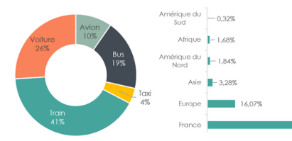

Le train constitue le principal mode de déplacement en volume et émet très peu de CO₂ par passager au kilomètre, ce qui en fait un mode de transport très vertueux. La voiture arrive en second, avec environ un quart des déplacements et demeure un poste d'émissions significatif. L'avion, bien que limité à près de 10 % des trajets, génère une part d'émissions élevée en raison de son intensité carbone. Les leviers d'action consistent donc à cibler en priorité les trajets les plus émetteurs afin de concentrer les efforts là où l'impact carbone est le plus fort. Ils visent également à optimiser les déplacements professionnels en favorisant le train, en limitant l'avion aux missions réellement indispensables et en développant les alternatives numériques ainsi que la mutualisation des missions.

# Former Les Chercheuses Et Les Chercheurs À La Transition **Écologique**

La montée en compétences des membres des unités de recherche, rendue possible grâce à la formation, est un élément clé pour réussir la transition écologique. Le défi majeur consiste à atteindre la masse critique permettant de réaliser de véritables avancées.

Former les chercheurs à la transition écologique, c'est leur donner les moyens de réduire l'impact de leurs pratiques, d'orienter leurs recherches vers des solutions durables et de jouer pleinement leur rôle dans la transformation de la société. Le plan de formation proposé par l'université est construit de sorte à prendre en compte les attentes exprimées par ses membres. Un réseau de formatrices et formateurs internes permet de répondre de manière efficiente aux demandes des directions, composantes et laboratoires.

Réactualisé chaque année, le plan de formation s'articule autour de 6 axes :

## Comprendre Les Enjeux **Climatiques** Ateliers **Climat**

Atelier d'intelligence collective permettant de comprendre les mécanismes du changement climatique et les moyens d'action pour y faire face.

## De L'Éco-Anxiété À **L'Éco-Action**

Comprendre les émotions et les blocages liés à l'éco-anxiété afin de permettre de créer des dynamiques d'action.

## Intégrer De Nouvelles **Pratiques** L'Achat Durable Et **Responsable**

Appréhender dans l'environnement de l'achat public, les trois composantes du développement durable : économique, environnemental et social. Les participantes et participants sont initiés à mesurer leur définition du besoin à l'aune de cette exigence et à découvrir comment le Service de la commande publique peut accompagner cet achat responsable.

## Le Fonctionnement Durable Et Responsable À **L'Université**

Comprendre les enjeux de transformation écologique, la stratégie et les mesures prises par l'université de Tours pour y répondre ; agir dans son quotidien de travail afin de diminuer son empreinte carbone.

## La Prévention Et La Gestion Des **Déchets**

Identifier les enjeux et les actions en matière de prévention et de gestion des déchets, au niveau des politiques publiques et de l'établissement.

## Ma Terre En **180Mn**


Atelier collaboratif, ludique et convivial sous forme d'un jeu de rôle, il vise à sensibiliser et mobiliser les personnels des laboratoires, pour construire des scénarios de réduction de leur empreinte carbone. Cet atelier consiste à discuter entre participantes et participants de la réduction de l'empreinte carbone d'un laboratoire fictif, en questionnant notamment les déplacements, les achats et les activités. Les participantes et participants sont amenés à proposer des mesures concrètes à mettre en œuvre pour réduire cette empreinte de 50% d'ici 2030 au plus tard. L'atelier met en scène des personnages aux profils et aux niveaux de sensibilité environnementale variés, afin de faciliter la compréhension de différents points de vue et la recherche collective de leviers de changement des comportements.

## Numérique **Responsable**

 Fresque Du **Numérique**

Atelier d'intelligence collective afin de comprendre en équipe les enjeux environnementaux du numérique à l'échelle planétaire. Usages numériques éco-responsables à **l'université** Sensibiliser aux bonnes pratiques écologiques et responsables dans le domaine numérique au sein de l'établissement.

## Vers Des Mobilités Bas **Carbone** Circuler En Ville : Stage **Théorique**

Cette formation s'adresse aux usagers de la route et de la rue : automobilistes, motards, usagers des transports en commun ou des trottinettes, piétons. Elle permet d'acquérir les connaissances pour améliorer et sécuriser sa pratique de conduite, notamment pour une meilleure prise en compte des usagers vulnérables.

## Circuler En Ville : Stage Pratique De **Vélo**

Pour les cyclistes souhaitant gagner en confiance afin de se sentir en sécurité à vélo dans la circulation du quotidien.

## Devenir Animatrice / **Animateur** Animer Des Ateliers Ma Terre En **180Mn**

Apports théoriques et pratiques permettant d'être autonome et à l'aise dans l'animation de l'atelier Animer des Fresques du **numérique** Apports théoriques et pratiques permettant d'être autonome et à l'aise dans l'animation de l'atelier


10

## Les Principales **Mesures** Au Niveau De **L'Établissement** Gouvernance Et **Stratégie**

Désignation d'un ou une référente Transition Écologique et Sociale (TES) dans chaque unité de recherche, permettant notamment de s'investir sur des projets stratégiques, d'accélérer la prise de conscience de ces enjeux, d'accompagner le changement et la mise en place de pratiques plus durables. Mise en place en 2025 du Conseil stratégique de la Transformation Écologique et Sociale. Ce conseil est une instance politique chargé de définir les orientations stratégiques en matière de TES et de piloter leur mise en œuvre, en étroite collaboration avec les autres instances universitaires afin d'assurer la cohérence de la démarche. Organisation en juin de chaque année du Forum de la TES, ouvert à tous les personnels. Il permet à toutes et tous de se retrouver pour être informé.es de l'avancée des projets, d'évaluer l'impact et l'efficacité des actions menées, de préciser et de faire évoluer collectivement certaines actions.

## Achats Durables Et **Responsables**

Intégration des critères TES dans tous les marchés rédigés par le service de la commande publique. Un personnel au sein du service de commande publique (SCOP) est formé à l'achat durable et responsable et accompagne toutes les demandes.

## Numérique Et **Équipements**

Digital Clean Up Day : l'établissement organise chaque année cette journée mondiale de sensibilisation à l'empreinte environnementale du numérique en invitant chacune et chacun à agir concrètement en nettoyant ses données. Allongement de la durée de vie des matériels numériques par l'extension des garanties, la suppression d'applications non utilisées, le tri des données, etc. Chaque ordinateur portable acheté par l'établissement a ainsi une durée d'utilisation de 7 ans. Seconde vie donnée à des matériels numériques par la création d'un schéma d'économie circulaire numérique à destination d'associations, d'écoles, d'institutions. Traitement des déchets d'équipements électriques et électroniques pour en permettre le recyclage et la valorisation. Achats de matériels numériques reconditionnés dès que possible.

11

## Énergie Et **Patrimoine**

L'université dispose d'un Schéma Directeur des Énergies qui fixe la stratégie à suivre pour atteindre les objectifs du décret tertiaire d'ici 2050 : réduire de 60 % la consommation énergétique de ses bâtiments par rapport à une année de référence comprise entre 2010 et 2019. Les sites des Tanneurs, Tonnellé et La Riche sont raccordés au réseau de chaleur de Tours Métropole. D'ici 2030, s'ajouteront les sites Portalis, Grandmont et Plat d'Etain. Ces réseaux fonctionnent à plus de 70% avec des énergies renouvelables (plaquettes et déchets de bois) ou de la récupération de la chaleur fatale, permettant ainsi de réduire l'utilisation de ressources fossiles et donc les émissions de CO₂. Des panneaux solaires photovoltaïques sont installés sur le site de la Riche et prochainement sur le nouveau bâtiment de Polytech. D'autres sites et parkings sont éligibles avec un objectif d'atteindre un potentiel de production équivalent à 10% de nos consommations électriques totales. Des travaux d'amélioration de la performance énergétique des bâtiments sont conduits : isolation thermique (remplacement de menuiseries, isolation de toitures et murs...) ; amélioration ou mise en place de centrales de traitement d'air double flux avec récupération de la chaleur ; installation d'éclairages moins énergivores ; mise en place d'une gestion technique centralisée pour piloter le chauffage, la ventilation et la production d'eau glacée, afin d'optimiser les consommations énergétiques et détecter rapidement les dysfonctionnements. Le marché d'exploitation des installations de chauffage prévoit un intéressement des exploitants selon les économies d'énergie réalisées. Dans le cadre de la charte Fibois, l'université s'engage à utiliser 20% de ressources bio-sourcées dans ses constructions.

## Déchets

Installation de points de collecte de déchets basés sur l'apport volontaire dans les lieux de passage, de bacs de récupération des fournitures de bureau et de piles dans les BU, de composteurs sur tous les sites. Opérations de collectes de déchets ciblées : smartphones usagés, mobiliers cassés, polystyrène, gobelets inutilisés etc.

## Déplacements **Professionnels**

Vote au Conseil d'Administration 2024 du Plan Universitaire des Mobilités (PLUM) afin de favoriser durablement les transports bas carbone. Ce plan compte 23 actions ambitieuses. Plus d'infos Mise à disposition d'une carte de transports en commun Fil Bleu pour les déplacements au sein de la métropole de Tours et les déplacements inter-sites : cette mesure existe au sein des services centraux et sera déclinée dans les unités de recherche.

# Acheter Durable Et Responsable Comment **Faire** ?

## Initiation

Réaliser un inventaire de son matériel et de ses équipements pour encourager à la mutualisation et éviter des achats en double Favoriser l'achat de produits basés sur l'analyse du cycle de vie Intégrer la durabilité et la réparabilité dans les critères d'achat Intégrer l'empreinte carbone et/ou la consommation énergétique de ses achats d'équipements comme critère de sélection Acheter du matériel ou des équipements reconditionnés ou d'occasion quand c'est possible Imposer une livraison groupée de ses achats auprès de ses prestataires Informer les membres de l'UR des formations à l'achat durable et responsable

## Maîtrise

Réparer ses équipements au lieu d'acheter un autre équipement en remplacement Mutualiser l'achat de fournitures avec la composante et laboratoires de proximité Assurer la participation des membres du Conseil de laboratoire à la formation à l'achat durable et responsable

## Exemplarité

Pour tout achat de matériel numérique ou d'équipement supérieur à un seuil préalablement fixé, demander un avis consultatif à la référente ou le référent TES de l'UR Pour les achats à forte empreinte carbone mais scientifiquement pertinents, activer le processus de compensation carbone en limitant d'autres achats ou activités afin d'en réduire l'impact Mutualiser le matériel et les équipements avec d'autres unités de recherche Si l'UR achète un matériel onéreux à forte empreinte carbone, il est affecté pour être mutualisé Mutualiser l'achat de produits en plus grand conditionnement avec d'autres laboratoires partageant les mêmes consommables S'engager à ne pas acheter de matériel jetable Partager ses solutions techniques pour éviter le plastique jetable au sein de l'UR / auprès des autres UR / auprès de Transition 1.5 Rédiger une note d'utilisation de chaque équipement afin que chaque personnel de l'UR / des autres UR connaisse les différents usages et donc encourager à sa mutualisation Assurer la participation de tous les membres de l'UR à la formation à l'achat durable et responsable

## Inventaire Du **Matériel**


Définir le périmètre (espaces, équipes, types de matériel) / Choisir un format commun (tableur/outil) avec champs standardisés / Nommer des référent·es par salle ou équipe / Étiqueter le matériel (QR code/numéro) / Planifier une collecte courte et simple / Centraliser, harmoniser et valider les données

## Achat **Responsable**

Inscrire les critères environnementaux dans les demandes de devis (pondérés ou éliminatoires) Consulter des plateformes spécialisées en matériel d'occasion ou reconditionné : LabX, Labexchange, EquipNet, etc. / Vérifier : état, historique, compatibilité technique, logistique, garantie/SAV Intégrer les gestionnaires dans les réflexions et prises de décision Contacter son antenne financière pour ventiler les dépenses des achats mutualisés

## Réemploi Et **Mutualisation**

Contacter les laboratoires à proximité : recenser les équipements mutualisables, établir des règles, organiser un planning, et éventuellement une convention Travailler en groupe pour identifier les alternatives à l'achat de consommables jetables

## Réparation Et Prolongation De Vie

Vérifier la garantie du matériel et contacter le prestataire

## Formation

S'inscrire via la plateforme RH Geforp (intranet)

## Gages De **Réussite**

S'appuyer sur le Service de la Commande Publique (SCOP)

# Se Déplacer Dans Un **Cadre** Professionnel

## Initiation

Encourager les membres en mobilité à optimiser leur temps sur place en mutualisant leurs motifs de déplacement (ex : rencontrer des collaborateurs locaux, visiter des laboratoires partenaires, identifier de nouvelles collaborations, préparer des publications conjointes...) Encourager le suivi des événements scientifiques en distanciel ou en replay, si le lieu de l'événement n'est pas accessible en transport bas carbone Encourager et communiquer sur les dispositifs facilitant les transports bas carbone (intranet) : le train, le bus/tram et le vélo notamment Encourager le co-voiturage lorsque c'est possible

## Maîtrise

Ne pas autoriser l'avion lorsque le trajet peut être réalisé en moins de 8 heures en train Privilégier les déplacements vers des colloques et conférences qui comportent une contribution active (communication orale, poster, animation de session, etc.) Organiser des webinaires plutôt que des événements en présentiel Réunir les comités scientifiques à distance, notamment dans le cadre d'organisation d'événements

## Exemplarité

Ne pas autoriser l'avion lorsque le trajet peut être réalisé en moins de 10 heures en train Fixer un quota annuel des émissions de gaz à effet de serre au niveau individuel et collectif Fixer un nombre de trajets maximal en avion par personne et par an Se concerter afin d'identifier la ou les personnes qui se déplaceront dans le cadre d'un évènement intéressant plusieurs membres du laboratoire Investir dans un vélo (simple, pliant, électrique, cargo, charrette) pour les besoins de service

 
Limitation de l'usage de **l'avion** Respecter les obligations ministérielles et se référer à la politique voyages et déplacements de l'établissement

## Covoiturage

Créer un canal dédié de mise en relation Intégrer le covoiturage dans les procédures de déplacement (missions, séminaires, réunions) Planifier les évènements en horaires compatibles avec le covoiturage

## Quota Annuel D'Émissions De Gaz À Effet De **Serre**

Utiliser le bilan carbone du laboratoire comme base Définir un objectif de réduction réaliste pour le poste des déplacements Convertir cet objectif en tonnes de CO₂ et le diviser par le nombre de membres

## Déplacements Mutualisés Et **Arbitrage**

Critères d'arbitrage : pertinence scientifique ; rôle (responsable, porteur, doctorant/postdoc concerné) ; capacité de représentation du laboratoire ; contraintes (disponibilité, budget, transport bas carbone ou pas) ; impact collectif (retour à l'équipe) ; équité : rotation entre les intéressés

## Gages De **Réussite**

Piloter ce sujet au sein du groupe de travail TES et du Conseil du laboratoire Impliquer les antennes financières dans les prises de décision

# Développer Le Numérique Responsable Comment **Faire** ?

## Initiation

Réaliser un inventaire mutualisé des équipements numériques Participer à l'Atelier de la donnée Centre-Val de Loire pour développer une culture commune de la donnée Encourager le dépôt systématique et unique des publications dans HAL Planifier la fin de vie et la possibilité de réparation du matériel numérique (ex. changement de batteries, disponibilité des pièces) Rédiger une note interne sur le bon usage du numérique : stockage, archivage, outils collaboratifs, alternatives au mail Réduire les envois de pièces jointes volumineuses en privilégiant le partage de liens sécurisés Participer au Cleanup Day numérique annuel organisé par l'établissement : tri des fichiers, mails, archives partagées Encourager l'utilisation de canaux adaptés (plateformes de projet, outils de messagerie instantanée) plutôt que de détourner la boîte mail comme espace de chat ou de stockage Informer les membres de l'UR des formations internes Fresque du numérique, Pratiques numériques écoresponsables, Linux et logiciels libres

## Maîtrise

Créer une gouvernance interne du matériel, impliquant les antennes informatiques et la référente ou le référent TES du laboratoire Limiter la redondance d'équipements en mutualisant et en optimisant leur taux d'usage Favoriser l'open data et la diffusion des données de recherche Assurer la participation des membres du Conseil du laboratoire aux formations internes Fresque du numérique et Pratiques numérique éco-responsables, Linux et logiciels libres Utiliser le matériel mutualisé de calcul plutôt que d'acheter son propre matériel de calcul

## Exemplarité

Rédiger une note d'utilisation de chaque matériel numérique afin que les personnels de l'UR / des autres UR connaissent les différents usages et donc encourager à sa mutualisation Exiger une justification de besoin pour tout nouvel achat d'équipement numérique (motivation pédagogique, scientifique ou technique) Privilégier systématiquement le matériel reconditionné lors des achats Définir une politique interne à l'UR de stockage et de gestion des données (incluant RGPD et pérennité) Soumettre les décisions impactantes en matière de numérique responsable au conseil de laboratoire pour validation collective Utiliser des outils libres - Linux, logiciels open source - quand ils sont compatibles avec les besoins scientifiques Assurer la participation des membres de l'UR aux formations internes Fresque du numérique et Pratiques numérique éco-responsables15

## Inventaire Et **Mutualisation** Définir Le Périmètre (Espaces, Équipes, Types De Matériel) /

Choisir un format commun (tableur/outil) avec champs standardisés / Nommer des référent·es par salle ou équipe /
Étiqueter le matériel (QR code/numéro) / Planifier une collecte courte et simple / Centraliser, harmoniser et valider les données Recenser les équipements mutualisables, établir des règles, organiser un planning

## Diffusion De La **Donnée**

Préparer les données : plan de gestion des données, formats ouverts, documentation complète / Choisir une plateforme adaptée : dépôts reconnus, licences ouvertes
(CC0, CC BY) / Assurer qualité et pérennité : contrôle des erreurs, anonymisation si nécessaire, suivi des versions /
Promouvoir l'accès : liens dans publications, guides d'utilisation, communication active

## De L'Achat À La Fin De Vie

Établir un cahier des charges ambitieux et inscrire des critères environnementaux dans les procédures d'achat Contacter l'antenne informatique pour organiser le tri et le recyclage

## Bonnes **Pratiques** Se Référer Au Guide Des Bonnes Pratiques De Pro3 Tri Et Suppression Des **Données**

Définir ce qui sera trié et les outils nécessaires (logiciel de doublon, listing sous excel...) / Supprimer les fichiers inutiles, les doublons, archiver / Gérer les mails : supprimer les spams, trier les dossiers, détacher les pj, se désabonner de newsletters non lues / Désinstaller les applications inutiles /
Sauvegardes : supprimer les doublons / Répéter régulièrement par session mensuelle

## Formation

S'inscrire via la plateforme RH Geforp (intranet)
S'inscrire à l'atelier de la donnée

## Gages De **Réussite**

Intégrer l'antenne informatique dans les actions Contacter le chargé de mission numérique responsable Contacter la DPO (Délégué à la Protection des Données)
de l'université pour les questions de conformité

# Vie Du **Laboratoire** Organiser Un **Événement**

## Initiation

Mettre en avant la page web de l'université dédiée aux transports bas carbone auprès des participantes et participants à l'évènement Utiliser des outils collaboratifs pour partager les informations, les données Utiliser des supports de communication réutilisables (ex : kakémonos ou bâches non datés) Demander aux participantes et participants de venir avec leur tour du cou et leur gobelet/gourde Récupérer les porte-badges et les tours de cou à l'issue des évènements Proposer des goodies éco-responsables (utiles, durables, en matière recyclée ou recyclable, produits en France) Proposer une offre traiteur végétarienne pour les repas Ne plus faire appel aux traiteurs pour des réunions courtes Limiter l'achat de plateaux-repas, sources de déchets importants Commander la juste quantité auprès des traiteurs afin d'éviter le gaspillage alimentaire Rappeler les consignes de tri des déchets lors de l'évènement

## Maîtrise

Privilégier un webinaire plutôt qu'un événement en présentiel Choisir un lieu accessible facilement en transport en commun et à un horaire adapté Organiser la/les réunions de préparation de l'évènement en distanciel Donner des tickets de transports en commun pour les intervenantes et intervenants Emprunter ou louer le matériel plutôt que l'acheter (ex : pupitres …) Proposer uniquement des goodies éco-responsables et utilitaires Fournir des badges en papier et non en plastique Proposer une offre traiteur à dominante végétarienne Investir dans l'achat de gobelets réutilisables, de carafes en verre, d'une machine à café et de thermos pour l'organisation de ses événements et moments conviviaux

## Exemplarité

Proposer uniquement une offre traiteur végétarienne Investir dans l'achat d'un lave vaisselle / station de lavage pour faciliter l'utilisation de vaisselle réutilisable Prévoir ou demander au prestataire de fournir des contenants pour conserver et/ou distribuer les surplus alimentaires Ne distribuer aucun goodies


? 

## Communication Et Outils **Numériques**

Définir un espace commun clair (dossiers, UT box...) pour centraliser documents et échanges, identifier des droits d'accès restreints si besoin

## Logistique Et **Matériel**

Contacter les services intérieurs des composantes, les services centraux (communication, vie étudiante, transition écologique...) pour favoriser l'emprunt Installer un point de collecte bien visible afin de récupérer les objets et matériaux pouvant être réutilisés

## Goodies Et Objets Remis Aux **Participant·Es**

Questionner l'usage réel avant de commander : fréquence d'utilisation, durée de vie, pertinence Ne pas distribuer automatiquement mais interroger le besoin, c'est-à-dire demander aux participant·es si ils/elles sont ou pas intéressé·es par le/les objets

## Transports

Commencer un événement à 10h ou à 16h s'il dure plusieurs jours facilite l'utilisation du train Keolis est un prestataire de l'établissement auprès duquel il est possible d'acheter des tickets de bus/tram Restauration et gestion des surplus **alimentaires** Se référer au guide de l'achat traiteur éco-responsable (intranet)

## Déchets Et Tri

Positionner les points de tri à des endroits stratégiques et les signaler visuellement Briefer l'équipe d'accueil pour guider rapidement le public

## Vie Collective / **Approvisionnement**

Acheter du thé/café deux fois par an Collaborer avec d'autres laboratoires de proximité pour créer une zone commune de stockage de produits mutualisés

# Prévenir Et Gérer Les Déchets Comment **Faire** ?

## Initiation

S'assurer que les membres de l'UR ont connaissance des bonnes pratiques pour limiter l'usage des consommables Transmettre les recommandations pour limiter les impressions et leur impact Mettre à disposition de la vaisselle commune Communiquer sur les procédures de gestion des déchets d'équipements électriques et électroniques Transmettre les consignes de tri à l'ensemble des membres (poubelles recyclables, tout-venant, biodéchets, polystyrène, déchets dangereux principalement) (intranet) S'assurer de la mise à disposition des poubelles de tri nécessaires au bon fonctionnement du laboratoire

## Maîtrise

Privilégier les contenants en verre au lieu de plastique lors des manipulations Utiliser des cahiers de laboratoire dématérialisés (intranet)

## Exemplarité

Entamer une réflexion collective pour optimiser le plan expérimental afin de limiter l'usage de consommables S'engager à ne plus utiliser de vaisselle jetable pour l'organisation de ses événements et de son fonctionnement interne Mettre à disposition d'autres unités de recherche les équipements dont l'UR n'a plus l'usage Optimisation des pratiques **expérimentales**

 Travailler avec le gestionnaire pour intégrer les matériels réutilisables dans les achats Échanger avec d'autres laboratoires sur leurs pratiques

## Mise En Place D'Outils Et Supports **Communs**

Créer un mini-guide interne de bonnes pratiques Ajouter une section "sobriété" dans les protocoles du laboratoire Sensibilisation et communication **interne** Rendre visibles les consignes de tri avec une signalétique adaptée Afficher les consignes et procédures liées aux consommables : qu'est ce qui est réutilisable ? quand utiliser du jetable ? ...

## Gestion Du Matériel Et Des **Stocks**

Optimiser les stocks : zone "à finir d'abord", tableau partagé, gestion tournante Apporter ou acheter de la vaisselle réutilisable (tasses, thermos, carafes)

## Engagements Collectifs Et Fonctionnement **Interne**

Exiger de la vaisselle réutilisable auprès des prestataires (traiteurs) Organiser clairement la gestion de la vaisselle (prêt 
→ 
lavage 
→
 rangement) / Règle de base : les personnes qui empruntent la vaisselle la gèrent de A à Z, lavage compris Valoriser les efforts : retours positifs, mise en avant des progrès

## Gages De **Réussite**

Contacter les services compétents en cas de question ou besoin, notamment pour gérer les déchets électriques et électroniques ou favoriser le réemploi : Direction de la logistique, Sécurité et Sureté (DL2S), service intérieur de la composante, antenne informatique

# Consommer Moins D'Énergie Comment **Faire** ?

## Initiation

Éteindre l'éclairage hors occupation ; privilégier la lumière naturelle Fermer portes et fenêtres des pièces climatisées ou chauffées. Par exemple, sur un plateau comprenant une zone technique et des bureaux, s'assurer de la fermeture des portes (le conditionnement d'air des zones techniques est dimensionné pour fonctionner portes fermées) Mettre en veille ou éteindre les appareils non utilisés lorsque c'est possible Dégivrer régulièrement les congélateurs pour éviter la surconsommation Fermer systématiquement la vitre des hottes chimiques des sorbonnes (simple geste = jusqu'à 60 % d'économie) et les éteindre quand elles ne sont pas utilisées Remplacer les anciennes sources lumineuses par des LEDs haute efficacité sur les matériels adéquats

## Maîtrise

Rédiger une procédure qui sera affichée sur les équipements pour un bon usage Remonter la température des congélateurs ultra-basse température de -80 °C à -70 °C (gain de 20–30 % d'économie d'électricité, validé par des organismes de recherche) Installer des sorbonnes à débit variable (VAV) plutôt qu'à débit constant

## Exemplarité

Mener une réflexion générale sur les besoins en températures afin d'optimiser les réglages lors des manipulations scientifiques (exemple : suivant la plage de température tolérée par l'équipement, choisir la température la moins énergivore) Optimiser l'utilisation des réfrigérateurs, congélateurs, chambres froides… Les mutualiser pour en réduire le nombre Regrouper les expériences sur équipements à forte consommation pour éviter des démarrages multiples Optimiser l'utilisation des salles blanches ou salles à atmosphère contrôlée avec un planning partagé Gestion des produits chimiques et du **stockage**

 Prévoir, mutualiser et maintenir des espaces de stockage adaptés et dimensionnés aux besoins réels : armoires ventilées, réfrigérateurs, congélateurs... S'assurer que tout le monde connaît les consignes de stockage et les points de vigilance

## Maîtrise De La Consommation Énergétique Des Équipements

Vérifier si certains appareils disposent d'un mode veille programmable ou d'un arrêt automatique après usage, et activer ces fonctionnalités Mettre en place une routine de fin de journée via une check-list partagée : équipements à éteindre, équipements à mettre en veille, appareils qui ne doivent jamais être éteints Étiqueter clairement les prises et interrupteurs : « peut être éteint », « laisser allumé », « vérifier avant extinction » Utiliser des multiprises avec interrupteur pour simplifier ces opérations et éviter les oublis

## Organisation **Interne**

Bien communiquer auprès des membres les consignes et points de vigilance en préparant des notes d'information Créer un groupe de travail au sein du laboratoire et/ou avec des membres d'autres laboratoires pour harmoniser les pratiques, mutualiser les solutions simples (équipements, étiquetage, routines) et renforcer la cohérence globale

## Gages De **Réussite**

Contacter le responsable pôle énergie de l'établissement

## Initiation

Proposer aux personnels volontaires de participer à l'atelier Ma Terre en 180 mn Inscrire la thématique Transition Écologique à l'ordre du jour des conseils de laboratoire au moins une fois par an, avec suivi des décisions par le groupe de travail TES Intégrer la référente ou le référent TES comme membre consultatif au conseil de laboratoire Inscrire la/le référent·e TES sur l'organigramme du laboratoire et sur le site web de l'unité de recherche Mettre en ligne un espace TES sur le site web du laboratoire afin de valoriser les bonnes pratiques, partager outils et bilans d'actions Créer un budget annuel dédié TES pour soutenir des actions concrètes (animations, communication, matériel partagé etc.) Constituer un groupe de travail TES associant chercheuses et chercheurs, doctorantes et doctorants, BIATSS membres du laboratoire, afin que la dynamique repose sur le collectif

## Maîtrise

Engager tous les membres du conseil de laboratoire à participer à l'atelier Ma Terre en 180 mn afin d'ancrer la TES dans la gouvernance Ajouter un point TES régulier (par ex. trimestriel) à l'ordre du jour des conseils et AG du laboratoire Intégrer la référente ou le référent TES comme membre avec un droit de vote au conseil de laboratoire Organiser des temps conviviaux dédiés à la sensibilisation TES Mettre en place une stratégie de communication TES (newsletter, affiches, mails) à destination de tous les membres du laboratoire (chercheuses, chercheurs, BIATSS, doctorantes, doctorants)

## Exemplarité

Généraliser la participation de l'ensemble des personnels du laboratoire à l'atelier Ma Terre en 180 mn, en l'intégrant à un temps collectif Ajouter un point TES à l'ordre du jour de chaque conseil et AG du laboratoire Rédiger une charte TES ou feuille de route du laboratoire, fixant des objectifs concrets à court, moyen et long terme, révisables chaque année Organiser chaque année une demie-journée ou une journée TES du laboratoire (conférences, ateliers pratiques, retours d'expérience…) Ajouter dans les projets scientifiques (appels ANR, Horizon Europe, etc.) une réflexion explicite sur la soutenabilité et les enjeux TES Engager une réflexion collective sur la conversion progressive des recherches du laboratoire vers des thématiques compatibles avec la TES Démocratiser la prise de décision au sein du laboratoire, en présentant et en faisant valider les propositions d'actions à l'assemblée générale ou au conseil du laboratoire (ex : en matière de déplacements, d'achats, de prévention et gestion des déchets, d'usages du numérique...)19

INTÉGRER LES ENJEUX TES **DANS** LA
GOUVERNANCE Comment **faire** 

 

## Sensibiliser Et Former Le **Personnel**

Planifier les ateliers lors de périodes où le maximum de personnels peut participer (réunions collectives, séminaire annuel de l'UR) Prévoir des formats variés : présentations courtes, ateliers pratiques, échanges informels Créer des rituels conviviaux courts (café TES, pauses discussions) pour maintenir l'intérêt et l'adhésion

## Gouvernance Et **Suivi**

Définir clairement le rôle et les responsabilités du/de la référent·e TES Mettre en place un suivi simple des décisions TES dans un document unique Centraliser les documents et outils TES dans un espace accessible à tou·tes Prévoir un temps collectif dédié au bilan annuel TES pour ajuster les objectifs et actions

## Communication Et **Valorisation**

Envoyer des communications courtes, régulières et visuelles plutôt que de longues newsletters Mettre en avant les réussites concrètes (ex : économie de papier, réduction des déplacements) pour motiver

## Intégration Dans La **Recherche**

Proposer des points de discussion TES lors de la conception des projets Favoriser le partage d'exemples concrets et de retours d'expérience pour inspirer les équipes

## Formation

S'inscrire via la plateforme RH Geforp (intranet)

## Mobilités Repenser Et Réadapter Sa **Mobilité**

LA VOITURE, PRATIQUE ET RAPIDE, RESTE LE CHOIX DOMINANT DES FOYERS. POURTANT, REPENSER NOS DÉPLACEMENTS EST ESSENTIEL POUR PRÉSERVER LA SANTÉ, L'ENVIRONNEMENT ET FAIRE DES ÉCONOMIES SUR LE LONG TERME. En moyenne, une voiture n
'est utilisée que 3% de sa durée de vie, le reste du temps elle reste stationnée. Pourtant, elle occupe une place centrale dans nos déplacements : 82% des automobilistes conduisent seuls lors de leurs trajets quotidiens. Cela représente environ 7 jours passés chaque année dans la voiture uniquement pour se rendre au travail. En plus du temps perdu, l'impact environnemental est considérable : une seule voiture émet en moyenne 1,29 tonne équivalent CO₂ par an rien que pour le trajet domicile-travail.

## L'Objectif À Atteindre Pour Un Futur **Durable** ?

2 Tonnes équivalent CO² par personne et par an, impliquant les transports mais *aussi* l'habitat, la consommation, l'énergie, l'alimentation *et les services publics* En 2024, la part des déplacements de la communauté universitaire de Tours pour leur trajet domicile-travail ressemblait à ceci :

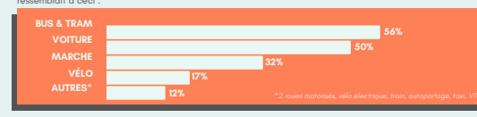

|                                                                                   |                                                                                                                                                                                 |                                                          | du mode de transport utilisé.                                                                                                             |
|-----------------------------------------------------------------------------------|---------------------------------------------------------------------------------------------------------------------------------------------------------------------------------|----------------------------------------------------------|-------------------------------------------------------------------------------------------------------------------------------------------|
| /////                                                                             | COUT MOYEN (sans aides fin.)                                                                                                                                                    | TONNE CO² EQUIVALENT pour 172km* IMPACT SANTÉ            |                                                                                                                                           |
|                                                                                   | Une voiture coûte 425 €/mois                                                                                                                                                    |                                                          |                                                                                                                                           |
| VOITURE soit 5 100 €/an Covoiturer tous les jours permets d'économiser 2 000 €/an |                                                                                                                                                                                 | Thermique : 37,4 kg de CO₂e Électrique : 17,8 kg de CO₂e | Augmente la frustration, l' agressivité + le stress, entretient l'hyperindividualisme, favorise les douleurs musculaires et articulaires Encourage une sociabilisation et favorise la marche à pied                                                                                                                                           |
| BUS TRAM                                                                          | Un abonnement de transport en commun coûte 49 €/mois soit 588                                                                                                                   | 0,75 kg de CO₂e                                          |                                                                                                                                           |
|                                                                                   | €/an (sans aide financière)                                                                                                                                                     |                                                          |                                                                                                                                           |
| VÉLO                                                                              | Personnel : 25 €/mois (300 €/an) entre achat/équipements/entretien Abonnement mécanique (Vélociti) : 8 €/mois (96 €/an) Abonnement électrique (Vélociti) : 42 €/mois (504 €/an) | Mécanique : 0,03 kg de CO₂e Électrique : 1,88 kg de CO₂e | 30 min de marche ou de vélo c ' est le minimum d'activité physique nécessaire à toute.s pour maintenir une bonne santé physique et morale |
| MARCHE La marche, c ' est gratuit !                                               |                                                                                                                                                                                 | 0 kg de CO²e                                             |                                                                                                                                           |

## Corrélation Entre Le Coût Financier, **Écologique** Et Mental Des Différentes **Mobilités**

AUGMENTATION
DE L'USAGE DE
LA **VOITURE**
En moyenne, un.e Français.e parcourt 172 km par semaine pour aller travailler, et les **émissions** de CO₂ liées à cette distance dépendent **fortement**
du mode de transport *utilisé.*

## L'Empreinte Spatiale De 50 Personnes En Fonction De Leur **Moyen** De

 Transport

L'expression empreinte spatiale de mobilité désigne un indicateur en m² représentant la surface

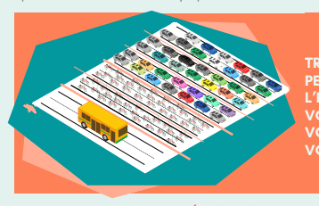 occupée par les déplacements. En ville, l'augmentation de cette empreinte constitue l'un des facteurs majeurs de la congestion urbaine, qui survient lorsque la demande de mobilité dépasse la capacité des infrastructures. Dans le cas de la voiture, ce phénomène se manifeste depuis plusieurs décennies sous une forme cyclique et croissante.


TRANSPORTER
PERSONNES NÉCESSITE L'ÉQUIVALENT D'UNE
VOIE EN BUS, CONTRE 6 VOIES EN VOITURE ET 2 VOIES À VÉLO

## Cc Yy Cc Ll Ee Dd Ee Dd Éé Pp Ee Nn Dd Aa Nn Cc Ee Aa Uu Tt Oo Mm Oo Bb Ii Ll Ee

AUGMENTATION DES
INFRASTRUCTURES
ROUTIÈRES
RÉDUCTION DES
ESPACES DÉDIÉS AUX
AUTRES MODES DE **TRANSPORTS**
AMPLIFICATION DE **L'ÉTALEMENT**
URBAIN ET BAISSE DU **TEMPS** DE
TRAJET EN VOITURE

## Et À L'Université De **Tours** ?

Selon les bilans carbone de l'établissement, 33% des émissions de gaz à effet de serre (GES) de l'université proviennent des déplacements de personnels et des étudiant·es. Favoriser le covoiturage, le vélo ou les transports en commun peut réduire significativement ces émissions.

## Transports Domicile-Travail : Prise En Charge **Financière**

Abonnements (train, bus, tram, vélo) : 75% remboursés (plafond 101,75€/mois) sur justificatifs. Aide ASIU transport (départements 37 & 41) complémentaire : 1/6 du montant de l'abonnement (plafond 86,16€/mois).

```
                                                                                                                              s
                                                                                                                                
                                                                                                                              o
                                                                                                                                 
                                                                                                                              u
                                                                                                                                 
                                                                                                                              rc
                                                                                                                              e
                                                                                                                                 
                                                                                                                              :
                                                                                                                                
                                                                                                                             A
                                                                                                                                 
                                                                                                                             D
                                                                                                                                 
                                                                                                                             EM
                                                                                                                             E
                                                                                                                                 
Exemple : Abonnement Fil bleu 49 € 
                                            →
                                                prise en charge à 75% = 36,75 € + ASIU transport = 8,16 €
                         Soit 44,91 € remboursés et un reste à charge de 4,09€

```

Abonnement via l'établissement : 75% pris en charge, avantages :
12e mois offert (si 11 mois consécutifs)
Renouvellement automatique durant 8 ans (pas de justificatifs à fournir)
Forfait mobilité durable (vélo, covoiturage, etc.) : indemnité de 100 à 300 €/an.

## Outils Et **Services**

Présence de bornes de réparation et de gonflage de vélo sur toutes les composantes

## Numérique Repenser Ses Usages Du **Numérique**

POUR CONTRIBUER À LA DÉCARBONATION DE SES ACTIVITÉS ET À LA MAÎTRISE DE SA CONSOMMATION DE RESSOURCES NON RENOUVELABLES, L'UNIVERSITÉ REVOIT SES USAGES DU NUMÉRIQUE TANT EN MATIERE DE GESTION DE SES
ÉQUIPEMENTS QUE DE PRATIQUES **RESPONSABLES.**
L'université de Tours agit pour une utilisation responsable du numérique tout en garantissant un service de qualité à la **communauté universitaire.**

## Une Politique Numérique **Ambitieuse**

La durée de vie des **matériels** numériques a été portée à 7 ans grâce à l'extension des garanties, à la suppression des applications non utilisées et à des actions régulières de tri et de nettoyage des données ;

## 5 Ans 7 Ans

d'électricité consommées en **France,**
atteignant ainsi 93 TWh (dont 39 TWh par les seuls data centers).

Les équipements numériques en fin de premier usage sont **redistribués** à des associations, des écoles ou des institutions, dans une logique d'économie circulaire ;
Les déchets d'équipements électriques et **électroniques** (DEEE) sont collectés, traités et recyclés afin de permettre la réutilisation des matériaux.

## Des Achats **Responsables**

L'achat de matériel reconditionné est possible afin de limiter l'empreinte environnementale liée à la production de nouveaux équipements ;
Des marchés spécifiques sont mis en place afin de favoriser des choix responsables et accessibles ; Des ordinateurs portables reconditionnés sont remis gratuitement à des étudiant·es en difficulté, contribuant ainsi à réduire la fracture numérique.*

## Sensibilisation Et **Accompagnement**

Formation sous forme d'ateliers d'intelligence collective concernant les enjeux environnementaux du numérique ; Participation à la Digital CleanUp Week, un événement national mêlant actions physiques et numériques pour promouvoir la sobriété digitale et le réemploi des équipements.

*Via le programme Emmaüs Connect. Celui-ci est engagée dans l'inclusion numérique des publics en situation de *précarité* pour garantir à chacun·e un accès aux outils, aux connexions et aux compétences *essentielles*

S

o u rc e

:

A

de m e

émises par la consommation de contenus audiovisuels en France en **2022** : TV linéaire, streamings audio et vidéo à la demande..., soit autant que les émissions de 4 041 073 véhicules par an.


++ **2299%%**


dd''éémmiissssiioonnss En **2030,** si l'on suit la tendance actuelle (moins de TV linéaire mais plus de streaming audio et vidéo à la demande)

XX33


## ++ **8800%%**

 Projection De

Si rien n'est fait, l'ADEME s'attend à un triplement des émissions de gaz à effet de serre d'ici 2050.

QU'EN EST-IL DE L'AUDIOVISUEL ? FABRICATION DES *ÉQUIPEMENTS* :


UN IMPACT *IMPORTANT*

## 1177,,88Mmttccoo22 17,8 M Tco2

de Gaz à effet de serre émises en 2022. La fabrication des équipements est ce qui pèse le plus dans l'impact **global** du numérique.

## 111177Mmtt//Aann

de **ressources**

 mobilisées **pour**
produire ces équipements numériques : métaux, minerais, plastiques, eau, terres, excavées, etc..


de ressources par an et par

## Lesaviez-Vous?

48 milliards d'équipements numériques sont utilisés dans le monde, ce qui représente 4% des émissions de gaz à effet de serre mondiales.

La pollution liée au numérique est supérieure à celle de l'aviation civile !

La fabrication d'un terminal de 2 kg nécessite 800 kg de matières brutes (minéraux, métaux) et plusieurs milliers de litres d'eau. Pour couvrir nos besoins numériques dans les 20 ans à venir, il faudra extraire du sol l'équivalent des extractions réalisées depuis 1900.

## L'Impactcarbonedunumériqueenfrance

46%


Centres de données 4%
Réseaux et infrastructures 50%


Fabrication des **appareils**
Contact


spote@univ-tours.fr MARCHÉ TRAITEUR
Des éléments de **contexte**
LE SCHÉMA DIRECTEUR DE TRANSITION ÉCOLOGIQUE ET RESPONSABILITÉ SOCIÉTALE DE L'UNIVERSITÉ DE TOURS, INTITULÉ ASTRES, PREND EN
COMPTE LES ENJEUX STRATÉGIQUES EN LIEN AVEC LE MARCHÉ TRAITEUR : IMPACT ENVIRONNEMENTAL ET TRAJECTOIRE DE DÉCARBONATION.

VOYONS ENSEMBLE COMMENT ADOPTER UNE GESTION ÉCO-RESPONSABLE LORS DES
COMMANDES AUPRÈS DU **TRAITEUR**

## 1 Privilégier Les Produits De Saison Et **Durables**

Acheter de saison permet de limiter l'impact environnemental lié aux importations et aux cultures hors saison qui nécessitent souvent davantage d'eau, d'engrais et d'énergie. Vous soutenez ainsi une offre plus locale et durable.

Par ailleurs, vous pouvez privilégier des produits sans huile de palme afin de soutenir des pratiques éco-responsables.

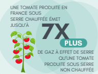

L'EXPANSION DES PLANTATIONS DE PALMIERS À HUILE ENTRAÎNE UNE DESTRUCTION MASSIVE DES FORÊTS TROPICALES.

LA DÉFORESTATION CAUSÉE PAR LA PRODUCTION D'HUILE DE
PALME MENACE LA BIODIVERSITÉ, ENTRAÎNANT LA DISPARITION
D'ESPÈCES ANIMALES ET VÉGÉTALES.

## 2 Encourager Les Options **Végétariennes** Nos Modes De Consommation Ayant Évolué, Il Est Important D'Inclure Des

options végétariennes et adaptées aux régimes spécifiques. Choisir des plats végétariens permet de respecter les convictions et les régimes alimentaires de chacun, tout en offrant des repas tout aussi nutritifs, gourmands et bien souvent moins onéreux à l'achat !

## Comparaison Basée Sur La Quantité De Co₂ **Émise** :


VÉGÉTARIENS
Proposer des options végétariennes permet de limiter les émissions de CO₂ et la consommation de ressources comme l'eau et les terres agricoles.

## Lesaviez-Vous?

GUIDE
D'ACCOMPAGNEMENT
ÉCOLOGIQUE ET DURABLE
La majeure partie des terres agricoles est utilisée pour cultiver des aliments


destinés au bétail (céréales, soja, etc.).

Il faut beaucoup plus de calories végétales pour produire une calorie animale. Par exemple, pour produire 1 kg de viande bovine, il faut environ 7 kg de céréales. Cela signifie qu'une plus grande surface de terres et un plus grand volume d'eau sont nécessaires pour nourrir les animaux que pour nourrir directement les humains avec des aliments végétaux.

1 FRANÇAIS·E SUR 4

 SOUHAITE DIMINUER SA CONSOMMATION DE VIANDE AU QUOTIDIEN
Contact spote@univ-tours.fr

## 3 Gestion Responsable Des Portions Et Des **Restes**

Il est nécessaire d'ajuster les quantités commandées en fonction du nombre de convives afin d'éviter le gaspillage alimentaire. Privilégier des portions adaptées et anticiper les besoins réels permet de limiter les excédents. En cas de surplus, vous pourrez déposer les restes dans les frigos solidaires ou contacter l'association des Bonnes Mines qui les redistribuera dans la mesure du possible. Autre bonne idée, prévoir des boites et bocaux vides pour emballer les restes !

lesbonnesmines.univ-tours@gmail.com

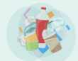

EN FRANCE, LE GASPILLAGE ALIMENTAIRE GÉNÉRÉ PAR LES ÉVÉNEMENTS REPRÉSENTE ENVIRON
TONNES DE NOURRITURE CHAQUE ANNÉE.

30 000

## 4 Minimiser La Génération De **Déchets**

Il est possible d'opter pour des prestations utilisant de la vaisselle lavable afin de limiter les déchets. Cela permet de réduire le gaspillage de ressources et simplifie la gestion des déchets après l'événement. Pour les boissons, l'usage des carafes au lieu des bouteilles en plastique réduit les emballages superflus. Vous pouvez aussi préciser au traiteur ce que vous ne voulez pas, comme des gobelets jetables par exemple, car une alternative lavable aura été prévue en amont. En effet, il y a encore des automatismes dans les services fournis par les traiteurs et les refuser permet de faire évoluer les pratiques. Enfin, limiter les portions individuelles au profit de plats collectifs constitue une solution pour limiter le sur-emballage.

## En **Résumé**


Dans l'expression des besoins auprès du traiteur, vous pouvez indiquer vouloir :
des produits de saison, sans huile de palme un pourcentage de parts végétariennes de la vaisselle réutilisable quand cela est possible, des plats collectifs minimisant les déchets et commander au plus juste du nombre de convives.

## Objets Publicitaires Et Sobriété : Des **Pratiques** À **Questionner**

DANS LES COLLOQUES, SÉMINAIRES OU JOURNÉES SCIENTIFIQUES, LES OBJETS PUBLICITAIRES (SACS,
CARNETS, CLÉS USB, STYLOS, MUGS...) SONT FRÉQUEMMENT UTILISÉS COMME OUTILS DE COMMUNICATION OU DE VALORISATION.

Présentés souvent comme utiles, durables ou responsables, ces goodies peuvent en réalité relever d'une démarche de greenwashing : une apparence écologique trompeuse. On imagine souvent qu**'ils**
ont un impact environnemental limité, pourtant, la réalité est toute autre.

## Durée D'Utilisation = Impact **Réduit**

Les goodies perdent tout intérêt environnemental s'ils sont distribués en trop grand nombre et donc cumulés en plusieurs exemplaires

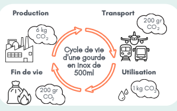

Atteindre une empreinte carbone neutre demande du temps… et de l'usage ! Un gobelet réutilisable devient plus vertueux qu'un jetable dès 7 utilisations. Un tote bag, lui, doit être utilisé environ 7 500 fois, soit pendant 20 ans. Quant à une gourde en inox, elle atteint la neutralité carbone après environ 3 ans d'utilisation.

FINALEMENT, LE MEILLEUR OBJET PROMOTIONNEL, C'EST CELUI QU'ON GARDE ET QU'ON UTILISE SOUVENT !

## 23% Des Goodies Sont Jetés **Sans** Être **Utilisés**

Clés USB, vite obsolètes, peu utilisées avec le développement du cloud Stylos non rechargeables et carnets à peine entamés s'amassent en grand nombre Mugs, gourdes, tote bag non utilisés car trop cumulés

## Les Bons Usages **Pour** Un Événement Éviter & Réduire

Inviter les participant·es à venir avec leur propre matériel : mug, carnet, stylo… Emprunter des équipements mutualisables :
vaisselle, signalétique, badges Proposer des objets à la demande au lieu d'une distribution automatique

## Réutiliser

Ne pas indiquer de dates sur les objets pour favoriser leur réutilisation

## Choisir

Privilégier des objets locaux, durables et sobres du marché des objets promotionnels FAVORISER L'UTILE ET LE DURABLE, C'EST COMMUNIQUER AVEC SENS. SOBRIÉTÉ, TRANSPARENCE ET ENGAGEMENT : NOS CHOIX COMPTENT.

## Un Bon Goodies, C'Est Un **Objet...** Sobre En **Ressources**

Fabriqué avec peu de matière premières,


sans habillage superflu (peinture, vernis, sur-emballage)

## A Base De Matériaux Peu **Polluants**


Un objet en fibre recyclée, bois certifié, inox brut ou encore en plastique recyclé, avec une origine claire et traçable (labels, circuit court)

## Facilement **Recyclable**

En limitant les mélanges de matériaux et en privilégiant du mono-matériau ou des composants faciles à séparer, le goodies en fin de vie sera mieux recyclé au lieu d'être incinéré

## Produit **Localement**

Une fabrication locale, française et même européenne limite les transports longues distances

## Au Bon **Design**

Un design neutre et sobre c'est durable car le goodies a plus de chance d'être utilisé longtemps

# Contacts


Servicedelacommandepublique(SCOP)
scop@univ-tours.fr Servicetechniquedel'immobilier(STI)
sti@univ-tours.fr Directiondelalogistique,sécurité,sureté(DL2S)
dl2s@univ-tours.fr Directiondessystèmesd'information(DSI)
dsi@univ-tours.fr

DIRECTIONS MÉTIERS RÉFÉRENT·ES **MÉTIERS**
Chargédemissionnumériqueresponsable bertrand.billault@univ-tours.fr Déléguéeà laprotectiondesdonnées dpo@univ-tours.fr RéférenteformationsTES
milica.vidakovic@univ-tours.fr Référentetransportsbascarbone margot.normand@univ-tours.fr

## Responsablepôleénergie

gregoire.barghamian@univ-tours.fr Guide de **décarbonation** de la recherche réalisé par :
Service du Pilotage de la **Transition** Écologique spote@univ-tours.fr Direction de la **recherche** et de la valorisation red@univ-tours.fr

```
©
   
U
  
niv
e
  
r
  
sit
é
  
d
  
e
  
T
  
o
  
u
  
r
  
s
  
/
  
S.B
o
  
u
  
rin
/
  
D.B
o
  
u
  
r
  
r
  
y
  

```
