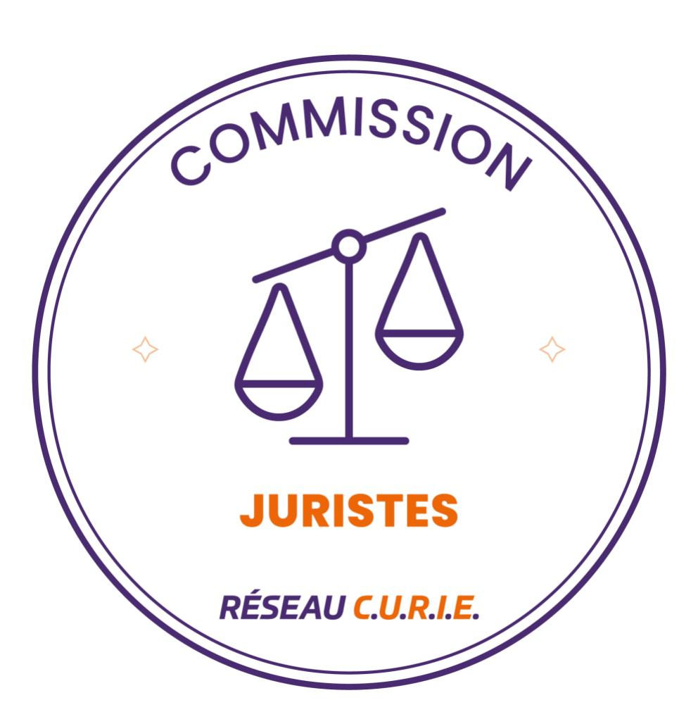

# La mobilité des chercheurs dans le cadre des dispositifs de valorisation du code de la recherche : Synthèse et préconisations

La présente fiche ne prétend pas à l'exhaustivité et ne peut engager la responsabilité de ses auteurs. Elle est fournie uniquement à titre d'information. Elle ne saurait en tout état de cause se substituer à la lecture des dispositions légales, règlementaires et la jurisprudence applicable en la matière.

Avant 1999, de fait de contraintes statutaires, les agents publics ne pouvaient pas créer des entreprises ou participer aux activités des entreprises existantes qui valorisaient leurs travaux de recherche, sauf à se mettre en disponibilité, position arrêtant dès lors leur progression de carrière publique.

Afin de lever ces freins, la Loi no 99-587 sur l'innovation et la recherche du 12 juillet 1999 a créée trois dispositifs de valorisation de la recherche publique codés alors aux articles 25-1, 25-2 et 25-3 de la Loi n° 82-610 du 15 juillet 1982 d'orientation et de programmation pour la recherche et le développement technologique de la France. Au jour de la publication de cette note, ces dispositifs de valorisation sont codés aux articles L531-1 à 17 du Code de la recherche. Ils permettent aux agents ayant la qualité de fonctionnaires civils, titulaires et stagiaires, quels que soient les statuts particuliers des corps auxquels ils appartiennent (e.g. chercheurs et enseignants-chercheurs, corps des ingénieurs, de techniciens ou de personnels administratifs etc.) et les fonctions auxquelles ils sont assignés, exerçant dans des services publics où est organisée la recherche publique (universités, établissements publics de recherche etc.) :

- D'être dirigeant et/ou associé d'une entreprise nouvelle ou existante qui valorise des travaux de recherche et d'enseignement (premier dispositif) ;
- D'apporter son concours scientifique à une entreprise qui valorise des travaux de recherche et de prendre des parts au capital social de ladite entreprise (deuxième dispositif);
- D'être membre des organes de direction de sociétés commerciales et de prendre des parts au capital de ladite société (**troisième dispositif**).

Les lois « PACTE » et « LPR » ont modifié ces dispositions du code de la recherche notamment en assouplissant les règles de mobilité, en fluidifiant les modalités de passage d'un dispositif à l'autre, en sécurisant le parcours de l'agent et en responsabilisant les établissements employeurs.

La présente note expose pour les trois dispositifs de valorisation du Code de la recherche :

- les évolutions suite à la loi PACTE et à la LPR,
- des préconisations de mise en œuvre.

Ces dispositifs de valorisation du code de la recherche sont également ouverts aux agents publics contractuels (article L.531-17 du code de la recherche) pour lesquels une loi ou un décret a étendu leur application. Pour ces agents contractuels, au jour de la publication de cette note, les lois ou décrets prévoient l'activation du premier dispositif (uniquement dans le cadre de la création d'entreprise et non pour une entreprise existante), et du deuxième dispositif. Les lois et les décrets ne prévoient actuellement pas la possibilité d'activer le troisième dispositif pour les contractuels.

Date: 15 mai 2024

#### Co-auteurs de la fiche initiale

- Pascale BOUVIER-MARION, Université Clermont Auvergne
- Florence FAURE, Université de Paris
- Morgane GUIBERT, Université de Tours

- Gaëtan LAN SUN LUK, Université de Montpellier
- Blandine LAVOILLOTTE, CY Cergy Paris Université
- Audrey RINGEVAL, Sorbonne Université
- Catherine ROCH, Université de Lorraine

Avec la participation de Germain Malnoury, Université de Technologie de Troyes, en sa qualité de co-auteur de la fiche « Loi « PACTE » : vers une simplification de la mobilité des chercheurs ? Fiche de synthèse et préconisations - Commission juristes du Réseau C.U.R.I.E » qui a servi de base de rédaction à la présente fiche.

#### Co-auteurs de l'actualisation de la fiche

- Isabelle CHERY, Institut Polytechnique de Grenoble
- Florence FAURE, Université de Paris
- Catherine ROCH, Université de Lorraine
- Anissa TAGHZOUTI, CentraleSupélec
- Sophie GEYRES, CentraleSupélec

Contact(s): relationsmembres@curie.asso.fr

#### Textes de référence :

- La Loi n° 2019-486 du 22 mai 2019 relative à la croissance et la transformation des entreprises, dite « Loi PACTE », qui réforme les articles L. 531-1 à L. 531-17 du code de la recherche.
- La Loi n° 2020-1674 du 24 décembre 2020 de Programmation de la Recherche (LPR) pour les années 2021 à 2030 et portant diverses dispositions relatives à la recherche et à l'enseignement supérieur
- Le décret n° 2019-1230 du 26 novembre 2019 portant application des articles L. 531-1 à L. 531-17 du code de la recherche, abrogé par le décret n°2023-1321 du 27 décembre 2023 art. 9 codifié aux articles R531-1 à R 531-8 du code de la recherche Section 1 : Dispositions applicables aux fonctionnaires
- Le décret n° 2001-125 pour l'application des articles 25-1 et 25-2 de la loi n° 82-610 du 15 juillet 1982 abrogé par le décret n°2023-1321 du 27 décembre 2023 - art. 9 codifié aux articles R531-9 à 10 du code de la recherche – Section 2 : Dispositions applicables aux personnels n'ayant pas le statut de fonctionnaire (Articles R531-9 à R531-10)
- Le décret n° 2021-1645 du 13 décembre 2021 (articles 16 et 17) pour certains agents non titulaires exerçant des fonctions universitaires et hospitalières dans les centres hospitaliers et universitaires.
- Le décret n°2021-882 qui fixe la liste des établissements publics dont les statuts prévoient une mission de recherche et est dorénavant codé aux articles D112-8 à 11 du code de la recherche

L'ensemble des préconisations mentionnées dans cette fiche est basé sur un état des lieux des pratiques mises en œuvre dans divers établissements. Les établissements sont souverains dans la mise en œuvre du texte.

# Table des matières

| 1. PREMIER DISPOSITIF                                                                           | 5           |
|-------------------------------------------------------------------------------------------------|-------------|
| 1.1 CE QUI A CHANGÉ                                                                             | 5           |
| 1.2 PRÉCONISATIONS :                                                                            | 5           |
| 2. DEUXIÈME DISPOSITIF                                                                          | 6           |
| 2.1. CE QUI A CHANGÉ                                                                            |             |
| 2.2. PRÉCONISATIONS                                                                             |             |
| 3. TROISIÈME DISPOSITIF                                                                         | 6           |
| 3.1. CE QUI A CHANGÉ :                                                                          |             |
|                                                                                                 |             |
| 4. CHANGEMENTS POUR L'ENSEMBLE DES DIS                                                          |             |
| 4.1. L'AVIS DE LA COMMISSION DE DÉONTOLOGIE                                                     |             |
| 4.2. LA MISE À DISPOSITION DE L'AGENT PUBLIC                                                    | 8           |
|                                                                                                 |             |
|                                                                                                 | FORISATION9 |
| 4.4 OBLIGATION D'INFORMATION                                                                    | FORISATION9 |
| 4.4 OBLIGATION D'INFORMATION4.5 DURÉE DE L'AUTORISATION                                         | FORISATION  |
| 4.4 OBLIGATION D'INFORMATION4.5 DURÉE DE L'AUTORISATION4.6. DÉLAI DE RÉPONSE DES ÉTABLISSEMENTS | FORISATION  |
| 4.4 OBLIGATION D'INFORMATION4.5 DURÉE DE L'AUTORISATION                                         | FORISATION  |

#### 1. PREMIER DISPOSITIF

#### 1.1 CE QUI A CHANGÉ

- Elargissement des travaux support de la demande d'autorisation aux activités d'enseignement (art. L531-1 code recherche).
- L'agent n'est plus obligé d'être à temps complet dans l'entreprise (mise à disposition¹ ou détachement) et peut être placé à temps incomplet (mise à disposition) auprès de l'entreprise nouvelle ou existante. Dans ce cas, l'autorisation fixe la quotité de temps de travail et la nature des fonctions que l'agent conserve dans l'établissement (art. L531-4 et L 531-5 code recherche) et une convention de mise à disposition², est signée avec l'entreprise prévoyant le remboursement du salaire de l'agent.
- L'agent mis à disposition ou détaché pourra bénéficier d'une promotion ou de la réussite d'un concours sans avoir à réintégrer son établissement (art. L 531-5 code recherche).
- Un plafond de complément de rémunération a été introduit (art. L. 531-5 et art. R 531-2 du code de la recherche).
- L'agent n'a plus besoin d'être à l'origine des travaux valorisés (art. L. 531-1 du code de la recherche)
- L'agent peut être associé ou dirigeant d'une entreprise existante qui valorise des travaux de recherche et d'enseignement (et non plus uniquement d'une entreprise nouvelle)

#### 1.2 PRÉCONISATIONS :

- Evaluer scrupuleusement le risque de conflit d'intérêt « caractérisé » dans le cas où l'agent souhaite poursuivre une activité de recherche au sein de l'établissement dans le cadre d'une mise à disposition à temps incomplet. Ce risque pourrait être restreint en envisageant la poursuite de l'activité de l'agent uniquement sur son activité de formation. C'est le choix fait par certains établissements. Cependant, le statut des enseignants-chercheurs prévoyant pour moitié une mission de recherche et pour moitié une mission d'enseignement, certains établissements font le choix d'équilibrer à parts égales la quotité de temps dédiée à la mise à disposition de l'agent sur son activité formation et son activité recherche. Ceci permet d'ailleurs de conserver un équilibre dans l'activité de recherche au sein des laboratoires et dans l'activité d'enseignement dans la composante de formation. S'agissant de l'activité recherche, notamment dans les cas sensibles et si cela est réalisable, il peut être envisagé de prévoir un périmètre de recherche différent des activités de l'entreprise. Il s'agit ici d'un choix politique d'établissement.
- En cas de doute sur un risque de conflit d'intérêt, notamment dans le cadre d'une mise à disposition à temps incomplet, saisir la Haute Autorité pour la transparence de la vie publique pour avis.

&lt;sup>1 Le terme de « mise à disposition » est utilisé de façon générique dans la présente note, sachant que pour les enseignantschercheurs, on parle de délégation et pour les chercheurs des EPST et personnels IRTF des EPSCP, on parle de mise à disposition.

2 Ou de détachement, en fonction du statut de l'agent. Dans cette fiche, le terme « mise à disposition » recouvre indifféremment « mise à disposition » ou « détachement » par commodité de lecture.

# 2. DEUXIÈME DISPOSITIF

# 2.1. CE QUI A CHANGÉ

- L'agent n'a plus besoin d'être à l'origine des travaux valorisés (art. L. 531-8 du code de la recherche)
- Le concours scientifique peut être apporté jusqu'à hauteur de 50% du temps de travail de l'agent. Si le concours scientifique n'est pas compatible avec l'exercice d'un temps plein, une mise à disposition doit être envisagée.
- Les fonctions et rôles possibles de l'agent au sein de l'entreprise sont également élargis, l'agent en concours scientifique pouvant désormais « exercer toute fonction au sein de l'entreprise à l'exception d'une fonction de dirigeant » (art. L.531-9 alinéa 2 code recherche).

# 2.2. PRÉCONISATIONS

- Une question qui se pose est celle de la quotité de concours scientifique à partir de laquelle il n'y a plus de compatibilité avec l'exercice d'un temps plein. Ceci relève d'une décision de chaque structure. Un établissement pourrait considérer que cette incompatibilité a lieu dès le premier pourcent de concours scientifique. Néanmoins, la plupart des établissements, au regard de la jurisprudence antérieure de la Commission nationale de déontologie de la fonction publique, estiment que la limite du temps consacré à l'entreprise dans le cadre d'un concours scientifique, compatible avec l'exercice d'un temps plein de l'agent dans sa fonction publique peut aller jusqu'à 20%.
- Concernant le concours scientifique et la prise de participation au capital social (articles L. 531-8 et L531-9 du code de la recherche): Les textes en vigueur ne prévoient pas de plafond de prise de participation au capital social. Avant la loi PACTE et la LPR, le chercheur/enseignant-chercheur en concours scientifique pouvait participer au capital social de l'entreprise qui valorisait ses travaux de recherche à hauteur maximale de 49%. Au regard de l'absence de plafond dans les nouveaux textes, il peut être considéré que la participation au capital social par le chercheur peut aller jusqu'à 100% et il n'est donc juridiquement pas possible de limiter ce plafond à 49%.

# 3. TROISIÈME DISPOSITIF

# 3.1. CE QUI A CHANGÉ :

- La participation est élargie à tous les organes de direction de toute société commerciale (auparavant limitée aux seules sociétés anonymes).
- La participation ne peut dépasser 32% du capital social, ni donner droit à plus de 32% de droits de vote contre 20% précédemment (art. L531-12 code recherche).

### 4. CHANGEMENTS POUR L'ENSEMBLE DES DISPOSITIFS :

#### 4.1. L'AVIS DE LA COMMISSION DE DÉONTOLOGIE

La commission de déontologie a été remplacée depuis le 1er février 2020 par la Haute Autorité pour la Transparence de la Vie Publique (HATVP). Désormais, ce sont les établissements employeurs qui sont chargés de l'instruction et du suivi des demandes (art. L531-14 code recherche). Il n'y a donc plus d'avis préalable obligatoire d'une instance nationale.

Pour autant la HATVP peut être saisie préalablement à la décision d'autorisation et doit l'être si l'établissement estime ne pas pouvoir apprécier si le fonctionnaire se trouve en situation de conflit d'intérêts. ((art.4 du décret n° 2019-1230 codifié à l'article R. 531-7 du code de la recherche).

#### Préconisations :

- Constitution d'une instance au sein de l'établissement-employeur à même de rendre un avis éclairé sur les demandes d'autorisation susmentionnées et d'évaluer le risque de conflit d'intérêt. Cette instance peut également se prononcer sur une abrogation d'autorisation ou un refus de renouvellement. Il est rappelé que cette instance n'a qu'un rôle consultatif et qu'il appartient toujours au représentant légal de l'établissement de délivrer l'autorisation.
- Définir précisément la composition de cette instance, afin d'assurer l'objectivité et le sérieux des avis rendus (et ce afin de limiter les risques de recours des agents contre le contenu des autorisations édictées, in fine). A cette fin, il est conseillé de placer cette instance sous la responsabilité du vice-président concerné par la valorisation et de doter cette instance, a minima, d'un représentant de la DRH, d'un représentant de la Direction de la Valorisation, d'un représentant de la direction des affaires juridiques, du référent déontologue de l'établissement et au cas par cas un chercheur de la thématique recherche du dossier évoqué. Il est possible d'y associer d'autres vice-présidents. La composition de cette instance relève d'une politique d'établissement.
- Pour le cas spécifique des personnels hospitalo-universitaires, mais également celui où sur un même projet de valorisation, plusieurs agents ayant des employeurs différents sont impliqués : il est préconisé de mettre en œuvre des interactions entre les employeurs concernés par le dossier afin que les avis et autorisations puissent être le plus possible harmonisés et cohérents.

Au choix des établissements, plusieurs options sont envisageables :

- une instance interne avec possibilité d'inviter au cas par cas des membres appartenant à des établissements partenaires afin de traiter les dossiers concernant des personnels relevant de ces établissements;
- > une instance créée au niveau du site, via le contrat de site ;
- une instance « inter-établissements » (par exemple : Université CHRU ...). Dans ces instances inter-établissements, l'ensemble des employeurs des agents concernés doivent être représentés.

- S'agissant de la constitution du dossier, il est préconisé de mettre en place un dossier analogue à celui qui était utilisé antérieurement pour les saisines de la commission de déontologie de la fonction publique. Cela permettra de bénéficier d'un dossier bien complet et, le cas échéant, de pouvoir plus aisément saisir la HATVP.
- Il convient de définir le plus précisément possible des critères de fond objectifs, pour l'évaluation du conflit d'intérêt, et d'argumenter les avis négatifs afin que puissent être justifiés les éventuels refus d'autorisation (encore une fois, en vue de limiter les risques de recours des agents contre les décisions des établissements).

## 4.2. LA MISE À DISPOSITION DE L'AGENT PUBLIC

Recours au temps incomplet pour participer en qualité d'associé ou de dirigeant à une entreprise existante ou nouvelle ou pour être en concours scientifique : le personnel peut désormais être placé en mise à disposition en temps incomplet pour créer son entreprise ou partir vers une entreprise existante. En concours scientifique, il peut ainsi consacrer jusqu'à 50% de son temps de travail à l'entreprise.

#### Préconisations :

Il est rappelé qu'un point de vigilance est à souligner sur la gestion du conflit d'intérêt dans le cas où l'enseignant-chercheur/le chercheur travaillerait encore à temps incomplet dans son laboratoire d'origine. Les textes (articles L 531-1 et s. et L. 531-8 du code de la recherche) ne précisent pas si la mise à disposition de l'enseignant-chercheur est faite sur son temps « recherche » ou son temps « formation ». Comme évoqué précédemment, ceci relève d'une politique d'établissement, des pratiques différentes ayant été relevées entre les établissements.

En cas de, participation en qualité d'associé ou de dirigeant à une entreprise existante ou nouvelle ou de concours scientifique, la mise à disposition donnera obligatoirement lieu à remboursement, quelle que soit la durée, dans les conditions prévues par voie réglementaire (art. L 531-14 code recherche, dernier alinéa) cependant les dérogations restent possibles3.

#### Préconisations :

Il est préconisé de mettre en place des cadrages au sein des établissements qui détermineront les modalités de ce remboursement, au regard des dérogations possibles selon les textes applicables aux différentes formes d'établissements. Les établissements pourront ainsi faire le choix de prévoir des dérogations, au cas par cas, qui prévoiront une exonération totale ou partielle de remboursement de la rémunération et des charges salariales du chercheur notamment pendant une durée déterminée.

&lt;sup>3 Les modalités de remboursement de mise à disposition sont prévues par plusieurs textes :

 $\hfill \square$  Pour les CR, DR et ITA des EPST : article R. 426-3 du code de la recherche ;

☐ Pour les ITRF des EPSCP : art. 140 du décret n° 85-1534 (CE) ;

□ Pour les enseignants chercheurs : art. 14 du décret n°84-431 du 6 juin 1984. Le décret de 1984 sur le statut des enseignants - chercheurs n'a par ailleurs pas été mis en conformité avec la nouvelle règlementation sur la durée de 3 ans renouvelable dans la limite de 10 ans. Dans le cadre de la création d'entreprise, le remboursement n'est obligatoire qu'au-delà d'un an sauf dispense totale ou partielle du conseil d'administration de l'établissement.

#### 4.3. CONSERVATION DU CAPITAL AU TERME DE L'AUTORISATION

En cas de participation en qualité d'associé ou de dirigeant à une entreprise existante ou nouvelle ou de concours scientifique avec participation au capital social, et sous réserve d'informer son établissement du montant dont il dispose, le fonctionnaire pourra conserver sa participation au capital social à la fin de l'autorisation, dans la limite de 49% du capital (art. L531-15 du code de la recherche).

Le régime antérieur prévoyait un délai d'un an pour revendre les parts sociales au terme de la mobilité ce qui pouvait s'avérer complexe à mettre en pratique.

Attention, cette possibilité de conserver des parts sociales à l'issue de la période d'autorisation disparaît en cas de retrait ou de refus de renouvellement de l'autorisation par l'établissement public « si les conditions qui avaient permis la délivrance de l'autorisation ne sont plus réunies ou si le fonctionnaire méconnaît les dispositions » du code de la recherche. Dans ce cas, l'agent ne pourra plus « conserver directement ou indirectement un intérêt financier quelconque dans l'entreprise. »

#### Préconisations :

Il est préconisé de confier à l'instance mise en place au sein des établissements la mission de mettre en place une procédure pour demander l'information sur les revenus perçus afin que le service compétent puisse s'assurer que la somme des revenus n'excède pas le plafond fixé par voie réglementaire (art. L531-5 du code de la recherche).

#### 4.4 OBLIGATION D'INFORMATION

Contrairement aux dispositions antérieures, il n'y a plus d'obligation d'informer l'employeur sur les contrats et conventions conclus entre l'entreprise et le service public de la recherche4.

#### 4.5 DURÉE DE L'AUTORISATION

Les autorisations sont accordées par périodes de trois ans maximum, dans la limite d'une durée totale de dix ans (art. 2 du décret n° 2019-1230) tous dispositifs confondus. Le régime antérieur prévoyait une durée de deux ans renouvelable deux fois pour la création d'entreprise et une durée de cinq ans pour le concours scientifique dont le renouvellement n'était pas limité dans le temps. Le renouvellement de l'autorisation de membre des organes de direction était autorisé pour la durée dudit mandat social et les renouvellements étaient possibles à chaque reconduction du mandat.

#### 4.6. DÉLAI DE RÉPONSE DES ÉTABLISSEMENTS

Les établissements disposent d'un délai **de quatre mois à compter de la demande** de l'agent pour se prononcer sur cette dernière (article R 531-7 du code de la recherche). Ils peuvent saisir la HATVP pour avis.

&lt;sup>4 Au vu d'un contexte particulier, la demande de production des contrats peut être néanmoins pertinente.

#### > Préconisations :

L'article R 531-7 du code de la recherche ne précise pas ce qui est entendu par « demande ». Il serait raisonnable de considérer que le délai court à compter du dépôt du dossier complet et finalisé par l'agent.

Il appartient à chaque établissement de qualifier expressément ce qu'il entend par « demande ».

#### 4.7 DÉLALPOUR CONCLURE LE CONTRAT DE VALORISATION

Le contrat de valorisation doit être conclu dans un délai d'un an (contre neuf mois auparavant) après la délivrance de l'autorisation (art. R. 531-1 et R.531-3 du code de la recherche).

# 4.8. PLAFONDS DE RÉMUNÉRATION

Les plafonds de rémunération sont maintenus mais en sont exclus les revenus issus des cessions de parts sociales (art. R. 531-2, R. 531-4 et R.531-6 du code de la recherche).

Cet état des lieux n'aborde pas certaines questions restant sujettes à interprétations des textes et sur lesquelles des travaux d'analyses sont en cours. Ces questions feront l'objet d'une revue prochaine.