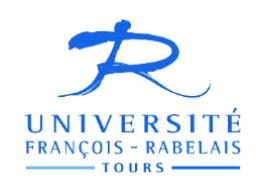

# **Projet** V1. 30 mai 2017

# REGLEMENT INTERIEUR UNIVERSITE DE TOURS

# **PREAMBULE**

**TITRE I: Dispositions communes** 

**CHAPITRE I : Les droits et libertés** 

CHAPITRE II : Hygiène et sécurité

**CHAPITRE III: Utilisation du domaine public** 

**CHAPITRE IV: Dispositions relatives aux outils informatiques** 

CHAPITRE VI : Développement durable et environnement

**TITRE II: Dispositions applicables aux personnels** 

CHAPITRE I : Les droits, libertés et obligations

**CHAPITRE II: Exercice du droit syndical** 

TITRE III: Dispositions applicables aux usagers

CHAPITRE I : Les droits, libertés et obligations

CHAPITRE II : Hygiène et sécurité

**TITRE IV: Discipline** 

CHAPITRE I: Régime disciplinaire applicable aux personnels

CHAPITRE II: Régime disciplinaire applicable aux usagers

**TITRE V : Dispositions finales** 

# **PREAMBULE**:

L'Université est un établissement public administratif de l'Etat, à caractère scientifique, culturel et professionnel, qui participe au développement de la mission de service public de l'enseignement supérieur et de la recherche. Conformément au code de l'éducation, l'université contribue à la lutte contre les discriminations, à la réduction des inégalités sociales ou culturelles, à la réalisation de l'égalité entre les hommes et les femmes et mène une action contre les stéréotypes sexués. Elle contribue également à la construction d'une société inclusive et veille, à cette fin, à favoriser l'inclusion des individus, sans distinction d'origine, de milieu social et de condition de santé. L'université promeut des valeurs d'éthique, de responsabilité et d'exemplarité.

Les dispositions du présent règlement intérieur s'appliquent aux usagers du service public de l'enseignement supérieur, aux personnels de l'Université ainsi qu'à toute autre personne présente dans l'enceinte de l'Université (comprenant également les locaux ms à disposition du service public de l'enseignement supérieur mais n'appartenant pas à l'Université).

Le présent Règlement intérieur a pour objet de fixer le cadre dans lequel chacun peut exercer ses droits et libertés, dans le respect de ses obligations, afin de garantir l'ordre et le bon fonctionnement de l'Université.

# **TITRE I: Dispositions communes:**

# **CHAPITRE I : Les droits et libertés :**

## Article 1 : Neutralité et laïcité au sein de l'Université :

L'article L.141-6 du Code de l'éducation prévoit que le service public de l'enseignement supérieur doit répondre à une exigence de laïcité.

L'Université est neutre et laïque en sa qualité d'établissement public à caractère scientifique, culturel et professionnel.

Le Président de l'Université veille au respect du principe de laïcité au niveau de la vie de l'Université (enseignements, examens...).

Sont strictement interdits : les actes de prosélytisme, les manifestations de discriminations, les incitations à la haine et toute forme de pression physique ou psychologique visant à imposer un courant de pensée religieux, philosophique ou politique qui s'opposerait au principe de neutralité

## Article 2 : Liberté de communication :

La liberté de communication est garantie au sein de l'Université. Elle comprend liberté d'information et d'expression à l'égard des problèmes politiques, économiques, sociaux et culturels. Elle s'exerce dans le respect des principes de tolérance et d'objectivité et dans des conditions qui ne portent pas atteinte aux activités d'enseignement et de recherche et qui ne troublent pas l'ordre public.

## 2-1: Moyens de communication:

La distribution de documents, tracts, avis et communiqués par toute personne étrangère à l'Université est interdite, sauf autorisation expresse du Président de l'Université ou d'une autorité délégataire.

Il en est de même de l'affichage dont le droit est reconnu aux seuls membres de la communauté universitaire. Les modalités d'exercice de ce droit par les personnels, les organisations syndicales ou associatives de personnels ou d'usagers sont fixées à l'article 26 du présent règlement intérieur.

Tout affichage est interdit en dehors des emplacements réservés à cet effet ainsi que sur les panneaux réservés à l'administration.

Des institutions ou organismes extérieurs à l'université peuvent être autorisés à apposer des affiches sur les emplacements prévus à cet effet sous la double réserve que cet affichage soit en lien direct avec la mission de service public de l'université et soit préalablement autorisé par les autorités habilités. La responsabilité du contenu de ces documents incombe aux institutions et organisations qui les signent et les diffusent. Tout document doit mentionner l'identité de son auteur sans confusion possible avec l'Université.

Tout affichage à caractère diffamatoire ou injurieux et de manière générale contraire à l'ordre public est interdit.

## <u>2-2</u>: Mises à disposition et locations de locaux :

L'université peut mettre à disposition ou louer ses locaux à des institutions ou organismes extérieurs pour la tenue, notamment, de réunions, de concours ou de manifestations.

Les organisateurs extérieurs doivent au préalable solliciter l'autorisation de l'autorité habilitée et adresser ensuite leur demande d'affectation de salle au service de gestion des salles du site concerné. Après l'accord du Président ou de la personne délégataire, un contrat de location, établi selon les tarifs en vigueur, est proposé au demandeur.

La réservation est effective au retour signé du contrat prévoyant la mise à disposition ou la location.

Fidèle à ses traditions de neutralité, l'Université refuse la mise à disposition ou la location de locaux aux organisations politiques et religieuses.

## <u>2-3</u>: Mesures en cas de manquement :

Dans le but de préserver l'ordre public et le bon fonctionnement de l'établissement, le Président de l'Université ou l'autorité délégataire pourra engager toute action, dont le recours à la force publique, pour faire respecter les dispositions mentionnées ci-dessus et faire cesser tout désordre.

L'Université se réserve le droit de porter plainte et, le cas échéant, se saisir la section disciplinaire.

# **CHAPITRE II : Hygiène, sécurité et conditions de travail :**

Soucieuse du respect de son personnel et de ses usagers, l'Université veille aux au bien-être de chacun et à l'amélioration des conditions de travail et de vie étudiante.

Certains bâtiments ou certaines activités répondent à une réglementation particulière. La connaissance et le respect des règles sont impératifs :

- Connaître, respecter et faire respecter les règles de sécurité en vigueur dans le service,
- Localiser et utiliser les moyens de secours,
- Respecter les circulations et les issues de secours en les maintenant en bon état,
- Respecter les consignes spécifiques à certains lieux, tenues ou procédures,
- Connaître et respecter les indications des panneaux de danger, d'obligation, d'évacuation etc...,
- Utiliser les équipements de protection individuels et collectifs,
- Prendre connaissance et respecter les précautions d'emploi et de stockage des produits chimiques,
- Respecter les niveaux d'accès aux locaux techniques selon les formations et les autorisations recues,
- Ne pas déroger sans autorisation aux horaires de fonctionnement habituel au service.
- Utiliser à bon escient les registres réglementaires disponibles.

## Article 3 : L'interdiction du harcèlement :

Le harcèlement moral et le harcèlement sexuel sont des délits pénalement répréhensibles qui peuvent faire l'objet, de manière indépendante, de poursuites pénales et de poursuites disciplinaires. L'université a mis en place une procédure qui permet de signaler et de faire cesser toute situation de harcèlement. Les personnes qui s'estiment victimes de harcèlement ou qui constatent une situation de harcèlement doivent donc s'y référer.

## Article 4: Interdiction du bizutage:

Le bizutage est pénalement répréhensible selon les articles 225-16-1 ; 225-16-2 et 225-16-3 du Code pénal.

Cette prohibition du bizutage est reprise par l'article L.511-3 du Code de l'éducation. Le bizutage peut être défini comme : « Hors les cas de violences, de menaces ou d'atteintes sexuelles, le fait pour une personne d'amener autrui, contre son gré ou non, à subir ou à commettre des actes humiliants ou dégradants ou à consommer de l'alcool de manière excessive, lors de manifestations ou de réunions liées aux milieux scolaire, sportif et socio-éducatif ».

## Article 5 : Règles liées au matériel de sécurité et aux évacuations:

Toute détérioration des équipements (alarmes, extincteurs...) peut faire l'objet d'une sanction.

Il en va de même en cas d'alerte déclenchée de façon injustifiée.

L'Université organise des exercices d'évacuation des bâtiments auxquels chacun est tenu de participer activement.

#### Il convient:

- D'assurer la sécurité de tous les occupants d'un bâtiment et en particulier du public, lors d'un départ d'incendie, d'un déversement de produit chimique, d'une fuite de gaz, d'un évènement grave.
- De respecter et faire respecter les consignes transmises pendant l'événement (évacuation, confinement, ...).

## Article 6: Interdiction de fumer ou de « vapoter » dans les locaux :

Conformément à l'article R.3511-1 du Code de la santé publique, il est interdit de fumer dans les lieux fermés et couverts accueillant du public ou qui constituent des lieux de travail. Cette disposition s'applique au sein de l'Université.

Le Code de la santé publique et le décret n° 2017-633 du 25 avril 20171 interdisent le vapotage aux employeurs, salariés et usagers dans établissements destinés notamment à l'accueil et/ou à la formation et dans les lieux de travail fermés et couverts à usage collectif. A ce titre, l'usage de la cigarette électronique est interdit dans les locaux de

Règlement intérieur de l'Université François---Rabelais de Tours – Approuvé par le CA le XX/XX/2017

&lt;sup>1 Relatif aux conditions d'application de l'interdiction de vapoter dans certains lieux à usage collectif

l'Université. Pour rappel, vapoter dans un lieu où cette pratique est interdite est puni d'une amende de 2ème classe. Une signalisation devra être mise en place sous peine d'amende de 3ème classe.

## Article 7 : Vente et consommation d'alcool sur les sites de l'Université :

Il est par principe interdit de vendre ou de consommer de l'alcool au sein de l'Université.

Cependant, des autorisations exceptionnelles pour la consommation d'alcool doux (vin, bière, cidre et poiré) peuvent être accordées lors d'événements particuliers tels que les colloques, les remises de diplômes, les pots de thèse ou de départ etc...

## Article 8 : Substances illicites et matériel dangereux :

Il est interdit de détenir ou de consommer des substances illicites (notamment des stupéfiants) au sein de l'Université.

Il est interdit de détenir ou d'user de tout matériel dangereux (notamment des armes).

## Article 9 : Respect des biens au sein de l'Université :

Tout vol ou détérioration de biens personnels n'engage pas la responsabilité de l'Université puisque ces derniers sont réputés être sous la garde de leur propriétaire ou détenteur.

Les auteurs de dégradations volontaires causées aux biens mis à disposition par l'Université (locaux, ordinateurs, mobiliers...) peuvent faire l'objet de sanctions disciplinaires, de poursuites civiles et pénales.

## Article 10: Videoprotection:

Dans un but de prévention d'atteintes aux personnes et aux biens, des moyens de videoprotection peuvent être installées sur les sites universitaires.

Cette possibilité est encadrée par la Charte de Videoprotection de l'Université François-Rabelais de Tours2

&lt;sup>2 Fn annexe.

# **CHAPITRE III: Utilisation du domaine public de l'Université:**

Les locaux dont l'Université est gestionnaire font partie du domaine public. Ces locaux sont affectés à la mission du service public de l'enseignement supérieur et de la recherche et ne sont pas ouverts au public, sauf cas particuliers. Le domaine public de l'Université comprend également les biens mobiliers. Ces derniers doivent être utilisés conformément à leur usage et avec respect.

#### Article 11 : Liberté de circulation :

Les personnes autorisées à accéder aux différents sites, locaux et parkings de l'Université sont les personnels, les usagers du service public de l'enseignement supérieur tels que définis à l'article L.811-1 du Code de l'éducation et les autres personnes intervenant dans le cadre du service. En particulier, les restrictions d'accès aux locaux spécifiques ayant un accès règlementé (labo, locaux techniques, ...) doivent être respectées.

Toute personne présente sur un des sites de l'Université doit être en mesure de justifier sa présence en montrant sa carte d'étudiant, sa carte professionnelle ou toute autre autorisation spécifique. En cas d'absence ou d'insuffisance de justification, les personnels habilités peuvent demander aux personnes présentes de quitter les lieux sans délai.

Le Président de l'Université en vertu de son pouvoir de police administrative spéciale peut décider temporairement de limiter ou d'interdire l'accès des usagers, des professionnels et des personnes intervenant dans le service pour prévenir des atteintes à l'ordre (plan Vigipirate, chantiers de travaux etc...). Dans ces cas, la présentation de la carte étudiante ou professionnelle peut être une condition d'accès.

## Article 12: Autorisation d'occupation du domaine public universitaire :

L'université peut accorder des autorisations d'occupation temporaire du domaine public universitaire à des organismes publics ou privés pour exercer une activité en lien avec les missions de l'université.

Ces autorisations, unilatérales ou contractuelles, sont strictement encadrées et relève de la compétence du conseil d'administration ou du Président de l'université par délégation.

Dans tous les cas, les autorisations d'occupation sont temporaires et révocables et donnent lieu au versement d'une redevance.

## Article 13: Stationnement et circulation sur les parkings:

Les règles du présent article s'appliquent aussi bien sur les parkings étudiants que sur les parkings réservés aux personnels et intervenants dans le cadre du service.

Les règles du Code de la route s'appliquent sur les parkings de l'Université.

Il est interdit de stationner en dehors des emplacements prévus à cet effet. Cela signifie qu'il est interdit de stationner notamment sur les voies réservées aux personnes en situation de handicap, à l'accès des services de secours, sur les voies permettant aux autres véhicules de sortir du parking, sur les voies réservées aux livraisons etc...

Tout véhicule ne respectant pas les règles de stationnement pourra faire l'objet d'un procèsverbal et d'une mise en fourrière par les autorités de police compétentes. Cette disposition pourra également s'appliquer aux véhicules abandonnés.

L'Université n'est pas responsable des dommages causés par un véhicule ou sur un véhicule présent sur un de ses parkings.

## Article 14: Interdiction des animaux:

Les animaux sont interdits dans les enceintes de l'Université sauf autorisation expresse de son Président ou de son délégataire. Cela peut notamment couvrir les cas où l'animal aurait pour fonction d'accompagner une personne en situation de handicap.

# **CHAPITRE IV: Dispositions relatives aux outils informatiques:**

Les outils informatiques doivent être utilisés avec respect et tolérance, conformément aux dispositions du présent règlement intérieur. Les propos tenus par l'intermédiaire des outils informatiques (messagerie, réseaux sociaux, sites web...) sont susceptibles d'engager la responsabilité de leurs auteurs.

## Article 15 : L'usage des réseaux sociaux :

L'usage de la page Facebook de l'Université doit se faire conformément à la Charte d'utilisation de la page Facebook de l'Université François-Rabelais3.

L'usage des réseaux sociaux est régi par la Charte éditoriale réseaux sociaux4.

\_

&lt;sup>3 Fn annexe.

## Article 16 : La messagerie et le droit de déconnexion :

Les règles relatives à la messagerie sont régies par la Charte d'usage du Système d'Information de l'Université de Tours5.

Dans l'attente de la mise en œuvre des dispositions relatives au droit à la déconnexion, la messagerie doit être utilisée conformément au cadre de travail et dans le respect de la vie privée des personnels et usagers.

## Article 17 : Accès et utilisation des systèmes d'informations :

Les règles relatives à l'accès et à l'utilisation des systèmes d'informations sont régies par la Charte d'usage du Système d'Information de l'Université de Tours.

## Article 18 : Publication et hébergement de services Web :

Le présent article est régi par la Charte de publication et d'hébergement de services web de l'Université François-Rabelais de Tours.

## Article 19: Usage des outils informatiques:

L'utilisation des technologies de l'information et de la communication est délimitée par la circulaire du 29 Novembre 2016 du Ministre de l'éducation nationale, de l'enseignement supérieur et de la recherche6.

## Article 20: Manquement aux chartes:

Tout manquement aux chartes précitées peut donner lieu à des poursuites disciplinaires.

# **CHAPITRE VI : Développement durable et environnement :**

#### Article 21 : Transition écologique et sociale

L'unité de recherche s'engage à contribuer activement à la transition écologique et sociale, en intégrant ces préoccupations dans ses activités de recherche et de valorisation.

Notamment, elle nomme un référent Transition Écologique et Sociale en charge de suivre les différentes actions de l'UR en lien avec cette thématique.

&lt;sup>4 En annexe.

&lt;sup>5 En annexe.

&lt;sup>6 En annexe.

Par ailleurs, elle s'engage à effectuer son bilan carbone (BGES) 2 fois par contrat (avec l'appui des services dédiés), et à mettre en œuvre un plan d'action sur cette base, qu'elle évalue régulièrement pour ajuster les actions entreprises en vue d'atteindre les objectifs fixés. Enfin, elle contribue par ses recherches à la réflexion sur la transition écologique et sociale, lorsque c'est pertinent.

# **TITRE II: Dispositions propres aux personnels:**

Les personnels de l'université sont des agents publics. A ce titre, ils sont soumis aux droits et obligations du statut de la fonction publique et exercent leurs fonctions avec dignité, impartialité, intégrité et probité.

# **CHAPITRE I : Les droits, libertés et obligations :**

## Article 22 : Laïcité et neutralité :

Conformément au statut de la fonction publique, les personnels de l'université sont tenus à l'obligation de neutralité et doivent exercer leurs fonctions dans le respect du principe de laïcité. Toute manifestation, dans l'exercice de leurs fonctions, de leurs opinions religieuses est interdite. Les agents traitent de façon égale toutes les personnes et respectent leur liberté de conscience et leur dignité.

## Article 23 : Liberté d'opinion et d'expression :

La liberté d'opinion et d'expression est garantie aux personnels de l'université. La liberté d'expression s'exerce dans le respect des obligations de réserve, de secret et de discrétion professionnelle.

Pour ce qui concerne leurs fonctions d'enseignement et de recherche, les enseignantschercheurs, les enseignants et les chercheurs jouissent d'une pleine indépendance et d'une entière liberté d'expression dans l'exercice de leurs fonctions d'enseignement et de leurs activités de recherche, sous les réserves que leur imposent, conformément aux traditions universitaires et aux dispositions du code de l'éducation, les principes de tolérance et d'objectivité.

# **CHAPITRE II: Exercice du droit syndical:**

#### Article 24 : La liberté syndicale :

La liberté syndicale vise la liberté individuelle de défendre ses droits et ses intérêts par l'adhésion au syndicat de son choix ainsi que la liberté collective de créer un syndicat professionnel.

La liberté syndicale est octroyée aux personnels de l'Université en vertu du décret du 28 Mai 1982 relatif à l'exercice du droit syndical dans la fonction publique7.

## <u>24-1</u>: Liberté de communication/affichage :

Les documents émanant des syndicats de personnels peuvent être distribués aux agents dans l'enceinte des bâtiments administratifs, mais en dehors des espaces ouverts aux usagers. Ces distributions ne doivent en aucun cas porter atteinte au bon fonctionnement du service. Lorsqu'elles ont lieu pendant les heures de service, elles ne peuvent être assurées que par des agents qui ne sont pas en service ou qui bénéficient d'une décharge de service.

L'université met à disposition des organisations syndicales des espaces d'affichage qui leur sont réservés. Les syndicats ont la responsabilité du contenu des affiches.

## 24-2 : Liberté de réunion et mise à disposition d'un local :

Les organisations syndicales bénéficient du droit de réunion dans les locaux universitaires selon les termes fixés par le décret du 28 Mai 1982 relatif à l'exercice du droit syndical dans la fonction publique.

Pour les réunions autorisées, les organisateurs sont responsables du contenu de leurs interventions, se chargent d'assurer l'ordre à l'intérieur de celles-ci et veillent à l'intégrité des locaux et équipements de l'Université.

A ce titre, les organisations syndicales ont droit à la mise à disposition d'un local.

## 24-3: Utilisation des outils numériques: A développer

Une adresse mail générique est mise à disposition des syndicats ainsi qu'une page sur le site intranet.

&lt;sup>7 Décret n°82---447.

# **TITRE III: Dispositions propres aux usagers:**

# **CHAPITRE I : Les droits, libertés et obligations :**

## Article 25 : La neutralité et la laïcité :

L'interdiction dans les écoles, collèges et lycées publics du port ou tenues par lesquels les usagers manifestent ostensiblement une appartenance religieuse ne s'applique pas à l'université.

Toutefois, en vertu des principes de neutralité et de laïcité, sont strictement interdits les actes de prosélytisme, les manifestations de discrimination, les incitations à la haine et toute forme de pression physique et psychologique visant à imposer un courant de pensée religieux, philosophique ou politique qui s'opposerait au principe de laïcité. Aucune raison d'ordre religieux, philosophique, politique ou considération de sexe ne pourra être invoquée pour refuser de participer à certains enseignements, empêcher d'étudier certains ouvrages ou auteurs, refuser de participer à certaines épreuves d'examen, contester les sujets, les choix pédagogiques ainsi que les examinateurs.

Par ailleurs, les usagers sont soumis aux exigences de la loi du 11 octobre 20108 qui interdit la dissimulation du visage dans les espaces publics, dont les lieux affectés au service public, comme l'université, font partie.

## Article 26 : La liberté d'expression :

La liberté d'expression est octroyée aux usagers par l'article L.811-1 du Code de l'éducation. Les usagers « disposent de la liberté d'information et d'expression à l'égard des problèmes politiques, économiques, sociaux et culturels. Ils exercent cette liberté à titre individuel et collectif, dans des conditions qui ne portent pas atteinte aux activités d'enseignement et de recherche et qui ne troublent pas l'ordre public ».

# Article 27: Liberté d'association :

La liberté d'association est garantie aux usagers.

Peuvent être reconnues comme association étudiante de l'université, les associations qui répondent aux exigences du « label » association étudiante.

&lt;sup>8 Loi n°2010---1192.

Cette liberté s'exerce selon deux modalités : la domiciliation et l'hébergement.

## 27-1 : Procédure de domiciliation :

Toute demande de domiciliation d'une association au sein de l'Université est soumise à autorisation préalable du Président de l'Université.

Toute demande de domiciliation d'une association étudiante devra respecter les dispositions arrêtées par le bureau de la vie étudiante.

## 27-2 : Procédure d'hébergement :

Un local peut être mis à disposition des associations après autorisation préalable du Président de l'Université.

Une convention d'occupation précaire est conclue entre l'Université et l'association.

Le non-respect des termes de la convention par l'association entraînera la remise à disposition du local occupé par l'association.

Les associations hébergées s'engagent à communiquer chaque année au Président de l'Université un rapport d'activités et les coordonnées de leurs responsables.

Les conditions d'utilisation des locaux par les associations étudiantes sont décidées par le Président de l'Université, après consultation du conseil académique réuni en formation plénière.

#### Article 28 : La liberté de réunion :

Les usagers peuvent se réunir librement dans les locaux de l'université, sous réserve de réservation d'une salle auprès du service de gestion des salles du site concerné.

Les réunions se déroulent dans le respect de l'organisation des activités d'enseignement, de recherche et d'administration.

Les associations étudiantes peuvent également se réunir librement dans les mêmes conditions. Dans le cas où elles souhaitent organiser des manifestations dans les locaux, un contrat à titre gracieux est réalisé. Elles doivent par ailleurs fournir une attestation de responsabilité civile.

Dans le cas de demande d'une prestation particulière ou en dehors des heures d'ouverture des locaux, une facturation peut être effectuée.

## **CHAPITRE II : Hygiène et sécurité :**

Les associations étudiantes peuvent être autorisées à distribuer ou vendre des boissons nonalcoolisées et des produits alimentaires à des fins de communication ou pour financer certaines de leurs actions.

Cependant, les boissons non-alcoolisées et les produits alimentaires proposés ne doivent en aucun cas être « faits maison » pour des raisons évidentes d'hygiène et de sécurité (allergies, impossibilité de savoir l'origine des produits, si la chaîne du froid et la date de péremption sont respectées...). Les associations étudiantes doivent pouvoir justifier de la traçabilité des boissons non-alcoolisées et des produits alimentaires distribués ou vendus.

# **TITRE IV : Discipline :**

Conformément à l'article R. 712-7 du code de l'éducation, tout manquement par un personnel ou un usager aux dispositions législatives et réglementaires, au présent règlement intérieur, aux dispositions relatives à l'ordre et à la sécurité dans les enceintes et les locaux de l'université ainsi que toute action ou provocation contraire à l'ordre public est passible d'une action disciplinaire intentée par le président de l'université, de sa propre initiative ou à la demande d'un directeur d'unité de formation et de recherche, d'institut ou d'école.

# **CHAPITRE I : Régime disciplinaire applicable aux personnels :**

Outre l'article R. 712-7 du code de l'éducation, tout manquement par un personnel de l'université aux obligations professionnelles prévues au statut de la fonction publique peut donner lieu à des poursuites disciplinaires.

Les enseignants-chercheurs et chercheurs doivent également respecter l'intégrité scientifique telle que définie dans la circulaire du 15 Mars 2017 : l'intégrité scientifique « qui se comprend comme l'ensemble des règles et des valeurs qui doivent régir l'activité de recherche, pour en garantir le caractère honnête et scientifiquement rigoureux, est la condition indispensable du maintien de la confiance qu'accorde la société aux acteurs de la recherche ».

Le pouvoir disciplinaire à l'égard des enseignants-chercheurs et enseignants est exercé en premier ressort par la section disciplinaire du conseil académique réunie en formation compétente à l'égard des enseignants- chercheurs et enseignants. Le Conseil national de l'enseignement supérieur et de la rechercher (CNESER) est compétent pour les appels selon l'article L 232-2 du Code de l'éducation.

Concernant les personnels BIATSS, le pouvoir disciplinaire est exercé par l'autorité de nomination, après saisine du Président de l'Université. Selon les corps, le pouvoir de sanction appartient au Ministre ou au Recteur après avis des commissions administrative paritaires compétentes (nationales ou académique).

# **CHAPITRE II : Régime disciplinaire applicable aux usagers :**

Outre l'article R.712-7 du code de l'éducation, une procédure disciplinaire peut notamment être déclenchée contre un usager en cas de fraude à l'inscription ou à une épreuve de contrôle continu ou un examen, en cas de plagiat ou en cas de faits de nature à porter atteinte à l'ordre et au bon fonctionnement de l'Université.

Le pouvoir disciplinaire à l'égard des usagers est exercé en premier ressort par la section disciplinaire du conseil académique réunie en formation compétente à l'égard des usagers. Le Conseil national de l'enseignement supérieur et de la rechercher (CNESER) est compétent pour les appels selon l'article L.232-2 du Code de l'éducation.

#### Article 29 : La fraude :

La fraude est interdite conformément à la loi du 23 décembre 1901 réprimant les fraudes dans les examens et concours publics et à l'article R. 811-10 du Code de l'éducation.

Selon ce dernier article : « en cas de flagrant délit de fraude ou tentative de fraude aux examens ou concours, le surveillant responsable de la salle prend toutes mesures pour faire cesser la fraude ou la tentative sans interrompre la participation à l'épreuve du ou des candidats. Il saisit les pièces ou matériels permettant d'établir ultérieurement la réalité des faits. Il dresse un procès-verbal contresigné par les autres surveillants et par le ou les auteurs de la fraude ou de la tentative de fraude. En cas de refus de contresigner, mention est portée au procès-verbal.

Toutefois, en cas de substitution de personne ou de troubles affectant le déroulement des épreuves, l'expulsion de la salle des examens peut être prononcée par l'autorité responsable de l'ordre et de la sécurité dans les enceintes et locaux de l'établissement.

La section disciplinaire est saisie dans les conditions prévues aux articles R. 712-29 et R. 712-30 ».

Les sanctions applicables aux cas de fraudes sont prévues à l'article L.811-10 du Code de l'éducation.

Les complices de fraudes peuvent également faire l'objet d'une sanction disciplinaire figurant à l'article L.811-12 du Code de l'éducation.

## Article 30 : Le plagiat :

Tout plagiat est interdit conformément au Code de la propriété intellectuelle. En vertu de l'article L.335-3 de ce Code « toute reproduction, représentation ou diffusion, par quelque moyen que ce soit, d'une œuvre de l'esprit en violation des droits de l'auteur, tels qu'ils sont définis et réglementés par la loi » peut être considérée comme du plagiat.

Le plagiat, qui consiste à présenter comme sien ce qui appartient à un autre, est assimilé à une fraude.

Tout plagiat peut déclencher une procédure disciplinaire.

# **TITRE V : Dispositions finales :**

## Article 31 : Entrée en vigueur et modification :

Le présent règlement intérieur est adopté par le conseil d'administration après avis du comité d'hygiène, de sécurité et des conditions de travail, du comité technique et du conseil académique réuni en formation plénière. Il entre en vigueur dès la publication de la délibération du conseil d'administration procédant à son adoption. Il est porté à la connaissance de l'ensemble de la communauté universitaire.

Il peut faire l'objet de modifications selon la même procédure.

## Article 32 : Manquement au règlement intérieur :

Tout manquement au présent règlement intérieur peut faire l'objet d'une procédure disciplinaire.

## **ANNEXES:**

## Règlements:

- Règlement intérieur de la Formation continue.

## Chartes:

- Charte de déontologie et du savoir-vivre ensemble de l'Université de TOURS.
- Charte des thèses.
- Charte d'utilisation de la page Facebook de l'Université François-Rabelais.
- Charte éditoriale réseaux sociaux.
- Charte de Videoprotection de l'Université François-Rabelais de Tours.
- Charte d'usage du Système d'Information de l'Université de Tours.
- Charte de publication et d'hébergement de services web de l'Université François-Rabelais de Tours
- Charte éventuellement à venir sur le droit à la déconnexion de l'Université de Tours.
- Ajouter le doc de sécurité.

## *Circulaires*:

- Circulaire du Ministère de la fonction publique en date du 15 Mars 2017 relative au respect du principe de laïcité dans la fonction publique (NOR : RDFF1708728C).
- Circulaire du 29 Novembre 2016 du Ministre de l'éducation nationale, de l'enseignement supérieur et de la recherche
- Circulaire du Ministère de l'enseignement supérieur et de la recherche du 23 mars 2017 relative à l'intégrité scientifique

## Coordonnées des référents