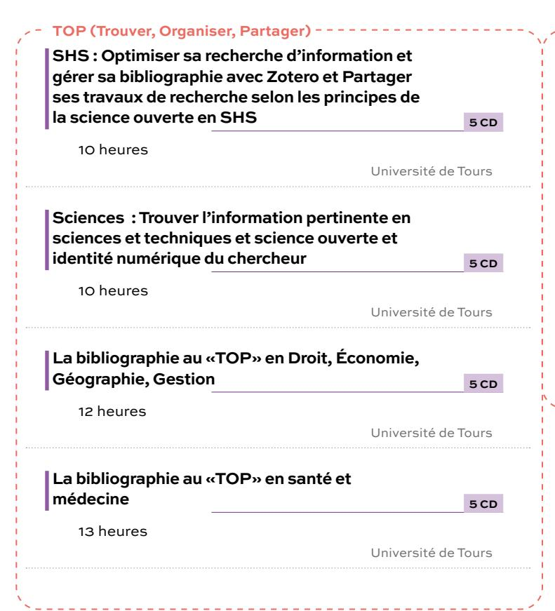
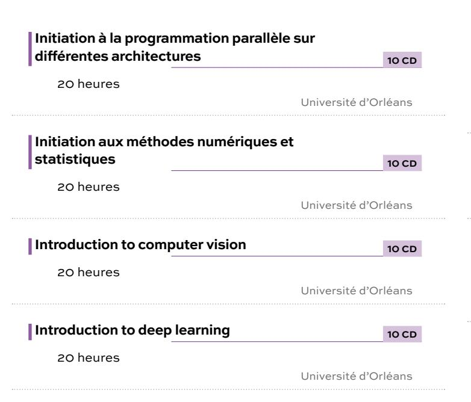
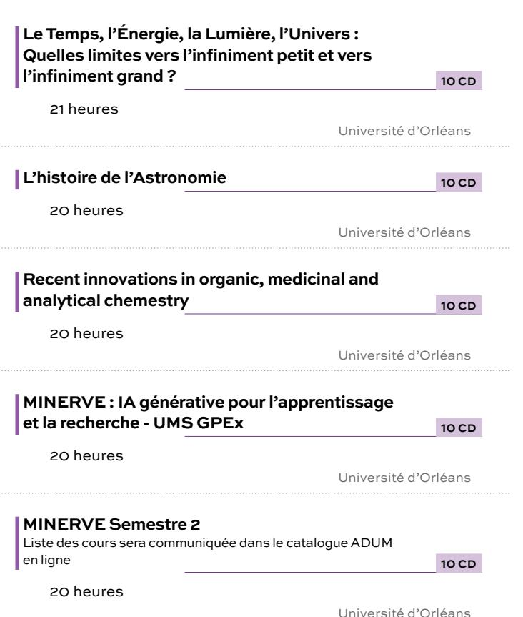
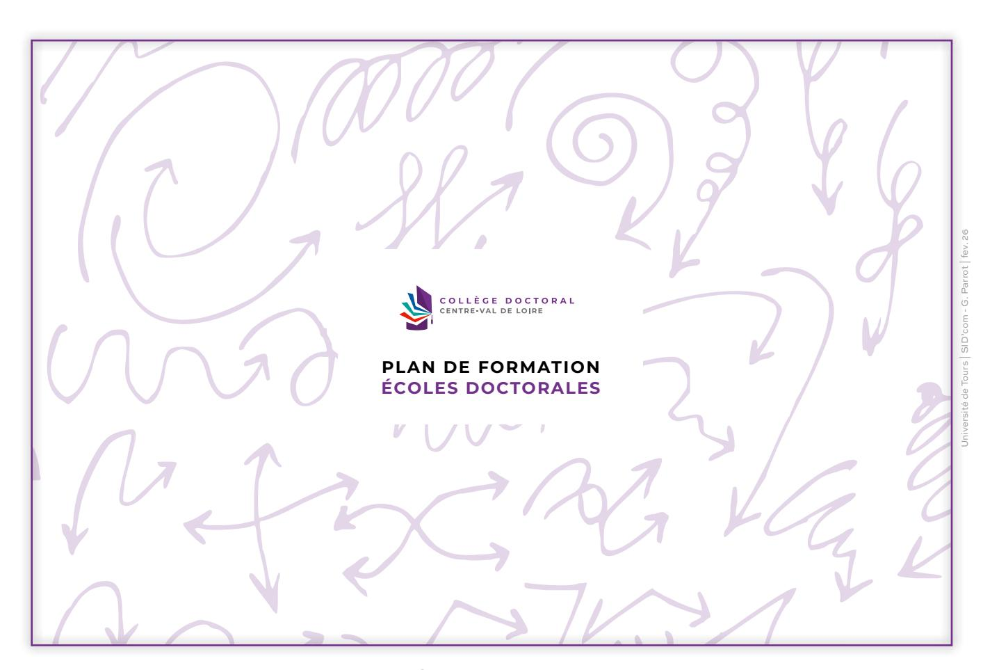

# PLAN DE FORMATION ÉCOLES DOCTORALES

2025 - 2026

## PRATIQUES PÉDAGOGIQUES DANS L'ENSEIGNEMENT SUPÉRIEUR

## Rendre ses étudiants actifs 5 CD 12 heureseeeeeeeeeeeeeeeeeeeeeeeeeeeeeeeeee Université d'Or Se former pour enseigner dans le supérieur 10 CD 26 heures | MOOC Université Construire, animer et évaluer son cours : atelier tutoré 10 CD 24 heures Université d'Or Enseigner les sciences expérimentales : quelles difficultés d'apprentissage, quels leviers? 5 CD 6 heures Université d'Orléans and the state of the state of the state of the state of the state of the state of the state of the state of the state of the state of the state of the state of the seeeeeeeeeeeeeeeeeeeeeeeeeeeeeeeeee des pratiques d'enseignements en Sciences / Biologie / SHS 5 CD 6 Obligatoire pour les doctorants avec mission d'enseignement

Université de Tours

inscrits à Tours

### Utilisation des moyens numériques

5 CD

### 9 heures

Obligatoire pour les doctorants avec mission d'enseignement inscrits à Tours Université de Tours

### Encadrement du comportement des étudiants en cours

5 CD

### 3 heur

Obligatoire pour les doctorants avec mission d'enseignement inscrits à Tours Université de Tours

### Évaluer les étudiants à l'université

### 6 heures

Obligatoire pour les doctorants avec mission d'enseignement inscrits à Tours Université de Tours

### Formation aux 1ers secours - PSC1

5 CD

### 7 heures

Obligatoire pour les doctorants avec mission d'enseignement inscrits à Tours Université de Tours

### Prise de parole en public

5 CD

### 12 heuuuuuuuuuuuuuuuuuuuuuuuuuuuuuuuuuuuu

Obligatoire pour les doctorants avec mission d'enseignement inscrits à Tours Université de Tours

### **COMMUNICATION, LANGUES**

### Anglais tous niveaux 10 CD communication scientifique orale en anglais 10 CD 20 heures 20 heures Collège doctoral Centre-Val de Loire Université d'Ooooooooooooooooooooooooooooooooooooo Academic Presentation Skills in English 5 CD Atelier d'appui à la recherche - présenter ses <list-item> 10 heures 5 CD Université d'Ooooooooooooooooooooooooooooooooooooo 6 heures Université de Tours Communication scientifique en anglais **Jooo** Atelier d'appui à la recherche - savoir écrire un 20 heures article de recherche - niveau B2 Université d'Orléanseeeeeeeeeeeeeeeeeeeeeeeeeeeeeeeeeeee 5 CD 6 heures Entraînement à la prise de parole et à la Université de Tours

### **FRANÇAIS**

Français langue étrangère (FLE) French as a foreign language

10 À 20 CD

20 à 48 heures

Semestre 1 ou Semestre 2 (tous niveaux)

Consulter le programme de FLE dans votre établissement de rattachement Collège doctoral Centre-Val de Loire

Vivre en France (cours de français débutant A1)

10 CD

51 heures | MOOC

Collège doctoral Centre-Val de Loire

### - COMMUNICATION

Rédiger et publier un article scientifique / Writing and publishing a scientific article / Redactar y publicar un artículo científico

10 CD

20 heures | MOOC

Collège doctoral Centre-Val de Loire

Scientific writing and publishing (SST)

10 C

20 heures

Université d'Orléans

Améliorer sa communication orale et gérer son stress

5 CD

Université de Tours

## PRÉPARER SON INSERTION PROFESSIONNELLE / POURSUITE DE CARRIÈRE

| to the state of the state of the state of the state of th ta te tate e tt .  'I                 | Cursus MAbBoost 5 CD                             |
|-------------------------------------------------------------------------------------------------|--------------------------------------------------|
| préparation au concours STARTHÈSE (français présentiel + anglais distanciel) 10 CD           |                                                  |
| 21 heures                                                                                       | Université de Tours                              |
| Collège doctoral Centre-Val de Loire                                                            | Auto-évaluation des compétences 10 CD            |
| Doctorat et poursuite de carrière / PhD and                                                     | 7 heures + travail individuel                    |
| Career Development 10 CD                                                                        | Université de Tours                              |
| 24 heures   MOOC                                                                                | Découvrir et accéder à la recherche              |
| Collège doctoral Centre-Val de Loire                                                            | académique 5 CD                                  |
| Project management 5 CD                                                                         | 12 heures                                        |
|                                                                                                 | Université de Tours                              |
| 12 heures Université d'Orléans                                                               | L'entretien de recrutement (exercices pratiques  |
|                                                                                                 | en anglais, françai                            . |
| Construire son projet et valoriser son parcours: monde de l'entreprise / fonction publique te e | 17 heures                                        |
| 8 heures                                                                                        | Offiversite de Tours                             |
| Université de Tours                                                                             |                                                  |

## SCIENCE OUVERTE, DONNÉES, BIBLIOGRAPHIE

| méthodoo                                                        | ence 10.                         | ORCID, ResearcherID, IdHAL, IdRef Les identifiants chercheurs et leurs enjeux |           |                              |
|-----------------------------------------------------------------|----------------------------------|-------------------------------------------------------------------------------|-----------|------------------------------|
| 24 heures   MOOC                                                | ège doctoral Centre-Val de Lo C. | <b>1 heure</b> Scéance flash                                               |           | '' <table-cell></table-cell> |
| Science Ouverte                                                 |                                  | Filmer sa thèse : enjeux et por représentation audiovisuelle d             |           | ''                           |
| 8 heures   MOOC                                                 | ège doctoral Centre-Val de Loire | 20 heures                                                                     | ''        |                              |
| Dee ee ee.                                                      | en prattique                     | FORMATI  .                                                                    |           |                              |
| 2 heures                                                        | Université d'Orléan              | Sensibilisation à la science ou                                               |           |                              |
| Déposer ses travaux de rechei l'archive ouverte HAL : mode c |                                  | 3 heures                                                                      | Universi. | ''                           |
|                                                                 | _                                | · · ·      .                                                                  | .   b.    | '                            |

| ''                                     |                      |
|----------------------------------------|----------------------|
|                                        |                      |
| Gérer ses références bibl IC        | iographiques avec le |
|                                        |                      |
| ''                                     |                      |
| 3,5 heures                             | Université d'Orléans |
| 3,5 heures Déposer ses travaux de r |                      |
|                                        |                      |

\*: Possibilité de cumuler 10h de formations pour valider 5 CD

# SCIENCE AVEC ET POUR LA SOCIÉTÉ (SAPS)

| ''                                                                                                      |                                                                                   |
|---------------------------------------------------------------------------------------------------------|-----------------------------------------------------------------------------------|
| ''                                                                                                      |                                                                                   |
| ''                                                                                                      | . '                                                                               |
|                                                                                                         | .''' <table-cell><table-cell></table-cell></table-cell>                           |
|                                                                                                         | .uu.                                                                              |
| '' <table-cell></table-cell>                                                                            | '' <table-cell></table-cell>                                                      |
| .'' <table-cell></table-cell>                                                                           | '''                                                                               |
|                                                                                                         |                                                                                   |
| ''                                                                                                      |                                                                                   |
|                                                                                                         | .''' <table-cell><table-cell><table-cell></table-cell></table-cell></table-cell>  |
|                                                                                                         |                                                                                   |
|                                                                                                         |                                                                                   |
| '' <table-cell><table-cell><table-cell><table-cell></table-cell></table-cell></table-cell></table-cell> | ''                                                                                |
|                                                                                                         |                                                                                   |
| '' <table-cell></table-cell>                                                                            | de votre thèse,                                                                   |
|                                                                                                         | 10 CD                                                                             |
| ''                                                                                                      |                                                                                   |
| 25 heures                                                                                               | Université d'Orléans                                                              |
| 25 heures Formation SAPS                                                                                | 10 CD                                                                             |
| Communication vulgarisée production d'un podcast  25 heures  Formation SAPS  20 heures                  | Université d'Orléans                                                              |
| 25 heures  Formation SAPS                                                                               | Université d'Orléans                                                              |
| 25 heures Formation SAPS                                                                                | Université d'Orléans                                                              |
| Formation SAPS 20 heures 20 heures Partenaires «Scientifiques                                           | Université d'Orléans  Université d'Orléans  Pour la Classe»                       |
| Formation SAPS 20 heures  Partenaires «Scientifiques                                                    | Université d'Orléans  Université d'Orléans  Pour la Classe»                       |
| 25 heures Formation SAPS                                                                                | Université d'Orléans  Université d'Orléans  Université d'Orléans  Pour la Classe» |
| Formation SAPS  20 heures  Partenaires «Scientifiques Démarche d'investigation e                        | Université d'Orléans  Université d'Orléans  Université d'Orléans  Pour la Classe» |

# Dispositif : «Les sciences c'est leur chance» Démarche d'investigation en sciences 12 heures Université d'Orléans Réaliser une action de médiation scientifique : théorie et pratique 20 heures (7h formation + 13h actions de terrain) Université de Tours Jeudi des SAPS 7 heures Université de Tours

## ÉTHIQUE, INTÉGRITÉ SCIENTIFIQUE

### FORMATIONS OBLIGATOIRES -----

Vous devez suivre obligatoirement UNE seule formation «étique et intégrité scientifique» , au choix, parmi les formations ci-dessous

# Intégrité scientifique dans les métiers de la recherche

15 heures | MOOC

Collège doctoral Centre-Val de Loire

### Éthique et Recherche

15 heures | MOOC

Collège doctoral Centre-Val de Loire

## Éthique et intégrité scientifique dans la recherche en SHS

3 heures

Université d'Orléans

# Éthique et intégrité scientifique dans la recherche en SST

3 heures

Université d'Orléans

### Conférence Intégrité scientifique

3 heures

Université de Tours

### FORMATIONS OBLIGATOIRES -

La formation VSS devient obligatoire pour tous les doctorants inscrits en 1º année du doctorat en 2024-2025.

Vous devez suivre obligatoirement UNE seule formation «VSS», au choix, parmi les formations ci-dessous:

### VSS Violences sexistes et sexuelles

3,5 heures

Université d'Orléans

# Comprendre et agir contre les violences sexistes et sexuelles

2 heures | formation sur CELENE

<table-cell>

### Formation VSS

3 heures

Université de Tours

### **FORMATIONS FACULTATIVES**

### Propriété intellectuelle - Domaine SHS / SST

5 CD

3 heur

# Egalité Femmes Hommes dans le monde académique

5 CD

12 heures

Université

| ANSITION ÉCOLOGIQ SOCIALE      |
|-----------------------------------|
| eux de la transition écologique / |
|                                   |
|                                   |

TRRRRRRRRRRRRRRRRRRRRRRRRRRRRRRRRRRRRRR UE ET Enje 您 ion 10 CD Université d'Orléans Ma terre en 180 minutes: comment réduire l'empreinte carbone des laboratoires de recherche 3 heures Université de Tours Atelier de sensibilisation aux enjeux

climatiques (Atelier climat)

3 heures

Université de Tours

ne de la company de la company de la company de la company de la company de la company de la company de la comp

3 heures

Université de Tours

\*5 CD pour le suivi de 2 formations

## SÉMINAIRES TRANSVERSAUX ET DISCIPLINAIRES

Ouvert à tous

Possibilité de suivre certains cours de Master, veuillez vous renseigner auprès de votre gestionnaire Ecoles Doctorales

| . ''.                                                                                                     | <table-cell></table-cell> | ' . <table-cell></table-cell> |
|-----------------------------------------------------------------------------------------------------------|---------------------------|-------------------------------|
| ''                                                                                                        |                           |                               |
|                                                                                                           | ''                        |                               |
| '' <table-cell></table-cell>                                                                              |                           |                               |
| '' <table-cell><table-cell><table-cell></table-cell></table-cell></table-cell>                            | .  '      ''              | ' . <table-cell></table-cell> |
| . '''                                                                                                     |                           |                               |
|                                                                                                           | ''                        |                               |
| ''                                                                                                        | .''                       |                               |
| . ''. <table-cell><table-cell><table-cell></table-cell></table-cell></table-cell>                         |                           |                               |
| ''                                                                                                        |                           |                               |
|                                                                                                           |                           |                               |
| . '''                                                                                                     |                           |                               |
| . 'u <table-cell><table-cell><table-cell><table-cell></table-cell></table-cell></table-cell></table-cell> | .                    '.   |                               |
| '' <table-cell></table-cell>                                                                              |                           | ''                            |
| ''                                                                                                        |                           |                               |
|                                                                                                           |                           |                               |

|                                                                                                                                                                                                                                                                                                                                                                                                                                                                                                                                                                                                                                                                                                                                                                                                              | . ''I                        |
|--------------------------------------------------------------------------------------------------------------------------------------------------------------------------------------------------------------------------------------------------------------------------------------------------------------------------------------------------------------------------------------------------------------------------------------------------------------------------------------------------------------------------------------------------------------------------------------------------------------------------------------------------------------------------------------------------------------------------------------------------------------------------------------------------------------|------------------------------|
|                                                                                                                                                                                                                                                                                                                                                                                                                                                                                                                                                                                                                                                                                                                                                                                                              |                              |
|                                                                                                                                                                                                                                                                                                                                                                                                                                                                                                                                                                                                                                                                                                                                                                                                              |                              |
| .u.'' <table-cell></table-cell>                                                                                                                                                                                                                                                                                                                                                                                                                                                                                                                                                                                                                                                                                                                                                                              |                              |
| ''                                                                                                                                                                                                                                                                                                                                                                                                                                                                                                                                                                                                                                                                                                                                                                                                           | '' <table-cell></table-cell> |
|                                                                                                                                                                                                                                                                                                                                                                                                                                                                                                                                                                                                                                                                                                                                                                                                              |                              |
| .u' <table-cell></table-cell>                                                                                                                                                                                                                                                                                                                                                                                                                                                                                                                                                                                                                                                                                                                                                                                | ''                           |
| ''I <table-cell><table-cell> <table-cell><table-cell><table-cell><table-cell><table-cell><table-cell><table-cell><table-cell><table-cell><table-cell><table-cell><table-cell><table-cell><table-cell><table-cell><table-cell><table-cell><table-cell><table-cell><table-cell><table-cell><table-cell><table-cell><table-cell><table-cell><table-cell><table-cell><table-cell><table-cell></table-cell></table-cell></table-cell></table-cell></table-cell></table-cell></table-cell></table-cell></table-cell></table-cell></table-cell></table-cell></table-cell></table-cell></table-cell></table-cell></table-cell></table-cell></table-cell></table-cell></table-cell></table-cell></table-cell></table-cell></table-cell></table-cell></table-cell></table-cell></table-cell></table-cell></table-cell> | ile Université d'Or       |

| Techniques avancées de caractérisation en microscopie électronique et microsonde |                              | Initiation à l'analyse métabolomique d'échantillon biologique: De la technique à |                                                                                                                   |
|----------------------------------------------------------------------------------|------------------------------|----------------------------------------------------------------------------------|-------------------------------------------------------------------------------------------------------------------|
| 22                     .      .      .                                           |                              | <table-cell></table-cell>                                                        | '''. <table-cell><table-cell><table-cell>        у</table-cell></table-cell></table-cell>                         |
| Universi .                                                                       | .''                          | ''                                                                               |                                                                                                                   |
|                                                                                  |                              |                                                                                  | .u.'                                                                                                              |
| Biostatitee                                                                      | '' <table-cell></table-cell> |                                                                                  |                                                                                                                   |
| 18 heure e                                                                       |                              | '' <table-cell></table-cell>                                                     |                                                                                                                   |
|                                                                                  | ''                           | ''                                                                               | . '''                                                                                                             |
|                                                                                  |                              | ''                                                                               |                                                                                                                   |
| OpenRefitee e                                                                    | ''                           |                                                                                  | .u.''                                                                                                             |
| 12 heures                                                                        | .''u                         | Approches technologiques avance                                                  | ''                                                                                                                |
| Université de Tours                                                              |                              | cellule unique (traee                                                            |                                                                                                                   |
| M                                                                                |                              | <table-cell><table-cell></table-cell></table-cell>                               | ''                                                                                                                |
| Microsco eu  u .u .u     .                                                       | '''.      . ''               | ''                                                                               | '''. <table-cell> <table-cell>.   <table-cell> <table-cell>u.</table-cell></table-cell></table-cell></table-cell> |
| 21 heure                              .                                          |                              | ''                                                                               |                                                                                                                   |
|                                                                                  |                              |                                                                                  | .u.'' <table-cell></table-cell>                                                                                   |

 $\ \ \textcircled{+} \ \ \text{collegedoctoral-cvl.fr}$