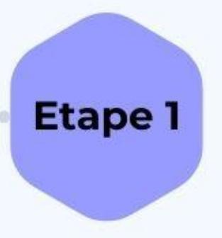
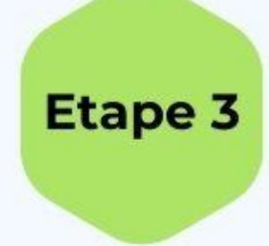
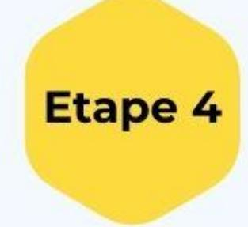
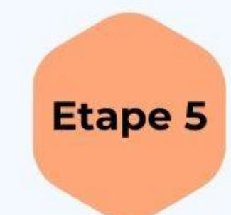

#### Sélection des doctorants aux formations

La sélection des doctorant-e-s se fait selon plusieurs critères : nombre de places disponibles, motivations, année de thèse, discipline et nombre de formations demandées (maximum 5 par an).

> Les motivations constituent un élément particulièrement déterminant.

Chaque candidature est étudiée au cas par cas avec les intervenants.

Etape 2

Présence / Absence

aux formations

La présence du doctorant est obligatoire à

l'intégralité de la formation.

Un désistement peut être effectué au plus

tard 15 jours avant le début de la formation

afin de nous permettre d'avertir un

doctorant en liste d'attente.

Toute absence non justifiée par un certificat

médical pourra se traduire par un refus

d'inscription pour des demandes ultérieures

#### Formations spécifiques

Les conférences "Intégrité scientifique, recherche", "science ouverte" et "Violences Sexistes et Sexuelles(VSS)" sont obligatoires et doivent être suivies une seule fois au cours de la thèse.

Les formations du volet enseignement sont obligatoires si vous avez une mission d'enseignement, et votre inscription sera alors automatiquement acceptée, avec l'engagement de suivre les cinq formations. Si vous êtes vacataire,

vous pourrez y accéder uniquement selon les places disponibles, avec l'engagement de suivre les cinq formations.

**Etape 6** 

#### **Demande d'inscription**

Une fois les formations ouvertes aux inscriptions, vous

la formation.

### Inscription acceptée

Dès votre inscription acceptée, un mail de confirmation vous sera envoyé avec en copie la direction de thèse.

A la fin du mail de confirmation d'inscription, sera précisé le **planning complet** de la formation ainsi que **le lieu et la salle.** 

Merci de bien noter ces dates dans votre agenda afin de ne pas les oublier et surtout de ne pas prendre d'autres engagements.

## Validation des heures de formation du catalogue et/ou des crédits doctoraux

La validation des crédits doctoraux sera effective une fois le questionnaire de satisfaction d'Adum complété, à l'issue de la formation.

# Les formations du Collège Doctoral Centre-Val-de-Loire