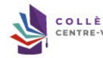
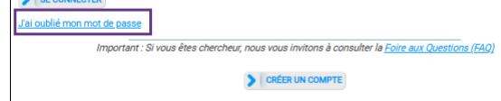
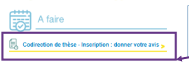
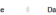
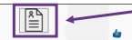
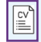
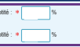
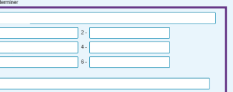
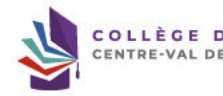

Validation inscription codirection de thèse

Inscription en doctorat -

Bonjour, vient de finaliser sa demande d'inscription en 1ª année de doctorat au titre de l'année universitaire :
Nous vous informons que Nous vous rappelons que vous devez vérifier les informations saisies par votre étudiant.e et notamment : » Les données liées au doctorat (spécialité et domaine scientifique qui doivent correspondre à votre section CNU), = La taille des résumés du projet de thèse, d'une page maximum, en français et en anglais, qui apparaîtront sur le site thosos.fr
 - Le taux d'encadrement de la thèse qui doit être égal à 100% (direction/so-direction et co encadrement compris),
-Les pièces justificatives déposées par l'étudiant e Nous vous remercions également de bien vouloir indiquer dès à présent votre avis sur la qualité du projet et les conditions de sa réalisation. Pour oveur deveur cour cour sour sour sotro encolorent: https://www.deum.lindeur.bly.coupe de consissea pau vote not de passe, clécues intropsi.l'hecheverywiz, je et haliqu invitons à vous rendre sur votre page d'accueil, dans la rubrique = A faire = et à cliquer sur le lien = Direction de thèse - Inscription - donner votre avis >.

Cordialement, Dear Dr, We would like to inform you that has just finalized the request for enrolling in the 1º year in the dootoral program for the academic year

We remind you that you must check the information entered by your student and in particular: - The data related to the doctorate (specialty and scientific field which must correspond to your CNU section),
- The size of the summaries of the thesis project, maximum one page, in French and in English, which will appear on the theses.fr website, = The rate of supervision of the thesis which must be equal to 100% (including direction/oo-direction and oo-supervision), -The supporting documents submitted by the student.

 Please notify us as soon as possible your opinion (tavarable) on the quality of the groject and the conditions for tor realization, by logínging into pour ADUM environnent:
If you do not know your password, click here and enter your e-mail address.

 Best regards
---
 Ceci est un e-mail automatique, merci de ne pas y répondre. This is an automatic email, please do not reply to it. Il se peut que vous receviez ce message à des heures matinales, tardives ou le week-end.

 Il ne nécesaite, en aucune façon, une réponse de votre part en dehors des heures ouvrées.

Vous recevez ce mail lorsque le directeur de thèse vient de valider la demande d'inscription de votre doctorant(e) dont vous avez accepté de codiriger la thèse.

Vous devez donc vous connecter à votre profil ADUM afin de vérifier et valider les informations saisies.

## Connexion Espace Personnel

 Ce site est optimisé pour Google Chrome ou Mozilla Firefox. Merci d'utiliser un de ces navigateurs.

Identification Votre adresse e-mail :
 Mot de passe :

Intranet >>

Si vous avez oublié votre mot de passe ou bien que vous ne vous soyez jamais connecté(e) à votre profil ADUM, cliquer sur « j'ai oublié mon mot de passe » afin de réinitialiser votre mot de passe.

Il vous faudra ensuite indiquer votre adresse mail professionnelle pour créer un nouveau mot de passe.

 www.collegedoctoral-cvl.fr Encadrant/Gestionnaire:
8.

Une fois connecté(e) à votre profil ADUM, vous allez cliquer sur « Codirection de thèse - inscription : donner mon avis » puis sur la fiche du doctorant concerné.

Afficher | Tous ▼ éléments Rechercher

Date
Fiche

 Co-direction de thèse Equipe Dosaier Reçu Etab | Dossier Reçu ED | Passé à la Scolarité | Laboratoire (
Doctorat ED
Établissement +

Votre avis est attendu Affichage de l'élement 1 à 1 sur 1 éléments

Précédent

1 Suivant CTORAL
www.collegedoctoral-cvl.fr
- 1˚ année de thèse en

 Préparation de la thèse réalisée à Ecole doctorale Spécialité doctorale Unité de recherche Equipe d'accueil Première inscription en thèse Encadrement de la thèse Régime d'inscription Thèse confidentielle ldentité Né le Genre :
 N° étudiant : .................. N° INE : Nationalité :
E-mail: l Téléphone :
 Situation de handicap :

TORAL
Vérifiez les informations saisies par votre doctorant(e).

www.collegedoctoral-cvl.fr

 Informations sur la thèse Direction de thèsi Codirection Thèse impliquant un traitement de données à caractère personnel Titre en français Mots clés

quotite :

 quotité :

|       |     |     |
|-------|-----|-----|
| 1 -   | 2 - |     |
| 3 -   | 4 - |     |
| 5 -   | 6 - |     |
| 1 -   | 2 - |     |
| 3 -   | 4 - |     |
|       | 6 - | ( I |

 English title Keyswords Résumé du projet de thèse en français Résumé du projet de thèse en anglais

|  Obtention                  |  Diplôme   | Série ou Intitulé ou Option   | Etablissement   | Ville   |  Pays   |
|-----------------------------|------------|-------------------------------|-----------------|---------|---------|
| Licence ou équivalent       |            |                               |                 |         |         |
| Master 1 ou équivalent      |            |                               |                 |         |         |
| Baccalauréat ou équivalence |            |                               |                 |         |         |
| Diplôme national de master  |            |                               |                 |         |         |

 Scolarité

TORAL
Vérifiez les informations saisies par votre doctorant(e).

 Financement Situation financière : Statut/Type de contrat :
Employeur :
Type de financement : l Origine des fonds : 
Durée : du i au :
Grille 2025/2026 (SIREDO, HCERES) : 
Cotutelle en cours Descriptif: Period 1 : from . J. /... b . ./ ... . at (which university) : ........................................ .

Etablissement :
Pays :
 → RGPD - Portabilité des données
→ A Consulter la convention individuelle de formation
→ > Consulter les pièces justificatives d'inscription en thèse relatives à l'état civil 
→ A Consulter les pièces justificatives d'inscription en thèse relatives à la scolarité
→ A Consulter les pièces justificatives d'inscription en thèse relatives au financement 
→ A Consulter les pièces justificatives d'inscription en thèse

 AVIS DE LA DIRECTION DE LA THÈSE

 Direction de la thèse, a donné un avis favorable sur la demande d'inscription en thèse le Remarques éventuelles / Avis circonstancié : Avis favorable Vérifiez les informations saisies par votre doctorant(e).

ORAL
Votre avis sur la demande d'inscription en thèse de
* - Avis favorable * - Avis défavorable Remarques éventuelles / Avis circonstancié :
li est nécessaire de vous asture la raste que vos commertaires ou avis sont adéquat, perfinents et milles a e qu'est néessare au regard de smalles cour lespelles is sont tra Votre commentaire ou avis ne doit donc pas être inapproprié, subjectif ou insuitant

Enregistrer votre avis

Indiquez votre avis et remarques éventuelles puis enregistrez votre avis.

Le dossier de demande d'inscription de votre doctorant(e) devra ensuite être validé par la direction de laboratoire, la direction de l'école doctorale concernée puis par le/la représentant(e) du chef d'établissement concerné.

À l'université de Tours : 

Elysa RAGOT  + 33 2 47 36 66 75 ED EMSTU - MIPTIS - **SSBCV**
@ elysa.ragot@univ-tours.fr Christèle GAUDRON  + 33 2 47 36 64 50 ED HL - **SSTED**
@ christele.gaudron@univ-tours.fr Université de Tours Service de la Recherche et des Etudes Doctorales Bâtiment A - **1er étage**
60 rue du Plat d'Etain - **BP 12050**
37020 TOURS cedex 1 - **France**
 **https://www.univ-tours.fr**

Vos contacts

À l'INSA Centre Val de Loire :
Laura GUILLET  **+ 33 2 48 48 07 61**
ED EMSTU - MIPTIS
@ laura.guillet@insa-cvl.fr INSA Centre Val de Loire Direction de la Recherche et de la Valorisation Etudes Doctorales Campus de Bourges 88 Bd. Lahitolle Technopôle Lahitolle CS 60013 18022 BOUGES Cedex - France Campus de Blois 3 rue de la Chocolaterie CS 23410 41034 BLOIS Cedex - **France**
 https://www.insa-centrevaldeloire.fr À l'université d'Orléans : 

Marion ALLER  + 33 2 38 49 49 85
 **+ 33 2 38 49 48 25**
ED EMSTU @ edemstu@univ-orleans.fr ED MIPTIS @ edmiptis@univ-orleans.fr ED SSBCV @ edssbcv@univ-orleans.fr Kathia FUSTER  + 33 2 38 71 73 61 ED SSTED @ edssted@univ-orleans.fr ED HL @ edhl@univ-orleans.fr
 **Direction de la Recherche et Partenariats**
Pôle Recherche et Etudes Doctorales Bâtiment IRD
5 rue Carbone - BP 6749 45067 ORLEANS Cedex 2 - **France**
 **https://www.univ-orleans.fr/fr**

## Www.Collegedoctoral-Cvl.Fr 9
