Validation CIF, Charte du doctorat et Inscription

par la Direction de thèse

De: "Doctorat" <noreply@adum.fr>
À:
Envoyé:
Objet: [convention de formation]
Bonjour,
.

Lorsque votre doctorant(e) a saisi les informations concernant sa Convention Individuelle de Formation vous recevez ce mail vous invitant à vous connecter à votre espace personnel ADUM afin de vérifier les informations saisies.

a renseigné sa convention individuelle de formation.

Merci de valider la convention individuelle de formation en vous connectant sur votre espace personnel :
https://www.adum.fr Vous trouverez un lien direct sur la page d'accueil de votre espace personnel dans la partie 'à faire'.

Cette validation est indispensable au processus d'inscription du doctorant. Ceci est un mail automatique, merci de ne pas y répondre. ll se peut que vous receviez ce message à des heures matinales, tardives ou le week-end.

Il ne nécessite, en aucune façon, une réponse de votre part en dehors des heures ouvrées.

 MAJ 05/2026

## Www.Collegedoctoral-Cvl.Fr

 Pour vous connecter aller sur https://adum.fr/

Si vous avez oublié votre mot de passe cliquer sur « J'ai oublié mon mot de passe »
afin de réinitialiser celui-ci.

RAL
Encadrant/Gestionnaire:
ol

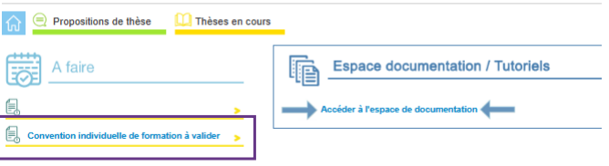

Cliquer sur Convention individuelle de formation à valider pour accéder à l'espace des CIF à vérifier et valider

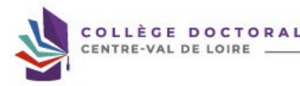

www.collegedoctoral-cvl.fr Convention Individuelle de Formation 1000 Sélection

 Année d'inscription en thèse

 >
 Etat d'avancement de la Convention Individuelle de Formation
 (Veuillez sélectionner une valeur)  V
:
Glossaire :
 : le doctorant a terminé sa procédure d'inscription/réinscription en thèse.

Afficher Tous V éléments

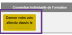

Matricule temporaire Matricule définitif État avancement convention Nom Prénom +
Niveau lemp +
 Niveau enregistré Direction de thêse

Établissement

École doctorale

 Unité de recherche 

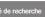

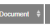

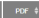

 름 Ajout
-
Précédent Suivant

Affichage de l'élement 1 à 1 sur 1 éléments Cliquer sur Convention individuelle de formation à valider pour accéder à la CIF à vérifier et valider

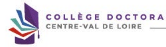

Rechercher en examen www.collegedoctoral-cvl.fr

## Vous Avez La Possibilité D'Apporter Des Modifications Avant De Valider La Convention Ou De Redonner La Main Au Doctorant.

 Votre travail de recherche est-il effectué pour tout ou partie dans un établissement autre qu'un établissement public d'enseignement supérieur etlou de recherche ? @ non ( 
Calendrier du projet de recherche Préciser les échéances prévisionnelles des étapes principales du projet doctoral jusqu'à la soutenance
· Durée prévue (3 ans à temps complet, entre 3 et 6 ans à temps partiel)
 -  Calendrier des séjours dans les deux pays si cotutelle internationale (à reporter dans le champ "Organisation de la cotutelle" de votre profil) -  Répartition du temps entre laboratoire académique et centre de recherche non académique (cas Cifre ou thèse en partenariat avec entreprise)
 -  Etapes et résultats du projet dans le cas d'un contrat de recherche partenariale.

Modalités d'encadrement, de suivi de la formation et d'avancement des recherches de la thèse Préciser :
· les modalités décidées par l'Ecole doctorale pour le comité individuel de formation
 -   les prérequis spécifiques pour la soutenance (publications, heures ou crédits doctoraux …) ou renvoyer à un règlement intérieur ED

Vérifier les informations saisies par votre doctorant(e)

 Conditions matérielles de réalisation du projet de recherche, le cas échéant, les conditions de sécurité spécifiques Préciser :
- Moyens et méthodes disponibles dans l'unité de recherche pour mener à bien le projet
 -  Préciser si des conditions spécifiques de sécurité sont requises pour ce projet doctoral, en plus de celles évoquées dans le règlement intérieur de l'unité de recherche Modalités d'intégration dans l'unité ou l'équipe de recherche

## Vérifier Les Informations Saisies Par Votre Doctorant(E)

 Indiquer les mélhotes d'iniègralinn de l'unité de recherche, leilles que des animations sosentifiques ou difriégration (offetes ou obigatoires que le ocotrand derra assume Un calendrier prévsionel du projet de recherche peut être précisé.

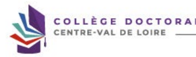

 Paroours prévisionnel individuel de formation A compléter : Liste des formations envisagées en lien avec votre projet professionnel : formations transversales, scientlifiques et techniques et lechniques et lechniques e u du de dout le spoucede differele sices doctioners proce u resent de franssisse des passés pispant il linemes des passes des pispant il lineada prossisse de la miès de les cyl.fr).

 D'autres formations plus spécifiques peuvent être suivies à l'extérieur et validées par l'école doctorale.

 Objectifs de valorisation des travaux de recherche de la théve : diffusion, publication et confidentialité, droit à la propriéle intellectuelle selon le champ du programme Préciser les objectifs de valorisation : offitsion, communications, publication et confidentialité, brevels (avec si opssible des chiffré), dodt à la proprélé intellectuelle

Vérifier les informations saisies par votre doctorant(e)

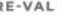

Vérifier les informations saisies par votre doctorant(e)
Vous avez 3 possibilités : 1. **La convention individuelle de formation est validée, le doctorant a correctement complété les items** 

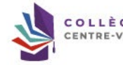

et vous validez donc la CIF.

2. **La convention individuelle de formation nécessite des corrections, vous redonnez la main au** 
doctorant ou à la doctorante pour effectuer les corrections que vous demandez.

3. Candidat inconnu de l'enseignant-chercheur, ce n'est pas un/une candidat(e) que vous avez accepté de diriger, vous refusez la CIF de cet inconnu.

 Veuillez indiquer votre choix pour pouvoir l'enregistrer et sauvegarder vos éventuelles modifications.

□ La convention individuelle de formation est valide
@ La convention individuelle de formation nécessite des corrections O Candidat inconnu de l'enseignant-chercheur Email expéditeur :
Email destinataire :

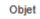

Votre message

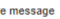

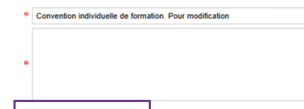

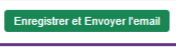

La convention individuelle de formation nécessite des corrections, merci d'indiquer dans le mail les corrections demandées.

li

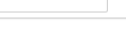

 Convention Individuelle de Formation Matricule temporaire Matricule définitif

|  Nom Prénom   |
|---------------|

| État avancement convention   |
|------------------------------|

Niveau temp :
Niveau enregistré

| École doctorale +   | Unité de recherche   |
|---------------------|----------------------|

Direction de thèse

|  Demande de modification   |
|----------------------------|

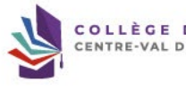

Établissement Decument \#
POF
 (f)
Ajout

en cours m Convention Individuelle de Formation Visualiser le document Veuillez indiquer votre choix pour pouvoir l'enregistrer et sauvegarder vos éventuelles modifications.

© La convention individuelle de formation est valide 
- La convention individuelle de formation nécessite des corrections - Candidat inconnu de l'enseignant-chercheur

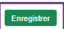

La convention individuelle de formation est correctement complétée, vous validez la CIF.

 Accord pour impression donné le 31 mars 2026

 finalisée

CTORAL
 De: "Doctorat" <noreply@adum.fr>
A:
Cc: Envoyé:
Objet: Convention Individuelle de Formation - Document disponible Bonjour, La direction de votre thèse a validé la convention individuelle de formation.

Vous pouvez dès à présent la visualiser à partir de votre espace personnel.

Ceci est un e-mail automatique, merci de ne pas y répondre.

Voici le mail que vous recevez en copie du mail envoyé à votre doctorant(e) lorsque vous avez validé la CIF.

En cas d'erreur vous pouvez contacter le/la gestionnaire administrative d'établissement de votre école doctorale.

Il se peut que vous receviez ce message à des heures matinales, tardives ou le week-end.

Il ne nécessite, en aucune façon, une réponse de votre part en dehors des heures ouvrées.

Inscription en doctorat ·

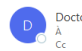

Doctorat <noreply@adum.fr>
Bonjour, vient de finaliser sa demande d'inscription en 1° année de doctorat au titre de l'année universitaire Nous vous informons que l Nous vous rappelons que vous devez vérifier les informations saisies par votre étudiant.e et notamment : » Los données liées au doctorat (spécialité et domaine scientifique qui doivent correspondre à votre section CNU),
 - La taille des résumés du projet de thèse, d'une page maximum, en français et en anglais, qui apparaîtront sur le site theses.fr - Le taux d'oncadrement de la thèse qui doit être égal à 100% (direction/co-direction et co encadrement compris), -Les pièces justificatives déposées par l'étudiant.e. Nous vous remercions également de bien vouloir indiquer dès à présent votre avis sur la qualité du projet et les conditions de sa réalisation.

 Pour colu vous dover consecter sur votre oppose onsudrant : trippe: l'hyww adum.frholex, d'Strous no cornsisses pau orte mot de passe, cleuzes le https://www.e.dum.bhroceve invitons à vous rendre sur votre page d'accueil, dans la rubrique - A faire - et à cliquer sur le lien · Direction de thèse - Inscription - donner votre avia -
Cordialement, Dear Dr We would like to inform you that i has just finalized the request for enrolling in the 1º year in the doctoral program for the academic year We remind you that you must check the information entered by your student and in particular:
 - The data related to the doctorate (specialty and scientific field which must correspond to your CNU section),
 - The size of the summaries of the thesis project, maximum one page, in French and in English, which will appear on the theos.fr website,
 - The rate of supervision of the thesis which must be equal to 100% (including direction/co-direction and co-supervision),
-The supporting documents submitted by the student.

 Please notity us as soon as possible your opinion (tovorable) on the quality of the project and the conditions for the confitions for tos revilization, py logging into your If you do not know your password, click here and enter your e-mail address.

Best rogards
...

 Ceci est un e-mail automatique, merci de ne pas y répondre. This is an automatic email, please do not reply to it.

Il se peut que vous receviez ce message à des heures matinales, tardives ou le week-end. Il ne nécessite, en aucune façon, une réponse de votre part en dehors des heures ouvrées

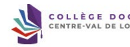

Vous recevez ce mail lorsque votre doctorant(e) vient de finaliser sa procédure de demande d'inscription en 100 année de thèse. Vous devez donc vous reconnecter à votre espace personnel ADUM afin de vérifier et valider les informations saisies.

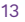

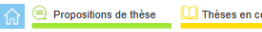

 Je signe la charte du doctorat (arrêté modificatif du 26 août 2022) Direction de thèse - Inscription : donner votre avis,

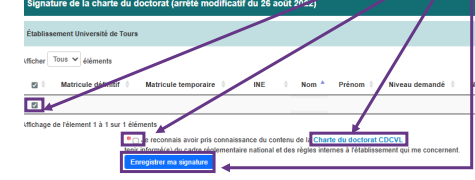

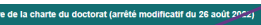

Vous devez, dans un premier temps, prendre connaissance de la charte du doctorat et enregistrer votre signature.

 Rechercher Spécialité �
Temps partiel / Temps plein Type de signature liveau enregistré Etablissement Ecole doctorale 0 Laboratoire Titre de la thèse Cotutelle Pays cotutelle Précédent 1 Suivant et je m'engage à la respecter. Je m'engage également à respecter et à me Encadrant/Gestionnaire:
Une fois l'enregistrement effectué, vous devez voir apparaître « votre signature de la charte du doctorat CDCVL a bien été prise en compte ».

Vous devez ensuite retourner à l'accueil de votre profil ADUM en cliquant sur -

Propositions de thèse Theses en cours ature de la charte du doctorat CDCVL a bien èté prise e Signature de la charte du doctorat (arrêté modificatif du 26 août 2022)

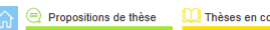

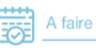

uf

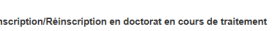

Votre avis est attendu

Liste format Excel

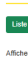

Afficher | Tous ▼ éléments

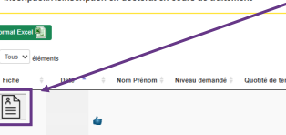

Niveau demandé à Quotité de temps à Direction de thèse f
Cliquez sur « Direction de thèse - inscription : donner votre avis puis sur la fiche de votre doctorant(e).

Rechercher Equipe Laboratoire �
 Doctorat ED
Établissement �
Dossier Reçu Etab | Dossier Reçu ED =
Passé à la Scolarité |

15

- 1˚ année de thèse en CV

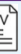

Vérifiez les informations saisies par votre doctorant(e) notamment : -  l'école doctorale
-  La spécialité
-  L'unité de recherche -  L'encadrement de thèse Préparation de la thèse réalisée à Ecole doctorale Spécialité doctorale Unité de recherche Equipe d'accueil Première inscription en thèse Encadrement de la thèse Dans le cadre d'une codirection de thèse, merci de vous rapprocher de votre gestionnaire d'étude doctorale pour la validation de cette codirection par votre établissement.

 Régime d'inscription Thèse confidentielle ldentité Genre :
 N° étudiant : : Nationalité :
E-mail:
 Téléphone :

TORAL

## Www.Collegedoctoral-Cvl.Fr

 Née le N° INE :
 Informations sur la thèse

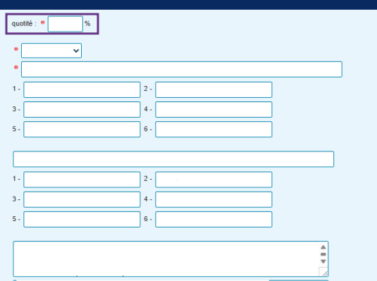

|  Thèse impliquant un traitement de données à caractère personnel                                                        | >   |     |
|-------------------------------------------------------------------------------------------------------------------------|-----|-----|
| Titre en français                                                                                                       |     |     |
| Mots clés                                                                                                               | 1 - | 2 - |
|                                                                                                                         | 3 - | 4 - |
|                                                                                                                         | 5 - | 6 - |
| English title                                                                                                           |     |     |
| Keyswords                                                                                                               | 1 - | 2 - |
|                                                                                                                         | 3 - | 4 - |
|                                                                                                                         | 5 - | 6 - |
| Résumé du projet de thèse en français                                                                                   | 0   |     |
|                                                                                                                         | D   |     |
| Résumé du projet de thèse en anglais                                                                                    |     |     |
| Vérifiez les informations saisies par votre doctorant(e), notamment le pourcentage concernant la quotité d'encadrement. |     |     |
| S'il y a codirection ou co-encadrement le pourcentage total doit être égal à 100%.                                      |     |     |
| Attention ces informations seront affichées sur theses.fr                                                               |     |     |
| ORAL                                                                                                                    |     |     |

www.collegedoctoral-cvl.fr

| Pays   |
|--------|

| Ville   |  Département   |
|---------|----------------|

 Scolarité

|  Obtention                  | Diplôme   |
|-----------------------------|-----------|
| Baccalauréat ou équivalence |           |
| Master                      |           |
| Licence                     |           |
| Master 1                    |           |

## Financement Non Dédié À La Préparation Du Doctorat. Le Doctorat Est Mené À Temps Partiel

Situation financière :
 Statut/Type de contrat :

| Etablis sement   |
|------------------|

| Série ou Intitulé ou Option   |
|-------------------------------|

Employeur : Type de financement : l Origine des fonds : Durée : du 1 au Grille 2025/2026 (SIREDO, HCERES) :

## Cotutelle En Cours

Vérifiez les informations liées :
-  Aux diplômes -   Au financement
 -  À la cotutelle s'il y a lieu Descriptif : Période 1 : du .. J ... . au ... / .... à (établissement) : .....

... Période 2 : du ... au ... J ... à (établissement) : ......

... Période 3 : du .. /..... au .. /..... à (établissement) : .

Etablissement :
Pays :

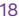

Vérifiez les pièces justificatives :
- **Convention Individuelle de Formation** - **Justificatif d'état civil** - **Justificatif de Master** - Justificatif de financement - Justificatif d'inscription en thèse Pour l'ED HL, le justificatif d'inscription en thèse doit contenir 

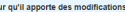

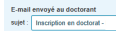

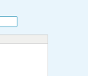

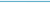

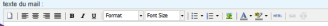

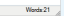

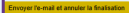 les éléments suivants : - **Le résumé de la thèse** - **L'exposé en quelques lignes du caractère novateur du projet**
- **Quelques références bibliographiques**
- **Un calendrier prévisionnel du travail**
- **Un plan prévisionnel de la thèse si cela est possible**
Pour les ED EMSTU, MIPTIS, SSBCV et SSTED, le justificatif d'inscription doit contenir une page vierge Si toutes les informations saisies sont correctes, cliquez sur Avis Favorable, indiquez vos remarques et cliquez sur enregistrer votre avis. S'il y a des corrections à faire, cliquez sur redonner la main au doctorant, pensez à renseigner les éléments à modifier dans le mail envoyé au doctorant. Si vous émettez un avis défavorable, merci 

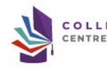 d'indiquer les raisons exactes dans les remarques éventuelles. Vous devrez confirmer votre choix.

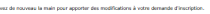

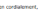

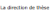

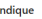

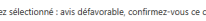

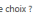

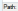

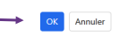

 Propositions de thèse

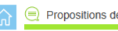

Thèses en cours Vie quotidienne Informations - Inscriptions / réinscriptions en cours
> Charte(s) du doctorat signée(s)
Propositions de thèse II Thèses en cours Inscription / réinscription en cours de procédure
" : Nouveau doctorant inscrit dans Adum en bleu : sont affichés les 1A
de : le doctorant a finalisé sa procédure d'inscription Liste format Excel F
Tous ▼ éléments Afficher

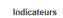

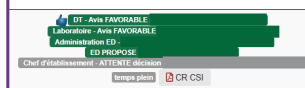

| Comité        | Etab   |    |
|---------------|--------|----|
| Photo         | de     | ED |
| d'inscription |        |    |
| thèse         |        |    |

Vous pouvez suivre l'évolution de l'étude du dossier de votre doctorant(e) sur votre profil personnel ADUM / Vie quotidienne / Informations - Inscriptions / réinscriptions en cours. Dans la partie  « indicateurs » vous visualisez l'avancée du traitement du dossier par les différents valideurs. Pour rappel, le délai de traitement pour les dossiers avec un diplôme étranger ou un DEA est rallongé. Ces dossiers doivent être étudiés en bureau d'école doctorale avant la validation de la direction de l'école doctorale sur ADUM.

Le dossier sera ensuite validé par le/la représentant(e) du chef de votre établissement.

 Rechercher Nom Email Prénom Laboratoire Passage à la Scolarité

www.collegedoctoral-cvl.fr

| En cours    | Niveau     |               |              |         |               |
|-------------|------------|---------------|--------------|---------|---------------|
| Encadrement | Date       | Dossier       | Dossier reçu |         |               |
| de          | déjà       | 1ºinscription | maj          | reçu ED | Etablissement |
| traitement  | enregistré |               |              |         |               |

À l'université de Tours : 

Elysa RAGOT  + 33 2 47 36 66 75 ED EMSTU - MIPTIS - **SSBCV**
@ elysa.ragot@univ-tours.fr Christèle GAUDRON  + 33 2 47 36 64 50 ED HL - **SSTED**
@ christele.gaudron@univ-tours.fr Université de Tours Service de la Recherche et des Etudes Doctorales Bâtiment A - 1er étage 60 rue du Plat d'Etain - **BP 12050**
37020 TOURS cedex 1 - **France**
 **https://www.univ-tours.fr**

Vos contacts

À l'INSA Centre Val de Loire :
Laura GUILLET  + 33 2 48 48 07 61 ED EMSTU - MIPTIS
@ laura.guillet@insa-cvl.fr
 **INSA Centre Val de Loire**
Direction de la Recherche et de la Valorisation Etudes Doctorales Campus de Bourges 88 Bd. Lahitolle Technopôle Lahitolle CS 60013 18022 BOUGES Cedex - France Campus de Blois 3 rue de la Chocolaterie CS 23410 41034 BLOIS Cedex - France
 **https://www.insa-centrevaldeloire.fr**
À l'université d'Orléans : 

Marion ALLER  **+ 33 2 38 49 49 85**
 + 33 2 38 49 48 25 ED EMSTU @ edemstu@univ-orleans.fr ED MIPTIS @ edmiptis@univ-orleans.fr ED SSBCV @ edssbcv@univ-orleans.fr Kathia FUSTER  + 33 2 38 71 73 61 ED SSTED @ edssted@univ-orleans.fr ED HL @ edhl@univ-orleans.fr
 **Direction de la Recherche et Partenariats**
Pôle Recherche et Etudes Doctorales Bâtiment IRD
5 rue Carbone - BP 6749 45067 ORLEANS Cedex 2 - **France**
 **https://www.univ-orleans.fr/fr**

## Www.Collegedoctoral-Cvl.Fr 21
