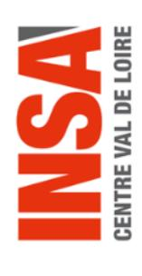

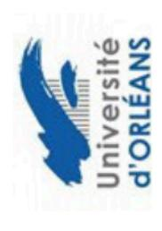

# **CREATION D'UN COMPTE DOCTORANT SUR ADUM**

# 🛈 Il est impératif d'avoir l'accord d'un directeur de thèse avant de commencer cette démarche. 🛈

Pour rappel les inscriptions sont ouvertes entre le 1ºr juin et le 15 novembre de l'année universitaire en cours, votre profil ne doit pas être créé en dehors de ces dates sauf exception particulière à vérifier avec votre gestionnaire d'école doctorale avant d'entamer votre démarche de création d'un compte ADUM.

Vous devez créer un compte personnel dans l'application ADUM via le lien : <u>https://adum.fr/index.pl</u>

Afin de compléter votre profil ADUM, pensez à vous munir des documents et/ou informations suivantes pour renseigner certaines données :

- votre relevé de notes du Baccalauréat (code INE si diplôme obtenu en France),
- votre parcours de formation en études supérieures,
- > votre diplôme de Master 2 ou équivalent,
- votre financement: attestation contrat doctoral, attestation ANRT dans le cadre d'une CIFRE, contrat de travail ou attestation de l'employeur, attestation de bourse, A
- ∨ votre projet de thèse.

# ACCÈS DOCTORAT UNIQUE ET MUTUALISÉ PORTAL INTERNET DINFORMATIONS, DE SERVICES, DE COMMUNICATION, DES DOCTORANTS ET DOCTEURS

MON COMPTE ADUM L'ADUM

ACTU RECHERCHE

Q

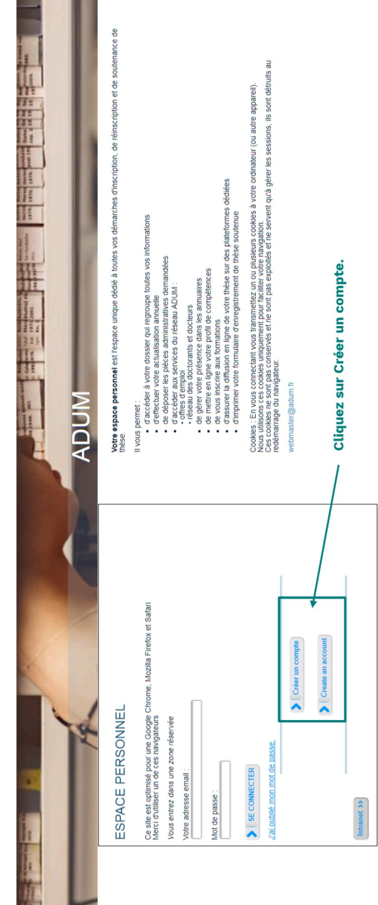

# VOUS SOUHAITEZ CRÉER UN COMPTE

Créer un compte vous permet de gérer et suivre vos demandes d'inscription et réinscription en thèse ou votre demande d'autorisation de soutenance. Vous donnez votre consentement pour le traitement de vos données à caractère personnelle dans le cadre de l'exécution d'une mission de service public de gestion du doctorat.

Vous pouvez compléter, modifiez votre dossier en plusieurs fois. Une fois les formulaires renseignés correctement vous pouvez finaliser éléctroniquement votre demande, afin d'imprimer les documents requis pour l'instruction de votre dossier. (renseignez-vous auprès de l'établissement).

Prépare les élements nécessaires à la création de votre compte afin de ne pas perdre de temps dans la saisie de votre dossier. Ce compte vous empres de l'établissement à capabilité de votre compte afin de ne pas perdre de temps dans la saisie de votre dossier. Ce compte vots emmetta également :

- de gagner du temps au moment des réinscriptions
- de stocker les données descriptives de la thèse et du suivi du travail de recherche
   de consulter et s'inscrire aux formations
- de disposer d'un portéfeuille d'expériences et de compétences dans lequel sont saisis des éléments susceptibles de nourrir un CV.
- d'accéder et recevoir des informations relatives au doctorat telles que : actualités de l'école doctorale, de l'établissement, offres d'emploi, offre de formations, annonces des soutenances

Sécurité
Nous attachons une grande importance à la qualité et à la protection des données personnelles. Tout doctorant ou docteur peut ainsi mettre à jour à tout moment les informations le concernant grâce à un accès sécurisé et peut définir les informations qui seront publiées ou pas sur le web.

Le traitement à pour finalité la collecte et la diffusion d'informations concernant les doctorants et les docteurs pour la gestion et l'animation de la vie doctorale et l'accompagnement à l'insertion professionnelle

#### Indiquez une adresse mail valide que vous utilisez régulièrement. Définissez ci-dessous votre code d'accès Mot de passe : 8 caractères minimum Courrier électronique principal Confirmation du mot de passe

🔲 \* En cochant cette case et en soumettant ce formulaire, j'accepte que les informations saisies soient exploitées dans le cadre de la gestion du doctorat. Je reconnais avoir lu, compris et accepté notre Politique de protection des données à caractère personnel, y compris ce qui concerne l'Utilisation des cookies.

#### Définissez ci-dessous votre code d'accès

Courrier électronique principal

Mot de passe : 8 caractères minimum

Confirmation du mot de passe

\* En cochant cette case et en soumettant ce formulaire, j'accepte que les informations saisies soient exploitées dans le cadre de la gestion du doctorat. Je reconnais avoir lu, compris et accepté notre Politique de protection des données à caractère personnel, y compris ce qui concerne l'Utilisation des cookies.

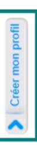

# Une fois que vous avez créé votre compte, vous recevez un mail pour activer votre compte Adum. Attention vous devez valider votre profil dans les 24 heures.

#### **ADUM] Création Profil**

hd@adum.fr <noreply@adum.fr>

nvové

Bonjour,

Vous avez demandé la création d'un compte dans le cadre de la gestion de votre thèse.

En activant le lien ci dessous pour la création de votre compte ADUM, vous donnez votre consentement pour le traitement de vos données à caractère personnelle dans le cadre de l'exécution d'une mission de service public de gestion du doctorat et du suivi du devenir des diplômes. Les données sont collectées et traitées de manière loyale et licite, dans un principe de transparence lors du traitement. Les données sont adéquates, pertinentes et non excessives au regard des finalités pour lesquelles elles sont collectées et de leurs traitements ultérieurs

Pour activer l'ouverture de votre compte cliquer ici :

https://adum.fr/phd/profil/newprofil.pl?tk=L5iUXc4SUFV5e67tHWwqQPAm63XhcH9QcgQmODQeAFmSf0bcwowxWc8w8lkBgdRT

Ce lien restera actif 24 heures.

Si vous n'avez pas effectué de demande ou si vous ne souhaitez pas poursuivre votre demande vous pouvez ignorer cet e-mail.

Cordialement,

L'équipe ADUM

Adum vous propose ensuite de compléter votre dossier de demande d'inscription en doctorat.

#### Que voulez-vous faire?

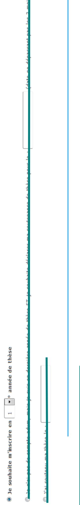

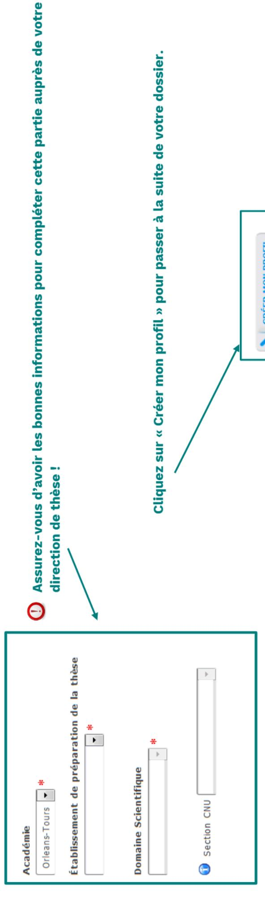

Cliquez sur « Créer mon profil » pour passer à la suite de votre dossier.

CRÉER MON PROFIL

Faites passer tous les onglets au vert, pour cela, vous devez compléter tous les éléments signalés par un astérisque rouge \*.

N'oubliez pas de sauvegarder à chaque étape!

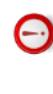

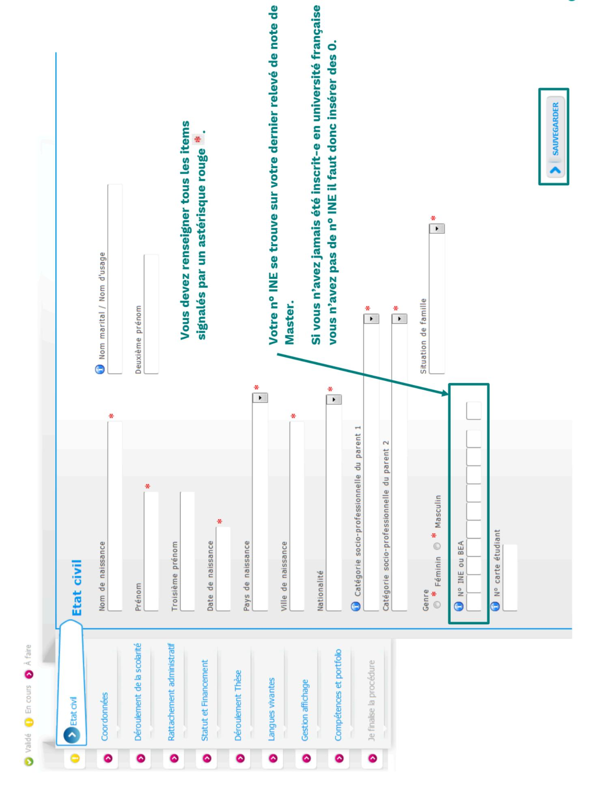

| *                                                                                                                           |                                                               | *                                                   |                                          |                                                                                          |
|-----------------------------------------------------------------------------------------------------------------------------|---------------------------------------------------------------|-----------------------------------------------------|------------------------------------------|------------------------------------------------------------------------------------------|
| Coordonnées Téléphone Portable  (1) Adresse électronique principale Adresse électronique secondaire Site Internet personnel | Identifiant IdHAL (1) Compte LinkedIn Compte Researchgate (1) | Pays Code Postal  Ville numéro, voie, rue Téléphone | Pays Code Postal Ville Numéro, voie, rue | - Adresse familiale ou permanente  Pays Code Postal  Ville  numéro, voie, rue  Téléphone |
| © Etat civil Coordonnées  Déroulement de la scolarité Adre  Rattachement administratif Idea                                 | Statut et Financement Déroulement Thèse Langues vivantes      | ortfolio                                            |                                          | 4 6 0 5 6 1                                                                              |

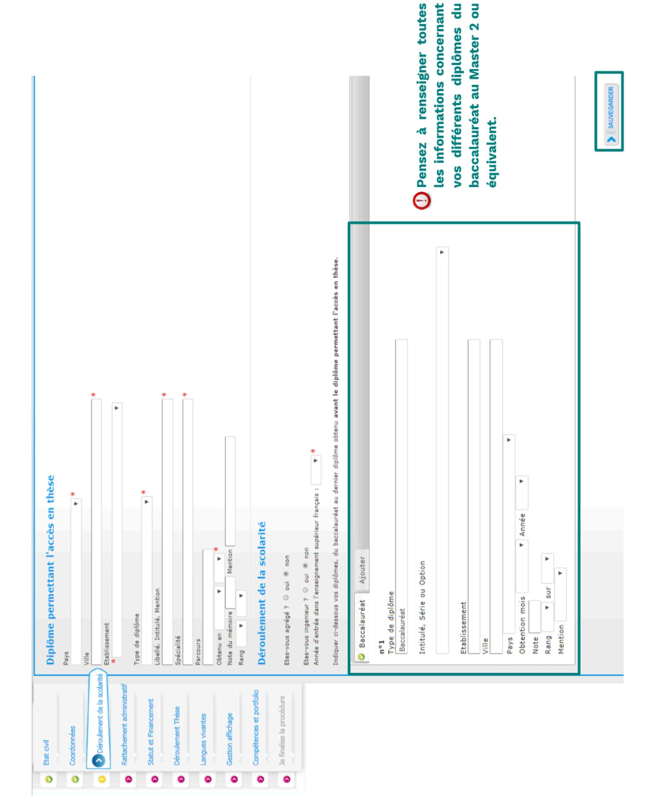

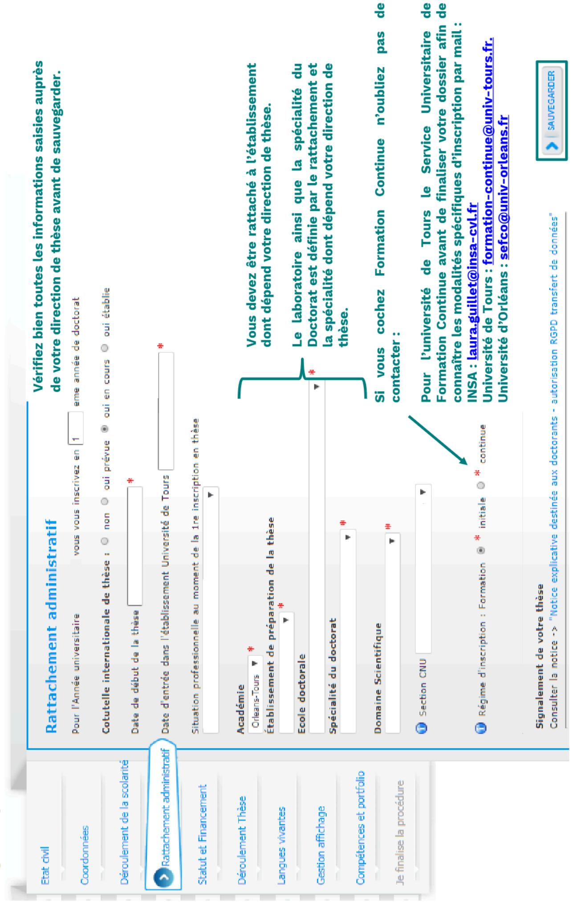

<del>o</del>

de

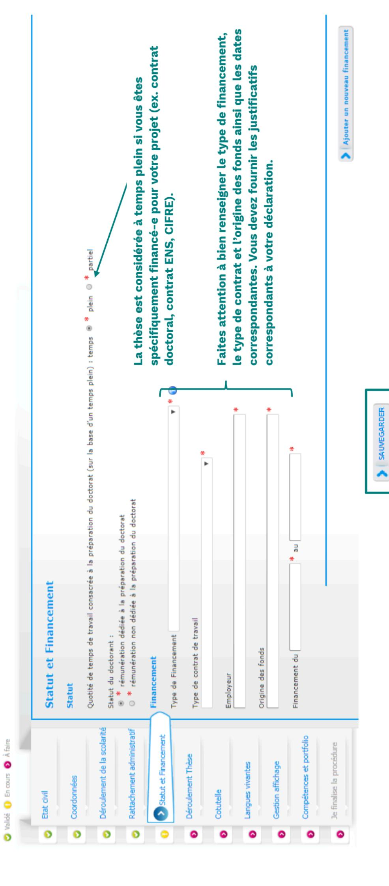

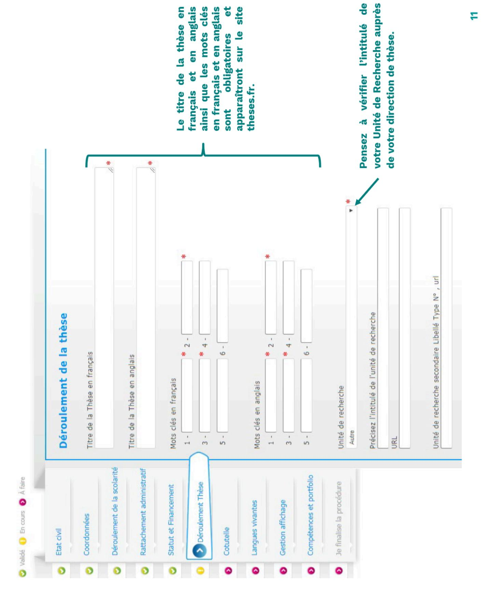

#### **ENCADREMENT DE LA THÈSE**

🕡 Information :: A partir du 3ème caractère saisi une recherche est effectuée sur l'ensemble des responsables de l'ADUM. Patientez un peu. Si le nom de votre encadrant comporte seulement 3 caractères, faites suivre d'un espace, et saisissez la 1e lettre du prénom.

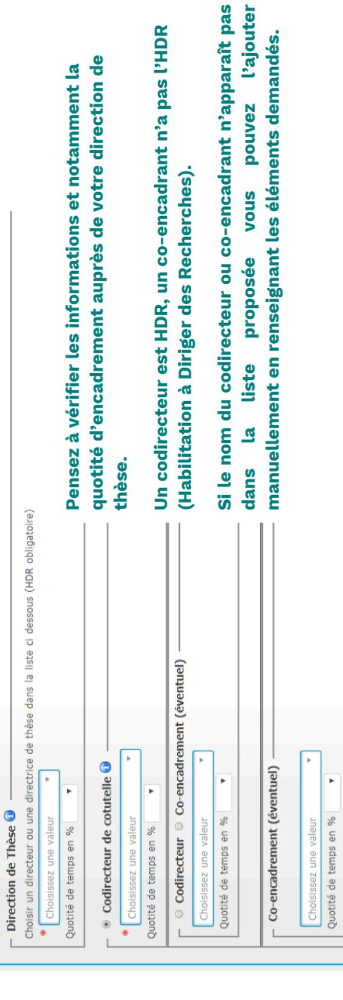

CALENDRIER PREVISIONNEL

Motivations à s'engager en thèse et perspectives professionnelles envisagées

Collaboration Industrielle 

non 
oui établie 
oui en cours

Préciser les échéances prévisionnelles des étapes principales du projet doctoral jusqu'a la soutenance, le calendrier est révisable annuellement.

#### **OUVERTURE INTERNATIONALE**

Préciser les éléments déja réalisés ou prévus (selon l'avancement du projet doctoral) qui apporteront une ouverture internationale,

(terrain d'étude à l'étranger, utilisation d'une plateforme expérimentale, séjour dans une unité de recherche pour acquérir une compétence particuliere utile au projet), mobilité internationale envisagée pendant la thèse en précisant l'objet conférences et colloques internationaux.)

Résumé du projet de thèse en français

Soyez attentif à votre résumé de projet de thèse en français et en anglais car ce sont les données qui apparaîtront sur le site theses.fr.

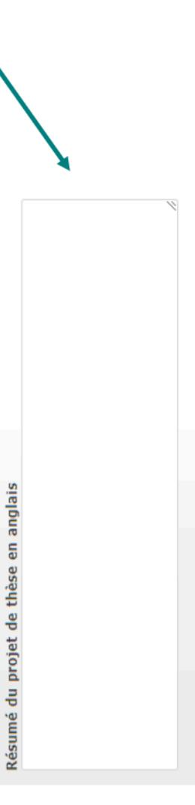

#### PLAN INDIVIDUEL DE FORMATION

Indiquer les formations collectives souhaitées, en lien avec les compétences à développer et le projet professionnel

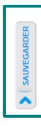

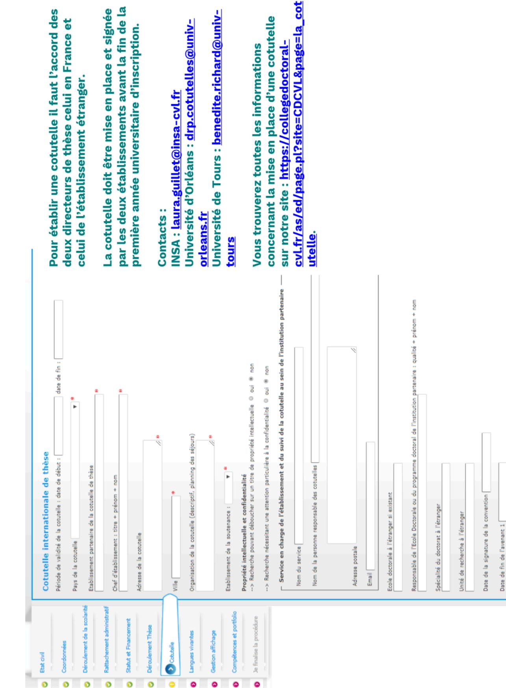

Date de fin de l'avenant 3

Date de fin de l'avenant 2

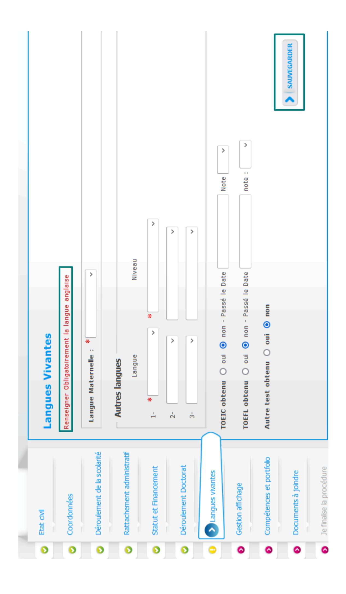

#### Pour des questions de confidentailité, votre profil ne sera pas visible depuis les moteurs de recherche (Google, Yahoo, etc.). Vous pouvez à tout moment décider de ne plus apparaître sur internet via ce formulaire. Si vous souhaitez que les informations relatives à votre thèse soient publiées sur internet, elles ne le seront qu'après leur validation par votre école doctorale ou établissement. Si vous souhaitez publier les informations relatives à votre thèses sur internet, seront affichées par défaut les informations liées à votre thèse (libellé du diplôme, titre, mots-clés- résumés). Si vous souhaitez afficher davantage d'informations sur votre profil en ligne, merci de bien vouloir le spécifier dans la partie "Paramétrage de mon profil internet" ci-dessous. Je souhaite publier les informations relatives à ma thèse sur internet conformément au paramétrage ci-dessous (affichage exclusivement sur des sites d'institutions publiques : école doctorale, établissement d'enseignement supérieur de la thèse, theses.fr\*, adum.fr, etc.) : Le signalement d'une thèse en préparation ou soutenue est une des bonnes pratiques utiles à la visibilité de la recherche française Vous pouvez compléter votre profil avec un maximum d'informations sur votre parcours professionnel et vos compétences. Signalement de votre thèse sur theses.fr Consulter la notice : "Notice explicative destinée aux doctorants - RGPD transfert de données" Vous pouvez choisir d'afficher d'autres informations en cochant la case a côté de celles-ci. Paramétrage de mon profil sur internet Par défaut Par défaut Adresse électronique principale Adresse électronique secondaire Affichage sur le web Diplôme entrée en thèse Adresse Professionnelle ino 🏶 mon 🖰 THESE Rattachement administratif Déroulement de la scolarité Ompétences et portfolio Je finalise la procédure Statut et Financement Déroulement Doctorat Gestion affichage Documents à joindre Langues vivantes Coordonnées Etat civil 0 0 0 0

"La base theses, fr est allmentée par un transfert automatique des informations relatives aux données concernant votre thèse déclarées lors de votre (n°))nscription dans l'ADUM (nom, prénom, titre de la thèse, école doctorale, spécialité doctorale, unité de recherche, établissement de cotutalle le cas échéant, date de première inscription, mots-clés, résumés). Plus d'informations sur le site de l'ABES (Agence Bibliographique de l'Enseignement Supérieur) : http://www.abes.fr/Theses/Les

Situation Professionnelle

Employabilité Publications

Photo

Site Internet personnel

-2-

-

2-

3-

4-

|                                                                                                          |                                                                                                          | > SAUVEGARDER |
|----------------------------------------------------------------------------------------------------------|----------------------------------------------------------------------------------------------------------|---------------|
| Fonction & Mission, statut ou contrat:  Entreprise ou établissement:  Ville, Pays:  Durée (en semaines): | Fonction & Mission, statut ou contrat:  Entreprise ou établissement:  Ville, Pays:  Durée (en semaines): |               |

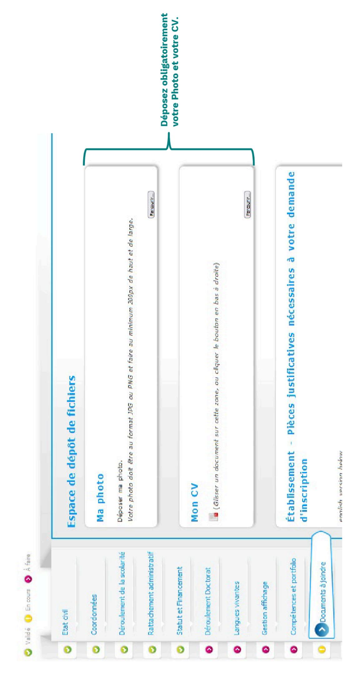

## Établissement - Pièces justificatives nécessaires à votre demande d'inscription

- Justificatif de financement (Attestation contrat doctoral, attestation ANRT dans le cadre d'une CIFRE, contrat de travail ou attestation de l'employeur, attestation de bourse)
- Copie de la pièce d'identité (carte d'identité, passeport ou titre de séjour en cours de validité)
- o Copie du diplôme ou attestation de réussite au Master ou DEA
- Pour une dispense de Master ou diplôme étranger équivalent Master :
- Copie du diplôme ou attestation de réussite
- Liste des matières constitutives du dernier diplôme obtenu avec les relevés de notes (traduction certifiée conforme par un service officiel français) et éventuellement le mémoire de fin d'études
  - eventuettement le memoire de un a eudres - Et/ou toute pièce prouvant que le candidat a bénéficié d'une réelle initiation à
- la recherche et a réalisé un travail de recherche personnel - Et/ou la liste détaillée des publications et travaux de recherche déjà effectués

Vous devez déposer ici tous les documents

demandés en 1 seul PDF.

 Attestation de mise en place d'une cotutelle internationale de thèse le cas échéant (téléchargeable sur votre profil ADUM) Pour l'Ecole Doctorale "Humanités et Langues", merci de bien vouloir fournir un projet de thèse intégrant :

- Le résumé lui-même ;
- L'exposé en quelques lignes du caractère novateur du projet;

l'école doctorale « Humanités et Langues » un document complémentaire est demandé

qui devra être intégré au PDF unique!

Attention, si vous sous inscrivez au sein de

N'oubliez pas de sauvegarder vos données.

- Quelques références bibliographiques ;
- Un calendrier prévisionnel du travail
- Si cela est possible, un plan prévisionnel de la thèse peut être ajouté.

La plus grande attention devra être portée à la correction de la langue écrite employée : les projets de thèse contenant des erreurs de syntaxe, d'orthographe (grammaticale et/ou lexicale) ne seront pas examinés et seront retournés à l'auteur pour correction.

Vous devez rassembler toutes les pièces en <u>un seul document PDF</u>

Parcourir...

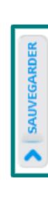

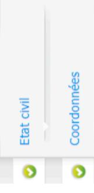

Déroulement de la scolarité

Rattachement administratif

Statut et Financement

Déroulement Thèse

Langues vivantes

Gestion affichage

Compétences et portfolio

) Je finalise la procédure

#### J'ai terminé la procédure

En cliquant sur ce lien, vous pourrez ouvrir et imprimer les documents nécessaires à votre inscription pédagogique à l'école doctorale ou à l'établissement. Cette action informe le gestionnaire de votre dossier que vous avez finalisé votre procédure ADUM.

Merci de vérifier que vos documents sont bien renseignés. Si ce n'est pas le cas, un bouton vous permettra d'annuler cette action afin de modifier vos données

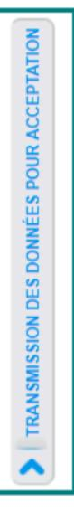

Une fois que vous avez cliquez sur « TRANSMISSION DES DONNEES POUR ACCEPTATION » votre direction de thèse reçoit un mail pour vérifier et valider les informations saisies.

doctorale puis au représentant du chef de votre établissement pour étude de votre demande d'inscription en Votre dossier sera ensuite transmis via ADUM à votre direction de laboratoire, à la direction de votre école doctorat avant autorisation ou non d'inscription.

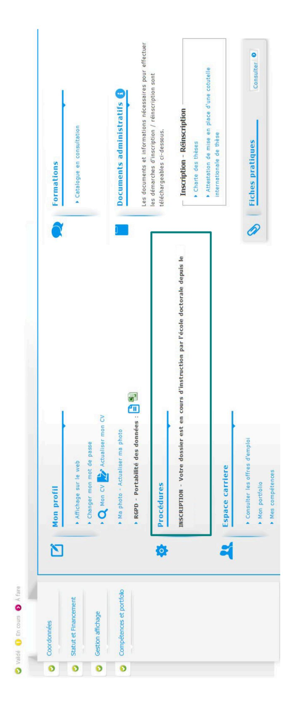

Vous pouvez suivre l'évolution de votre dossier sur votre espace personnel ADUM.

Pour rappel votre dossier doit être validé par votre direction de thèse, votre codirection de thèse le cas échéant, votre direction de laboratoire, votre direction d'école doctorale puis le représentant du Chef de votre établissement.

Vous recevrez la réponse par mail.

#### Vos contacts

### à l'université de Tours :

ED EMSTU – MIPTIS – SSBCV: Isabelle Foulon ☎ + 33 2 47 36 66 75 ⊠ isabelle.foulon@univ-tours.fr ED H&L – SSTED : Christèle Gaudron ☎ + 33 2 47 36 64 50 ⊠ christele.gaudron@univ-tours.fr

Université de Tours Service de la Recherche et des Etudes Doctorales 60 rue du Plat d'Etain – BP 12050 37020 TOURS Cedex 1 – France https://www.univ-tours.fr

# à l'INSA Centre Val de Loire :

Laura GUILLET ☎ + 33 2 48 48 07 61 ED EMSTU et MIPTIS ⊠ laura.guillet@insa-cvl.fr

INSA Centre Val de Loire Direction de la Recherche et de la Valorisation Etudes Doctorales

Campus de BOURGES 88 boulevard Lahitolle Technopôle Lahitolle CS 60013 18022 BOURGES CEDEX Campus de BLOIS
3 rue de la Chocolaterie
CS 23410 - 41034 BLOIS CEDEX
http://www.insa-centrevaldeloire.fr

## A l'université d'Orléans :

ED Secteur SST ● + 33 2 38 49 48 25 ED EMSTU ⊠ edemstu@univ-orleans.fr ED MIPTIS ⊠ edmiptis@univ-orleans.fr ED SSBCV ⊠ edssbcv@univ-orleans.fr

Kathia FUSTER **≅** + 33 2 38 41 73 61 ED SSTED ⊠ <u>edssted@univ-orleans.fr</u> ED H&L ⊠ <u>edhl@univ-orleans.fr</u>

Direction Recherche et Partenariats Pôle Recherche et Études Doctorales Bâtiment IRD 5 rue Carbone - BP 6749 45067 - Orléans Cedex 2 http://www.univ-orleans.fr/fr

https://collegedoctoral-cvl.fr