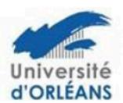

# Ecole doctorale n° 616 Humanités et Langues - H&L

## Aide à la Mobilité

L'aide proposée par l'ED H&L ne concerne que les déplacements des doctorants en France ou à l'étranger pour les colloques.

Cette aide peut être demandée dans le cadre d'une communication orale ou présentation d'un poster lors d'un colloque international en France ou à l'étranger.

De façon exceptionnelle, cette aide peut aussi être attribuée pour un déplacement en France ou à l'étranger (consultation d'archives ou de fonds de bibliothèque, étude ou enquête de terrain ...). Il convient alors <u>d'expliquer clairement</u> en quoi ce déplacement est indispensable à l'avancement de la thèse. Le montant cumulé maximal des aides à la mobilité est fixé à 800 euros par doctorant <u>pour toute la durée de la thèse</u> et dans la limite du budget annuel de l'Ecole doctorale.

Le dossier complet doit être envoyé par mail à votre gestionnaire des études doctorales :

Pour l'université d'Orléans : edhl@univ-orleans.fr

Pour l'université de Tours : <u>christele.gaudron@univ-tours.fr</u>

#### Les documents à fournir sont les suivants :

- Une lettre de demande rédigée et signée par le/la doctorant-e précisant le lieu (pays, établissement, nom du laboratoire d'accueil) les dates du séjour, la nature et l'intitulé de l'événement justifiant de l'intérêt du déplacement pour le travail du doctorant.
- Une lettre d'appui écrite et signée de la Direction de thèse motivant la demande.
- Les justificatifs nécessaires pour l'étude du dossier :
  - o <u>Tableau récapitulatif du budget prévisionnel faisant apparaitre les co-financeurs éventuels</u> (laboratoire, UFR, autres organismes).
  - o Programme du colloque s'il y a lieu,

Le Bureau de l'école doctorale étudiera le dossier et statuera sur votre demande.

Si le bureau décide l'octroi d'une aide à la mobilité, l'enveloppe allouée par l'école doctorale sera versée à votre laboratoire qui est chargé d'effectuer les dépenses associées à cette aide.

### 2 dispositions sont prévues :

- Le laboratoire effectue, pour le compte du doctorant, les réservations nécessaires à la mobilité.

#### Ou

- Le laboratoire verse l'aide au doctorant afin que celui-ci effectue lui-même les réservations nécessaires à sa mobilité.

Le/la doctorant-e devra donc s'adresser à son laboratoire pour les modalités pratiques pour le paiement des dépenses.