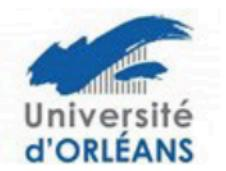

## Ecole doctorale n° 617 Sciences de la Société : Territoires, Economie. Droit - SSTED

## Aide à la Mobilité

L'aide proposée par l'ED SSTED ne concerne que les déplacements des Doctorants à l'étranger.

Cette aide peut être demandée pour un ou plusieurs séjours à l'étranger dans le cadre d'une communication orale ou présentation d'un poster lors d'un colloque ou d'une conférence. Tout en sachant que le montant cumulé maximal des aides à la mobilité internationale exceptionnelles est fixé à 800€, par doctorant pour <u>toute la durée de la thèse</u>, dans la limite du budget annuel de l'Ecole Doctorale.

<u>De façon très exceptionnelle</u>, cette aide peut être attribuée pour un <u>déplacement en France</u>, lorsqu'il est fait la preuve que la thématique de la thèse ne fait pas l'objet de colloques ni de manifestations similaires à l'étranger.

Le dossier complet doit être envoyé par mail à votre gestionnaire d'études doctorales :

Pour l'université d'orléans : edssted@univ-orleans.fr

Pour l'université de Tours : christele.gaudron@univ-tours.fr.

## Les documents à fournir sont les suivants :

- Une lettre de demande rédigée et signée par le/la doctorant-e précisant le lieu (pays, établissement, nom du laboratoire d'accueil) les dates du séjour, la nature et l'intitulé de l'événement justifiant de l'intérêt du déplacement pour le travail du doctorant.
- Une lettre d'appui écrite et signée de la Direction de thèse motivant la demande.
- Les justificatifs nécessaires pour l'étude du dossier :
  - o <u>Tableau récapitulatif du budget prévisionnel faisant apparaitre les co-financeurs éventuels</u> (laboratoire, UFR, autres organismes).
  - o Programme du colloque s'il y a lieu,

Le Bureau de l'école doctorale étudiera le dossier et statuera sur votre demande.

Si le bureau décide l'octroi d'une aide à la mobilité, l'enveloppe allouée par l'école doctorale sera versée à votre laboratoire qui est chargé d'effectuer les dépenses associées à cette aide.

## 2 dispositions sont prévues :

- Le laboratoire effectue, pour le compte du doctorant, les réservations nécessaires à la mobilité.

Ou

- Le laboratoire verse l'aide au doctorant afin que celui-ci effectue lui-même les réservations nécessaires à sa mobilité.

Le/la doctorant-e devra donc s'adresser à son laboratoire pour les modalités pratiques pour le paiement des dépenses.