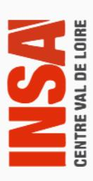

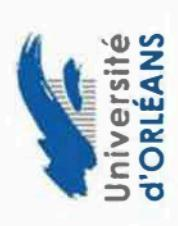

# Tutoriel de demande de réinscription en doctorat

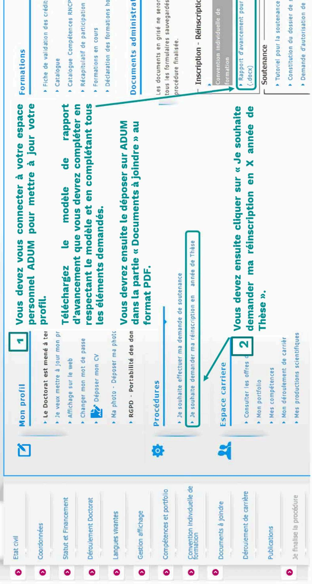

- Constitution du dossier de soutenance
- ▶ Demande d'autorisation de soutenance à huis-

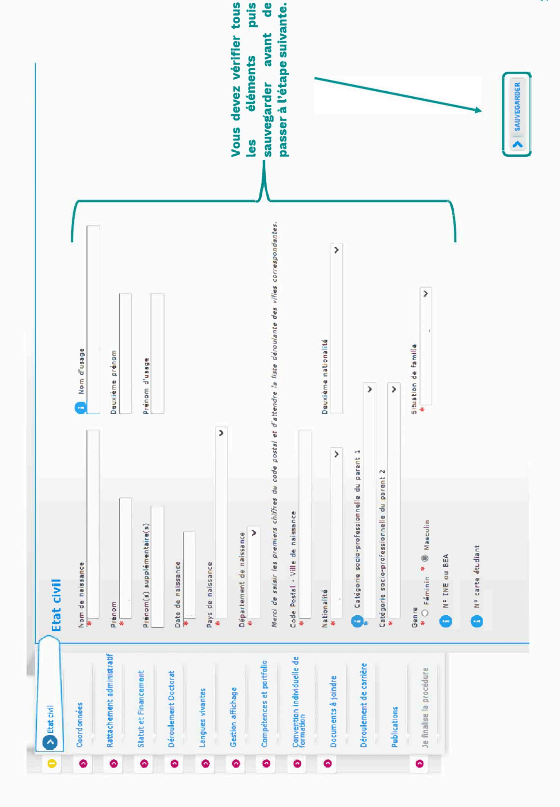

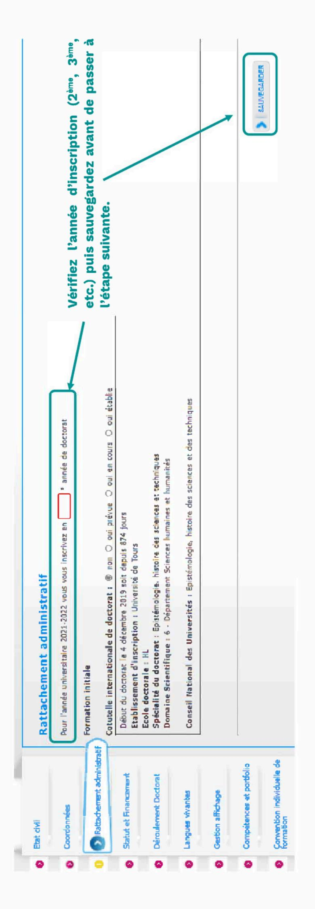

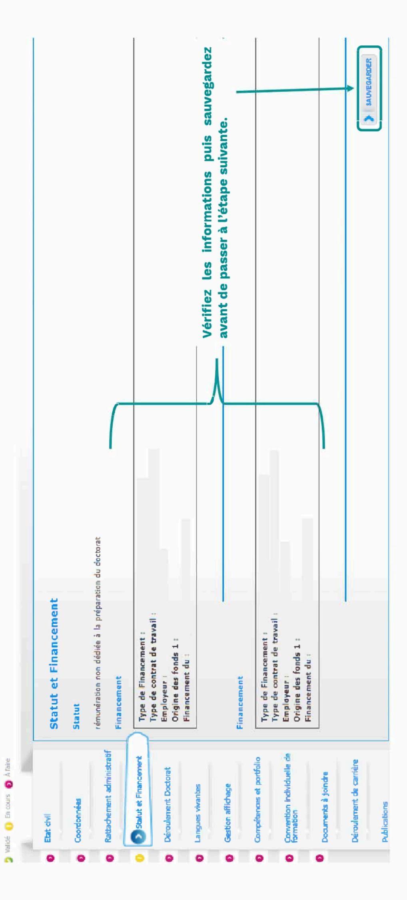

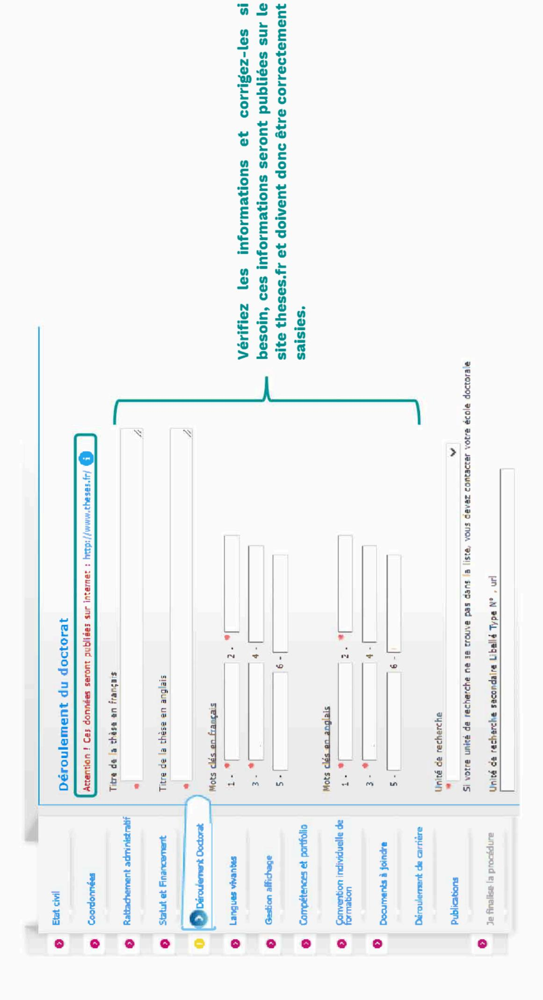

.<u>r</u>

### ENCADREMENT DE LA THÈSE

💽 Information : A partir du Jème caractère saisi, une racherche est effectuee sur l'ensemble des personnes répertoriées dans la base pouvant diriger une thèse. Patientez quelques instants.

| Choisissez une valeur | Choisisez une valeur • Quotité de temps en % 0 • | Lorsque la codirection est assuree par une personne du mande socio-économique qui n'appartient pas au monde universitaire, le nombre de codirecteurs peut être porté à deux.  — Codirecteur - Co-encadrement (éventuel) | Quotite de temps en % | * X | ® Codirecteur ○ Co-encadrement (éventuel) (i) | Quotité de temps en % | Choisir un directeur ou une directrice de thèse dans la liste ci dessous (HDR obligatoire) |  |
|-----------------------|--------------------------------------------------|-------------------------------------------------------------------------------------------------------------------------------------------------------------------------------------------------------------------------|-----------------------|-----|-----------------------------------------------|-----------------------|--------------------------------------------------------------------------------------------|--|
|-----------------------|--------------------------------------------------|-------------------------------------------------------------------------------------------------------------------------------------------------------------------------------------------------------------------------|-----------------------|-----|-----------------------------------------------|-----------------------|--------------------------------------------------------------------------------------------|--|

# DEVELOPPEMENT DE COMPETENCES ET PERSPECTIVES PROFESSIONNELLES

#### Indiquer :

- » les compérances disciplinaires, thématiques et transverses, les compérances transférables qui pourront être acquises ou ont été acquises au cours du doctorat et qui pourront être valorisées lors de l'insertion professionnelle ou de la poursuite de carrière ;
  - les perspectives d'insertion professionnelle ou de poursuite de cernière au projet ;
- · votre projet professionnel.

Mettez à jour les éléments de développement de compétences et perspectives professionnelles.

4 1

Attention | Cas données seront publiées sur internet : http://www.theses.fr/

Résume du projet de thèse en français

Résumé du projet de thèse en anglais

Vérifiez et corrigez si besoin les résumés de votre thèse en français et en anglais, ils apparaîtront sur le site theses.fr.

Sauvegardez avant de passer à l'étape suivante.

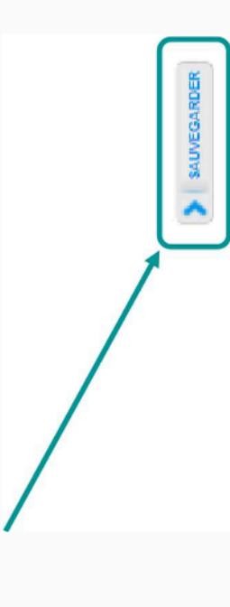

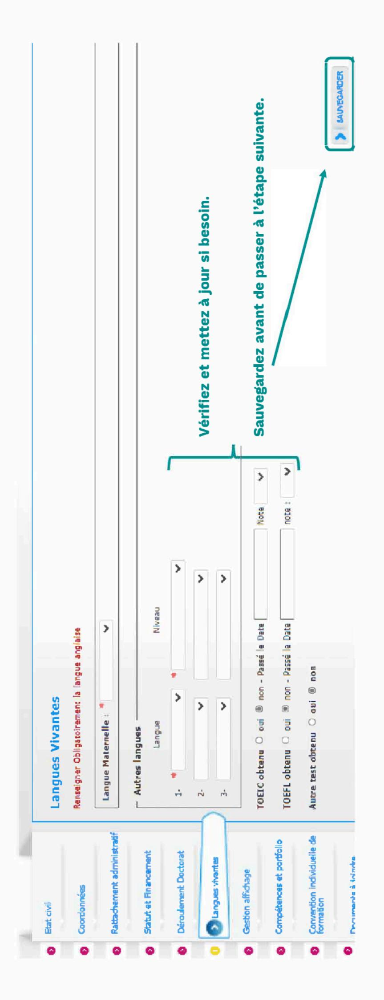

| 0 | Etat civil                   | Affichage sur internet                                                                                                                                                                                                                                                                                                                                                                                                                                                                                                                                                                                                                                                                                                                                                                                                                                                                                                                                                                                                                                                                                                                                                                                                                                                                                                                                                                                                                                                                                                                                                                                                                                                                                                                                                                                                                                                                                                                                                                                                                                                                                                         |
|---|------------------------------|--------------------------------------------------------------------------------------------------------------------------------------------------------------------------------------------------------------------------------------------------------------------------------------------------------------------------------------------------------------------------------------------------------------------------------------------------------------------------------------------------------------------------------------------------------------------------------------------------------------------------------------------------------------------------------------------------------------------------------------------------------------------------------------------------------------------------------------------------------------------------------------------------------------------------------------------------------------------------------------------------------------------------------------------------------------------------------------------------------------------------------------------------------------------------------------------------------------------------------------------------------------------------------------------------------------------------------------------------------------------------------------------------------------------------------------------------------------------------------------------------------------------------------------------------------------------------------------------------------------------------------------------------------------------------------------------------------------------------------------------------------------------------------------------------------------------------------------------------------------------------------------------------------------------------------------------------------------------------------------------------------------------------------------------------------------------------------------------------------------------------------|
| 0 | Coordonnées                  |                                                                                                                                                                                                                                                                                                                                                                                                                                                                                                                                                                                                                                                                                                                                                                                                                                                                                                                                                                                                                                                                                                                                                                                                                                                                                                                                                                                                                                                                                                                                                                                                                                                                                                                                                                                                                                                                                                                                                                                                                                                                                                                                |
| 0 | Oéroulement de la scolanté   | Vous poursz publier aur internet kei informations relabúves à votre thèse en préparation i titre de la thèse, divection de thèse, divole doctorale, i hallé du diplôms, motsuciés, résumés. Ces informations seront publièses (après enrégistrement de votre inscription ou miss à jour de vos données par votre établissement) sur les sites theses. It de votre établissement, de votre établissement de votre inscription ou miss à jour de vos données par votre établissement) sur les sites theses. It de votre établissement de votre inscription ou miss à jour de vos données par votre établissement.                                                                                                                                                                                                                                                                                                                                                                                                                                                                                                                                                                                                                                                                                                                                                                                                                                                                                                                                                                                                                                                                                                                                                                                                                                                                                                                                                                                                                                                                                                                |
| 0 | C Rattachement administratif | La signalement d'une thèse en préparation est une des bonnes pratiques utiles à la visibilité de la recherche française. Il est donc conseillé d'autoriser la publication des données relatives à votre thèse en préparation.                                                                                                                                                                                                                                                                                                                                                                                                                                                                                                                                                                                                                                                                                                                                                                                                                                                                                                                                                                                                                                                                                                                                                                                                                                                                                                                                                                                                                                                                                                                                                                                                                                                                                                                                                                                                                                                                                                  |
| 0 | © Financement                | Le sonaire publier sur internet les informations etatives a ma neue non ou Le signalement après soutenance de la bites sur thases. Feat quant à lai obligatoire conformément à l'arrêté modifié du 25 mai 2016 fizant le cadre national de la formation et les modalités conduisant à la délivrance du diplôme national de doctorat.                                                                                                                                                                                                                                                                                                                                                                                                                                                                                                                                                                                                                                                                                                                                                                                                                                                                                                                                                                                                                                                                                                                                                                                                                                                                                                                                                                                                                                                                                                                                                                                                                                                                                                                                                                                           |
| 0 | Oéroulement doctorat         | "La base thesest est alimentée par un transfert automatique des informations relatives aux données concernant votre thèse déclarées fors de votre (réjinscription dans IADUM (nom, prénom, titre de la thèse), écôts doctorale, spécialité dectorale, unité de recharche, disablesement de                                                                                                                                                                                                                                                                                                                                                                                                                                                                                                                                                                                                                                                                                                                                                                                                                                                                                                                                                                                                                                                                                                                                                                                                                                                                                                                                                                                                                                                                                                                                                                                                                                                                                                                                                                                                                                     |
| 0 | Cohutelle                    | échdat, date de pramère inscription, motraclés, résumés). Plus d'informations sur le site de TABES (Agence Bibliographique de l'Enseignament Supdirieu) : https://ebes.tr/reseau-theses/eupliv-ervenrices-theses/explore-les-donness/                                                                                                                                                                                                                                                                                                                                                                                                                                                                                                                                                                                                                                                                                                                                                                                                                                                                                                                                                                                                                                                                                                                                                                                                                                                                                                                                                                                                                                                                                                                                                                                                                                                                                                                                                                                                                                                                                       |
| 0 | Collaboration industrielle   | ► INVACAMENT                                                                                                                                                                                                                                                                                                                                                                                                                                                                                                                                                                                                                                                                                                                                                                                                                                                                                                                                                                                                                                                                                                                                                                                                                                                                                                                                                                                                                                                                                                                                                                                                                                                                                                                                                                                                                                                                                                                                                                                                                                                                                                                   |
| 0 | C Langues wvantes            |                                                                                                                                                                                                                                                                                                                                                                                                                                                                                                                                                                                                                                                                                                                                                                                                                                                                                                                                                                                                                                                                                                                                                                                                                                                                                                                                                                                                                                                                                                                                                                                                                                                                                                                                                                                                                                                                                                                                                                                                                                                                                                                                |
| 0 | Gestion affichage            |                                                                                                                                                                                                                                                                                                                                                                                                                                                                                                                                                                                                                                                                                                                                                                                                                                                                                                                                                                                                                                                                                                                                                                                                                                                                                                                                                                                                                                                                                                                                                                                                                                                                                                                                                                                                                                                                                                                                                                                                                                                                                                                                |
|   |                              | Wetifical at the control of the control of the control of the control of the control of the control of the control of the control of the control of the control of the control of the control of the control of the control of the control of the control of the control of the control of the control of the control of the control of the control of the control of the control of the control of the control of the control of the control of the control of the control of the control of the control of the control of the control of the control of the control of the control of the control of the control of the control of the control of the control of the control of the control of the control of the control of the control of the control of the control of the control of the control of the control of the control of the control of the control of the control of the control of the control of the control of the control of the control of the control of the control of the control of the control of the control of the control of the control of the control of the control of the control of the control of the control of the control of the control of the control of the control of the control of the control of the control of the control of the control of the control of the control of the control of the control of the control of the control of the control of the control of the control of the control of the control of the control of the control of the control of the control of the control of the control of the control of the control of the control of the control of the control of the control of the control of the control of the control of the control of the control of the control of the control of the control of the control of the control of the control of the control of the control of the control of the control of the control of the control of the control of the control of the control of the control of the control of the control of the control of the control of the control of the control of the control of the control of the control of the cont |

Affichage sur internet

de cotuteile le cas

Vérifiez et modifiez si besoin les informations avant de sauvegarder et de passer à l'étape suivante.

|                          | iser vos compétences, pensez à actualiser régulièrement votre profil afin de le maintenir à jour                                                                                                                                                                                                                                                  |                                             |                                                                |                                                                                                                                                                                                                                  |                   |                            |                                      |                     | Mettez à jour vos données. | 人                                | 2                                                                                 |                                         |                      |                                       |   |  |
|--------------------------|---------------------------------------------------------------------------------------------------------------------------------------------------------------------------------------------------------------------------------------------------------------------------------------------------------------------------------------------------|---------------------------------------------|----------------------------------------------------------------|----------------------------------------------------------------------------------------------------------------------------------------------------------------------------------------------------------------------------------|-------------------|----------------------------|--------------------------------------|---------------------|----------------------------|----------------------------------|-----------------------------------------------------------------------------------|-----------------------------------------|----------------------|---------------------------------------|---|--|
| Compétences et Portfolio | Si vous choisissez de publier votre profil sur internet (choix défini dans l'onglet "Gestion affichage"), celui-ci sera consulté par des recruteurs, des Chercheurs, etc., Afin de valoriser vos compétences, pensez à actualiser régulièrement votre profil afin de le maintenir à jour.  Enseignements réalisés (établissement, nombre d'heure) | Etes-vous en recherche d'emplo; ® non O oui | Projet professionnel (prévisionnel, plusieurs choix possibles) | Cartercheur en militar acteur prive de ABD du secteur prive     processe     processe     processe     processe     processe de la recherche et de l'innovation, gestion de projets innovants, pilotage de structures innovantes |                   |                            | Compétences techniques               |                     | Compitences transversales  | Missions de cultura acientifique | Indiquer le nombre d'heures, le publit cible et l'entité digantant chaque mission | Centres d'intérêts extra professionnels | Sájours à l'étranger | i i i i i i i i i i i i i i i i i i i | 3 |  |
| But dvil                 | Coordonnées     Rattachement administratif                                                                                                                                                                                                                                                                                                        | Statut et Enement                           | Déroulement Doctorat                                           | Langues wrentes                                                                                                                                                                                                                  | Oestion affichage | O Compilances et portfolio | Convention individuelle de formation | Occuments à joindre | Déroulement de camière     | Publications                     | De finalise la procédure                                                          |                                         |                      |                                       |   |  |

Saisissez toutes les informations en collaboration avec votre direction de thèse.

| • les modalités décidées par l'Ecole doctorale pour le comité individuel de formation • les prérequis spécifiques pour la soutenance (publications, heures ou crédits doctoraux) ou renvoyer à un règlement intérieur ED | Conditions matérielles de réalisation du projet de recherche, le cas échéant, les conditions de sécurité spécifiques : Préciser : • Moyens et méthodes disponibles dans l'unité de recherche pour mener à bien le projet • Préciser si des conditions spécifiques de sécurité sont requises pour ce projet doctoral, en plus de celles évoquées dans le règlement intérieur de l'unité de recherche | Modalités d'intégration dans l'unité ou l'équipe de recherche : Indiquer les méthodes d'intégration de l'unité de recherche, telles que des animations scientifiques ou d'intégration (offertes ou obligatoires), les éventuelles responsabilités collectives que assumer au sein du laboratoire. Un calendrier prévsionel du projet de recherche peut être précisé. |  |
|-----------------------------------------------------------------------------------------------------------------------------------------------------------------------------------------------------------------------------|--------------------------------------------------------------------------------------------------------------------------------------------------------------------------------------------------------------------------------------------------------------------------------------------------------------------------------------------------------------------------------------------------------------|-------------------------------------------------------------------------------------------------------------------------------------------------------------------------------------------------------------------------------------------------------------------------------------------------------------------------------------------------------------------------------|--|
| <ul> <li>les modalités décidées par l'Ecole doctorale pour le comité</li> <li>les prérequis spécifiques pour la soutenance (publications,</li> </ul>                                                                        | Conditions matérielles de réalisation du projet de recherc Préciser :  Moyens et méthodes disponibles dans l'unité de recherche Préciser si des conditions spécifiques de sécurité sont req                                                                                                                                                                                                               | Modalités d'intégration dans l'unité ou l'équipe de recherche : Indiquer les méthodes d'intégration de l'unité de recherche, telles q assumer au sein du laboratoire. Un calendrier prévsionel du projet de recherche peut être précisé.                                                                                                                             |  |

le doctorant devra

| A compléter: Liste des formations envisagées en lien avec votre projet professionnel : formations transversales, scientifiques et techniques Le collège doctoral regroupant les différentes écoles doctorales propose un ensemble de formations scientifiques disciplinaires, pluridisciplinaires et transversales telles sont présentées en début d'année universitaire et se déroulent en général au second semestre (https://collegedoctoral-cvi.fr). D'autres formations plus spécifiques peuvent être suivies à l'extérieur et validées par l'école doctorale. | Objectifs de valorisation des travaux de recherche de la thèse : diffusion, publication et confidentialité, droit à la propriété intellectuelle selon le champ du programme de doctorat.  doctorat. |
|---------------------------------------------------------------------------------------------------------------------------------------------------------------------------------------------------------------------------------------------------------------------------------------------------------------------------------------------------------------------------------------------------------------------------------------------------------------------------------------------------------------------------------------------------------------------|-----------------------------------------------------------------------------------------------------------------------------------------------------------------------------------------------------|
| Parcours previsionnel individuel de formation :  A compléter : Liste des formations envisagées en lien avec votre projet profession Le collège doctoral regroupant les différentes écoles doctorales propose un e professionnelle et aux métiers de l'enseignement. Elles sont présentées en début D'autres formations plus spécifiques peuvent être suivies à l'extérieur et validées                                                                                                                                                                              | Objectifs de valorisation des travaux de recherche de la thèse : diffusion Préciser les objectifs de valorisation : diffusion, communications, publication et doctorat.                             |

Saisissez toutes les informations en collaboration avec votre direction de thèse.

# DEVELOPPEMENT DE COMPETENCES ET PERSPECTIVES PROFESSIONNELLES

- les compétences disciplinaires, thématiques et transverses, les compétences transférables qui pourront être acquises ou ont été acquises au cours du doctorat et qui pourront être valorisées lors de l'insertion professionnelle ou de la poursuite de carrière

les perspectives d'insertion professionnelle ou de poursuite de carrière au projet

#### **OUVERTURE INTERNATIONALE**

Préciser les éléments déjà réalisés ou prévus (selon l'avancement du projet doctoral) qui apporteront une ouverture internationale, telle qu'une mobilité internationale envisagée pendant la thèse, en précisant

terrain d'étude à l'étranger, utilisation d'une plateforme expérimentale, séjour dans une unité de recherche pour acquérir une compétence particulière utile au projet, conférences et colloques internationaux.

Saisissez toutes les informations en collaboration avec votre direction de thèse.

Sauvegardez avant de passer à l'étape suivante.

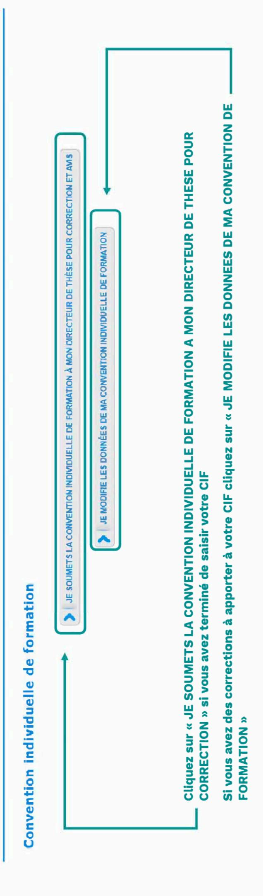

#### Vous devez terminer de mettre à jour votre profil, puis vous devrez télécharger et déposer votre Votre convention individuelle de formation a été transmise à votre direction de thèse pour En cas de problème pour le téléchargement ou le dépôt de la CIF contactez votre gestionnaire convention individuelle de formation une fois qu'elle sera validée par votre direction de thèse. La CIF - Convention Individuelle de Formation est en cours de révision par votre direction de thèse Convention individuelle de formation d'école doctorale. **► PAGE SUIVANTE** validation. Convention individuelle de formation Rattachement administratif Compétences et portfolio Collaboration industrielle Déroulement Doctorat Statut et Financement Gestion affichage Langues vivantes Coordonnées Etat civil

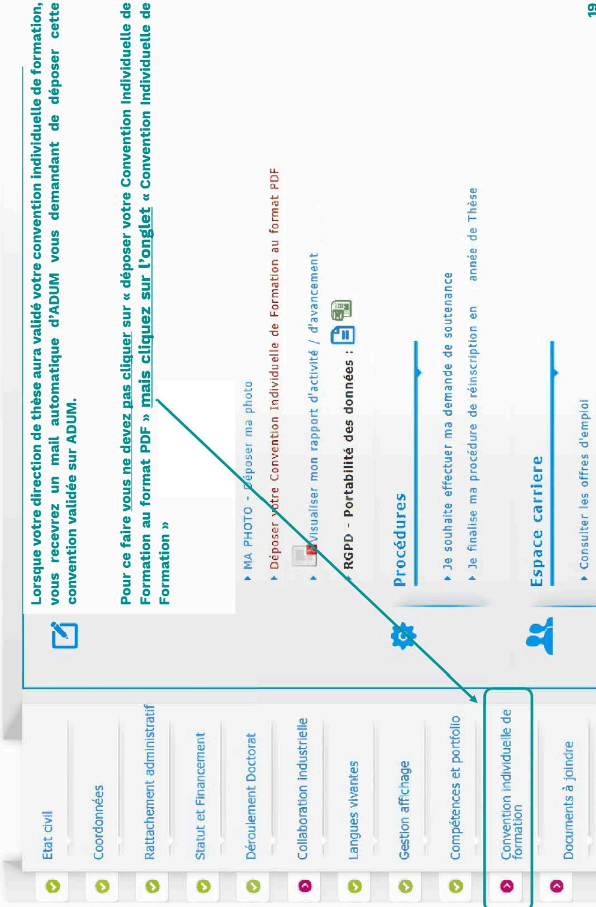

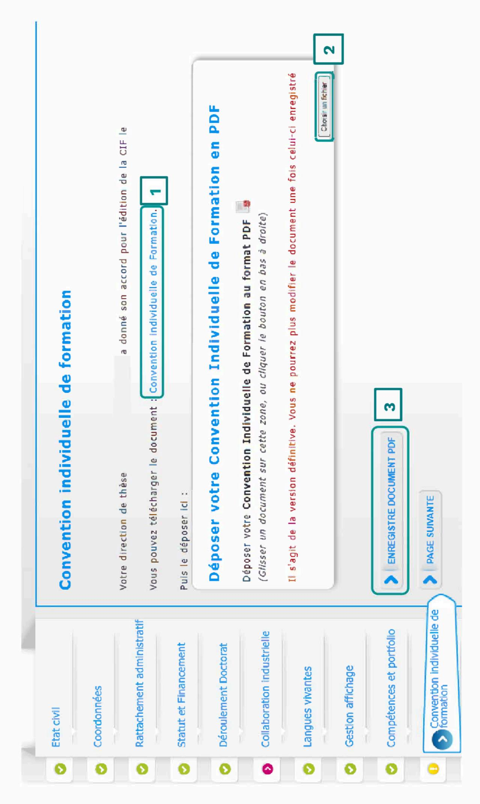

Vous devez télécharger la CIF via le lien indiqué (1), vous devez ensuite enregistrer le fichier au format PDF sur votre PC puis aller le télécharger ( $\bf 2$ ) et cliquer sur « ENREGISTRE DOCUMENT PDF » ( $\bf 3$ ).

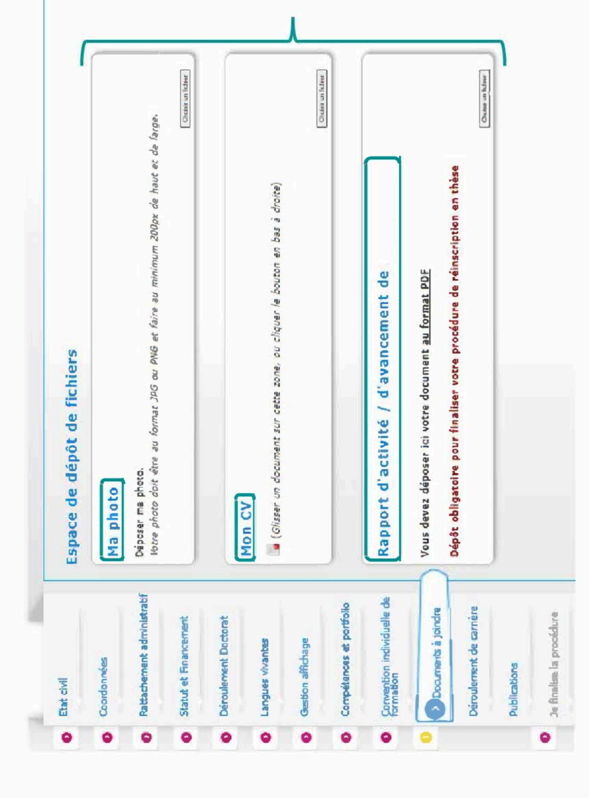

Vous devez obligatoirement déposer votre photo, votre CV et votre rapport d'activité/avancement sur ADUM pour pouvoir finaliser votre procédure de réinscription.

Le rapport d'avancement doit impérativement être celui que vous avez téléchargé sur la page d'accueil de votre profil ADUM et doit être déposé au format PDF.

Vous devez sauvegarder pour passer à l'étape suivante.

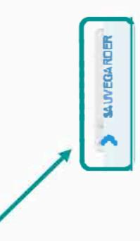

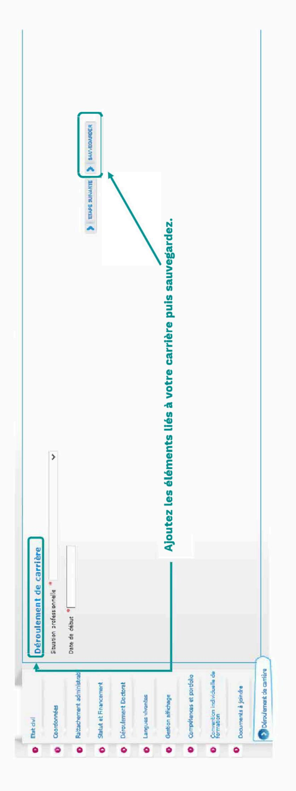

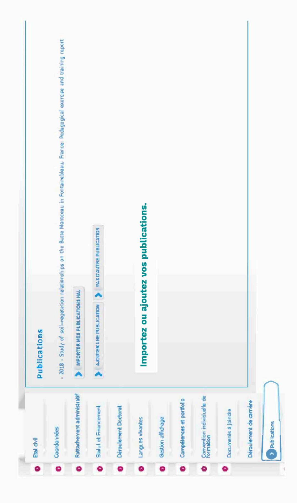

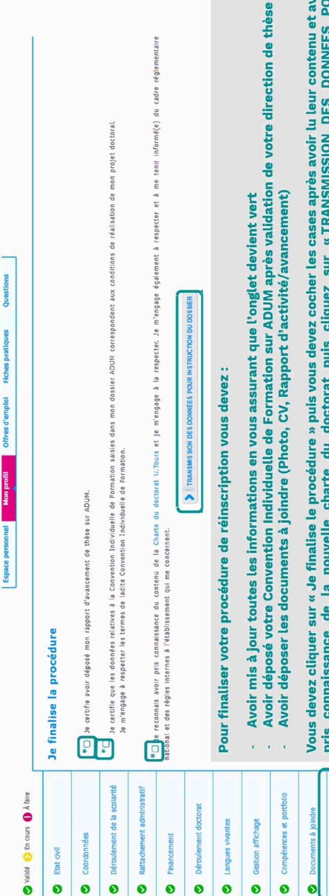

Vous devez cliquer sur « Je finalise le procédure » puis vous devez cocher les cases après avoir lu leur contenu et avoir pris connaissance de la nouvelle charte du doctorat puis cliquez sur «TRANSMISSION DES DONNEES POUR **INSTRUCTION DE VOTRE DOSSIER »** 

Je finalise la procédure

Votre dossier devra ensuite être validé par votre codirection de thèse, le cas échéant, puis par votre direction de aboratoire, votre direction d'école doctorale puis par la personne représentant votre établissement. Un mail sera envoyé à votre direction de thèse pour validation de votre dossier sur son profil ADUM.

Pour rappel, vous devez avoir finalisé votre dossier et l'avoir fait valider par votre direction de thèse et direction de laboratoire au plus tard le 15 novembre.

#### Mon profil

- ▶ Affichage sur le web
- Changer mon mot de passe
- Mon CV Notualiser mon CV
- ► Ma photo Actualiser ma photo
- Convention individuelle de formation 2023
- Rapport d'activité / d'avancement 2022-2023
- RGPD Portabilité des données : 시 시

#### Procédures

Charte du doctorat U. Tours signée le

INSCRIPTION - L'avis de la direction de thèse est en attente depuis le

Je souhaite effectuer ma demande de soutenance

Vous pouvez suivre l'instruction de votre dossier en vous connectant sur votre espace personnel ADUM.

Pour rappel votre dossier doit être validé par votre direction de thèse, votre codirection de thèse le cas échéant, votre direction de laboratoire, votre direction d'école doctorale ou le bureau de l'école doctorale à partir d'une demande de réinscription en 5èm année de thèse, puis le représentant du Chef de votre établissement.

Vous recevrez un mail lorsque vous aurez été autorisé à vous réinscrire.

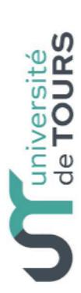

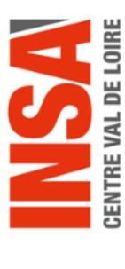

Université **d'ORLÉANS** 

#### **CENTRE VAL DE LOIRE**

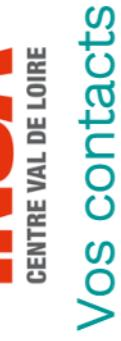

### à l'université de Tours :

Guillaume FIALEIX 🕿 + 33 2 47 36 66 75 ⊠ guillaume.fialeix@univ-tours.fr ED EMSTU - MIPTIS - SSBCV:

Christèle GAUDRON 😭 + 33 2 47 36 64 50 ED H&L - SSTED

60 rue du Plat d'Etain – BP 12050 37020 TOURS Cedex 1 - France https://www.univ-tours.fr et des Etudes Doctorales Service de la Recherche Université de Tours

# à l'INSA Centre Val de Loire :

Laura GUILLET 😭 + 33 2 48 48 07 61 ⊠ <u>laura.guillet@insa-cvl.fr</u> ED EMSTU et MIPTIS

Direction de la Recherche et de la INSA Centre Val de Loire **Etudes Doctorales** Valorisation

18022 BOURGES CEDEX 88 boulevard Lahitolle Campus de BOURGES Technopôle Lahitolle CS 60013

http://www.insa-centrevaldeloire.fr CS 23410 - 41034 BLOIS CEDEX 3 rue de la Chocolaterie Campus de BLOIS

## A l'université d'Orléans :

Frédérique LANDAIS 🖈 + 33 2 38 49 48 25 Audrey BOURGEOIS 🖀 + 33 2 38 49 49 85 **ED EMSTU** ⋈ edemstu@univ-orleans.fr ED MIPTIS 
\nedmiptis@univ-orleans.fr ED SSBCV ⊠ edssbcv@univ-orleans.fr

ED SSTED ≥ edssted@univ-orleans.fr Kathia FUSTER 🐿 + 33 2 38 41 73 61 ED H&L \ edhlauniv-orleans.fr

Pôle Recherche et Études Doctorales Direction Recherche et Partenariats http://www.univ-orleans.fr/fr 5 rue Carbone - BP 6749 45067 - Orléans Cedex 2 Bâtiment IRD

https://collegedoctoral-cvl.fr