Réinscription en doctorat sur ADUM

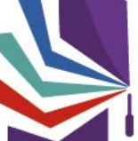

www.collegedoctoral-cvl.fr

Vous recevez un mail de votre gestionnaire d'études doctorale vous invitant à faire votre demande de réinscription en doctorat sur ADUM. Pour rappel, la demande de réinscription est obligatoire et doit être faite entre début juin et le 15 novembre de chaque année universitaire. Vous devez donc vous connecter à votre profil ADUM afin de suivre la procédure décrite dans ce tutoriel. www.adum.fr Si vous avez oublié votre mot de passe vous pouvez cliquer sur « J'ai oublié mon mot de passe **» vous devrez ensuite renseigner** l'adresse mail à laquelle vous avez reçu le mail vous invitant à vous engager dans la démarche de réinscription.

Updated **2026/05**

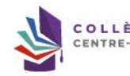

 Mon profil
 > Changer mon mot de passe
 > Activez gratuitement mon abonnement au journal T'heMetaNews
 > RGPD - Portabilité des données : A 22
!!!

Informations administratives

## Procédures

 > Charte du doctorat CDCVL
Signée le Signée par la direction de thèse Signée par la direction du laboratoire
 > Vous devez d'abord vous réinscrire pour pouvoir demander à soutenir t Je souhaite demander ma réinscription en 4º année de doctorat Comité de suivi individuel Cliquez sur « je souhaite demander ma réinscription en xème année de doctorat »
> Membres de votre comité de suivi
 >
 >
> Documents
> Compte-rendu du comité de suivi individuel > Compte rendu du comité de suivi individuel

## Espace Carrière

 > Consulter les offres d'emploi > Mon portfolio
 ▸ Mes compétences
> Mon déroulement de carrière > Mes productions scientifiques

Formations 0 crédits/points obtenus / 50 crédits/points requis
 ▸ Catalogue
> Catalogue Compétences RNCP
> Récapitulatif de participation aux formations > Formations en cours ▸ Déclaration des formations hors catalogue Mes documents
 ▸ Déposer mon CV
 ▸ Ma photo - Actualiser ma photo
> L Convention individuelle de formation
> A Convention individuelle de formation > [ Rapport d'activité / d'avancement Documents administratifs S'Il y a des documents en grisé, ils seront accessibles dès que la procédure sora finaliséa.

Formations
 ▸ Fiche de validation des crédits doctoraux
 » Plan de formation écoles doctorales
> Calendrier des formations > Formations Inscription - Réinscription
> Tutoriel pour la réinscription
 > Convention individuelle de formation
· Rapport d'avancement pour une réinscription (.docx)
Soutenance . Tutoriel pour la soutenance
> Constitution du dossier de soutenance > Demande d'autorisation de soutenance à huis-clos
 · Couverture de thèse (.docx)
 > Quatrième de couverture de thèse (.docx)

## Www.Collegedoctoral-Cvl.Fr

O Validé > En cours 1 à faire 1 Etat civil 0 Coordonnées 0 Rattachement administratif 0 Financement Déroulement doctorat 0 Cotutelle internationale 0 Langues vivantes 0 Gestion affichage
()    Compétences et portfolio 0 Convention individuelle de formation
� Comité de Suivi Individuel 0 Documents à joindre Déroulement de carrière Publications
() 

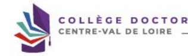

TORAL
Vous  devez mettre à jour et vérifier toutes les informations dans chaque onglet afin de le faire passer en mode « ঙvalidé ».

www.collegedoctoral-cvl.fr

## Etat Civil

 Pour toute demande de modification, nous vous Invitons à prendre contact directement avec votre école doctorale ou établissement.

Nom de naissance Prénom Deuxième prénom Date de naissance Pays de naissance Département de naissance Ville de naissance Nationalité Française Catégorie socio-professionnelle du parent 1 Catégorie socio-professionnelle du parent 2 Genre N° INE ou BEA
Nº carte étudiant

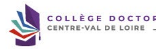

Situation de famille

Si vous avez des modifications sur la partie « Etat civil » merci de contacter votre gestionnaire d'école doctorale.

 Coordonnées Téléphone Portable Adresse électronique principale (identifiant de connexion ADUM)

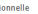

Adresse électronique professionnelle / institutionnelle Site Internet personnel Identifiant ORCID O
Identifiant IdHAL (
Compte LinkedIn Compte Twitter Compte Researchgate 1
- Adresse actuelle Pays Code Postal

Merci de saisir les premiers chiffres du code postal et d'attendre la liste déroulante des villes correspondantes.

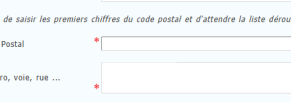

numéro, voie, rue ...
 Téléphone

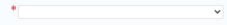

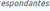

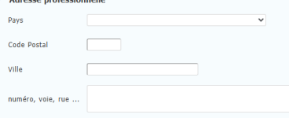

 Téléphone

-  Adresse familiale ou permanente Pays

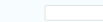

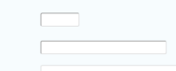

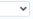

Ville numéro, voie, rue ...

 Téléphone
> SAUVEGARDER

Vous devez vérifier tous les éléments, les modifier si besoin puis sauvegarder avant de passer à l'étape suivante.

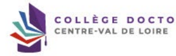

Adresse professionnelle

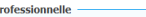

 Code Postal

# Rattachement Administratif

Pour l'année universitaire 2025-2026 vous vous inscrivez en
° année de doctorat Formation initiale Cotutelle internationale de doctorat : - non - oui prévue - oui en cours ☺ oui établie Début du doctorat le soit depuis jours Etablissement d'inscription :
Ecole doctorale : Spécialité du doctorat : Discipline : Domaine Scientifique : Conseil National des Universités :

## Www.Collegedoctoral-Cvl.Fr

 Financement

Merci de vérifier que le financement indiqué couvre bien l'année universitaire pour votre demande de réinscription.

 Nous vous invitons à mettre à jour votre situation financière. Si vous n'avez plus la main pour modifier ou ajouter un financement, merci de contacter votre école doctorale Conditions financières à l'entrée du doctorat Détail situation financière Type de Financement 1 : Origine des fonds 1 :
Origine des fonds :
Période situation du :
Ajouter une nouvelle situation financière

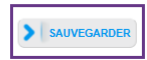

Si vous n'avez pas de nouveau financement cliquez sur « sauvegarder », sinon cliquez sur « Ajouter une nouvelle situation financière ».

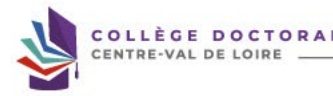

www.collegedoctoral-cvl.fr Détail situation financière Statut/Type de contrat de travail
   
 Employeur
   
Type de Financement 1 He [
Origine des fonds 1 Type de Financement 2 Origine des fonds 2
>
Code SIRET
>
 % (i
>
%
Nom de l'appel à projet Période situation du sic au Ajoutez le nouveau financement s'il y a lieu puis sauvegardez.

LÈGE DOCTORAL

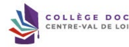

www.collegedoctoral-cvl.fr Déroulement du doctorat Attention ! Ces données seront publiées sur internet : http://www.theses.fr/ Votre thèse implique t-elle un traitement de données à caractère personnel ? *○ Oui *○ Non *○λ déterminer Titre de la thèse en français p Titre de la thèse en anglais | *
Mots clés en français

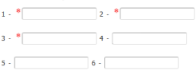

Mots clés en anglais

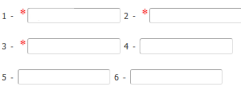

Unité de recherche :
 ENCADREMENT DE LA THÈSE
 - Information : A partir du 3ème caractère saisi, une recherche est effectuée sur l'ensemble des personnes répertoriès dans la base pouvant diriper une thèse. Patientez qu' Si le nom de la personne comporte seulement 3 caractères, faites suivre d'un espace, et saisissez la 1ère lettre du prénom.

Direction de thèse () :
Codirecteur de thèse de cotutelle : !

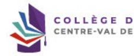

Vérifiez et Modifiez les informations si besoin, en accord avec votre direction de thèse.

 www.collegedoctoral-cvl.fr Mettez à jour les éléments concernant la collaboration industrielle s'il y a lieu et sur l'avancée de la thèse.

Vérifiez et corrigez si besoin les résumés de votre thèse en français et en anglais, ils apparaîtront sur le site theses.fr. Sauvegardez avant de passer à 

 l'étape suivante .

## Www.Collegedoctoral-Cvl.Fr 11

 Cotutelle internationale de doctorat [Établie]
Si vous constatez une erreur, signalez-la au service du doctorat de votre établissement.

Période de validité de la cotutelle : date de début :
- date de fin :
 Pays de la cotutelle Etablissement partenaire de la cotutelle de doctorat : Chef d'établissement (titre + prénom + nom)
 Adresse de la cotutelle Ville Organisation de la cotutelle (descriptif + calendrier des séjours)
 Préciser le calendrier des séjours par année dans les deux pays, conformément à la convention de cotutelle :
 à (établissement) :
Période 2 : du Période 1 : du au au à (établissement) :
Etablissement de la soutenance Propriété intellectuelle et confidentialité …> Recherche pouvant déboucher sur un titre de propriété intellectuelle
--> Recherche nécessitant une attention particulière à la confidentialité
- Service en charge de l'établissement et du suivi de la cotutelle au sein de l'institution partenaire Nom du service Nom de la personne responsable des cotutelles Adresse postale Email Ecole doctorale à l'étranger si existant :
Responsable de l'Ecole Doctorale ou du programme doctoral de l'institution partenaire : qualité + prénom + nom Spécialité du doctorat à l'étranger Unité de recherche à l'étranger
← Convention et avenants de cotutelle Date de la signature de la convention : Date de fin de l'avenant 1 :
Date de fin de l'avenant 2 :
Date de fin de l'avenant 3 :

Si vous êtes en cotutelle, vérifiez les éléments saisis et signalez toute erreur.

Attention, votre convention de cotutelle est établie et signée pour trois années universitaires.

Pour chaque année de réinscription au-delà des trois premières années indiquées dans la convention de cotutelle internationale, vous devez mettre en place un avenant à la convention de cotutelle en contactant :
-  INSA : laura.guillet@insa-clv.fr -  Université d'Orléans : cotutelles@univ-orleans.fr
-  Université de Tours : lucie.primault@univ-tours.fr

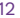

## Langues Vivantes

Renseigner Obligatoirement la langue anglaise Langue Maternelle :
 pla v

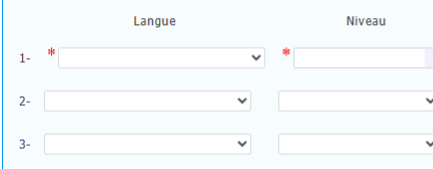

>
>
>
← Autres langues Vérifiez et mettez à jour si besoin.

Pensez à sauvegarder avant de passer à l'étape suivante.

TOEIC obtenu - oui - non - Passé le Date Note
>
TOEFL obtenu - oui - non - Passé le Date note :
>
Autre test obtenu - oui - non

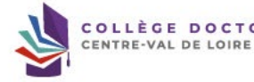

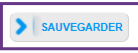

TORAL
www.collegedoctoral-cvl.fr VISUALISER L'APERÇU DE MON CV EN LIGNE
Vous pouvez publier sur internations relatives à votre thése en préparation : ttre de la thèse, direction de thèse, école doctorilo, libillé du diplôme, mots-cléc, récunés. Ces informations sanont publiées (après envegistement de votre inscription ou mise à jour de vos données par votre dabilissement) sur lus sites theses.fr, de votre école doc Le signalement d'une thèse en prépartion et une des bonnes probiques dities à la visibilité de la recheche français. II est donc conseille d'autoriser la poblication des do Je souhaite publier sur internet les informations relatives à ma thèse  ° - non Si vous cochez non, votre thèse ne sera pas visible sur le site theses.fr Le signérent après soutesante de la thèse sur beses fres autrice le l'urrêt envollité du 25 mil 2016 fixant le exdrem de la 1016 fitant le est modatiès condoisont à la déli

## Paramétrage De Mon Profil Sur Internet

 Si vous souhaitez afficher davantage d'informations sur votre profil en ligne (CV, publications, etc.), merci de bien vouloir le spécifer dans la partie ci-desseus en cocha Diplôme permettant l'accès au doctorat  Par défaut

| Informations relatives à la thèse   |  Par défaut   |
|-------------------------------------|---------------|
| Adresse professionnelle             | D             |
| Adresse e-mail principale           | D             |
| Adresse e-mail secondaire           | D             |
| Site Internet personnel             | 0             |
| Situation professionnelle           | 0             |
| Publications                        | 0             |
| Compétences et portfolio            | 0             |
| Photo                               | D             |
| CV                                  | 0             |

Vous pouvez paramétrer les informations visibles sur internet ici.

Nou pouve à l'aut morement mollier volou. Gopendale 1 l'e pet que la mine à juur ne set pour méside eu mieus de l'affinge des résidats des mateurs de recherne. En éliku une l'a base therauf net aliment pou ar brandrit automatique de shimmitore valites coulent vot these dédies dédies los de votes (if)kocopiton de se 3000/1 (sons prisem, tre de l échéant, date de première inscription, mots-clés, résumés).

 Plus d'informations sur le site de l'ABES (Agence Bibliographique de l'Enseignement Supérieur) : https://abes.fr/reseau-theses/outille-at-services-theres/exploar-la-donneer

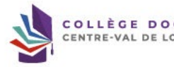

## Compétences Et Portfolio

 Neus vous invitons à tenir à jour cet noglet tout au long de votre dectrent. Votre portfoito comprend vos poblications, les femations suivies ainsi que les compétences que Il sera possible de renseigner ces compétences également après votre (réjinscription. Enseignements réalisés (établissement, nombre d'heure)
s d Etes-vous en recherche d'emploi ? - non ® oui Disponibilité
>
>
Précisions sur la disponibilité Mobilité geographique v Précisions sur la mobilité Projet professionnel, prévisionnel, plusieurs choix possibles)  "
� Enseignement et recherche, enseignement supérieur
□ Recherche en milieu académique
□ Recherche en entreprise, R&D du secteur privé
□ Pilotage de la recherche et de l'innovation, gestion de projets innovants, pilotage de structures innovantes
□ Métiers d'accompagnement et de support à la recherche, à l'innovation et à la valorisation, au développement des Spin Off et Start-up innovantes
□ Expertise, études et conseils dans des organisations, cabinets ou sciétés fournissant des prestations intellectuelles, des experities scientifiques, prospectives ou straté
□ Entreprenariat des domaines innovants
□ Médiation scientifique, communication et journalisme scientifique, édition scientifique, relations internationales
� Autre Compétences techniques (savoir et savoir-faire directement liés à votre domaine d'expertise)

did le Mettez à jour vos données.

Compétences transverses, relationnelles (savoir et savoir et savoir-faire mobilisables dans différentes situations professionnelles)
Pour vous aider à identifier et apprendre à valoriser vos compétences, vous pouvez 1
- Suivre une formation transverse du catalogue - Utiliser un des référentiels existants suivants : Fiche RNCP du doctorat Le profil professionnel des docteurs (ABG, France Universités, Medef)
 Fiche ANDES "Le Doctorat à la Loupe - Compétences développées pendant le doctorat" Fiche Adoc Metis "Les compétences des Docteurs" Illustrer chaque compétence par une formation, une activité réalisée ou une situation professionnelle vécue pendant le doctorat Evenples communicion adale (participátion à 2 conqrès intensetinues, luvide de WT240), réduction, trouvel an équipe, condit colanya, espric critique accedement d'un stajoin Autres activités (diffusion de la culture scientifique, transfert de technologie, rôle de représentant.es des doctorant.es,...)
Préciser le nombre d'heures, le contexte, le public, …
Centres d'intérêts extra professionnels Séjours à l'étranger 1234-

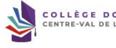

Mettez à jour vos données.

| Expériences professionnelles ou stages   |  Objet de l'expérience professionelle ou du stage   |
|------------------------------------------|-----------------------------------------------------|
| -1-                                      |                                                     |
| Fonction & Mission, statut ou contrat 1  |                                                     |
| Entreprise ou établissement :            |                                                     |
| Ville, Pays :                            |                                                     |
| Durée (en semaines) :                    |                                                     |
| Année :                                  | >                                                   |
| -2-                                      |                                                     |
| Fonction & Mission, statut ou contrat :  |                                                     |
| Entreprise ou établissement :            |                                                     |
| Ville, Pays :                            |                                                     |
| Durée (en semaines) :                    |                                                     |
| Année :                                  | >                                                   |
| -3-                                      |                                                     |
| Fonction & Mission, statut ou contrat :  |                                                     |
| Entreprise ou établissement :            |                                                     |
| Ville, Pays 1                            |                                                     |
| Durée (en semaines) :                    |                                                     |
| Année :                                  | >                                                   |
| -4-                                      |                                                     |
| Fonction & Mission, statut ou contrat :  |                                                     |
| Entreprise ou établissement :            |                                                     |
| Ville, Pays :                            |                                                     |
| Durée (en semaines) :                    |                                                     |
| Année :                                  | v                                                   |
| -5-                                      |                                                     |
| Fonction & Mission, statut ou contrat :  |                                                     |
| Entreprise ou établissement :            |                                                     |
| Ville, Pays :                            |                                                     |
| Durée (en semaines) :                    |                                                     |
| Année :                                  | >                                                   |

Mettez à jour vos données puis sauvegardez.

> | SAUVEGARDER
ORAL

www.collegedoctoral-cvl.fr

## Convention Individuelle De Formation

Avant de compléter ce questlonnaire, vous devez avoir échangé avec la direction de vous permettre de renseigner le contenu des difféentes rubriques. Votre demande pourra être rejetée si cet échange préalable n'a pas eu lieu. Tous les champs de ce formulaire sont obligatoires.

Votre travail de recherche est-Il effectué pour tout ou partie dans un établissement autre qu'un établissement public d'enseignement supérieur et/ou de rechevche ? * ) no * 
Calendrier du projet de recherche Préciser les échéances prévisionnelles des étapes principales du projet doctoral jusqu'à la soutenance
· Durée prévue (3 ans à temps complet, entre 3 et 6 ans à temps partiel) - Calendrier des séjours dans les deux pays si cotutelle internationale (à reporter dans le champ "Organisation de la cotutelle" de l'onglet "Cotutelle" de votre profil) -  Répartition du temps entre laboratoire académique et centre de recherche non académique (cas Clíre ou thèse en partenariat avec entreprise)
-  Etapes et résultats du projet dans le cas d'un contrat de recherche partenariale.

Modalités d'encadrement, de suivi de la formation et d'avancement des recherches de la thèse Préciser :
-  les modalités décidées par l'Ecole doctorale pour le comité individuel de formation
-  les prérequis spécifiques pour la soutenance (publications, heures ou crédits doctoraux …) ou renvoyer à un règlement intérieur ED

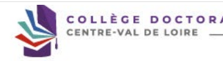

La Convention Individuelle de Formation doit être mise à jour en collaboration avec votre direction de thèse.

 Conditions matérielles de réalisation du projet de recherche, le cas échéant, les conditions de sécurité spécifiques Préciser :
 - Moyens et méthodes disponibles dans l'unité de recherche pour mener à bien le projet
- Préciser si des conditions spécifiques de sécurité sont requises pour ce projet doctoral, en plus de celles évoquées dans le règlement intérieur de l'unité de recherche Modalités d'intégration dans l'unité ou l'équipe de recherche ndquer les méthodos d'intégration de l'unité de recterche, telles que des animatons scentifiques ou dintégration (offices su obligatives), les éventevlies responsibilités co Un calendrier prévsionel du projet de recherche peut être précisé.

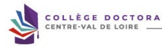

 ▲
Saisissez toutes les informations en collaboration avec votre direction de thèse.

Parcours prévisionnel individuel de formation A compléter : Liste des formations envisagées en lien avec votre projet professionnel : formations transversales, scientifiques et techniques… la collep dectair regropet les diffients doies destriles ropose un exemble de fransfors stemilliouse decliniares, pluiticophients et transvessies lilie, que celles proissame début d'année universitaire et se déroulent en général au second semestre (https://collegedoctoral-cvl.fr).

D'autres formations plus spécifiques peuvent être suivies à l'extérieur et validées par l'école doctorale.

Objectifs de valorisation des travaux de recherche de la thèse : diffusion, publication et confidentallté, droit à la propriété intellectuelle selon le champ du programme de Préciser les objectifs de valorisations : diffusion, communications et canfidentialité, brevels (ave si passible des dobjectivs chiffels), dont à la propriéle intellectualle Saisissez toutes les informations en collaboration avec votre direction de thèse.

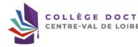

Développement de compétences et perspectives professionelles Expliquer vos objectifs en terme de projet professionnel personnel à l'issue du doctorat.

Préciter en particulier si votre doctorat est réalisé dans le cadre d'un projet personnel s'orientant vers une insaction en milleu socio-économique ou autre.

 Les doctorants réalisant leur doctorat dans le cadre de leur activité poréssionnelle peuvent préciser si l'obtention du doctorat peut déboucher sur une réorientation ou évo

## Ouverture Internationale

Précove le sélenents (43) visitis su périos (selon Vancement du protet des avectore internationale, elle couve mbitle internationale, elle couvernolité minutionale envissgée expérimentale, séjour dans une unité de recherche pour acquérir une compétence particulière utile au projet, conférences et colloques internationaux.

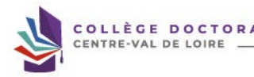

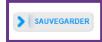

Saisissez toutes les informations en collaboration avec votre direction de thèse et sauvegardez.

Si vous n'avez pas de modification à faire sur votre Convention Individuelle de Formation, vous devez cliquer sur « **JE SOUMETS LA** CONVENTION INDIVIDUELLE DE FORMATION A MON DIRECTEUR DE THESE POUR CORRECTION ET AVIS ».

Cliquez sur « OK **» si vous avez bien saisi les informations de votre CIF avec votre** 

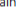

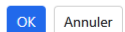 direction de thèse sinon cliquez sur « Annuler »
Vous pouvez visualiser, sur votre profil ADUM, que votre CIF est en cours de révision par votre direction de thèse.

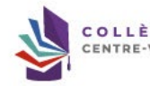

www.collegedoctoral-cvl.fr 22

--------- Forwarded message ---------
De : Doctorat <noreply@adum.fr>
Date: Subject: Convention Individuelle de Formation - Document disponible To:
Cc:
Bonjour, La direction de votre thèse a validé la convention individuelle de formation.

Vous pouvez dès à présent la visualiser à partir de votre espace personnel.

Ceci est un e-mail automatique, merci de ne pas y répondre.

---
Il se peut que vous receviez ce message à des heures matinales, tardives ou le week-end.

Il ne nécessite, en aucune façon, une réponse de votre part en dehors des heures ouvrées.

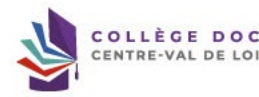

S'il n'y a pas de correction à faire sur votre CIF, vous recevrez ce mail !

www.collegedoctoral-cvl.fr

Convention individuelle de formation Votre direction de thèse l a donné son accord pour l'édition de la CIF le Retournez dans l'onglet « Convention Individuelle de Formation »
Vous pouvez consulter le document Convention individuelle de Format Pour imprimer ou enregister en PDF, nous vous mytons » farre cent » sur la page du document ou à utiliser la fonction "Imprimer" de votre navigateur.

Puis à le déposer ici :
Déposer votre Convention Individuelle de Formation en PDF
Déposer votre Convention Individuelle de Formation au format PDF
(Glisser un document sur cette zone, ou cliquer le bouton en bas à droite)
 Il s'agit de la version définitive. Vous ne pourrez plus modifier le document une fois celui-ci enregistrê Choisir un fichie Cliquez sur le lien de la CIF afin de la télécharger et de l'enregistrer sur votre PC.

Il vous est fortement conseillé de la relire avant de la déposer sur ADUM. En cas de problème contactez votre gestionnaire d'école doctorale.

Vous allez ensuite pouvoir déposer le PDF de votre CIF sur ADUM en cliquant sur choisir un fichier.

## Convention Individuelle De Formation

Votre direction de thèse i donné son accord pour l'édition de la CIF le Vous pouvez consulter le document : Convention individuelle de Formation Pour imprimer ou ennegistrer en PDF, nous vous invitons à faire "ctri+P" sur la page du document ou à utiliser la fonction "Imprimer" de votre navigateur.

Puis à le déposer ici :
Déposer votre Convention Individuelle de Formation en PDF
votre Convention Individuelle de Formation au format PDF
sur cette zone, ou cliquer le bouton Choisir un fichie

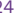

Lorsque votre CIF est complétement téléchargée, vous pouvez sauvegarder !

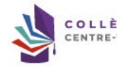

 Comité de Suivi Individuel Arété du 25 mai 2016 fixant le cadre national de la formation et les modulités conduisant à la délivrance du diplâme national de doctorat Article 11
 « […] [ Hecription en recouvrille au déber de chazus anvieuslaire par le chd d'écludissement, se proposition du diverseur de l'éclu decemaile, pels sais do diversue de stai Article 13
 « Un contré de suivi individuel du dectorant velle au bon déroviement du cusus en s'appuyant sur la charte du dectorat et la cornention de formuton.

[ ... ] Il se réunit obligatoirement avant l'inscrip Les entretiens sont organisés sous la forme de trois étapes distinctes i présentation de l'avail

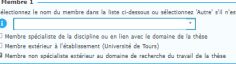

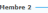

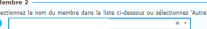

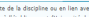

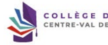

esien avec le doctorant sans la direction de thèse, entretion avec la direction de thése sans le doctorient.

t particulierement viollant à repérer toute forme de confit, de cliccrimination, de farcelement moral ou persel ou d'acissement se ng de son doctorat. Le combré de suivi individuel du doctorant comprend au mains un membre spécialiste de la discipline eu en lien avec le dansales uur au domaine de recherche du travail de la thée. Les membres de ce comité ne participent pas à la direction du navail du docorane. […] »
Dans la partie comité de suivi individuel, au minimum deux membres doivent être déclarés.

Merci de contacter votre gestionnaire d'école doctorale pour compléter cette partie.

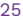

www.collegedoctoral-cvl.fr

## Espace De Dépôt De Fichiers Ma Photo D'Identité

La photo que vous déposez s'affichera sur internet dans le site web de votre école doctorale ou de votre établissement si vous avez choisi de l'afficher. Elle sera aussi susceptible de figurer sur des documents administratifs ou d'être utilisée pour votre carte d'étudiant. Les recruteurs viennent également chercher des profils pour leurs futurs collaborateurs. Votre photo doit être au format JPG ou PNG et faire au minimum 200px de haut et de large. Visualiser le fichier déjà déposé >>
Choisir un fichier Mon CV
 (Glisser un document sur cette zone, ou cliquer le bouton en bas à droite)
Choisir un fichier Rapport d'activité / avancement de Vous devez déposer ici votre document au format PDF
Dépôt obligatoire pour finaliser votre procédure de réinscription en thèse

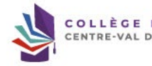

Choisir un fichier

Téléchargez obligatoirement votre CV à jour.

Téléchargez votre rapport d'avancement au format PDF. Attention ! Vous devez impérativement utiliser le modèle qui se trouve sur votre espace personnel dans la partie Documents administratifs / Inscription - réinscription.  Voir slide suivante ! Vous pouvez ensuite sauvegarder.

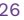

 www.collegedoctoral-cvl.fr

10 crédits/points obtenus / 50 crédits/points requis
> Catalogue
> Catalogue Compétences RNCP
> Récapitulatif de participation aux formations
> Formations en cours > Déclaration des formations hors catalogue > Dépôt attestation de suivi - Formation en distanciel Mes documents
> Déposer mon CV
> Ma photo - Actualiser ma photo Documents administratifs S'il y a des documents en grisé, ils seront accessibles dès que la procédure sera finalisée.

Formations

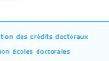

 » Fiche de validation des crédits doctoraux » Plan de formation écoles doctorales
. Calendrier des formations
) Formations Inscription - Réinscription
> Tutoriel pour la réinscription

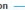

» Rapport d'avancement pour une réinscription (.docx)
Soutenance
. Tutoriel pour la soutenance > Constitution du dossier de soutenance
▸ Demande d'autorisation de soutenance à huis-clos
. Couverture de thèse (.docx)
- Quatrième de couverture de thèse (.docx)

Allez sur votre espace personnel après avoir entamé votre démarche de réinscription puis téléchargez votre rapport d'avancement pour une réinscription en Word.

Complétez votre rapport et enregistrez-le au format PDF dans la partie dédiée sur ADUM. Voir slide précédente !

Déroulement de carrière Situation professionnelle   *
Date de début Ajoutez les éléments liés à votre carrière puis şauvegardez.

 >
> ETAPE SUIVANTE > SAUVEGARDER

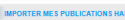

Ajouter une publication Type de la publication
>
Titre de la publication

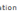

Libellé de la revue Importez et/ou ajoutez vos publications.

Si vous n'avez pas de publication en cours cliquez sur « pas de publication en cours ».

Dans tous les cas pensez à  sauvegarder.

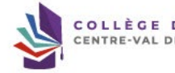

Etat de la publication
(Veuillez sélectionner une valeur)  ▼
Volumes et pages

>

 Auteurs

Brevet
 (Veuillez sélectionner une valeur)  V

URL de la publication
> PAS DE PUBLICATION EN COURS > SAUVEGARDER

 www.collegedoctoral-cvl.fr

## Je Finalise La Procédure

Vous pourrez finaliser votre demande de réinscription dès lors que le compte-rendu du comité de suivi individuel sera déposé. Pour tout renseignement contacter votre école doctorale.

Vous ne pourrez finaliser votre demande de réinscription que lorsque le compte-rendu de votre CSI sera déposé sur ADUM ainsi que votre ClF. Vous recevrez un mail lorsque votre compte-rendu de CSI sera déposé sur ADUM.

 De : Doctorat <noreply@adum.fr>
Date:
Subject: [CR comité de suivi individuel]
To: '
Bonjour, Le compte rendu du suivi individuel de thèse pour l'année universitaire de vient d'être déposé dans l'Adum.

Vous pouvez le consulter dans votre espace personnel ou en cliquant sur ce lien .

 dont la thèse est dirigée par

Bien cordialement,
---
Ceci est un mail automatique Merci de ne pas y répondre Il se peut que vous receviez ce message à des heures matinales, tardives ou le week-end.

 Il ne nécessite, en aucune façon, une réponse de votre part en dehors des heures ouvrées.

www.collegedoctoral-cvl.fr Pour finaliser votre procédure de réinscription vous devez : - Avoir mis à jour toutes les informations en vous assurant que l'onglet devient vert - Avoir déposé votre Convention Individuelle de Formation sur ADUM après validation de votre direction de thèse - Avoir déposé les documents à joindre (Photo, CV, Rapport d'activité/avancement) Vous devez cliquer sur« Je finalise la procédure» puis vous devez cocher les cases après avoir lu leur contenu puis cliquez sur « TRANSMISSION DES DONNEES POUR INSTRUCTION DE VOTRE DOSSIER » Un mail sera envoyé à votre direction de thèse pour validation de votre dossier sur son profil ADUM. Votre dossier devra ensuite être validé par votre codirection de thèse, le cas échéant, puis par votre direction de laboratoire, votre direction d'école doctorale puis par la personne représentant votre établissement. Pour rappel, votre dossier doit être finalisé et validé par tous les protagonistes au plus tard le 15 novembre de l'année universitaire en cours.

Vous pouvez suivre l'instruction de votre dossier en vous connectant sur votre espace personnel ADUM. Pour rappel votre dossier doit être validé par votre direction de thèse, votre codirection de thèse le cas échéant, votre direction de laboratoire, votre direction d'école doctorale ou le bureau de l'école doctorale selon votre année de demande de réinscription en thèse, puis le représentant du Chef de votre établissement. Si votre dossier doit être étudié par le bureau de l'école doctorale, le délai de traitement de votre dossier sera plus long. Vous recevrez un mail lorsque vous aurez été autorisé à vous réinscrire avec la procédure à 

 suivre afin de régler la CVEC ainsi que vos droits d'inscription et d'obtenir votre certificat de scolarité.

À l'université de Tours : 

Elysa RAGOT  + 33 2 47 36 66 75 ED EMSTU - MIPTIS - **SSBCV**
@ elysa.ragot@univ-tours.fr Christèle GAUDRON  + 33 2 47 36 64 50 ED HL - **SSTED**
@ christele.gaudron@univ-tours.fr Université de Tours Service de la Recherche et des Etudes Doctorales Bâtiment A - 1er étage 60 rue du Plat d'Etain - **BP 12050**
37020 TOURS cedex 1 - **France**
 **https://www.univ-tours.fr**

Vos contacts

À l'INSA Centre Val de Loire :
Laura GUILLET  + 33 2 48 48 07 61 ED EMSTU - MIPTIS
@ laura.guillet@insa-cvl.fr
 **INSA Centre Val de Loire**
Direction de la Recherche et de la Valorisation Etudes Doctorales Campus de Bourges 88 Bd. Lahitolle Technopôle Lahitolle CS 60013 18022 BOUGES Cedex - France Campus de Blois 3 rue de la Chocolaterie CS 23410 41034 BLOIS Cedex - France
 **https://www.insa-centrevaldeloire.fr**
À l'université d'Orléans : 

Marion ALLER  **+ 33 2 38 49 49 85**
 + 33 2 38 49 48 25 ED EMSTU @ edemstu@univ-orleans.fr ED MIPTIS @ edmiptis@univ-orleans.fr ED SSBCV @ edssbcv@univ-orleans.fr Kathia FUSTER  + 33 2 38 71 73 61 ED SSTED @ edssted@univ-orleans.fr ED HL @ edhl@univ-orleans.fr
 **Direction de la Recherche et Partenariats**
Pôle Recherche et Etudes Doctorales Bâtiment IRD
5 rue Carbone - BP 6749 45067 ORLEANS Cedex 2 - **France**
 **https://www.univ-orleans.fr/fr**

## Www.Collegedoctoral-Cvl.Fr 32
