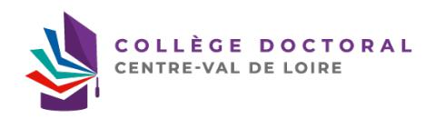
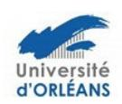

## CONSTITUTION DU DOSSIER ADMINISTRATIF DE SOUTENANCE

⇒ Le doctorant déclare sa soutenance sur ADUM, au plus tard 8 semaines avant la date de soutenance en prenant en compte les périodes de fermeture de l'établissement.

(Conformément à la procédure relative à la soutenance de thèse des Ecoles Doctorales Centre-Val de Loire). Tout retard dans le dépôt du dossier peut entraîner un report de la soutenance.

- Le contrat de diffusion électronique des thèses autorisant l'établissement d'inscription à diffuser la thèse électronique dûment complété et signé
- L'attestation de dépôt « *Certificat de conformité avec la version de soutenance* » dûment complétée et signée.
- Page de couverture et 4ème de couverture signées du Directeur de thèse.
- Pour les doctorants de l'ED SSBCV : joindre l'article en 1er auteur dans une revue à comité de lecture ou un brevet.
- Pour les doctorants de l'ED EMSTU : joindre l'article en 1er auteur soumis à une revue à comité de lecture ou un brevet ainsi qu'un justificatif de participation à une conférence internationale.
- Pour les doctorants de l'ED MIPTIS : joindre une production scientifique importante (revue, conférence internationale ou brevet soumis)
- Récapitulatif de participation aux formations.
- Portfolio.
- Si la thèse présente un caractère confidentiel : le « formulaire de demande de dérogation au caractère public de la soutenance » doit être dûment complété et signé de toutes les parties (document disponible auprès de votre gestionnaire d'école doctorale et à faire valider 3 mois avant la soutenance).
- Si le rapporteur d'un établissement étranger n'est pas titulaire de l'HDR, joindre le CV.

## □ Important :

- Tous les documents sont disponibles sur votre profil ADUM et sont à déposer dans l'espade dédié sur ADUM.
- Tout dossier incomplet sera rejeté

## Avant de valider vos données, assurez-vous que les éléments soient conformes :

- Les informations relatives à l'état civil, l'intitulé du diplôme, le titre de la thèse, ainsi que les qualités et titres exacts des personnes proposées (informations qui apparaitront sur le diplôme).
- Dans le cadre d'une cotutelle, se conformer aux exigences des deux établissements stipulés dans la convention,
  y compris lorsque la soutenance a lieu dans l'établissement partenaire.
  - o Respecter la réglementation de la composition du jury disponible sur le site du collège doctoral intitulé « Procédure de soutenance » : https://collegedoctoral-cvl.fr/as/ed/calendrier.pl?site=CDCVL.

Mis à jour et validé en collège doctoral du 23/01/2026

