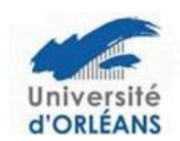

## ATTESTATION DE SEJOUR DE RECHERCHE \* Effectué(s) dans un pays européen

| ı                                                                                                                                                                                              | LABEL « DOCTORAT EUROPEEN »                                               |                         |  |
|------------------------------------------------------------------------------------------------------------------------------------------------------------------------------------------------|---------------------------------------------------------------------------|-------------------------|--|
| Je soussigné(e) M, Mme directeur du laboratoire d'accueil dans l'établissement :  Pays :  Certifie que M., Mme :  Doctorant(e) de :  L'université d'Orléans  L'université de Tours  L'INSA CVL |                                                                           |                         |  |
|                                                                                                                                                                                                | A effectué dans mon laboratoire le(s) séjour(s) de recherche suivant(s) : |                         |  |
|                                                                                                                                                                                                | Date de début de séjour :                                                 | Date de fin de séjour : |  |
|                                                                                                                                                                                                |                                                                           |                         |  |
|                                                                                                                                                                                                |                                                                           |                         |  |
| Soit: mois                                                                                                                                                                                     |                                                                           |                         |  |
|                                                                                                                                                                                                | Résumé succinct de l'objet /objectif du (des) séjour(s) :                 |                         |  |
|                                                                                                                                                                                                |                                                                           |                         |  |
|                                                                                                                                                                                                |                                                                           |                         |  |
|                                                                                                                                                                                                |                                                                           |                         |  |
|                                                                                                                                                                                                |                                                                           |                         |  |
|                                                                                                                                                                                                | Date et signature du directeur du laboratoire d'accueil :                 |                         |  |
|                                                                                                                                                                                                |                                                                           |                         |  |
|                                                                                                                                                                                                |                                                                           |                         |  |
|                                                                                                                                                                                                | Visa du directeur de thèse :                                              |                         |  |
|                                                                                                                                                                                                |                                                                           |                         |  |
|                                                                                                                                                                                                | vsa du directeur de l'Ecole Doctorale :                                   |                         |  |
|                                                                                                                                                                                                |                                                                           |                         |  |

\* Remplir une attestation par laboratoire d'accueil. Le séjour ou les séjours dans un (ou plusieurs) pays membre de la Communauté Européenne doit être d'au moins de 3 mois au total.