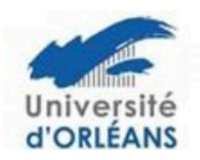
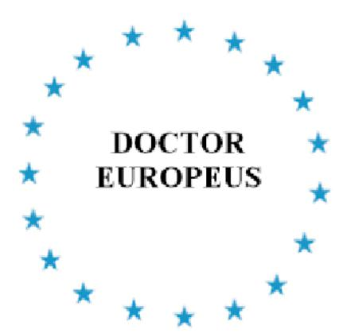

## DOCTORAT EUROPEEN

## Si vous souhaitez obtenir le label européen, voici les quatre conditions à remplir :

- L'autorisation de soutenance accordée au vu de rapports rédigés par au moins deux professeurs appartenant à deux établissements d'enseignement supérieur de deux états membre de l'Union Européenne autres que celui dans lequel le doctorat sera soutenu.
- 2. Un membre au moins du jury doit appartenir à un établissement d'enseignement supérieur d'un Etat membre de l'Union Européenne autre que celui dans lequel le doctorat est soutenu.
- 3. Une partie de la soutenance doit être effectuée dans une langue de l'Union Européenne autre que la (ou les) langue(s) nationale(s) du pays où est soutenu le doctorat.
- 4. Ce doctorat devra avoir été préparé, en partie, lors d'un séjour d'au moins un trimestre dans un autre pays membre de l'Union Européenne.

La délivrance du label revêtira la forme d'une attestation ajoutée au diplôme français.

Ce dispositif est distinct de celui de la cotutelle, auquel il peut se superposer. Le ou les établissements dans lequel est effectué le stage doit être différent de l'établissement de cotutelle.

Ce label n'apparaît pas sur le diplôme de docteur, mais il constitue un élément fort pour valoriser la formation doctorale à l'international.

Assurez-vous d'être en mesure de remplir ces quatre conditions, dans un délai suffisant, avant votre date de soutenance et d'en informer votre gestionnaire des Ecoles Doctorales.

