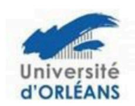

# Procédure relative à la soutenance de thèse des Ecoles Doctorales Centre Val de Loire

Arrêté du 25 mai 2016 fixant le cadre national de la formation et les modalités conduisant à la délivrance du diplôme national de doctorat (articles 18 & 19)

## Composition de jury (4 à 8 membres choisis en raison de leurs compétences scientifiques) :

- la moitié au moins doit être composée de professeurs des universités ou fonctionnaires assimilés\*
- la moitié au moins doit être composée de personnalités extérieures à l'unité de recherche et à l'école doctorale.
- la moitié au moins doit être composée de personnalités extérieures à l'établissement délivrant le doctorat.
- la moitié au moins ne doit pas être impliquée dans le travail de thèse.
- il doit comporter au moins un enseignant-chercheur HDR ou fonctionnaire assimilé de l'établissement délivrant le doctorat.
- dans la mesure du possible, il doit tendre vers une représentation équilibrée de femmes et d'hommes.
- les éventuels membres invités (en nombre très limité) ne font pas partie officiellement du jury.

<u>Un seul</u> enseignant-chercheur ou fonctionnaire assimilé émérite peut participer au jury, même en tant que rapporteur, mais il ne peut pas présider un jury. Les jurys des thèses en cotutelle devront tendre vers ces consignes mais seront examinés au cas par cas.

# Désignation du jury:

Le jury de soutenance est désigné par le président/directeur de l'établissement délivrant le doctorat après avis du directeur de l'école doctorale et sur proposition du directeur de thèse.

#### Désignation des rapporteurs :

Les deux rapporteurs doivent être HDR. Ils sont extérieurs à l'école doctorale du doctorant et à son établissement d'inscription. Ils peuvent appartenir à des établissements d'enseignement supérieur ou de recherche étrangers ou à d'autres organismes étrangers. Les rapporteurs n'ont pas d'implication dans le travail du doctorant.

## Autorisation de soutenance :

Elle relève de la responsabilité du président/directeur de l'établissement au vu des rapports, et après avis de la direction de l'école doctorale

## Présidence et rapport de soutenance :

Les membres du jury désignent parmi eux un président et le cas échéant un rapporteur de soutenance. Le président doit être professeur ou assimilé\*. Il sera indiqué dans le rapport de soutenance que le président du jury a signé le procès-verbal de la soutenance à la place du ou des membre(s) du jury qui a (ont) participé(s) par visioconférence.

## Déroulement de la soutenance :

A titre exceptionnel, les membres du jury peuvent être autorisés à participer à la soutenance au moyen de la visioconférence, par le président ou du directeur de l'établissement après avis du directeur de l'école doctorale et sur proposition argumentée du directeur de thèse. En règle générale, un tiers seulement du jury peut siéger à distance, à l'exclusion du président du jury et d'au moins l'un des rapporteurs. De même, le directeur de thèse ainsi que le candidat doivent être physiquement présents. Un cas de force majeure peut aussi justifier que tout membre du jury puisse participer à la soutenance par des moyens de visioconférence. Il est indiqué dans le rapport de soutenance que le président du jury a signé le PV de soutenance à la place du ou des membre(s) du jury ayant siégé par visioconférence.

#### **Délibération** (discussion, décision, rapport, signatures):

Tous les membres du jury – incluant le ou les directeur(s) de thèse – participent à la discussion. Les membres invités ne faisant pas partie du jury, ils ne participent pas à la délibération. Le ou les directeur(s) de thèse ne participe(nt) pas à la phase de décision (évaluation de niveau, décision finale d'attribution ou non du doctorat). En revanche, il(s) cosigne(nt) le rapport de soutenance. Pour conférer le grade de docteur, le jury porte un jugement sur les travaux du candidat, leur caractère novateur, sur son aptitude à les situer dans leur contexte scientifique et sur ses qualités générales d'exposition. Lorsque les travaux de recherche résultent d'une contribution collective, la part personnelle de chaque candidat est appréciée par un mémoire qu'il présente individuellement au jury.

#### Mention:

Le diplôme de doctorat ne comporte plus de mention transcrite sur le procès-verbal. Cependant, toute appréciation de niveau équivalent à une mention « honorable » ou « très honorable » peut figurer dans la conclusion du rapport de soutenance.

\*Liste des corps de fonctionnaires assimilés aux Professeurs des Universités (Arrêté du 15 juin 1992 modifié – article 1er)

- les professeurs et les sous-directeurs de laboratoire du Collège de France
- les professeurs du Muséum National d'Histoire Naturelle
- les professeurs et les sous-directeurs de laboratoire du Conservatoire National des Arts et Métiers
- les directeurs d'études de l'Ecole des Hautes Etudes en Sciences Sociales
- les directeurs de l'Ecole Pratique des Hautes Etudes et de l'Ecole Nationale des Chartes
- les professeurs de l'Institut National des Langues et Civilisations Orientales
- les sous-directeurs d'Ecoles Normales Supérieures
- les astronomes et physiciens régis par le décret n° 86-434 du 12 mars 1986 modifié portant statut du corps des astronomies et physiciens et du corps des astronomes adjoints et physiciens adjoints
- les astronomes titulaires et les astronomes adjoints régis par le décret du 31 juillet 1936 relatif au statut des observatoires astronomiques
- les physiciens titulaires et les physiciens adjoints régis par le décret du 25 septembre 1936 relatif au statut des instituts et observatoires de physique du globe
- les professeurs de 1ère et de 2ème catégorie de l'Ecole Centrale des Arts et Manufactures
- les directeurs de recherche relevant du décret n° 83.1260 du 30 décembre 1983 fixant les dispositions statutaires communes aux corps des fonctionnaires des établissements publics scientifiques et technologiques (Centre National de la Recherche Scientifique, Institut national de la Recherche Agronomique, Institut National de la Santé et de la Recherche Médicale, Institut de Recherche pour le Développement, ...).

Version la plus récente de la procédure, approuvée par le Collège doctoral lors de la séance du 10 juin 2025.