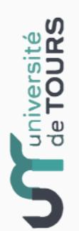

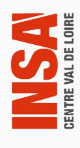

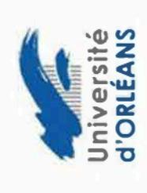

## **DECLARATION DE LA SOUTENANCE SUR ADUM**

## Tutoriel à l'attention des doctorants

#### Préambule

Les soutenances sont gérées depuis l'application ADUM.

Avant de déclarer votre soutenance de thèse sur ADUM, la proposition de rapporteurs, la composition du jury, ainsi que la date de soutenance doivent faire l'objet d'une concertation entre votre direction de thèse et vous-même.

Vous renseignerez ensuite, depuis votre espace personnel dans ADUM, les données correspondantes.

#### Attention

Les données que vous saisissez dans ADUM doivent être vérifiées minutieusement (orthographe des noms, grades des membres de votre jury, titre de thèse, résumés et mots clés en français et en anglais, etc.) car elles seront ensuite imprimées sur votre diplôme et visibles sur le site theses.fr.

## Informations nécessaires pour renseigner le formulaire :

- Titre de la thèse et mots clefs (français/anglais) identique au manuscrit.
- Résumé de la thèse (français/anglais) identique au manuscrit
- Date de la soutenance, adresse du lieu de soutenance, salle, horaire,
- 🗸 Confidentialité de la thèse <u>(vous rapprocher de votre gestionnaire d'Ecole Doctorale),</u>
- Rapporteurs / membres du jury / invités :
- prénom, nom, grade, HDR ou non, établissement de rattachement, coordonnées complètes, demande de visioconférence.
- Dépôt du manuscrit avant soutenance :
- Version de diffusion / Version d'archivage si différente.

### 1. Déclaration de la soutenance

Au plus tard DEUX MOIS avant la date prévisionnelle de votre soutenance, vous devez vous connecter sur votre espace personnel (<u>www.adum.fr</u>) et lancer la procédure en cliquant sur **« Je souhaite effectuer ma demande de** 

Attention, le mois d'août ainsi que les 2 semaines de congés de Noël ne rentrent pas dans le délai des 2 mois Demande d'autorisation de soutenance à huis-clos Les documents et informations nécessaires pour effectuer · Rapport d'avancement pour une réinscription Quatrième de couverture de thèse (.docx) Constitution du dossier de soutenance les démarches d'inscription / réinscription sont ▶ Convention individuelle de formation Récapitulatif de participation aux formations Documents administratifs ( Inscription - Réinscription ▶ Couverture de thèse (.docx) ▶ Tutoriel pour la soutenance > Formations hors-catalogue téléchargeables ci-dessous. dérogatoire (.docx) > Formations en cours Soutenance Formations > Catalogue Votre profil est enregistré en 3eme année de these pour 2020-2021 Je souhaite effectuer ma demande de soutenance Membres de votre comité de suivi de thèse : Le Doctorat est mené à temps partiel MA PHOTO - Déposer ma photo R référent Mes productions scientifiques Consulter les offres d'emploi Changer mon mot de passe Ma situation professionnelle Cv Déposer mon CV Affichage sur le web Espace carriere Mon employabilité Procédures Mon portfolio Mon profil soutenance »: O 

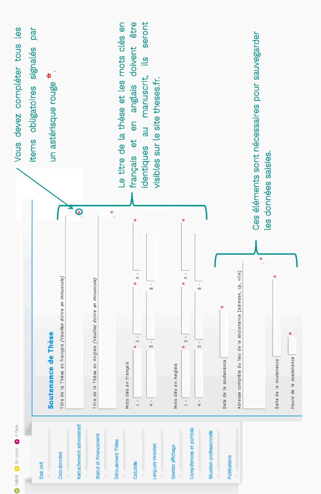

## Le label Européen est-il demandé? O oui 🕲 non

| Le label Européen est-il demandé ? ® oui 🔘 non | uropéen        | Prendre contact avec votre établissement afin de vous assurer que votre demande est recevable. | - langue N°1 de soutenance : | - langue N°2 de soutenance : ▼ | - Descriptif du séjour d'au moins trois mois dans un centre de recherche d'un pays européen autre que la France : | * \ | * Date de fir             |
|------------------------------------------------|----------------|------------------------------------------------------------------------------------------------|------------------------------|--------------------------------|-------------------------------------------------------------------------------------------------------------------|-----|---------------------------|
| Le label Européen                              | Label Européen | Prendre contact                                                                                | - langue Nº1 de s            | - langue N°2 de s              | - Descriptif du séj                                                                                               |     | Date de début du séjour : |

## ► Voir conditions d'obtention du Label Européen :

- sur le site du collège doctoral : https://collegedoctoral-cvl.fr/as/ed/page.pl?site=CDCVL&page=label\_euro
- ou auprès de votre gestionnaire d'école doctorale

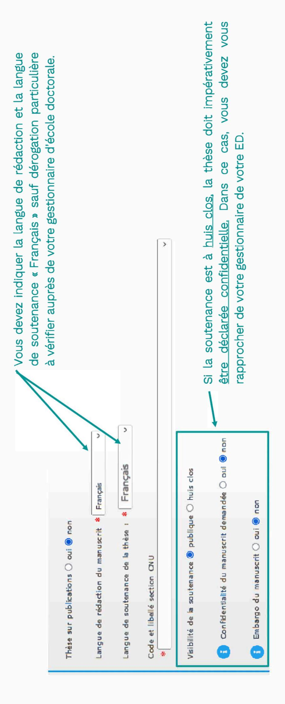

Attention, la vérification des rapporteurs au vu de l'arrêté n'est qu'à têre indicatif, seuls l'ED et l'établissement ont l'expertise pour vérifier les éléments saiss et les valider

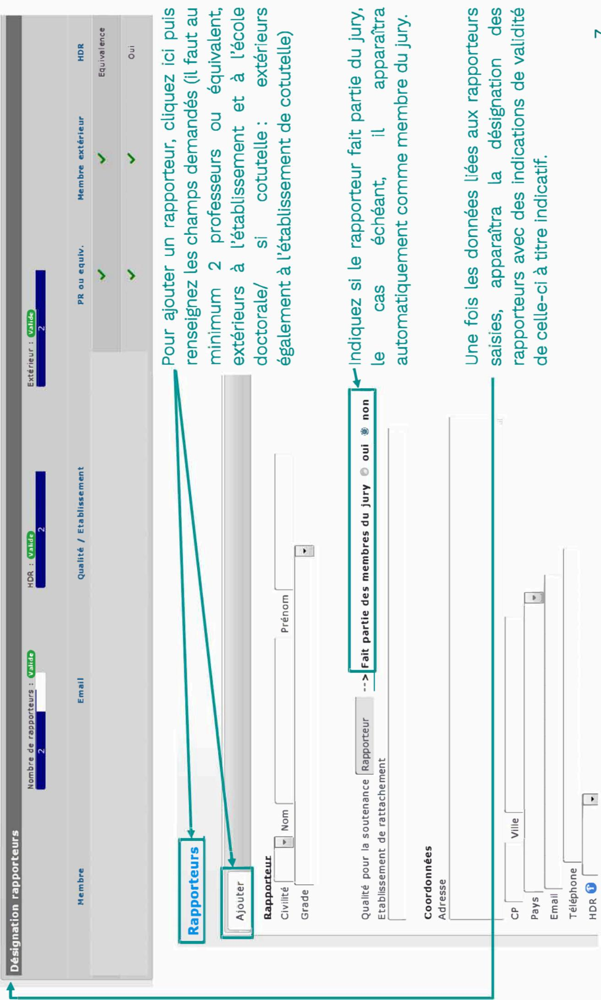

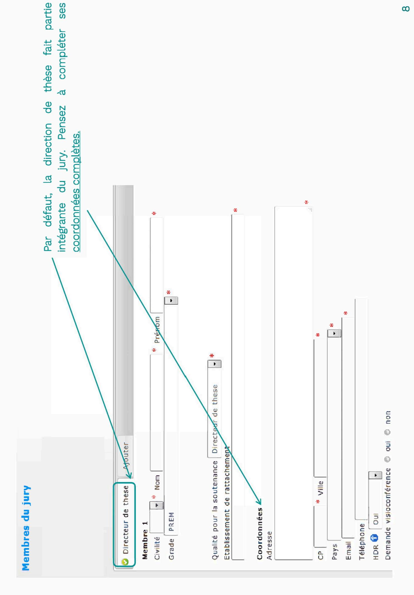

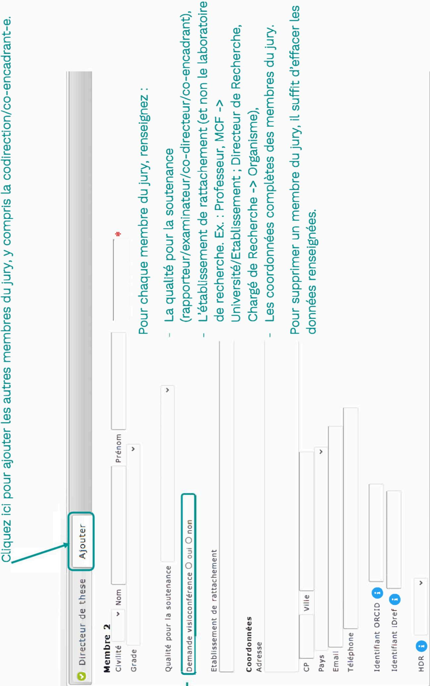

 La participation d'un membre du jury en visioconférence doit rester exceptionnelle et soumise à l'accord du chef d'établissement. Contactez votre gestionnaire d'école doctorale en cas de besoin.

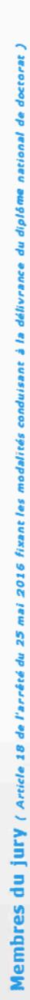

Attention, la vérification des membres du jury au vu de l'arrêté n'est qu'à titre indicată, seuls l'ED et l'établissement ont l'expertite pour vérifier les éléments saisis et les valider.

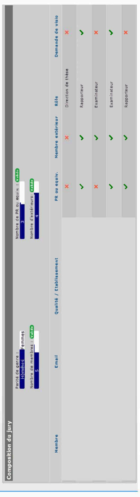

Une fois que vous avez saisi toutes les informations liées à votre jury, vous pouvez visualiser la conformité de la composition de votre jury à titre indicatif.

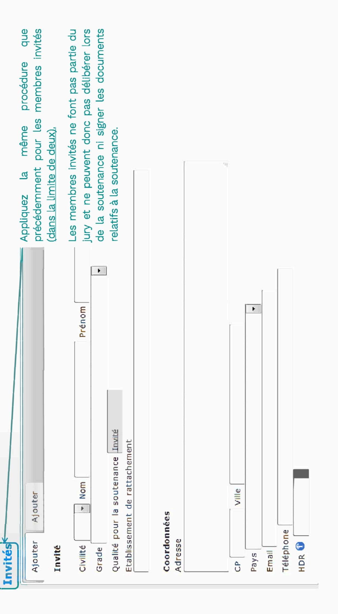

#### Résumé de la thèse en français

Le nombre de caractères ne doit pas être supérieur à 4000.

Les résumés français et anglais doivent tenir tous deux en 4ème de couverture de votre manuscrit, et les résumés déposés ici doivent être identiques à ceux du manuscrit.

Les résumés de la thèse en français et en anglais doivent être obligatoirement complétés et identiques au manuscrit, ils seront visibles sur le site theses.fr.

#### Résumé de la thèse en anglais

Le nombre de caractères ne doit pas être supérieur à 4000.

Les résumés français et anglais doivent tenir tous deux en 4ème de couverture de votre manuscrit, et les résumés déposés ici doivent être identiques à ceux du manuscrit.

## Résumé de thèse vulgarisé pour le grand public en français

1000 caractères maximum !

Résumé de thèse vulgarisé pour le grand public en anglais

1000 caractères maximum

## Résumé de thèse vulgarisé pour le grand public en français

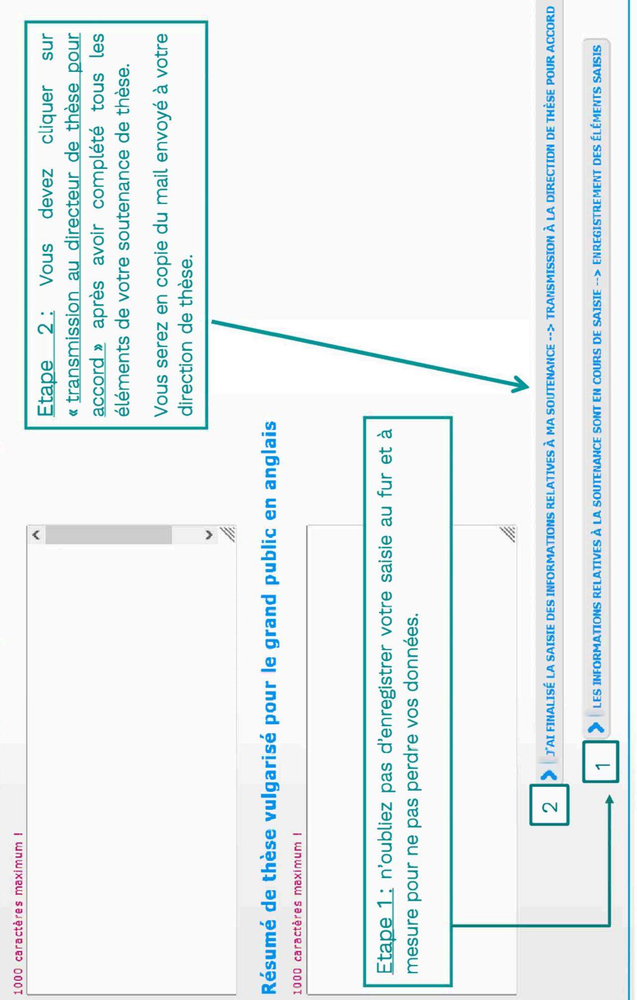

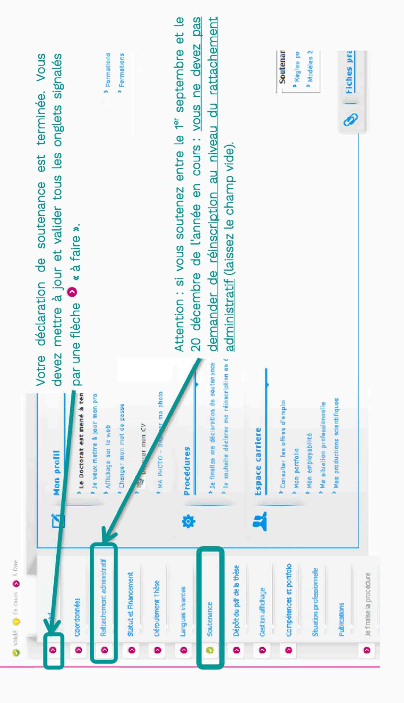

<u>semaines de congés de Noël ne rentrent pas dans ce délai !)</u> vous devez déposer votre thèse au format Au plus tard 7 semaines avant la date de votre soutenance <u>(attention, le mois d'août et les</u>

PDF sur ADUM puis vous devrez déposer les documents à joindre à votre dossier de soutenance en <u>un</u>

<u>seul fichier PDF. Le dépôt du manuscrit conditionne l'envoie des demandes de pré-rapports aux </u>

apporteurs.

### N'oubliez pas de sauvegarder

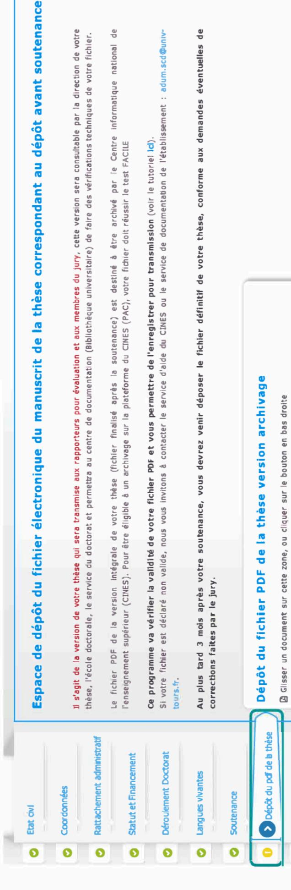

🖈 Version de diffusion pour la

Est-ce que la version d'archivage est aussi la version de diffusion ? 🌀 oui 🔾 non 🦙

Compétences et portfolo

O

Gestion affichage

0

Documents à joindre

O

- Souhaitez-vous que l'établissement diffuse votre thèse via le réseau Internet ? 💿 oui 🔾 non

Périmètre de diffusion de la thèse :

Déroulement de carrière

**Publications** 

En sauvegardant la page, VOUS DÉCLAREZ AVOIR DEPOSÉ la version électronique de votre mémoire de thèse.

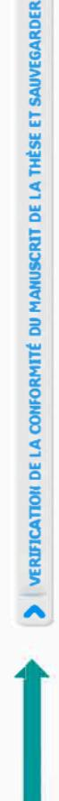

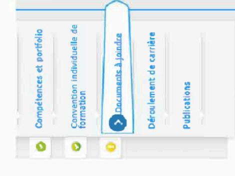

Établissement - Pièces justificatives nécessaires à votre demande de soutenance

### Tout dossier incomplet sera rejeté

- Le contrat de diffusion électronique des thèses autorisant l'établissement d'inscription à diffuser la thèse électronique dûment complété et signé. Disponible sur votre espace ADUM une fois la thèse déposée.
  - L'attestation de dépôt « Certificat de conformité avec la version de soutenance » dûment complétée et signée. Disponible sur votre espace ADUM une fois la thèse déposée.
- Page de couverture et 4ème de couverture signées du Directeur de thèse. *Modèles à respecter impérativement* disponibles sur votre espace ADUM.
- Pour les doctorants des ED SSBCV et EMSTU : joindre l'article en 1° auteur dans une revue à comité de lecture ou un
- Pour les doctorants de MIPTIS : joindre une production scientifique importante (revue, conférence internationale ou brevet sournis)
- Récapitulatif de participation aux formations. Disponible sur votre espace ADUM.
  - Portfolio. Disponible sur votre espace ADUM.
- Si la thèse présente un caractère confidentiel : le formulaire de demande de dérogation au caractère public de la soutenance dûment complété et signé. Disponible sur votre espace ADUM.
  - Si la soutenance se déroule en dehors des locaux de l'établissement d'inscription :
- INSA : autorisée uniquement sur accord du Directeur de la Recherche de l'établissement après demande motivée du/de la doctorant-e.
- Université d'Orléans : autorisée uniquement pour le CNRS et l'INRAE, le Directeur de thèse doit faire une demande de délocalisation auprès du VPCR pour avis. Joindre la confirmation.
- Université de Tours : autorisée uniquement pour l'INRAE.
- Si le rapporteur étranger n'est pas titulaire de l'HDR, joindre le CV.

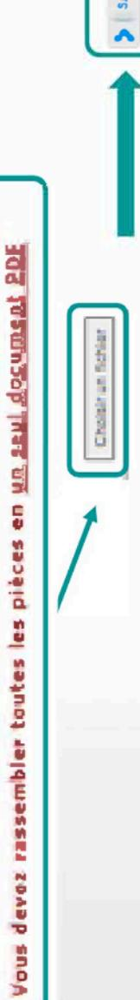

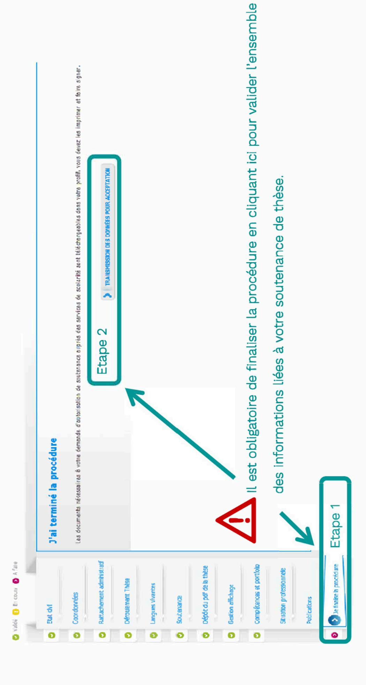

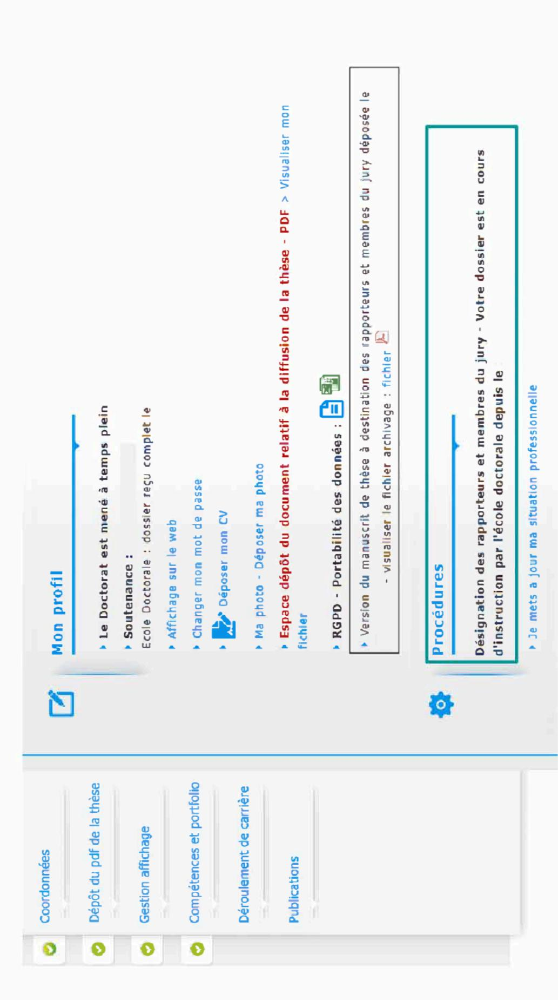

Vous pouvez suivre l'instruction de votre dossier sur votre profil personnel ADUM.

## 2. Validation par votre direction de thèse

Quand vous cliquez sur « transmission au directeur de thèse pour accord » après avoir complété tous les éléments de votre soutenance de thèse depuis votre espace personnel, un mail est automatiquement envoyé à votre direction de thèse lui demandant de se rendre sur son espace personnel ADUM afin de valider les informations saisies Une fois validées, les informations sont transmises automatiquement à votre codirection de thèse le cas échéant, puis à votre direction de laboratoire.

# 3. Validation des rapporteurs et du jury par la direction du laboratoire

Après validation de votre direction de thèse et de votre codirection de thèse le cas échéant, votre direction de laboratoire vérifie les données liées à votre soutenance et émet un avis. Un mail est automatiquement envoyé à votre direction d'école doctorale.

# 4. Validation des rapporteurs et du jury par la direction de l'école doctorale

composition du jury et des rapporteurs puis émet un avis. Un mail est automatiquement envoyé au chef Après validation de votre direction de laboratoire, la direction de l'école doctorale vérifie la conformité de la d'établissement.

# 5. Validation des rapporteurs et du jury par le chef d'établissement

Après validation de la direction de l'école doctorale, le chef d'établissement émet un avis qui permet de confirmer la conformité de la composition de votre jury.

## 6. Désignation des rapporteurs et convocation du jury par la gestionnaire de l'école doctorale après finalisation de votre déclaration de soutenance

Après avoir déposé votre manuscrit et les pièces de votre dossier de soutenance sur ADUM, vous devez cliquer sur « je finalise la procédure ». La gestionnaire de votre école doctorale, une fois la composition de votre jury validé par le chef d'établissement et la finalisation de votre procédure, peut indiquer la date de retour des pré-rapports de soutenance ce qui déclenche

- 1. à vos rapporteurs :
- de la lettre de désignation officielle,
- du lien utile pour consultation du manuscrit de thèse (la version que vous avez déposée dans ADUM),
- du lien pour dépôt de leur pré-rapport.
- 2. aux membres du jury:
- de la lettre de convocation (sous réserve d'autorisation de soutenance),
- du lien pour consulter votre manuscrit de thèse.

### 7. Autorisation de soutenance

Au vu des pré-rapports de soutenance reçus, sur avis de la direction de l'école doctorale, le chef d'établissement se prononce sur votre autorisation finale de soutenance. Votre direction de thèse et vous-même recevez cette décision par mail. De votre espace personnel ADUM, vous pouvez télécharger les pré-rapports de soutenance, votre « convocation de soutenance » ainsi que l'affichette Avis de soutenance ».

Les membres du jury recevront la confirmation de votre soutenance ainsi que les pré-rapports par mail via ADUM.

## 8. Remise des documents de soutenance

Au plus tard 15 jours après la soutenance, votre direction de thèse doit déposer sur son espace personnel ADUM les diffusion de la thèse, l'attestation de conformité visio et les procurations visio le cas échéant, le rapport de documents de soutenances complétés et signés suivants : le procès-verbal de soutenance, l'avis du jury sur la soutenance intégrant la page de garde contenant les signatures des membres du jury.

#### 9. Attestation de réussite

La gestionnaire de votre école doctorale vous transmettra votre attestation de réussite par mail après avoir téléchargé les documents de soutenance déposés par votre direction de thèse sur ADUM. Si des corrections vous ont été demandées par le jury et qu'elles doivent donner lieu à une validation par le Président du jury, l'attestation de réussite ne pourra vous être délivrée, qu'après réception par votre gestionnaire d'une attestation des corrections effectuées signée par le Président du jury.

### 10. Dépôt de la version définitive de la thèse

Au maximum TROIS MOIS après votre soutenance, vous devez déposer la version définitive de votre thèse sur ADUM après avoir intégré le nom du Président du jury sur la page de couverture.

Ce dépôt définitif est obligatoire et permet de faire apparaître votre thèse comme soutenue sur le site de theses.fr

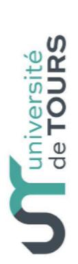

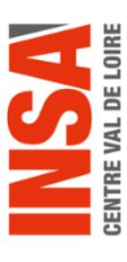

Université d'ORLÉANS

#### Vos contacts

#### à l'université de Tours :

Guillaume FIALEIX ☎ + 33 2 47 36 66 75 ED EMSTU – MIPTIS – SSBCV : ⊠ guillaume.fialeix@univ-tours.fr Christèle GAUDRON **1** + 33 2 47 36 64 50 ED H&L − SSTED :

⊠ christele.gaudron@univ-tours.fr

Université de Tours Service de la Recherche et des Etudes Doctorales 60 rue du Plat d'Etain – BP 12050 37020 TOURS Cedex 1 – France https://www.univ-tours.fr

### à l'INSA Centre Val de Loire :

Laura GUILLET ☎ + 33 2 48 48 07 61 ED EMSTU et MIPTIS ⊠ laura.guillet@insa-cvl.fr

INSA Centre Val de Loire Direction de la Recherche et de la Valorisation Etudes Doctorales

Campus de BOURGES 88 boulevard Lahitolle Technopôle Lahitolle CS 60013 18022 BOURGES CEDEX Campus de BLOIS
3 rue de la Chocolaterie
CS 23410 - 41034 BLOIS CEDEX
http://www.insa-centrevaldeloire.fr

#### A l'université d'Orléans :

Frédérique LANDAIS

Kathia FUSTER ★ + 33 2 38 41 73 61ED SSTED ☒ edssted@univ-orleans.frED H&L ☒ edhl@univ-orleans.fr

Direction Recherche et Partenariats Pôle Recherche et Études Doctorales Bâtiment IRD 5 rue Carbone - BP 6749 45067 - Orléans Cedex 2 http://www.univ-orleans.fr/fr

https://collegedoctoral-cvl.fr