Déclarer sa soutenance sur ADUM

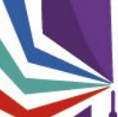

www.collegedoctoral-cvl.fr

# Tutoriel À L'Attention Des Doctorants

Préambule Les soutenances sont gérées depuis l'application ADUM. Avant de déclarer votre soutenance de thèse sur ADUM, la proposition de rapporteurs, la composition du jury, ainsi que la date de soutenance doivent faire l'objet d'une concertation entre votre direction de thèse et vous-même. Vous renseignerez ensuite, depuis votre espace personnel dans ADUM, les données **correspondantes.**

## Attention

Les données que vous saisissez dans ADUM doivent être vérifiées minutieusement (orthographe des noms, grades des membres de votre jury, **titre** de thèse, résumés et mots clés en français et en anglais, etc.) car elles seront ensuite imprimées sur votre diplôme et visibles sur le site **theses.fr.**
Informations nécessaires pour renseigner le formulaire :
 **Titre de la thèse et mots clefs (français/anglais) identique au tapuscrit,** **Résumé de la thèse (français/anglais) identique au tapuscrit,** **Date de la soutenance, adresse du lieu de soutenance, salle, horaire,** **Confidentialité de la thèse (vous rapprocher de votre gestionnaire d'Ecole Doctorale),** Rapporteurs / membres du jury / invités :
- **prénom, nom, grade, HDR ou non, établissement de rattachement, coordonnées complètes, demande de visioconférence.**
 Dépôt du manuscrit avant soutenance :
- **Version de diffusion / Version d'archivage si différente.**

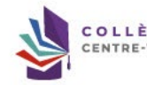

MAJ 05/2026

▸ Changer mon mot de passe
▸ Activez gratuitement mon abonnement au journal TheMetaNews
 ▸ RGPD - Portabilité des données :
!!!

## Informations Administratives

▶ Inscription Établissement : dossier reçu complet Gestionnaire :
o

## Procédures

 ▸ Charte du doctorat CDCVL
Signée le Signée par la direction de thèse Signée par la direction du laboratoire
) Inscription enregistrée en année de thèse pour
▸ Je souhaite effectuer ma demande de soutenance

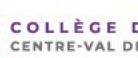

1.

Déclaration de la soutenance Au plus tard DEUX MOIS avant la date prévisionnelle de soutenance, vous devez vous connecter à votre espace personnel ADUM et lancer la procédure de soutenance en cliquant sur « Je souhaite effectuer ma demande de soutenance » Attention, les fermetures obligatoires de votre établissement ne rentrent pas dans le délai des deux mois, vérifiez auprès de votre gestionnaire d'école doctorale pour vous assurer de faire votre démarche dans les temps.

Attention ! Ces données seront publiées sur internet : http://www.theses.fr/
Vous devez indiquer une date de soutenance pour sauvegarder la page.

Soutenance de thèse Titre de la thèse en français (veuillez écrire en minuscule)
Titre de la thèse en anglais (veuillez écrire en minuscule)
ais Mots clés en français

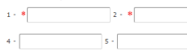

3 -
 6 -
Mots clés en anglais

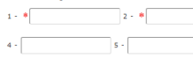

 3 -
6 -
Date de la soutenance Adresse complète du lieu de la soutenance (adresse, bâtiment, code postal, ville)
Salle de la soutenance 3

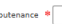

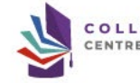

Vous devez compléter tous les items obligatoires signalés par un astérisque rouge *.

Le titre de la thèse et les mots clés en français et en anglais doivent être identiques sur le manuscrit de thèse, ils seront visibles sur le site theses.fr.

Ces éléments sont nécessaires pour sauvegarder les données saisies.

www.collegedoctoral-cvl.fr

Le label européen est-il demandé ? ® oui - non Vous trouverez les conditions pour l'obtention du label européen sur notre site :
https://collegedoctoral-cvl.fr/as/ed/page.pl?site=CDCVL&page=label_euro Label Européen Prendre contact avec votre établissement afin de vous assurer que votre demande est recevable.

- langue Nº1 de soutenance : *
>

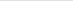

Vous devez contacter votre gestionnaire d'école doctorale avant de demander le label européen afin de vous assurer que vous remplissez bien les conditions requises.

- langue Nº2 de soutenance : *
>

- Descriptif du séjour d'au moins trois mois dans un centre de recherche d'un pays européen autre que la France :
*
Date de début du séjour : *
Date de fin du séjour :
Thèse sur publications / travaux - oui - non Vous trouverez les conditions d'une thèse sur travaux sur notre site :
https://collegedoctoral-cvl.fr/as/ed/page.pl?site=CDCVL&page=these_travaux Langue de rédaction du manuscrit
>
La langue de rédaction et de soutenance doit être le français sauf dérogation particulière liée à une convention de cotutelle internationale ou accordée lors de l'inscription en première année de thèse.

Langue de soutenance de la thèse *
>
Section  CNU

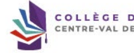

>

www.collegedoctoral-cvl.fr Si la soutenance est à huis clos, la thèse doit être déclarée confidentielle. Dans ce cas vous devez vous rapprocher au plus vite de votre gestionnaire d'école doctorale.

Si le manuscrit est déclaré confidentiel, la soutenance peut être publique. Contacter votre gestionnaire d'école doctorale pour déclarer votre manuscrit confidentiel.

Si vous envisagez de publier un article émanant de votre thèse ou votre thèse complète, il est fortement conseillé de mettre un embargo 

 afin d'éviter un auto-plagiat. La date d'embargo peut être modifiée sur demande à la suite de la soutenance de thèse, il faudra vous adresser à votre gestionnaire d'école doctorale.

www.collegedoctoral-cvl.fr 6

Ajouter Rapporteur.e Civilité
▼ | Nom Grade Prénom

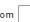

Dans un premier temps, vous devez déclarer les rapporteurs pour votre soutenance.

Les rapporteurs doivent être Professeurs, HDR ou équivalent, extérieurs à l'établissement et à l'école doctorale. Dans le cas d'une cotutelle, les rapporteurs doivent être extérieurs à l'établissement de cotutelle.

Indiquez si le rapporteur fait partie du jury ou non.

Si vous cliquez sur oui, le rapporteur va « disparaitre » de cet espace et sera intégré automatiquement au jury de soutenance. Une fois les informations sur le premier rapporteur saisies, vous devez cliquer sur
« Ajouter » puis saisir les informations concernant le second rapporteur.

Adresse

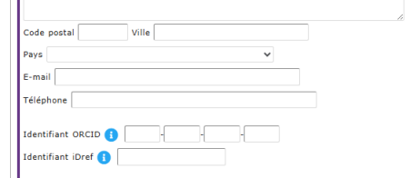

HDR (

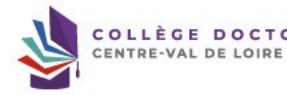

>

## Www.Collegedoctoral-Cvl.Fr

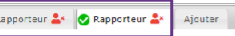

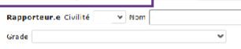

 Prénom

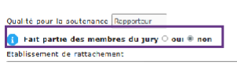

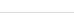

Adresse

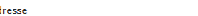

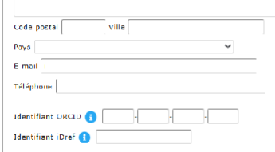

HDR

>
Vous devez déclarer deux rapporteurs.

Attention de bien cocher la case « Fait partie des membres du jury » sinon ils n'apparaitront pas.

Il est possible que l'un ou les deux rapporteurs ne fassent pas partie du jury dans de rares cas.

Membres du jury (Article 18 de l'arrêté du 25 mai 2016 fixant les modalités conduisant à la délivrance du diplôme national de doctorat)
Le iurv doit oblinatoirement être composé d'au moins quatre membres.

� Direction de thèse &x Ajouter

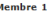

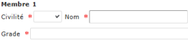

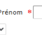

>
Qualité pour la soutenance  *  Directeur de thèse / Directrice de thèse
>
 Demande visioconférence - oui - non Etablissement de rattachement x Adresse

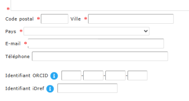

HDR (I

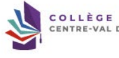

 Oui

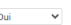

Par défaut, la direction de thèse est déjà renseignée mais vous devez compléter les coordonnées complètes.

 www.collegedoctoral-cvl.fr Le jury doit obligatoirement être composé d'au moins quatre membres e Direction de thèse

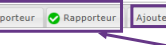

Membre 1

Civilité

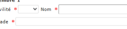

Grade &

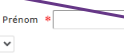

Lorsque les rapporteurs font partie du jury ils sont directement intégrés dans les membres du jury.

Vous devrez vérifier que tous les éléments sont correctement saisis.

Qualité pour la soutenance  * | Directeur de thèse / Directrice de thèse
>
Demande visioconférence - oui - non Etablissement de rattachement
® Université de Tours Adresse

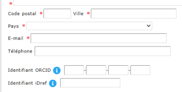

HDR (i

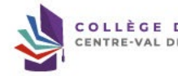

 Oui
>
Cliquer sur « Ajouter » pour intégrer les autres membres du jury.

Pour chaque membre du jury, renseignez :
-  Le grade du membre du jury (Professeur des universités, Maître de conférences, Directeur de recherche, etc.),
-  La qualité pour la soutenance (directeur/co-directeur/co encadrant/rapporteur/examinateur),
-  L'établissement de rattachement sans le laboratoire, -  Les coordonnées complètes.

- **4 à 8 membres choisis en raison de leur compétences scientifiques** - **La moitié au moins doit être composée de professeur des universités ou de rang A** - **La moitié au moins doit être composée de personnalités extérieures au laboratoire et à** 
l'école doctorale
- **La moitié au moins doit être composée de personnalités extérieures à l'établissement** 
délivrant le diplôme (dans le cas d'une cotutelle également extérieur à l'établissement de cotutelle)
- **La moitié au moins ne doit pas être impliquée dans le travail de thèse** - Il doit comporter au moins un enseignant-chercheur HDR ou fonctionnaire assimilé de l'établissement délivrant le diplôme (dans le cas d'une cotutelle un enseignant-chercheur de l'établissement de cotutelle)
Dans la mesure du possible le jury doit tendre vers une représentation équilibrée de femmes et d'hommes. Attention, un seul enseignant-chercheur ou fonctionnaire assimilé émérite peut participer au jury même en tant que rapporteur mais il ne peut être président du jury. A titre exceptionnel, les membres du jury peuvent être autorisés à participer à la soutenance 

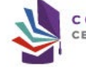 au moyen de la visioconférence, par le président ou le directeur de l'établissement après avis de la direction de l'école doctorale sur proposition argumentée du directeur de thèse. En règle générale, un tiers seulement du jury peut siéger à distance à l'exclusion du président du jury et d'au moins l'un des rapporteurs. De même, la direction de thèse ainsi que le/la candidat(e) doivent être physiquement présents.

Pour rappel ! Voici les règles de composition du jury :
Invités Ajouter Ajouter Invité.e

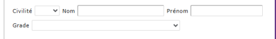

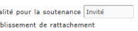

Adresse

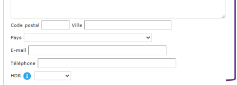

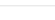

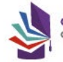

Les éventuels membres invités (2 maximum) ne font pas partie officiellement du jury.

Ils ne participent donc pas à la délibération de soutenance et ne signent aucun document de soutenance. Si vous avez des membres invités, vous devez compléter tous les items.

ORAL

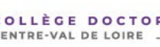

Attention !

 Les résumés de thèse en français et en anglais doivent correspondre aux 

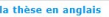 résumés intégrés dans votre manuscrit de thèse. Ils apparaitront sur le site theses.fr une fois que vous aurez soutenu votre thèse 

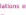 et que les services de bibliothèque de votre établissement de rattachement auront traité votre dossier suite au dépôt des documents de soutenance par votre direction de thèse et de la version définitive de votre thèse sur ADUM. Les résumés de thèse en français et en anglais (de 4000 caractères maximum) 

 devront être intégrés dans votre manuscrit de thèse après la page de couverture et les remerciements. Les résumés de thèse vulgarisés en français et en anglais (de 1000 caractères maximum) devront être intégrés à la 4ème **de couverture.**
Enregistrez les informations de la soutenance et vérifiez la composition du jury avant de soumettre à votre direction de thèse.

Lorsque vous aurez terminé de saisir les informations liées à votre soutenance vous pourrez vérifier la conformité des rapporteurs.

Cette conformité émanant d'ADUM est à titre d'information et non pas de validation. Cela vous permet de vérifié si vous avez bien indiqué les informations nécessaires à la composition du jury.

Rapporteur.e.S (Article 17 de l'arêté du 25 mai 2016 fixant les modalités conduisant à la délivrance du diplôme national de doctorat)
Attention, la vérification des rapporteurs au vu de l'arrêté n'est qu'a titre indicatif, seuls l'ED et l'établissement ont l'expertise pour vérifien les éléments saisis et l

| Désignation rapporteurs          |               |                       |              |                  |              |
|----------------------------------|---------------|-----------------------|--------------|------------------|--------------|
| Nombre de rapporteurs : (Valide) | HDR : (Valide | Extérieur : (Valide   |              |                  |              |
| 2                                | 2             | 2                     |              |                  |              |
| Membre                           | Email         | Grade / Etablissement | PR ou equiv. | Membre extérieur | HDR ou equiv |
| >                                | >             | >                     |              |                  |              |
| >                                | >             | >                     |              |                  |              |

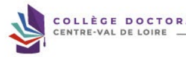

Membres du jury {Article 18 de l'arrêté du 25 mai 2016 fixant les modalités conduisant à la délivrance du diplôme national de doctorat)

| Composition du jury          |                                 |                       |                     |    |
|------------------------------|---------------------------------|-----------------------|---------------------|----|
| Parité de genre :            | Nombre de PR ou equiv. : Valide |                       |                     |    |
| F (4)                        | 4                               |                       |                     |    |
| Nombre de membres : (Valide) | Nombre d'extérieurs: (Valide    |                       |                     |    |
| 8                            | 6                               |                       |                     |    |
| PR ou                        | Membre                          | HDR ou                | Demande de          |    |
| Membre                       | Email                           | Grade / Etablissement | Rôle                |    |
| equiv.                       | extérieur                       | equiv                 | visio               |    |
| >                            | x                               | >                     | Direction de thèse  | x  |
| >                            | >                               | >                     | Rapporteur          | ×  |
| >                            | >                               | >                     | Rapporteur          | ×  |
| ×                            | >                               | >                     | CoDirection de thès | ×  |
|                              | e                               |                       |                     |    |
| x                            | ×                               | x                     | Co-encadrant de th  | x  |
|                              | ese                             |                       |                     |    |
| >                            | >                               | >                     | Examinateur         | x  |
| ×                            | >                               | ×                     | Examinateur         | >  |
| x                            | >                               | ×                     | Examinateur         | x  |

Attention, la vérfication des membres du jury au vu de l'arrête n'est qu'à titre indicatif, seuls l'ED et l'établissement ont l'expertive pour vérifier les éléments saisse e Pour supprimer un membre, vous devez supprimer son nom et prénom et sauvegarder la page.

Lorsque vous aurez terminé de saisir les informations liées à votre soutenance vous pourrez vérifier la conformité du jury.

Cette conformité émanant d'ADUM est à titre d'information et non pas de validation. Cela vous permet de vérifié si vous avez bien indiqué les informations nécessaires à la composition du jury.

Lorsque vous avez tout vérifié vous pouvez cliquer sur « **J'ai finalisé la saisie des informations relatives à ma soutenance** Transmission à la direction de thèse pour accord. »
Vous pourrez ensuite suivre l'évolution de la validation de votre jury sur ADUM.

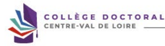

www.collegedoctoral-cvl.fr 16

� Etat civil n Mon profil
�
Coordonnées
�
 Rattachement administratif
�
Financement O
 Déroulement doctorat O
Langues vivantes O
Soutenance
� Dépôt du PDF de la thèse
� Gestion affichage 0 Compétences et portfolio
� Documents à joindre Déroulement de carrière Publications Je finalise la procédure 0

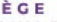

) Inscription Établissement : dossier reçu complet Gestionnaire :
Procédures année de thèse pour
) Inscription enregistrée en
 ▸ Désignation des rapporteurs et membres du jury - L'avis de la direction de thèse est en attente depuis le
▸ Je finalise ma déclaration de soutenance de thèse Vous ne pourrez finaliser votre déclaration de soutenance qu'une fois le dépôt de votre thèse et de documents de soutenance effectué.

 ▸ Changer mon mot de passe
 ▸ Activez gratuitement mon abonnement au journal TheMetaNews
 > RGPD - Portabilité des données : 因因 Informations administratives
!!!

o Documents administratifs Formations Pour être autorisé à soutenir votre thèse, en sus du manuscrit finalisé, vous devez avoir Validé 50 - crédits doctoraux et suivi les formations obligatoires de votre établissement.

Renseignez-vous auprès de votre gestionnaire d'études doctorales.

55 crédits/points obtenus / 50 crédits/points requis

 ▸ Catalogue
> Catalogue Compétences RNCP
▸ Récapitulatif de participation aux formations
▸ Formations en cours
 > Évaluation des formations suivies
▸ Déclaration des formations hors catalogue Cotutelle
▸ Convention de cotutelle signée Formations
> Fiche de validation des crédits doctoraux ▸ Plan de formation écoles doctorales
> Calendrier des formations Inscription - Réinscription
> Tutoriel pour la réinscription ▸ Convention individuelle de formation
> Rapport d'avancement pour une réinscription (.docx)
> Tutoriel pour la soutena Constitution du dossier de soutenance
> Couverture de thèse (.docx)
▸ Quatrième de couverture de thèse (.docx)

Vous trouverez le modèle de 1ère et 4ème de couverture, à respecter impérativement, sur votre profil ADUM.

Vous trouverez également la liste des éléments constituant votre dossier de soutenance. C

## Www.Collegedoctoral-Cvl.Fr

Etat civil Fichier électronique du manuscrit de la thèse correspondant au dépôt avant soutenance Coardonnées Rattachement administratif

| Financeme   |
|-------------|

Déroulement doctoral Langues vivantes Soutenance Dépôt du PDF de la thèse Gestion affichage Compétences et portfolio Documents à joindre Déroulement de carrière Publications Je finalise la procédure

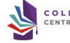

Dépôt du fichier PDF de la thèse version archivage
 [ Glisser un document sur cette zone, ou cliquer sur le bouton en bas droite ser un document sur cette zone, ou cliquer sur le bouton en bas droite.

Votre manuscrit de thèse doit être déposé en un seul PDF dont la taille ne doit pas dépasser 1GO.

Si vous rencontrez des difficultés pour déposer votre manuscrit, n'hésitez pas à contacter votre gestionnaire d'études doctorales.

Vous devez indiquer s'il s'agit de la version de diffusion.

S'il ne s'agit pas de la version de diffusion vous devez préciser les parties de votre thèse  non reproduites dans la version de diffusion.

Préciser les parties de votre thèse non reproduites dans la version de diffusion ex : "La version de diffusion ne comporte pas la totalité des reproductions pour des raisons de droits".

La taille totale des fichiers déposés ne peut être supérieure à 1Go.

II s'agit de la varion de votre thése qui sons transmise auc rappertuur pour évalusion et suz manfores du jury, catos wrion sua consultaire, l'icole doctraite, la serice du centre de documentation (Bibliothèque universitaire) de faire des vérifications techniques de votre fichier.

Le fichier PDF de la vesion intégrale de voze thése (ficire frailie apés la suzensone) est destiné à l'ere archivé par le Cente informatique national de l'ensignement supéri plateforme du CINES (PAC), votre fichier doit réussir le test FACILE Ce programme va vérifier la validité de votre fichier PDF et vous permettre de l'enregistrer pour transmission (voir le totoiel lici).

 Si votre fichier est déclaré non valide, nous vous invitans à contacter le service d'aide du CINES ou le service de documentation de l'écabitissement i adum.sodguniv-tours.

Au plus tard 3 mois après votes soutenance vous déposerez le fichier définitf de votre thèse en y intégrant sur la page de couverture le président du jury, la correction d'é éventuelles demandes de corrections formulées par le jury.

Périmètre de diffusion de la thèse Sauf si la thèse présente un caractère de confidentialité avéré, sa diffusion est assurée dans l'éablissement de soutenance et au sein de l'ensemble de la communauté univer La diffusion en ligne de la thèse au-delà de ce périmère est subordonnée à l'autorisation de son auteur, sous réserve de l'absence de clause de confidentislité.

- Une fois admis au titre de Decteur, autorisea-vous l'éablisement à diffuser vorat thèse via le réseau internet (une fois la date éventuelle de fin d'embargo ou corfidenti En sauvegardant la page, VOUS DÉCLAREZ AVOIR DEPOSÉ la version électronique de votre mémoire de thèse.

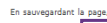

VERIFICATION DE LA CONFORMITÉ DU MANUSCRIT DE LA THÉSE ET SAUVEGARDER

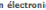

Vous devez indiquer si vous autorisez l'établissement à diffuser votre thèse sur le réseau internet.

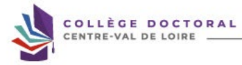

Cliquez sur « vérification de la conformité du manuscrit de thèse et sauvegarder ».

Liste des documents à intégrer dans votre dossier de soutenance en un seul PDF :

- **Le contrat de diffusion électronique des thèses autorisant l'établissement d'inscription** 

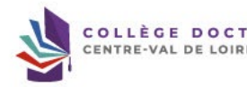

à diffuser la thèse électronique dûment complété et signé.

- **L'attestation de dépôt «** Certificat de conformité avec la version de soutenance » 
dûment complétée et signée.

- **Page de couverture et 4ème de couverture signées du Directeur de thèse.**
- Pour les doctorants de l'ED SSBCV : joindre l'article en 1er auteur dans une revue à comité de lecture ou un brevet.

- Pour les doctorants de l'ED EMSTU : joindre l'article en 1er auteur soumis à une revue à comité de lecture ou un brevet ainsi qu'un justificatif de participation à une conférence internationale.

- Pour les doctorants de l'ED MIPTIS : joindre une production scientifique importante 
(revue, conférence internationale ou brevet soumis).

- **Récapitulatif de participation aux formations.**
- **Portfolio.**
- Si la thèse présente un caractère confidentiel : le « **formulaire de demande de** 
dérogation au caractère public de la soutenance **» doit être dûment complété et signé de** toutes les parties (document disponible auprès de votre gestionnaire d'école doctorale et à faire valider 3 mois avant la soutenance).

- Si le rapporteur d'un établissement étranger n'est pas titulaire de l'HDR, joindre le CV.

## Www.Collegedoctoral-Cvl.Fr 21

0
 ▸ Changer mon mot de passe
 ▸ RGPD - Portabilité des données :
!!!

## Informations Administratives

 > Demande de soutenance pour le Gestionnaire :
École Doctorale : dossier reçu complet le Rapporteurs désignés par le Chef d'établissement le Jury désigné par le Chef d'établissement le :
Une fois votre thèse déposée sur ADUM vous pouvez visualiser le suivi de la validation de votre jury par les différents valideurs.

Mes documents
 ▸ Déposer mon CV
 ▸ Ma photo - Actualiser ma photo
▸ Version du manuscrit de thèse à destination des rapporteurs et membres du jury déposée le
- visualiser le fichier archivage : fichier □

Vous pouvez vérifier la version de votre thèse que vous avez déposé sur ADUM.

Attention, une fois le jury validé, il ne vous est plus possible de modifier votre thèse.

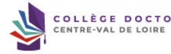

De : Doctorat <noreply@adum.fr>
Envoyé :
À :
Cc :
Objet : [Vprovisoire - Dépôt mémoire de thèse] version à destination des rapporteurs et membres du jury Bonjour Vous venez de déposer la version numérique de votre mémoire de thèse.

Version archivage et diffusion :
Nom :
Taille :
Date de dépôt :
Cordialement, Il se peut que vous receviez ce message à des heures matinales, tardives ou le week-end. Il ne nécessite, en aucune façon, une réponse de votre part en dehors des heures ouvrées.

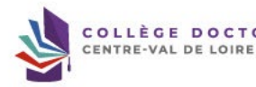

ORAL
Vous recevrez ce mail de confirmation lorsque vous aurez déposé votre thèse sur ADUM.

www.collegedoctoral-cvl.fr

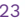

Soutenance de thèse / Thesis Defence -

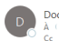

 Doctorat <noreply@adum.fr>

 Bonjour, Nous suons le plaisir de rous infromer que nous rons transmis le lette de convocation officielle eux membres du jury, sous réeme de l'autrisation de soutenance. Nous  sons é à heure à l'adresse suivante :
Nous leur avons indiqué que la soutenance se déroulerait     date Lieu de soutenance Convocation envoyée à :
 Liste des membres du jury Cordialement, Vous recevrez ce mail lorsque votre gestionnaire lancera les invitations aux membres du jury intégrant le lien vers votre thèse ainsi que le courriel aux rapporteurs pour les demandes de pré-rapports.

Mon profil
 ▸ Changer mon mot de passe B D
 ▸ RGPD - Portabilité des données :
!!!

## Informations Administratives

 ▸ Demande de soutenance pour le Gestionnaire :
École Doctorale : dossier reçu complet le Rapporteurs désignés par le Chef d'établissement Jury désigné par le Chef d'établissement le Rapports des rapporteurs attendus pour le Vous pouvez vérifier sur votre espace ADUM : La date de retour des rapports demandés aux rapporteurs.

Les pré rapports lorsqu'ils ont été déposés par les rapporteurs afin de mieux vous préparer à votre soutenance de thèse.

A Rapport du rapporteur A Rapport du rapporteur
▸ Version du manuscrit de thèse à destination des rapporteurs et membres du jury déposée le
· visualiser le fichier archivage : fichier &

TORAL

Confirmation de la soutenance de thèse

Doctorat <noreply@adum.fr>
 Madame, Monsieur, Le   Chef de l'établissement d'inscription a autorisé la soutenance de thèse de le à l'adresse suivante :

 à Vous trouverez ci-dessous les rapports de Noms des deux rapporteurs et liens internet vers leurs pré rapports Vous trouverez la note concernant le déroulement de la soutenance via le lien suivant :    Lien internet vers la note  de  soutenance Nous vous remercions de votre collaboration et restons à votre disposition pour toute information complémentaire.

Cordialement, Message envoyé à :
 Liste des membres du jury Ce mail vous est adressé lorsque votre soutenance a été validée par le chef de votre établissement d'inscription.

www.collegedoctoral-cvl.fr
← Formations

Inscription - Réinscription -
Soutenance
► Affichette : Avis de soutenance Vous pouvez retrouver les informations sur votre soutenance sur votre profil ADUM
« Affichette - Avis de soutenance »
CTORAL

De : Doctorat <noreply@adum.fr>
Envoyé :
À :
Cc :
Objet : Dépôt de la version définitive de la thèse Bonjour, Conformément à l'arrété du 25 mai 2016 fixant le cadre national de la formation et des modalités conduisant à la délivrance du diplöme national du doctorat, vous devez obli déposer la version définitive de votre thèse, directement dans votre espace personnel ADUM, dans un délai de 3 mois maximum après la soutenance sur l'ADUM.

ll est nécessaire d'indiquer le nom du Président du jury sur la 1ªº page du manuscrit et d'apporter les éventuelles corrections demandées par le jury. Nous vous remercions par avance de bien vouloir effectuer ce dépôt définitif dans le respect des délais impartis.

Cordialement, Une fois votre thèse soutenue, vous devez redéposer votre thèse sur ADUM en indiquant le Président du jury sur la page de couverture.

Si le jury vous a demandé des corrections, vous avez trois mois au maximum pour les faire et déposer la version définitive de votre thèse sur ADUM.

Sans dépôt de la version définitive de votre thèse sur ADUM, il ne sera pas possible d'obtenir votre diplôme de doctorat et votre thèse n'apparaitra pas comme soutenue sur le site theses.fr.

 De : Doctorat <noreply@adum.fr>
Envoyé : À :
Cc : Objet : [Vdef - Dépôt mémoire de thèse] version après soutenance Bonjour
 »
Vous venez de déposer la version numérique finalisée de votre thèse. Ce document va être traité par le centre de documentation de l'établissement pour archivage et diffusion sauf si confidentialité du manuscrit.

Version archivage et diffusion :
archivage.pdf Nom :
Taille :
Mo Date de dépôt :
i à Cordialement, Lorsque vous avez déposé la version définitive de votre thèse sur ADUM vous recevez ce mail de confirmation. S'il ne s'agit pas de la bonne version vous adresser à votre gestionnaire d'école doctorale afin de vous redonner la main pour un nouveau dépôt.

www.collegedoctoral-cvl.fr

À l'université de Tours : 

Elysa RAGOT  + 33 2 47 36 66 75 ED EMSTU - MIPTIS - **SSBCV**
@ elysa.ragot@univ-tours.fr Christèle GAUDRON  + 33 2 47 36 64 50 ED HL - **SSTED**
@ christele.gaudron@univ-tours.fr Université de Tours Service de la Recherche et des Etudes Doctorales Bâtiment A - 1er étage 60 rue du Plat d'Etain - **BP 12050**
37020 TOURS cedex 1 - **France**
 **https://www.univ-tours.fr**

Vos contacts

À l'INSA Centre Val de Loire :
Laura GUILLET  + 33 2 48 48 07 61 ED EMSTU - MIPTIS
@ laura.guillet@insa-cvl.fr
 **INSA Centre Val de Loire**
Direction de la Recherche et de la Valorisation Etudes Doctorales Campus de Bourges 88 Bd. Lahitolle Technopôle Lahitolle CS 60013 18022 BOUGES Cedex - France Campus de Blois 3 rue de la Chocolaterie CS 23410 41034 BLOIS Cedex - France
 **https://www.insa-centrevaldeloire.fr**
À l'université d'Orléans : 

Marion ALLER  **+ 33 2 38 49 49 85**
 + 33 2 38 49 48 25 ED EMSTU @ edemstu@univ-orleans.fr ED MIPTIS @ edmiptis@univ-orleans.fr ED SSBCV @ edssbcv@univ-orleans.fr Kathia FUSTER  + 33 2 38 71 73 61 ED SSTED @ edssted@univ-orleans.fr ED HL @ edhl@univ-orleans.fr
 **Direction de la Recherche et Partenariats**
Pôle Recherche et Etudes Doctorales Bâtiment IRD
5 rue Carbone - BP 6749 45067 ORLEANS Cedex 2 - **France**
 **https://www.univ-orleans.fr/fr**

## Www.Collegedoctoral-Cvl.Fr 30
