Validation jury et rapporteurs de soutenance par la direction de laboratoire sur ADUM

www.collegedoctoral-cvl.fr

 De : Doctorat <noreply@adum.fr>
Envoyé :
À :
 Cc :
 Objet : Déclaration de soutenance de thèse -
Bonjour, Nous vous informons que a effectué une demande de soutenance de thèse pour le Nous vous remercions de bien vouloir vérifier, rectifier si besoin les données, et donner votre avis sur la désignation des rapporteurs et la composition du jury indiqués pa doctorant. Pour ce faire, connectez-vous sur votre interface ADUM : https://www.adum.fr/index.pl.

Cordialement, Vous recevez ce mail lorsqu'une direction de thèse vient de valider le jury et les rapporteurs de sa/son doctorant(e).

Vous devez donc vous connecter à votre espace ADUM en tant que Direction de laboratoire pour vérifier et valider la composition du jury.

MAJ 05/2026

 Pour vous connecter aller sur https://adum.fr/

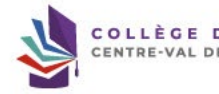

Si vous avez oublié votre mot de passe cliquer sur « J'ai oublié mon mot de passe »
afin de réinitialiser celui-ci.

RAL

nf Direction laboratoire - Avis sur rapporteurs et jury
>
Cliquez sur « Direction de laboratoire - Avis sur rapporteurs et jury » puis sur la fiche du doctorant pour donner votre avis

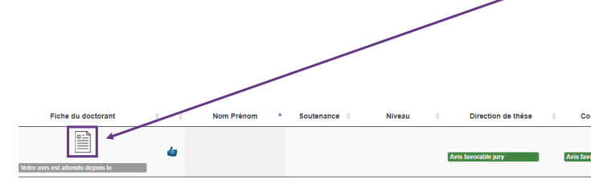

Avis favorable jury
 Co-direction de thèse Laboratoire Spécialité ED
Établissem

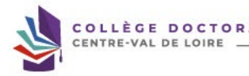

www.collegedoctoral-cvl.fr Avis sur la désignation des rapporteurs et des membres du jury de soutenance de thèse Établissement :
École doctorale :
 Unité de recherche :
Spécialité :
 Date de début de la thèse :
DIRECTION DE LA THÈSE
 Direction de thèse :
Titre :
Etablissement de rattachement :
Unité de recherche :
 Courriel :
 Vérifiez que les informations sont correctes.

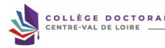

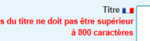

 Le nombre de caractères du titre ne doit pas être supérieur
Titre ====
 Le nombre de caractères du titre ne doit pas être supérieur

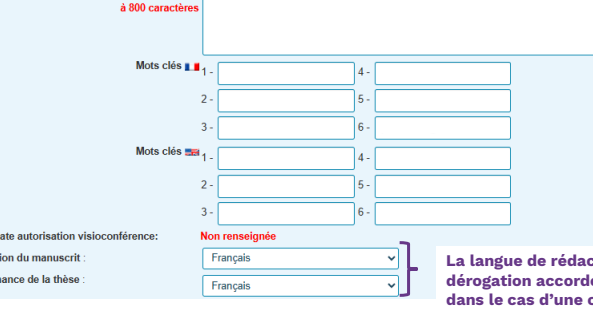

 Etablissement - Date autorisation visioconférence:
Ces informations apparaîtront sur le site theses.fr Langue de rédaction du manuscrit :
Langue de soutenance de la thèse :

La langue de rédaction et de soutenance de la thèse doit être le français sauf dérogation accordée à l'inscription par la direction de l'école doctorale ou dans le cas d'une convention de cotutelle internationale.

ORAL

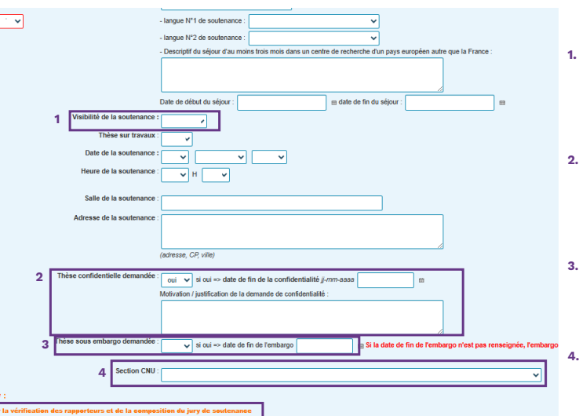

1. La soutenance est généralement publique mais peut être à huis-clos. Dans ce cas il faut en faire la déclaration auprès du gestionnaire de l'école doctorale 3 mois avant la soutenance afin que les documents soient validés avant la déclaration de soutenance.

2. La déclaration d'une thèse confidentielle doit être effectuée trois mois avant la date de soutenance et validée par le chef de l'établissement d'inscription. Tous les renseignements sont disponibles auprès de la gestionnaire de l'école doctorale concernée.

3. **L'embargo est demandé par le doctorant qui** 
souhaite éventuellement publier sa thèse ou un article émanant de sa thèse, cela évite l'auto-plagiat puisqu'après la soutenance la thèse est visible sur theses.fr 4. La section CNU de votre doctorant doit être la même que la direction de thèse.

En cliquant sur l'outil d'aide pour la vérification des rapporteurs et la composition du jury vous pouvez visualiser les informations générales de la 

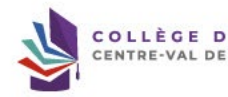 composition du jury.

Désignation rapporteurs

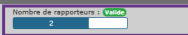

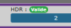

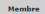

| Grade / Etablissement   |  PR ou equiv,   |  Membre extérieur   | HDR ou equiv   |
|-------------------------|-----------------|---------------------|----------------|
| >                       | >               | >                   |                |
| V                       | >               | >                   |                |

Composition du jury 

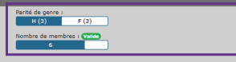

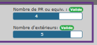

|  Grade / Etablissement   | PR ou equiv.   | Membre extérieur   | HDR ou equiv       | Rôle   | Demande de visio   |
|--------------------------|----------------|--------------------|--------------------|--------|--------------------|
| >                        | ×              | >                  | Direction de thèse | ×      |                    |
| >                        | >              | >                  | Rapporteur         | ×      |                    |
| >                        | >              | >                  | Rapporteur         | ×      |                    |
| x                        | >              | >                  | Examinateur        | >      |                    |
| x                        | >              | >                  | Examinateur        | ×      |                    |
| V                        | >              | >                  | Examinateur        | ×      |                    |

 Membre

Email Attention !

Cet outil permet seulement de vérifier la composition du jury mais ne valide par cette composition.

Vous devez vérifier chaque fiche de membre du jury saisi par votre doctorant(e) afin de vous assurez que les éléments saisis sont corrects.

Invité

 Invité Email Grade / Etablissement

Pour rappel ! La déclaration de soutenance doit être faite au plus tard 2 mois avant la date de soutenance. S'il y a une fermeture de votre **établissement, cette** fermeture ne rentre pas dans le délai des deux mois, merci d'en tenir compte. Voici les règles de composition du jury : - **4 à 8 membres choisis en raison de leur compétences scientifiques** - **La moitié au moins doit être composée de professeur des universités ou de rang A** - **La moitié au moins doit être composée de personnalités extérieures au laboratoire et à l'école doctorale** - La moitié au moins doit être composée de personnalités extérieures à l'établissement délivrant le diplôme (dans le cas d'une cotutelle également extérieur à l'établissement de cotutelle)
- La moitié au moins ne doit pas être impliquée dans le travail de thèse - **Il doit comporter au moins un enseignant-chercheur HDR ou fonctionnaire assimilé de l'établissement délivrant le diplôme (dans le cas d'une cotutelle** 
un enseignant-chercheur de l'établissement de cotutelle)
Dans la mesure du possible le jury doit tendre vers une représentation équilibrée de femmes et d'hommes. Attention, un seul enseignant-chercheur ou fonctionnaire assimilé émérite **peut participer au jury même en tant que rapporteur mais il ne peut être** président du jury. A titre exceptionnel, les membres du jury peuvent être autorisés à participer à la soutenance au moyen de la visioconférence, par le président ou le directeur de l'établissement après avis de la direction de l'école doctorale sur proposition argumentée du directeur de thèse. En règle générale, un tiers seulement du jury peut siéger à distance à l'exclusion du président du jury et d'au moins l'un des rapporteurs. De même, la direction de thèse ainsi que le/la candidat(e) doivent être physiquement présents. Les éventuels membres invités (2 maximum) ne font pas partie officiellement du jury. Ils ne participent donc pas à la délibération de soutenance et ne signent aucun document de soutenance.

Membres du jury :
 ♦ Outil d'aide pour la vérification des rapporteurs et de la composition du jury de soutenance Membre du jury - Directeur de these 
 - demande de visio-conférence : 
non ▼
 Civilité :
 Qualité pour la soutenance :
 Téléphone :
 Etablissement de rattachement :
Grade : Adresse :
E-mail HDR
ldentifiants

## Membre Présent Dans L'Adum :

Donnéee de la fiche Grade ldentifiant Orcid ldentifiant iDref Laboratoire Ecole doctorale Etablissement Employeur Pour rectifier l'élément saisi dans le cadre du membre du jury, cliquez sur J'Cela modifiera instantanément l'info du membre du jury.

Eléments concernant la direction de thèse.

CTORAL

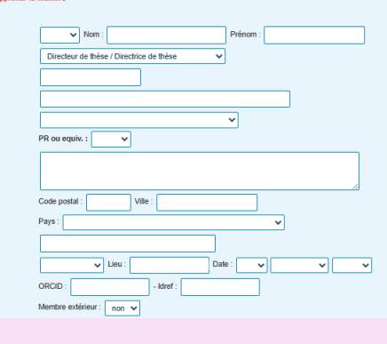

 Rapporteur et membre du jury
- demande de visio-conférence :
 non ▼
 Civilité : Qualité pour la soutenance : Téléphone :
Etablissement de rattachement : Grade :
Adresse : E-mail HDR ldentifiants

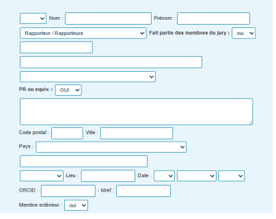

Rapporteur et membre du jury 
- demande de visio-conférence :

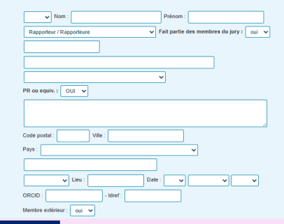

Civilité :
Qualité pour la soutenance :
 Téléphone :
Etablissement de rattachement : Grade : Adresse : E-mail HDR
ldentifiants

## Membre Présent Dans L'Adum :

|  Données de la Fiche   |
|------------------------|
| Grade                  |
| Laboratoire            |
| Ecole doctorale        |
| Etablissement          |
| Employeur              |

Eléments concernant les deux rapporteurs.

COLLÈGE DOCTORAL

 Membre du jury - Examinateur
 - demande de visio-conférence :
oui Civilité :
Qualité pour la soutenance :
 Téléphone :
Etablissement de rattachement :
Grade :
Adresse :

| HDR   |
|-------|

| E-mail   |
|----------|

ldentifiants

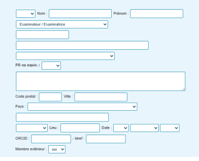

Membre du jury - Examinateur 
- demande de visio-conférence :
 Civilité : Qualité pour la soutenance : Téléphone :
 Etablissement de rattachement :
 Grade :

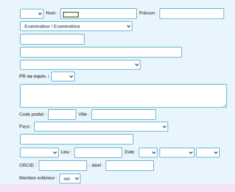

Adresse :
E-mail HDR
ldentifiants

## Membre Présent Dans L'Adum :

Données de la flohe

|  Laboratoire    |
|-----------------|
| Ecole doctorale |
| Etablissement   |

 Grade HDR Employeur Pour rectifier l'élément saisi dans le cadre du membre du jury, cliquez sur 3 Cela modifiera instantanément l'info du membre du jury.

Eléments concernant les examinateurs.

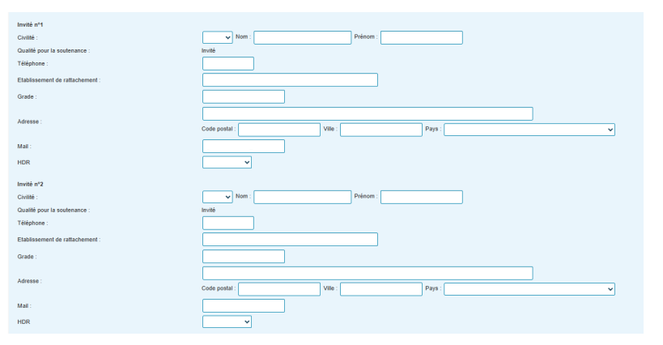

Eléments concernant les éventuels membres invités.

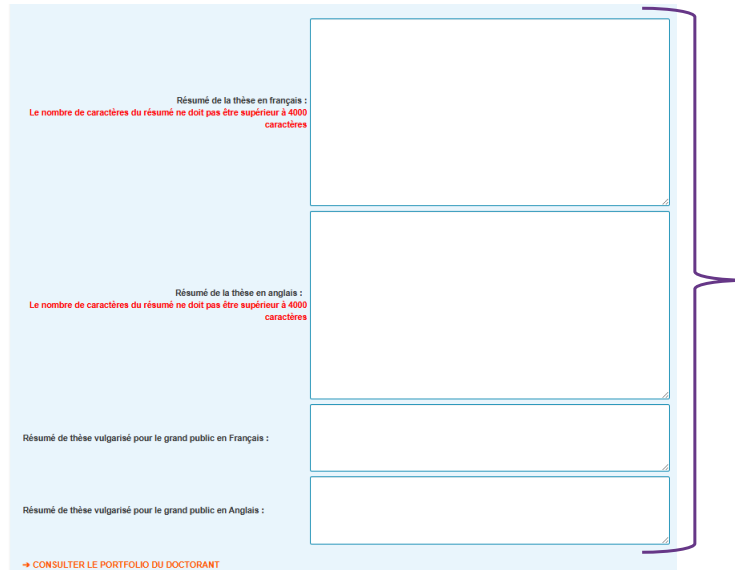

les résumés de thèse correspondent à ceux qui apparaitrons sur le site theses.fr.

www.collegedoctoral-cvl.fr
 → CONSULTER LE PORTFOLIO DU DOCTORANT
→ Tableaux de vérification rapporteurs et composition du jury de soutenance AVIS DE LA DIRECTION DE LA THÈSE
, Direction de la thèse, a donné un avis favorable sur la désignation des rapporteurs et la composition du jury de soutenance de thèse le Votre avis sur la désignation des rapporteurs et la composition du jury de soutenance de thèse de li est hécessain de vous assure les de la asté que vos commeriares ou avis sont adéquit, perfinents et imités a e qu'est nécessaire eu regand des mailles pur lesqueles is so Votre commentaire ou avis ne doit donc pas être inapproprié, subjectif ou insultant.

Enregistrer votre avis

retour à la liste Vous devez émettre votre avis sur les rapporteurs et le jury.

La composition du jury sera ensuite vérifiée et validée par la direction de l'école doctorale et enfin par le ou la représentent(e) du chéf de votre établissement.

www.collegedoctoral-cvl.fr

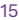

À l'université de Tours : 

Elysa RAGOT  + 33 2 47 36 66 75 ED EMSTU - MIPTIS - **SSBCV**
@ elysa.ragot@univ-tours.fr Christèle GAUDRON  + 33 2 47 36 64 50 ED HL - **SSTED**
@ christele.gaudron@univ-tours.fr Université de Tours Service de la Recherche et des Etudes Doctorales Bâtiment A - 1er étage 60 rue du Plat d'Etain - **BP 12050**
37020 TOURS cedex 1 - **France**
 **https://www.univ-tours.fr**

Vos contacts

À l'INSA Centre Val de Loire :
Laura GUILLET  + 33 2 48 48 07 61 ED EMSTU - MIPTIS
@ laura.guillet@insa-cvl.fr
 **INSA Centre Val de Loire**
Direction de la Recherche et de la Valorisation Etudes Doctorales Campus de Bourges 88 Bd. Lahitolle Technopôle Lahitolle CS 60013 18022 BOUGES Cedex - France Campus de Blois 3 rue de la Chocolaterie CS 23410 41034 BLOIS Cedex - France
 **https://www.insa-centrevaldeloire.fr**
À l'université d'Orléans : 

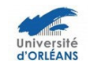

 + 33 2 38 49 48 25 Marion ALLER  + 33 2 38 49 49 85
 **+ 33 2 38 49 48 25**
ED EMSTU @ edemstu@univ-orleans.fr ED MIPTIS @ edmiptis@univ-orleans.fr ED SSBCV @ edssbcv@univ-orleans.fr Kathia FUSTER  + 33 2 38 71 73 61 ED SSTED @ edssted@univ-orleans.fr ED HL @ edhl@univ-orleans.fr Direction de la Recherche et Partenariats Pôle Recherche et Etudes Doctorales Bâtiment IRD
5 rue Carbone - BP 6749 45067 ORLEANS Cedex 2 - **France**
 **https://www.univ-orleans.fr/fr**

## Www.Collegedoctoral-Cvl.Fr 16
