Validation jury et rapporteurs de soutenance par la direction de thèse sur ADUM

www.collegedoctoral-cvl.fr

 Déclaration de soutenance de thèse -

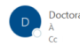

Doctorat <noreply@adum.fr>
Bonjour, Nous vous informons que
› vient d'effectuer une demande de soutenance de thèse pour le Nous vous remercions de bien vouloir vérifler, rectifier si besoin les donner votre avis sur la désignation des rapporteurs et la composition du jury indiqués par votre doct Pour ce faire, connectez-vous sur votre interface ADUM : https://www.adum.fr/index.pl.

Sivous ne connaissez pas votre not de passe, cliques id: https://www.adum.f.friesoverpwd.p.et tridiques vote adresse e-mail. Pour donner votre avis, nous vous invitons à vou à cliquer sur le lien « Direction de thèse - Avis jury et rapporteurs ».

Cordialement, Il se peut que vous receviez ce message à des heures matinales, tardives ou le week-end.

Il ne nécessite, en aucune façon, une réponse de votre part en dehors des heures ouvrées.

Vous recevez ce mail lorsqu'une direction votre doctorant(e) vient de déclarer sa soutenance sur ADUM.

Vous devez donc vous connecter à votre espace ADUM en tant que Direction de thèse pour vérifier et valider la composition du jury et les éléments saisis concernant la thèse.

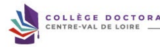

MAJ 05/2026

Vous devez vous connecter à votre espace personnel ADUM
https://adum.fr/
Si vous avez oublié votre mot de passe cliquer sur « J'ai oublié mon mot de passe » afin de réinitialiser celui-ci.

 CONNEXION ESPACE PERSONNEL
Ce site est optimisé pour Google Chrome ou Mozilla Firefox. Merci d'utiliser un de ces navigateurs.

ldentification Votre adresse e-mail :
 Mot de passe :

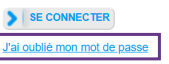

 Important : Si vous êtes chercheur, nous vous invitons à consulter la Foire aux

Questions (FAQ)
CRÉER UN COMPTE

 CREATE AN ACCOUNT

Intranet >>

TORAL

 Maj 05/2026

Pour rappel ! La déclaration de soutenance doit être faite au plus tard 2 mois avant la date de soutenance. S'il y a une fermeture de votre **établissement, cette** fermeture ne rentre pas dans le délai des deux mois, merci d'en tenir compte. Voici les règles de composition du jury : - **4 à 8 membres choisis en raison de leur compétences scientifiques** - **La moitié au moins doit être composée de professeur des universités ou de rang A** - **La moitié au moins doit être composée de personnalités extérieures au laboratoire et à l'école doctorale** - La moitié au moins doit être composée de personnalités extérieures à l'établissement délivrant le diplôme (dans le cas d'une cotutelle également extérieur à l'établissement de cotutelle)
- La moitié au moins ne doit pas être impliquée dans le travail de thèse - **Il doit comporter au moins un enseignant-chercheur HDR ou fonctionnaire assimilé de l'établissement délivrant le diplôme (dans le cas d'une cotutelle** 
un enseignant-chercheur de l'établissement de cotutelle)
Dans la mesure du possible le jury doit tendre vers une représentation équilibrée de femmes et d'hommes. Attention, un seul enseignant-chercheur ou fonctionnaire assimilé émérite **peut participer au jury même en tant que rapporteur mais il ne peut être** président du jury. A titre exceptionnel, les membres du jury peuvent être autorisés à participer à la soutenance au moyen de la visioconférence, par le président ou le directeur de l'établissement après avis de la direction de l'école doctorale sur proposition argumentée du directeur de thèse. En règle générale, un tiers seulement du jury peut siéger à distance à l'exclusion du président du jury et d'au moins l'un des rapporteurs. De même, la direction de thèse ainsi que le/la candidat(e) doivent être physiquement présents. Les éventuels membres invités (2 maximum) ne font pas partie officiellement du jury. Ils ne participent donc pas à la délibération de soutenance et ne signent aucun document de soutenance.

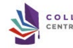

 Direction de thèse - Avis sur rapporteurs et jury Dans la partie « à faire » cliquez sur « Direction de thèse  - Avis sur rapporteurs et jury ».

nf G
Désignation rapporteurs et jury Afficher Tous v éléments Rechercher

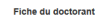

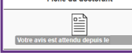

e Établissement Soutenance ♦
 Niveau Direction de thèse Nom Prénom   ^
Co-direction de thèse Laboratoire Spécialité ED
Date finalisation doctorant Affichage de l'élement 1 à 1 sur 1 éléments

 Précédent 1

 Suivant Cliquez sur la fiche du doctorant concerné. 

TORAL
www.collegedoctoral-cvl.fr

# Avis Sur La Désignation Des Rapporteurs Et Des Membres Du Jury De Soutenance De Thèse

[Consulter le manuscrit de thèse ici]
 Établissement :
École doctorale : Unité de recherche :
Spécialité :
 Date de début de la thèse :
 DIRECTION DE LA THÈSE
 Direction de thèse :
Etablissement de rattachement :
Titre :
 Unité de recherche :
 Courriel :
 Co-direction de thèse :
Etablissement de rattachement :
Titre :
 Unité de recherche :
 Courriel :
 Téléphone :
MEMBRES DU CSI
 Référent Membre spécialiste de la discipline ou en lien avec le domaine de la thèse HDR : Laboratoire :

  Membre extérieur à l'établissement Membre non spécialiste extérieur au domaine de recherche du travail de la thèse HDR :

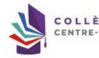

DOCTORAL
Vérifiez les informations liées au doctorat saisies par votre doctorant(e).

 Le nombre de caractères du titre ne doit pas être supérieur à 800 Titre = =
caractères Titre 등은

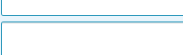

 Le nombre de caractères du titre ne doit pas être supérieur à 800

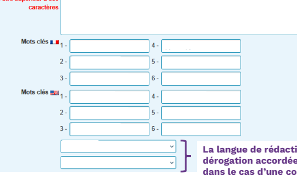

/12 Mic Vérifiez que les titres de thèse et mots clés en français et en anglais correspondent à la 1ère et 4ème de couverture du manuscrit de thèse de votre doctorant(e).

 Langue de rédaction du manuscrit : Langue de soutenance de la thèse :

La langue de rédaction et de soutenance de la thèse doit être le français sauf dérogation accordée à l'inscription par la direction de l'école doctorale ou dans le cas d'une convention de cotutelle internationale.

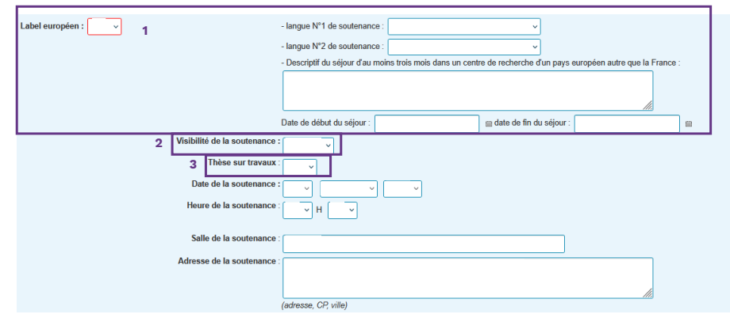

Vérifiez les informations saisies par votre doctorant(e).

1. Si votre doctorant demande le Label Européen, il doit avoir vérifié avec vous et la gestionnaire de l'école doctorale si les conditions requises sont remplies puis faire valider auprès du bureau de l'école doctorale l'obtention de ce label.

2. **La soutenance est généralement publique mais peut être à huis-clos. Dans ce cas il faut en faire la déclaration auprès de la gestionnaire de** 
l'école doctorale 3 mois avant la soutenance afin que les documents soient validés avant la déclaration de soutenance.

3. **Une thèse sur travaux se fait généralement en 1 année universitaire et est différente d'une thèse sur article. Informations sur la thèse sur** 

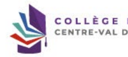

travaux disponibles sur notre site : https://collegedoctoral-cvl.fr/as/ed/page.pl?site=CDCVL&page=these_travaux

1 2 3

1. La déclaration d'une thèse confidentielle doit être effectuée trois mois avant la date de soutenance et validée par le chef de l'établissement d'inscription. Tous les renseignements sont disponibles auprès de la gestionnaire de l'école doctorale concernée.

2. L'embargo est demandé par le doctorant qui souhaite éventuellement publier sa thèse ou un article émanant de sa thèse, cela évite l'auto-plagiat puisqu'après la soutenance la thèse est visible sur theses.fr 3. **La section CNU de votre doctorant doit être la même que la vôtre.**

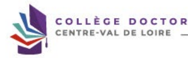

Membres du jury :
 → Outil d'aide pour la vérification des rapporteurs et de la composition du jury de soutenance En cliquant sur l'outil d'aide pour la vérification des rapporteurs et la composition du jury vous pouvez visualiser les informations générales de la composition du jury.

Ecole doctorale Soutenance le Tableaux vérification rapporteurs et composition du jury de soutenance

Désignation rapporteurs

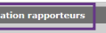

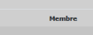

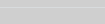

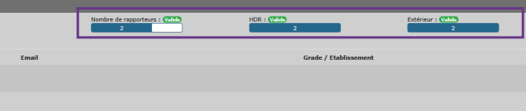

| PR ou equiv.   | Membre extérieur   | HDR ou equiv   |
|----------------|--------------------|----------------|
| >              | >                  | >              |
| >              | >                  | >              |

Composition du jury

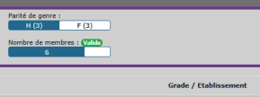

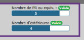

| PR ou equiv.   | Membre extérieur   | HDR ou equiv   |  Rôle   | Demande de visio   |
|----------------|--------------------|----------------|---------|--------------------|
| >              | ×                  | V              | x       |                    |
| V              | V                  | >              | x       |                    |
| >              | >                  | >              | x       |                    |
| >              | V                  | >              | V       |                    |
|                |                    | V              | ×       |                    |
| >              | ×                  |                |         |                    |
| >              | >                  | V              | x       |                    |

Email Attention !

Cet outil permet seulement de vérifier la composition du jury mais ne valide par cette composition.

Vous devez vérifier chaque fiche de membre du jury saisi par votre doctorant(e) afin de vous assurez que les éléments saisis sont corrects.

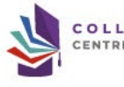

ORAL
 www.collegedoctoral-cvl.fr Membres du jury :
 ✈ Outil d'aide pour la vérifieation des rapporteurs et de la eomposition du jury de soutenanee Membre du jury - Directeur de these 
- demande de visio-conférence :
non Civillité : Qualité pour la soutenance : Téléphone :
 Etablissement de rattachement : Grade : Adresse :
 E-mail HDR
ldentifiants

## Membre Présent Dans L'Adum

 Données de la fighe Grade ldentifiant Orcid Identifiant iDref Laboratoire ca ca Ecole doctorale Etablissement Employeur Pour rectifier l'élément saisi dans le cadre du membre du jury, cliquez sur 3 Cela modifiera instantanément l'info du membre du jury.

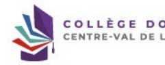

TORAL

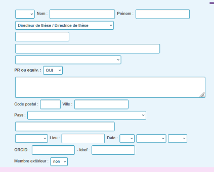

Vérifiez les éléments vous concernant.

Membre du jury - CoDirecteur de these
- demande de visio-conférence :
non v Civilité :
 Qualité pour la soutenance :
 Téléphone :
 Etablissement de rattachement :
 Grade :
Adresse :
E-mail HDR
ldentifiants

## Membre Présent Dans L'Adum :

 Données de la fiche

|  Téléphone   |
|--------------|

E2 Grade HDR
G
 Employeur Pour rectifier l'élément saisi dans le cadre du membre du jury, cliquez sur J'Cela modifiera instantanément l'info du membre du jury.

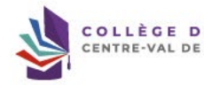

CTORAL

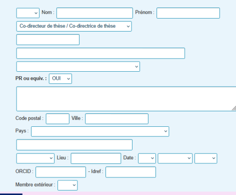

lis
Vérifiez les éléments concernant la co direction de thèse éventuelle ou du co encadrement éventuel.

 www.collegedoctoral-cvl.fr Rapporteur et membre du jury 
 - demande de visio-conférence :
non Civilité :
 Qualité pour la soutenance :
 Téléphone :
 Etablissement de rattachement :
Grade :
Adresse :
 E-mail HDR
ldentifiants

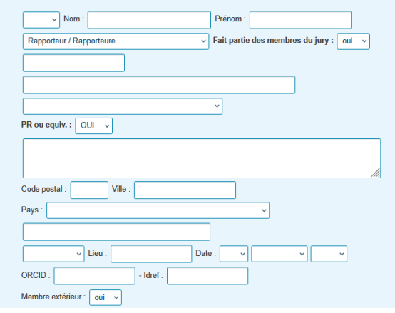

Vérifiez les éléments concernant les deux rapporteurs.

CTORAL
Membre du jury - Examinateur
   
- demande de visio-conférence : | oui v Civilité :
 Qualité pour la soutenance :
 Téléphone : Etablissement de rattachement : Grade :
 Adresse : E-mail HDR ldentifiants

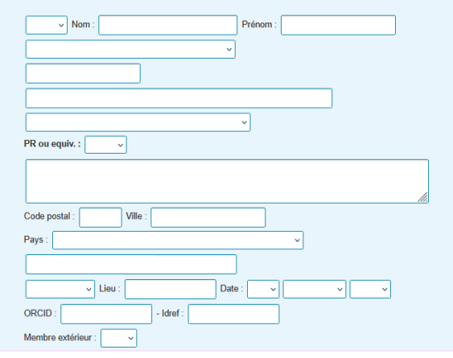

CTORAL
Vérifiez les éléments concernant les membres examinateurs du jury.

Invité n°1 Civilité :
Qualité pour la soutenance : Téléphone :
 Etablissement de rattachement : Grade : Adresse :

| Invité n°2   |
|--------------|
| Civilité :   |

| HDR   |
|-------|

|  Mail :   |
|-----------|

Qualité pour la soutenance : Téléphone :

|  Mail :   |
|-----------|

 Etablissement de rattachement :
Grade :
Adresse :
HDR

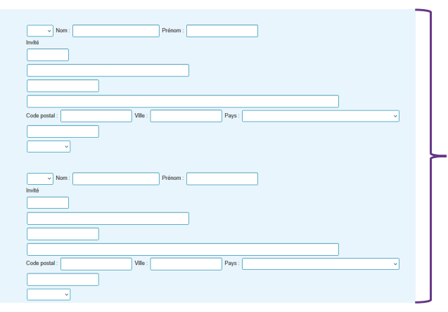

Vérifiez les éléments concernant les éventuels membres invités, au nombre de deux maximums.

Attention, le manuscrit de thèse ne leur sera pas transmis via ADUM.

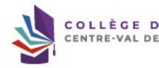

TORAL

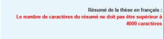

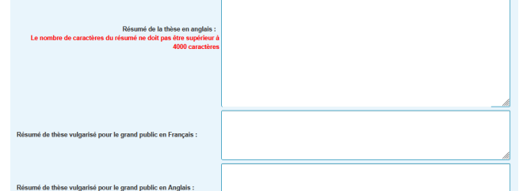

di Vérifiez que les résumés de thèse correspondent à ceux intégrés dans le manuscrit de thèse et qui apparaitront sur le site theses.fr.

Vérification FACILE le à Dépôt électronique de la thèse Mémoire de thèse version archivage : 1° dépôt Nom :
_archivage.pdf Fichier Date de dépôt : 1er dépôt :
 à
→ CONSULTER LE PORTFOLIO DU DOCTORANT → Etablissement - pièces complémentaires pour la soutenance
→ Tableaux de vérification rapporteurs et composition du jury de soutenance

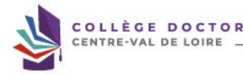

Vous pouvez vérifier ici les documents déjà déposés par votre doctorant(e). Il se peut qu'ils n'apparaissent pas tous puisque votre doctorant(e) a jusqu'à 7 semaines avant la date de soutenance pour les déposer sur ADUM.

TORAL

Votre avis sur la désignation des rapporteurs et la composition du jury de soutenance de thèse de sous réserve de l'avis des rapporteurs
*○ Avis favorable
* ( Avis défavorable Vos observations éventuelles :
li est hécessaire de vous assurer les a abié que vos commercione ou avis ost adéquat, perfrents el limilis à es qu'est necossove au regard de mailie et cele an reperche laut Votre commentaire ou avis ne doit donc pas être inapproprié, subjectif ou insultant.

* □
 Je certifie que mon/ma doctorant(e) a été sensibilisé(e) au plagiat, et notamment aux sanctions encourues en cas de plagiat avéré de son tapuscrit.

Le plagiat constitue une fraude et peut donner lieu à des poursuites disciplinaires, sans préjuger, par ailleurs, des poursuites pénales et/ou civiles,

Enregistrer votre avis

Redonner la main au doctorant pour qu'il apporte des modifications Vous devez émettre votre avis sur les rapporteurs et le jury.

Vous devez certifier que votre doctorant(e) a été sensibilisé(e) au plagiat (...). Vous devez soit enregistrer votre avis sur les rapporteurs et le jury, soit redonner la main à votre doctorant(e) s'il y a des modifications à apporter.

La composition du jury sera ensuite vérifiée et validée par la codirection de thèse éventuelle, puis par la direction du laboratoire, la direction de l'école doctorale et enfin par le ou la représentent(e) du chef de votre établissement.

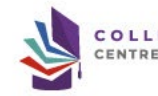

 www.collegedoctoral-cvl.fr Lorsque la composition du jury et des rapporteurs est validée par le ou la représentent(e) du chef de votre établissement et que **votre doctorant(e)** a déposé son manuscrit de thèse et son dossier de soutenance sur ADUM, votre gestionnaire d'études doctorale lance les invitations aux membres du jury avec un lien sécurisé pour télécharger le manuscrit de thèse via ADUM. Les rapporteurs reçoivent un second mail, via ADUM, contenant la date limite pour le dépôt de leur pré-rapport sur ADUM avec le lien sécurisé du dépôt. Dans le cadre d'une soutenance avec une visio conférence validée par le chef d'établissement. Contactez votre gestionnaire d'école doctorale pour la création et l'envoi des liens pour la visio conférence. Vous devrez télécharger les documents de soutenance se trouvant sur votre profil ADUM et les imprimer en Recto. Une fois la soutenance terminée, vous devrez récupérer les documents de soutenance signés et les déposer sur ADUM en un seul PDF et les transmettre au plus vite à votre gestionnaire d'école doctorale. Ces documents (PV de soutenance, Avis du jury sur la diffusion de la thèse, Attestation conformité visio s'il y a lieu, **rapport de soutenance** et 

 engagement de confidentialité du public dans le cadre d'une soutenance à huis-clos) sont nécessaires pour établir l'attestation de réussite au doctorat de votre docteur(e).

Lorsque le jury a été validé par le chef d'établissement et que votre doctorant(e) a déposé son manuscrit de thèse sur ADUM, vous recevez un mail récapitulant les date, lieux et horaire de soutenance ainsi que la liste des membres du jury. Lorsque les deux rapporteurs ont déposé leur pré rapport et que la soutenance est validée, vous recevez le mail indiquant que la soutenance est autorisée. Si certains membres du jury sont en visio, merci de vous adresser à votre gestionnaire d'école doctorale. Vous pouvez dès lors télécharger la note au jury et les documents de soutenance sur votre profil ADUM.

Connectez-vous sur votre profil ADUM et cliquez sur « **Documents de soutenance** »

www.collegedoctoral-cvl.fr 20

Documents de soutenance Tous ▼ éléments
\fficher Rechercher :
Matricule ADUM 
Nom Prénom Soutenance Liste jury Direction de T.

Laboratoire Spécialité ED 
Etablissement Documents
 - Documents de soutenance à l'attention du jury 트 l'ffichage de l'élement 1 à 1 sur 1 éléments Précédent 1

 Suivant Vous devez cliquer sur « Documents de soutenance à l'attention du jury » afin de pouvoir les télécharger. Attention ces documents sont à imprimer en RECTO.

Pour toute question concernant un éventuel changement de dernière minute, merci d'en informer votre gestionnaire dans les plus brefs délais.

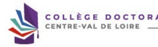

 www.collegedoctoral-cvl.fr Encadrant/Gestionnaire: 
ol

 Propositions de thèse | Thèse

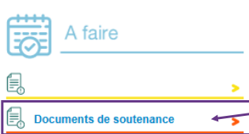

Une fois la soutenance passée, vous devez déposer les documents de soutenance sur votre profil ADUM dans la partie « Documents de soutenance ».

COLLÈGE DOCTORAL

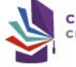

Documents de soutenance Afficher Tous ▼ éléments Rechercher :

| Matricule   |
|-------------|
| ADUM        |

 Nom Prénom Soutenance Date de retour des Dépôt rapport de Dépôt des documents de soutenance (PV, procuration, etc.)
Liste Direction de T.

Laboratoire (
 Spécialité ED
Etablissement documents souhaitée soutenance E
| 4 jury E
- Documents de soutenance à l'attention du jury Affichage de l'élement 1 à 1 sur 1 éléments Précédent

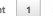

Suivant Vous devez déposer le rapport de soutenance intégrant la page de garde du rapport signée de tous les membres du jury, paraphée par le Président du jury sur chaque page et paginé.

Vous devez déposer l'avis du jury signé du Président du jury, le PV de soutenance signé de tous les membres du jury, l'attestation de conformité visio signé du Président du jury s'il y a lieu, les procurations de signature du Président du jury pour les membres du jury en visio, les engagements de confidentialité du public signés dans le cadre d'une soutenance à huis clos.

Attention, ces documents sont à déposer en un seul PDF.

En cas de problème, n'hésitez pas à contacter votre gestionnaire d'études doctorales !

À l'université de Tours : 

Elysa RAGOT  + 33 2 47 36 66 75 ED EMSTU - MIPTIS - **SSBCV**
@ elysa.ragot@univ-tours.fr Christèle GAUDRON  + 33 2 47 36 64 50 ED HL - **SSTED**
@ christele.gaudron@univ-tours.fr Université de Tours Service de la Recherche et des Etudes Doctorales Bâtiment A - 1er étage 60 rue du Plat d'Etain - **BP 12050**
37020 TOURS cedex 1 - **France**
 **https://www.univ-tours.fr**

Vos contacts

À l'INSA Centre Val de Loire :
Laura GUILLET  + 33 2 48 48 07 61 ED EMSTU - MIPTIS
@ laura.guillet@insa-cvl.fr
 **INSA Centre Val de Loire**
Direction de la Recherche et de la Valorisation Etudes Doctorales Campus de Bourges 88 Bd. Lahitolle Technopôle Lahitolle CS 60013 18022 BOUGES Cedex - France Campus de Blois 3 rue de la Chocolaterie CS 23410 41034 BLOIS Cedex - France
 **https://www.insa-centrevaldeloire.fr**
À l'université d'Orléans : 

Marion ALLER  **+ 33 2 38 49 49 85**
 + 33 2 38 49 48 25 ED EMSTU @ edemstu@univ-orleans.fr ED MIPTIS @ edmiptis@univ-orleans.fr ED SSBCV @ edssbcv@univ-orleans.fr Kathia FUSTER  + 33 2 38 71 73 61 ED SSTED @ edssted@univ-orleans.fr ED HL @ edhl@univ-orleans.fr
 **Direction de la Recherche et Partenariats**
Pôle Recherche et Etudes Doctorales Bâtiment IRD
5 rue Carbone - BP 6749 45067 ORLEANS Cedex 2 - **France**
 **https://www.univ-orleans.fr/fr**

