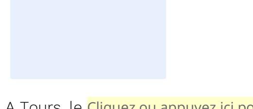

# Accord de confidentialité pour un manuscrit de thèse confidentiel

#### **ENTRE**

L'université de Tours,

Etablissement Public à caractère Scientifique, Culturel et Professionnel, dont le siège social est 60 rue du Plat d'Etain 37000 Tours, représenté par son Président, [nom du Chef d'établissement],

Ci-après désignée « l'université d'Orléans »

Et

(civilité, nom, prénom), né(e) le (date de naissance) à (lieu de naissance), domicilié(e) à (adresse du domicile)

Ci-après désigné le « Membre du Jury »1

## Etant préalablement exposé:

- Vu l'article 25 de l'arrêté du 25 mai 2016, modifié par l'arrêté du 26 août 2022, fixant le cadre national de la formation et les modalités conduisant à la délivrance du diplôme national de doctorat : « Sauf si la thèse présente un caractère de confidentialité avéré, sa diffusion est assurée dans l'établissement de soutenance et au sein de l'ensemble de la communauté universitaire. La diffusion en ligne de la thèse au-delà de ce périmètre est subordonnée à l'autorisation de son auteur, sous réserve de l'absence de clause de confidentialité. »
- Vu la dérogation au caractère public du manuscrit de doctorat accordée par le Président de l'université de Tours en [date de signature de l'autorisation de la confidentialité du manuscrit pour la soutenance de doctorat de [civilité, nom, prénom du doctorant], en date du [date de soutenance], et la durée de confidentialité sur la thèse de [durée en mois] après la soutenance.
- Vu la désignation du jury de soutenance signée, le [date de désignation du jury], par le Président de l'université de Tours Cliquez ou appuyez ici pour entrer du texte.].

&lt;sup>1 Les « **Membres du jury** » comprennent également les rapporteurs, qu'ils participent ou non à la soutenance.

## Il est convenu ce qui suit :

## Article 1 – objet

Le « Membre du Jury »

est soumis à une obligation de confidentialité afin de préserver les résultats des travaux de recherche, ayant pour titre [« titre de la thèse »]

Ci-après désignée « la Thèse »

qui sera soutenue au sein de l'université de Tours par [civilité, nom, prénom du doctorant].

Ci-après désigné « le Doctorant »

## Article 2 – Obligation de confidentialité du Membre du Jury

Sont couverts par le secret :

- Le manuscrit de la Thèse, les éléments d'informations relatifs à la Thèse reçus oralement ou par écrit de la part du Doctorant.
- Les informations communiquées à ce même Membre du Jury, au cours d'échanges portant sur le sujet de la Thèse au cours de sa soutenance.

Le Membre du Jury s'engage, de plus, pendant la période définie à l'Article 3, à :

- Ne pas laisser accessible, soit directement, soit indirectement, à toute autre personne que lui-même tout document, sous quelque forme que ce soit, qui lui sera communiqué par l'université de Tours ou par le Doctorant.
- Ne pas copier, ni reproduire, ni dupliquer totalement ou partiellement le manuscrit de la Thèse.
- Ne pas divulguer ni utiliser, même pour ses besoins propres, toute information relative à **la Thèse** qu'il aurait à connaitre, pendant toute la durée de ce présent engagement de confidentialité.

#### Article 3 - Durée du contrat et durée de l'engagement de confidentialité

Le **Membre du Jury** reconnait que son engagement de confidentialité prend effet dès sa signature du présent accord, et se poursuivra pendant [durée de confidentialité en mois] après la soutenance de la Thèse.

#### Article 4 - Rupture d'engagement et Litige

En cas de préjudice résultant de la rupture de tout ou partie des engagements de confidentialité, le **Membre du Jury** pourra être poursuivi par l'**université de Tours** et faire l'objet de poursuites sur le plan civil et pénal. En cas de désaccord entre les parties prenantes du présent accord, le litige sera porté auprès des tribunaux compétents.

# Signatures:

A [lieu de signature], le Cliquez ou appuyez ici pour entrer une date.

# Le Membre du Jury

(signature, précédée de la mention *Lu et approuvé*) Cliquez ou appuyez ici pour entrer du texte.

A Tours, le Cliquez ou appuyez ici pour entrer une date.

Le Président de l'université de Tours