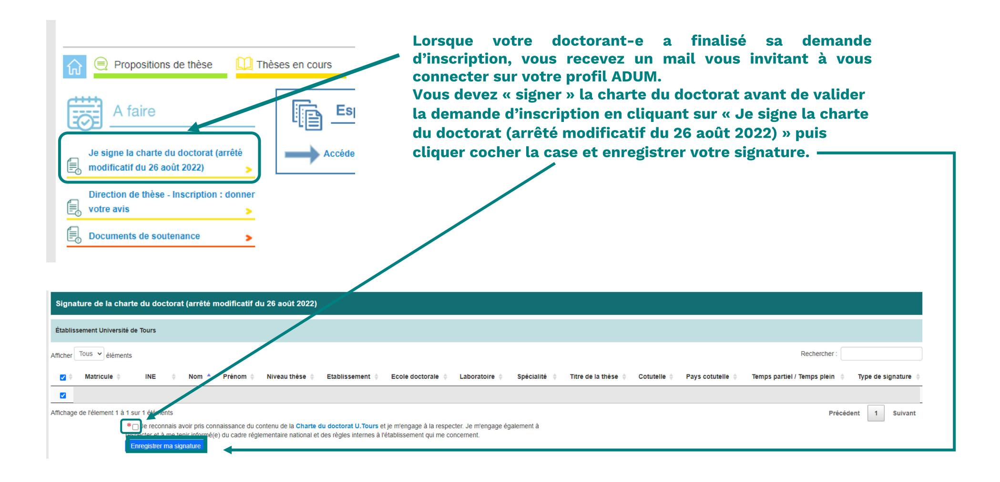
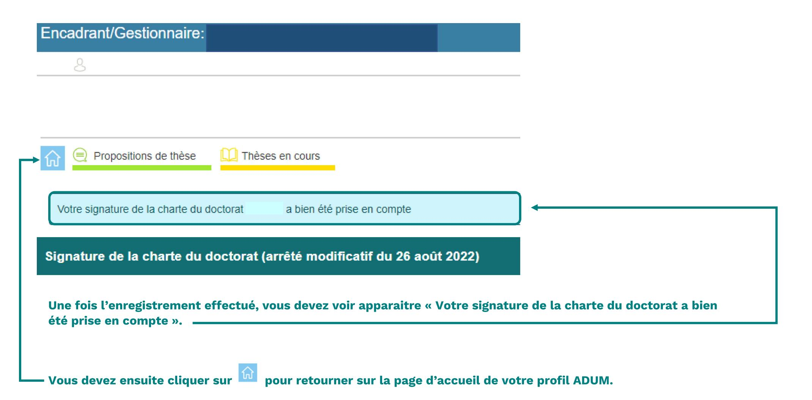
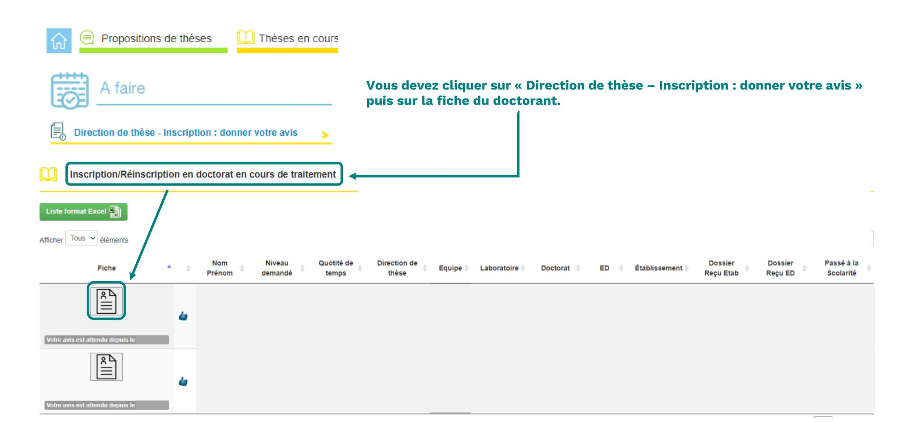
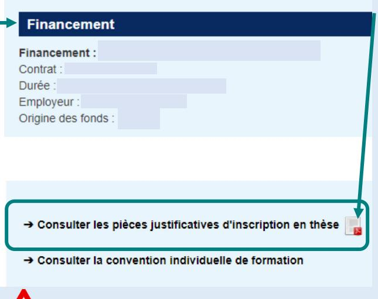
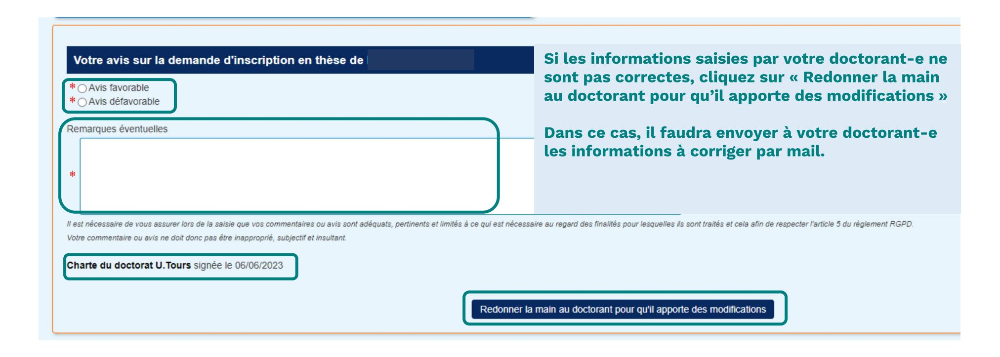
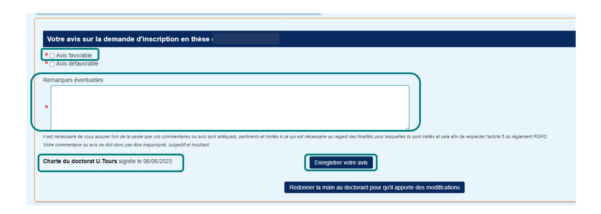
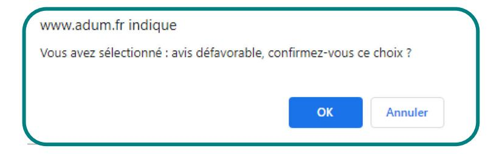
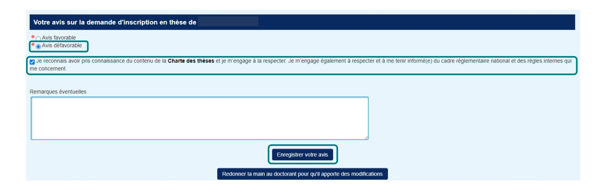
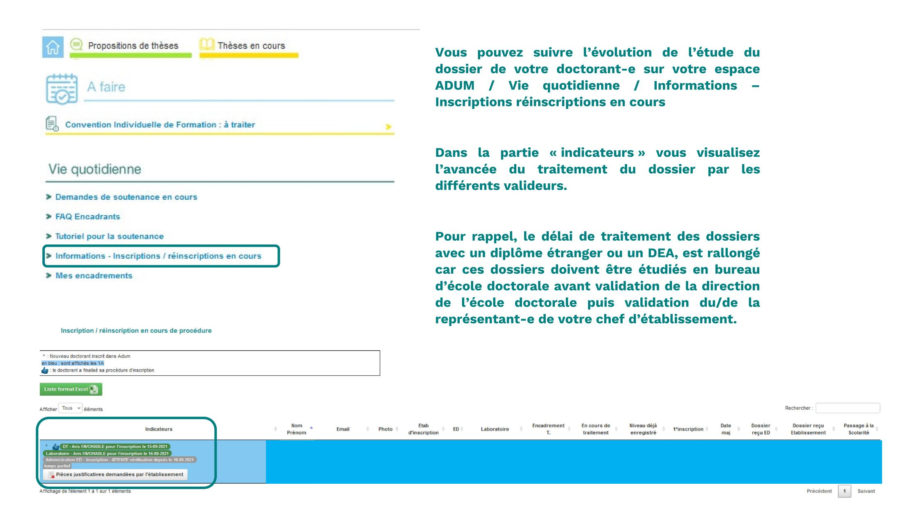

# D'INSCRIPTION EN PREMIERE ANNEE DE THESE

#### **INTERFACE CONNEXION**

 $\rightarrow$  Se connecter à son espace personnel via ce lien

| ESPACE PERSONNEL                                                                                              |  |
|---------------------------------------------------------------------------------------------------------------|--|
| Ce site est optimisé pour Google Chrome, Mozilla Firefox et Safari. Merci d'utiliser un de ces navigateurs |  |
| Vous entrez dans une zone réservée                                                                            |  |
| Votre adresse email :                                                                                         |  |
|                                                                                                               |  |
| Mot de passe :                                                                                                |  |
| J'ai oublié mon mot de passe                                                                                  |  |
| Sal oublie mon mor de passe                                                                                   |  |
| CRÉER UN COMPTE                                                                                               |  |
| CREATE AN ACCOUNT                                                                                             |  |

Si vous n'avez pas connaissance de votre mot de passe, nous vous invitons à cliquer sur « <u>J'ai oublié mon mot de passe</u> » afin de le réinitialiser.

| -                                                                                                                                                                 | 1 ° année de thèse en                                                                                                  |
|-------------------------------------------------------------------------------------------------------------------------------------------------------------------|-----------------------------------------------------------------------------------------------------------------------------------|
| Préparation de la thèse réalisée à :  Ecole doctorale :  Spécialité doctorale :  Unité de recherche :  Première inscription en thèse :  Encadrement de la thèse : | Vérifiez les informations saisies par votre doctorant-e notamment :  - L'école doctorale, - La spécialité, - L'unité de recherche |
| Identité                                                                                                                                                          |                                                                                                                                   |
| Genre: Née le à                                                                                                                                                   |                                                                                                                                   |
| N° étudiant : N° INE : Nationalité :                                                                                                                              |                                                                                                                                   |
| E-mail:                                                                                                                                                           |                                                                                                                                   |

| Informations thèse modifiables        |               |
|---------------------------------------|---------------|
| ■ Titre en français                   | *             |
| Direction de thèse                    | quotité : * % |
| Mots clés                             | 1 - 2 -       |
|                                       | 3 - 4 -       |
|                                       | 5 - 6 -       |
| English title                         |               |
| Keyswords                             | 1 - 2         |
|                                       | 3 - 4 -       |
|                                       | 5 - 6 -       |
| Résumé du projet de thèse en français |               |
|                                       |               |
| Résumé du projet de thèse en anglais  |               |
|                                       |               |

Vérifiez les informations saisies par votre doctorant-e et notamment le pourcentage de la quotité de direction, s'il y a co-direction ou co encadrement le pourcentage total doit être égal à 100%.

Ces informations seront affichées sur le site de theses.fr

# Scolarité Obtention Diplôme Série ou Intitulé ou Option Etablissement Ville Pays Vérifiez les informations liées au financement. Description sur l'avancée de la thèse / DEVELOPPEMENT DE COMPETENCES ET PERSPECTIVES PROFESSIONNELLES :

Vérifiez les pièces justificatives listées ci-dessous :

- Justificatif de financement (Attestation contrat doctoral, attestation ANRT dans le cadre d'une CIFRE, contrat de travail ou attestation de l'employeur, attestation de bourse)
- Ocpie de la pièce d'identité (carte d'identité, passeport ou titre de séjour en cours de validité)
- Copie du diplôme ou attestation de réussite au Master ou DEA
- O Pour une dispense de Master ou diplôme étranger équivalent Master :
- Copie du diplôme ou attestation de réussite
- Liste des matières constitutives du dernier diplôme obtenu avec les relevés de notes (traduction certifiée conforme par un service officiel français) et éventuellement le mémoire de fin d'études
- Et/ou toute pièce prouvant que le candidat a bénéficié d'une réelle initiation à la recherche et a réalisé un travail de recherche personnel
- Et/ou la liste détaillée des publications et travaux de recherche déjà effectués
- O Attestation de mise en place d'une cotutelle internationale de thèse le cas échéant

Pour l'Ecole Doctorale "Humanités et Langues", merci de bien vouloir fournir un projet de thèse intégrant :

- Le résumé lui-même ;
- L'exposé en quelques lignes du caractère novateur du projet ;
- Quelques références bibliographiques ;
- Un calendrier prévisionnel du travail;
- Si cela est possible, un plan prévisionnel de la thèse peut être ajouté.

La plus grande attention devra être portée à la correction de la langue écrite employée : les projets de thèse contenant des erreurs de syntaxe, d'orthographe (grammaticale et/ou lexicale) ne seront pas examinés et seront retournés à l'auteur pour correction.

Toutes les informations saisies par votre doctorant-e sont correctes :

Cliquez sur avis favorable. Notez vos remarques éventuelles. Cliquez sur Enregistrer votre avis.

Si vous cliquez sur avis défavorable, une fenêtre « Pop-Up » apparaît afin de confirmer votre choix.

Cochez la case je reconnais avoir pris connaissance du contenu de la charte des thèses ...

Notez vos remarques éventuelles. Cliquez sur Enregistrer votre avis.

# Vos contacts

### à l'université de Tours :

ED EMSTU - MIPTIS - SSBCV:
Isabelle Foulon \*\*2 + 33 2 47 36 66 75
\nisabelle.foulon@univ-tours.fr

ED H&L – SSTED :
Christèle Gaudron ☎ + 33 2 47 36 64 50

☑ christele.gaudron@univ-tours.fr

Université de Tours Service de la Recherche et des Etudes Doctorales 60 rue du Plat d'Etain – BP 12050 37020 TOURS Cedex 1 – France https://www.univ-tours.fr

# à l'INSA Centre Val de Loire:

Laura GUILLET ☎ + 33 2 48 48 07 61 ED EMSTU et MIPTIS ☑ laura.guillet@insa-cvl.fr

INSA Centre Val de Loire
Direction de la Recherche et de la
Valorisation
Etudes Doctorales

Campus de BOURGES 88 boulevard Lahitolle Technopôle Lahitolle CS 60013 18022 BOURGES CEDEX

Campus de BLOIS 3 rue de la Chocolaterie CS 23410 - 41034 BLOIS CEDEX http://www.insa-centrevaldeloire.fr

# A l'université d'Orléans:

ED secteur SST

Kathia FUSTER **2** + 33 2 38 41 73 61 ED SSTED ⊠ <u>edssted@univ-orleans.fr</u> ED H&L ⊠ <u>edhl@univ-orleans.fr</u>

Direction Recherche et Partenariats Pôle Recherche et Études Doctorales Bâtiment IRD 5 rue Carbone - BP 6749 45067 - Orléans Cedex 2 http://www.univ-orleans.fr/fr

https://collegedoctoral-cvl.fr