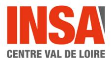
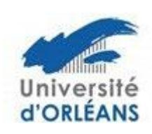
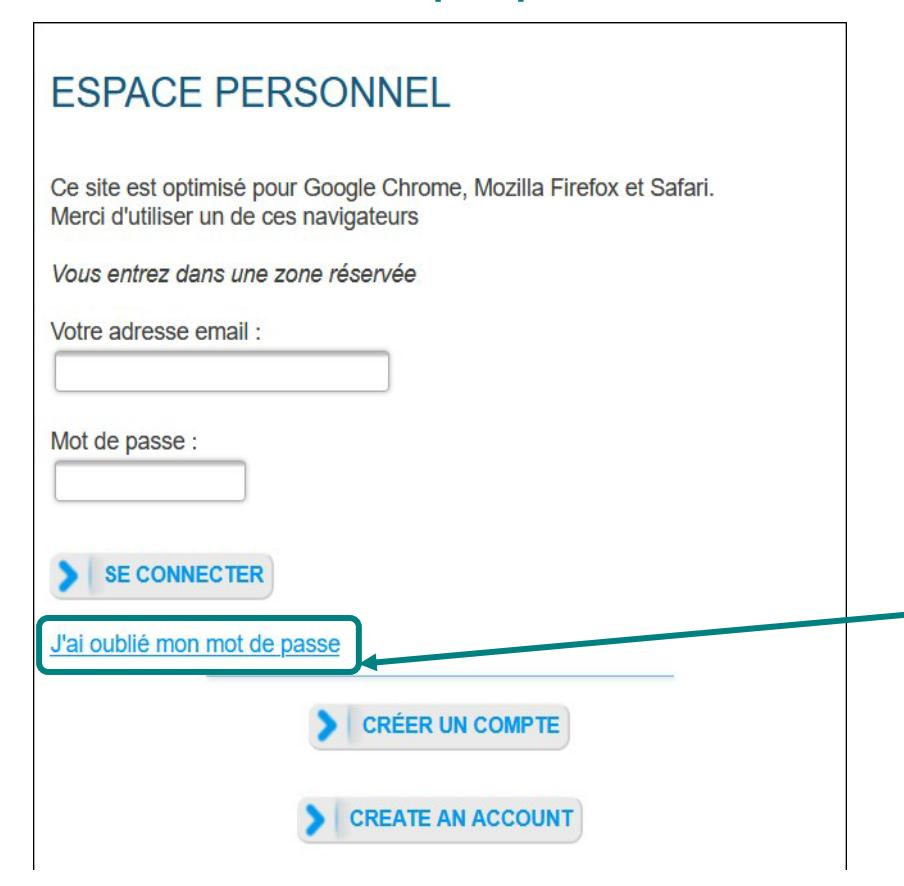
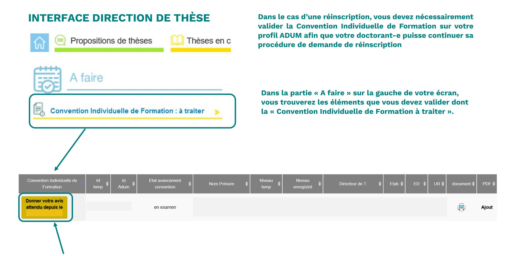
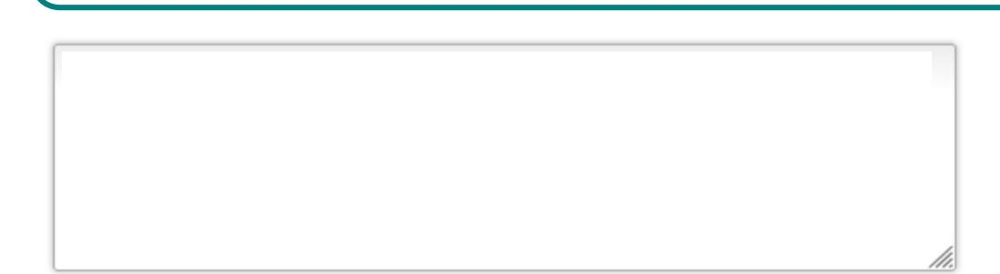
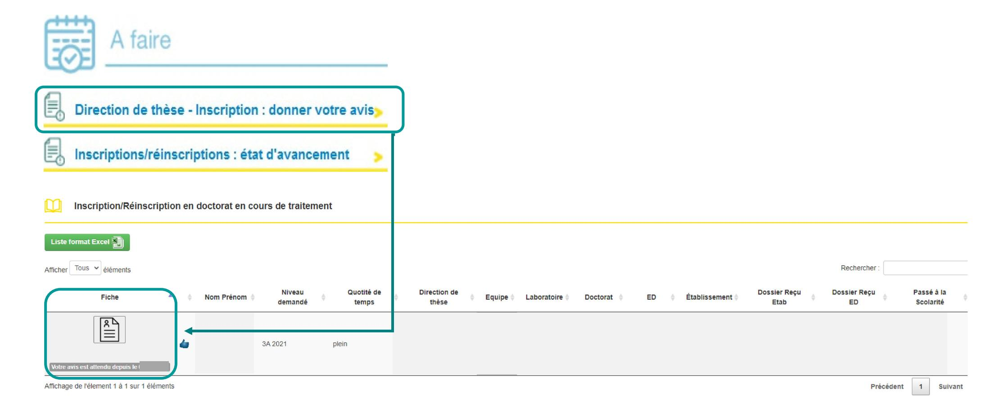
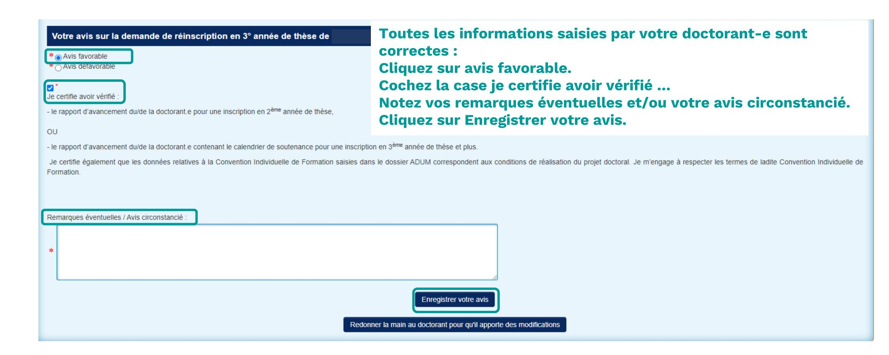
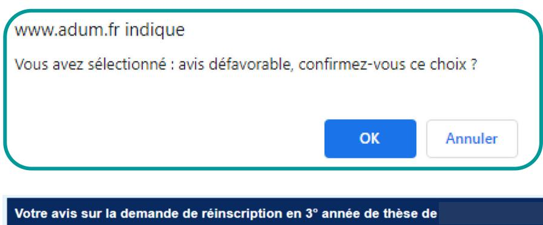
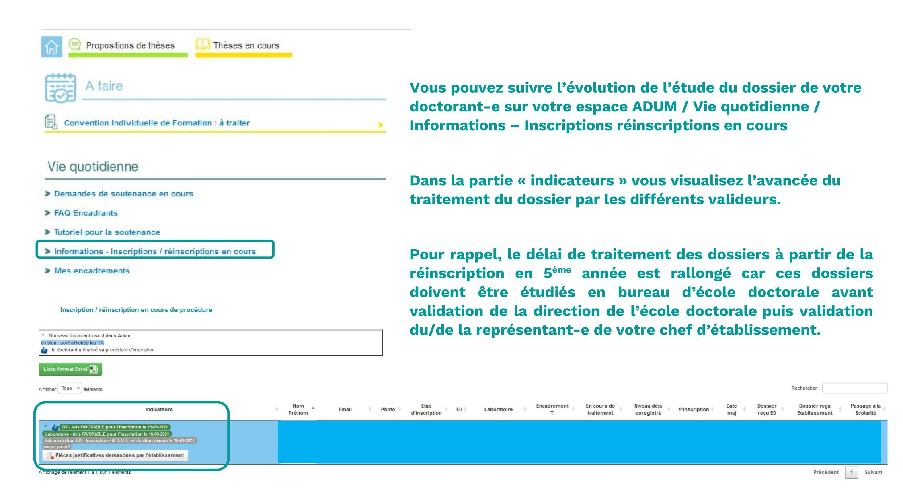

# DIRECTION DE THÈSE DONNER SON AVIS SUR LA CONVENTION INDIVIDUELLE DE FORMATION PUIS SUR UNE DEMANDE DE REINSCRIPTION

#### **INTERFACE CONNEXION**

 $\rightarrow$  Se connecter à son espace personnel via ce lien

Si vous n'avez pas connaissance de votre mot de passe, nous vous invitons à cliquer sur « *J'ai oublié mon mot de passe* » afin de le réinitialiser.

Cliquez ici pour accéder au contenu de la Convention Individuelle de Formation.

#### **TOUS LES CHAMPS DE CE FORMULAIRE SONT OBLIGATOIRES**

PENSEZ À SAUVEGARDER LA PAGE, sinon les données que vous avez entrées ne seront pas enregistrées.

#### Calendrier du projet de recherche :

Préciser les échéances prévisionnelles des étapes principales du projet doctoral jusqu'à la soutenance

- Durée prévue (3 ans à temps complet, entre 3 et 6 ans à temps partiel)
- Calendrier des séjours dans les deux pays si cotutelle internationale (à reporter dans le champ "Organisation de la cotutelle" de l'onglet "Cotutelle" de votre profil)
- Répartition du temps entre laboratoire académique et centre de recherche non académique (cas Cifre ou thèse en partenariat avec entreprise)
- Etapes et résultats du projet dans le cas d'un contrat de recherche partenariale.

|  | //. |
|--|-----|

Vérifiez toutes les données saisies par votre doctorant-e.

#### Modalités d'encadrement, de suivi de la formation et d'avancement des recherches de la thèse :

Préciser :

- les modalités décidées par l'Ecole doctorale pour le comité individuel de formation
- les prérequis spécifiques pour la soutenance (publications, heures ou crédits doctoraux ...) ou renvoyer à un règlement intérieur ED

| Conditions matérielles de réalisation du projet de recherche, le cas échéant, les conditions de sécurité spécifiques :  Préciser :  • Moyens et méthodes disponibles dans l'unité de recherche pour mener à bien le projet  • Préciser si des conditions spécifiques de sécurité sont requises pour ce projet doctoral, en plus de celles évoquées dans le règlement intérieur de l'unité de recherche                                                                                                                                                                                                                                                                                                         |  |  |  |
|----------------------------------------------------------------------------------------------------------------------------------------------------------------------------------------------------------------------------------------------------------------------------------------------------------------------------------------------------------------------------------------------------------------------------------------------------------------------------------------------------------------------------------------------------------------------------------------------------------------------------------------------------------------------------------------------------------------|--|--|--|
| Vérifiez toutes les données saisies par votre doctorant-e.                                                                                                                                                                                                                                                                                                                                                                                                                                                                                                                                                                                                                                                     |  |  |  |
| Modalités d'intégration dans l'unité ou l'équipe de recherche : Indiquer les méthodes d'intégration de l'unité de recherche, telles que des animations scientifiques ou d'intégration (offertes ou obligatoires), les éventuelles responsabilités collectives que le doctorant devra assumer au sein du laboratoire.  Un calendrier prévsionel du projet de recherche peut être précisé.                                                                                                                                                                                                                                                                                                                       |  |  |  |
|                                                                                                                                                                                                                                                                                                                                                                                                                                                                                                                                                                                                                                                                                                                |  |  |  |
| Parcours prévisionnel individuel de formation: A compléter: Liste des formations envisagées en lien avec votre projet professionnel : formations transversales, scientifiques et techniques Le collège doctoral regroupant les différentes écoles doctorales propose un ensemble de formations scientifiques disciplinaires, pluridisciplinaires et transversales telles que celles préparant à l'insertion professionnelle et aux métiers de l'enseignement. Elles sont présentées en début d'année universitaire et se déroulent en général au second semestre (https://collegedoctoral-cvi.fr/). D'autres formations plus spécifiques peuvent être suivies à l'extérieur et validées par l'école doctorale. |  |  |  |
|                                                                                                                                                                                                                                                                                                                                                                                                                                                                                                                                                                                                                                                                                                                |  |  |  |
| Objectifs de valorisation des travaux de recherche de la thèse : diffusion, publication et confidentialité, droit à la propriété intellectuelle selon le champ du programme de doctorat.  Préciser les objectifs de valorisation : diffusion, communications, publication et confidentialité, brevets (avec si possible des objectifs chiffrés), droit à la propriété intellectuelle selon le champ du programme de doctorat.                                                                                                                                                                                                                                                                                  |  |  |  |
|                                                                                                                                                                                                                                                                                                                                                                                                                                                                                                                                                                                                                                                                                                                |  |  |  |

| DEVELOPPEMENT DE COMPETENCES ET PERSPECTIVES PROFESSIONNELLES Indiquer :  • les compétences disciplinaires, thématiques et transverses, les compétences transférab  • les perspectives d'insertion professionnelle ou de poursuite de carrière au projet                                                                                                | oles qui pourront être acquises ou ont été acquises au cours du doctorat et qui pourront être valorisées lors de l'insertion professionnelle ou de la poursuite de carrière                                                                            |  |
|---------------------------------------------------------------------------------------------------------------------------------------------------------------------------------------------------------------------------------------------------------------------------------------------------------------------------------------------------------|--------------------------------------------------------------------------------------------------------------------------------------------------------------------------------------------------------------------------------------------------------|--|
| Mis.                                                                                                                                                                                                                                                                                                                                                    | Vérifiez toutes les données saisies par votre doctorant-e.                                                                                                                                                                                             |  |
|                                                                                                                                                                                                                                                                                                                                                         | pporteront une ouverture internationale, telle qu'une mobilité internationale envisagée pendant la thèse, en précisant l'objet : é de recherche pour acquérir une compétence particulière utile au projet, conférences et colloques internationaux. |  |
|                                                                                                                                                                                                                                                                                                                                                         |                                                                                                                                                                                                                                                        |  |
| Convention Individuelle de Formation                                                                                                                                                                                                                                                                                                                    |                                                                                                                                                                                                                                                        |  |
| O La convention individuelle de formation EST VALIDEE O La convention individuelle de formation nécessite des corrections O Candidat inconnu de l'enseignant-chercheur  Vous avez la possibilité de valider la CIF si toutes les données saisies sont correctes ou bien de redonner la main à votre doctorant-e afin qu'il corrige les données saisies. |                                                                                                                                                                                                                                                        |  |

Lorsque vous validez la CIF, un mail est envoyé à votre doctorant-e afin de finaliser sa demande d'inscription sur son profil personnel ADUM.

A la finalisation de la procédure de réinscription de votre doctorant-e, vous recevrez un mail vous invitant à vous reconnecter sur votre profil personnel ADUM afin de vérifier et valider sa demande de réinscription.

|                  |                      | -       | année de thèse | e en            |                     |           |
|------------------|----------------------|---------|----------------|-----------------|---------------------|-----------|
|                  |                      | ;> = | Vérifiez les   | informations sa | isies par votre dod | torant-e. |
| Préparation de l | a thèse réalisée à : |         |                |                 |                     |           |
| Ecole doctorale  | :                    |         |                |                 |                     |           |
| Spécialité docto | orale :              |         |                |                 |                     |           |
| Unité de recher  | che:                 |         |                |                 |                     |           |
| Première inscrip | otion en thèse :     |         |                |                 |                     |           |
| Encadrement de   | e la thèse :         |         |                |                 |                     |           |
| Identité         |                      |         |                |                 |                     |           |
| Genre :          | Née le               | à       |                |                 |                     |           |
| N° étudiant :    | N° INE :             |         |                |                 |                     |           |
| Nationalité :    |                      |         |                |                 |                     |           |
| E-mail:          |                      |         |                |                 |                     |           |

| Titre en français                                                                                       | *            |  |  |  |
|---------------------------------------------------------------------------------------------------------|--------------|--|--|--|
| Direction de thèse                                                                                      | quotité : *% |  |  |  |
| Mots clés                                                                                               | 1 - 2 -      |  |  |  |
|                                                                                                         | 3 - 4 -      |  |  |  |
|                                                                                                         | 5 - 6 -      |  |  |  |
| English title                                                                                           |              |  |  |  |
|                                                                                                         |              |  |  |  |
| Keyswords                                                                                               | 1-           |  |  |  |
|                                                                                                         | 3 - 4 -      |  |  |  |
|                                                                                                         | 5 - 6 -      |  |  |  |
| Résumé du projet de thèse en français                                                                   |              |  |  |  |
| Résumé du projet de thèse en anglais                                                                    |              |  |  |  |
| Description sur l'avancée de la thèse / DEVELOPPEMENT DE COMPETENCES ET PERSPECTIVES PROFESSIONNELLES : |              |  |  |  |
|                                                                                                         |              |  |  |  |
|                                                                                                         |              |  |  |  |

Vérifiez les informations saisies par votre doctorant-e.

Ces informations seront affichées sur le site de theses.fr

| Financement                                              |  |  |
|----------------------------------------------------------|--|--|
| Financement:                                             |  |  |
| Contrat :                                                |  |  |
| Durée :                                                  |  |  |
| Employeur:                                               |  |  |
| Origine des fonds :                                      |  |  |
| → Consulter la convention individuelle de formation      |  |  |
| → Consulter le rapport d'activité / avancement 2020-2021 |  |  |
| → Consulter la convention individuelle de formation      |  |  |

Vous devez télécharger et vérifier le rapport d'activité/avancement déposé par votre doctorant-e si les informations ne sont pas correctes vous devez redonner la main à votre doctorant-e afin qu'il/elle modifie les informations de son rapport.

Vous trouverez les modèles de rapport à respecter sur votre profil :

- 1 modèle de rapport pour les réinscriptions en 2ème et 3ème année
- 1 modèle de rapport pour les réinscriptions en 4ème année et plus

#### Conditions de finalisation acceptées par le doctorant le 05-05-2022

-Je certifie avoir déposé mon rapport d'avancement de thèse sur ADUM.

Je certifie que les données relatives à la Convention Individuelle de Formation saisies dans mon dossier ADUM correspondent aux conditions de réalisation de mon projet doctoral. Je m'engage à respecter les termes de ladite Convention Individuelle de Formation.

| Votre avis sur la demande de réinscription en 3° année de thèse de  * Avis favorable  Avis défavorable  Le certifie avoir vérifié:  - le rapport d'avancement du/de la doctorant e pour une inscription en 2ème année de thèse,  OU                                       | Si les informations saisies par votre doctorant-e ne sont pas correctes ou si le rapport d'activité/avancement n'est pas correct, vous pouvez lui redonner la main en cliquant sur Redonner la main au doctorant pour qu'il apporte des modifications.  Dans ce cas, il faudra envoyer à votre doctorant-e les informations à corriger par mail. |  |  |
|---------------------------------------------------------------------------------------------------------------------------------------------------------------------------------------------------------------------------------------------------------------------------|--------------------------------------------------------------------------------------------------------------------------------------------------------------------------------------------------------------------------------------------------------------------------------------------------------------------------------------------------|--|--|
| - le rapport d'avancement du/de la doctorant e contenant le calendrier de soutenance pour une inscription en 3 ème année de thèse et plus.                                                                                                                     |                                                                                                                                                                                                                                                                                                                                                  |  |  |
| Je certifie également que les données relatives à la Convention Individuelle de Formation saisies dans le dossier ADUM correspondent aux conditions de réalisation du projet doctoral. Je m'engage à respecter les termes de ladite Convention Individuelle de Formation. |                                                                                                                                                                                                                                                                                                                                                  |  |  |
| Remarques éventuelles / Avis circonstancié :                                                                                                                                                                                                                              |                                                                                                                                                                                                                                                                                                                                                  |  |  |
| ak .                                                                                                                                                                                                                                                                      |                                                                                                                                                                                                                                                                                                                                                  |  |  |
| Redonner la main au doctorant pour qu'il apporte des modifications                                                                                                                                                                                                        |                                                                                                                                                                                                                                                                                                                                                  |  |  |

Si vous cliquez sur avis défavorable, une fenêtre « Pop-Up » apparaît afin de confirmer votre choix.

Cochez la case je certifie avoir vérifié ... Notez vos remarques éventuelles et/ou votre avis circonstancié.

| Votre avis sur la demande de réinscription en 3° année de thèse de                                                                   | Cliquez sur Enregistrer votre avis.                                                                                                          |
|--------------------------------------------------------------------------------------------------------------------------------------|----------------------------------------------------------------------------------------------------------------------------------------------|
| * Avis favorable  * Avis défavorable                                                                                                 |                                                                                                                                              |
| Je certifie avoir vérifié :                                                                                                          |                                                                                                                                              |
| <ul> <li>le rapport d'avancement du/de la doctorant.e pour une inscription en 2ème année de thèse,</li> <li>OU</li> </ul> |                                                                                                                                              |
| - le rapport d'avancement du/de la doctorant.e contenant le calendrier de soutenance pour une inscription en 3ème ar                 | nnée de thèse et plus.                                                                                                                       |
| Je certifie également que les données relatives à la Convention Individuelle de Formation saisies dans le dossier à Formation.       | ADUM correspondent aux conditions de réalisation du projet doctoral. Je m'engage à respecter les termes de ladite Convention Individuelle de |
|                                                                                                                                      |                                                                                                                                              |
| Remarques éventuelles / Avis circonstancié :                                                                                         |                                                                                                                                              |
| 44:                                                                                                                                  |                                                                                                                                              |
|                                                                                                                                      | Enregistrer votre avis                                                                                                                       |
| Redonner la main a                                                                                                                   | u doctorant pour qu'il apporte des modifications                                                                                             |

## Vos contacts

### à l'université de Tours :

ED EMSTU - MIPTIS - SSBCV:
Isabelle Foulon \*\*2 + 33 2 47 36 66 75
\nisabelle.foulon@univ-tours.fr

ED H&L – SSTED :
Christèle Gaudron ☎ + 33 2 47 36 64 50

☑ christele.gaudron@univ-tours.fr

Université de Tours Service de la Recherche et des Etudes Doctorales 60 rue du Plat d'Etain – BP 12050 37020 TOURS Cedex 1 – France https://www.univ-tours.fr

## à l'INSA Centre Val de Loire:

Laura GUILLET ☎ + 33 2 48 48 07 61 ED EMSTU et MIPTIS ☑ laura.guillet@insa-cvl.fr

INSA Centre Val de Loire
Direction de la Recherche et de la
Valorisation
Etudes Doctorales

Campus de BOURGES 88 boulevard Lahitolle Technopôle Lahitolle CS 60013 18022 BOURGES CEDEX

Campus de BLOIS 3 rue de la Chocolaterie CS 23410 - 41034 BLOIS CEDEX http://www.insa-centrevaldeloire.fr

## A l'université d'Orléans:

ED secteur SST

Kathia FUSTER **2** + 33 2 38 41 73 61 ED SSTED ⊠ <u>edssted@univ-orleans.fr</u> ED H&L ⊠ <u>edhl@univ-orleans.fr</u>

Direction Recherche et Partenariats Pôle Recherche et Études Doctorales Bâtiment IRD 5 rue Carbone - BP 6749 45067 - Orléans Cedex 2 http://www.univ-orleans.fr/fr

https://collegedoctoral-cvl.fr