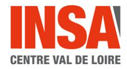
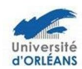
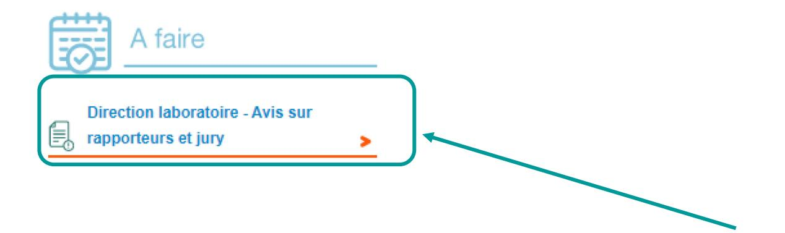
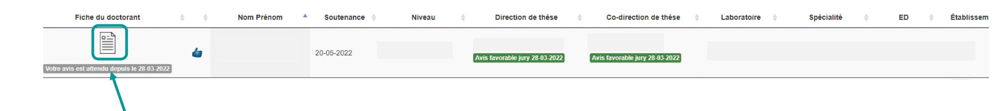
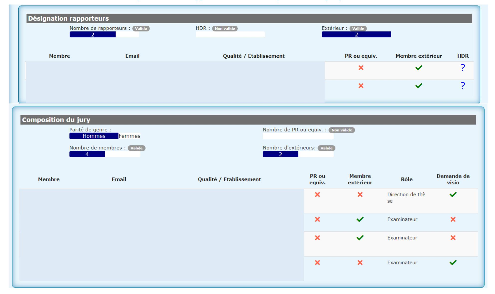

## Tutoriel de validation du jury et des rapporteurs par la Direction de Laboratoire

→ Se connecter à son espace personnel via <u>adum.fr / intranet</u>

| ESPACE PERSONNEL                                                                                              |  |
|---------------------------------------------------------------------------------------------------------------|--|
| Ce site est optimisé pour Google Chrome, Mozilla Firefox et Safari. Merci d'utiliser un de ces navigateurs |  |
| Vous entrez dans une zone réservée                                                                            |  |
| Votre adresse email :                                                                                         |  |
| Mot de passe :                                                                                                |  |
| J'ai oublié mon mot de passe                                                                                  |  |
| CRÉER UN COMPTE                                                                                               |  |
| > CREATE AN ACCOUNT                                                                                           |  |

Si vous n'avez pas connaissance de votre mot de passe, nous vous invitons à cliquer sur « <u>J'ai oublié mon mot de passe</u> » afin de le réinitialiser.

# **Cliquez sur Direction laboratoire – Avis sur rapporteurs et jury**

Cliquez sur la fiche pour donner votre avis

# Désignation des rapporteurs et des membres du jury de soutenance de thèse

| NOM Prénom [Consu                 | ılter le manuscrit de thèse ici]                                                                        |
|-----------------------------------|---------------------------------------------------------------------------------------------------------|
| Ecole doctorale :                 |                                                                                                         |
|                                   |                                                                                                         |
| Unité de recherche :              |                                                                                                         |
| Spécialité :                      |                                                                                                         |
| Sujet de thèse français :         |                                                                                                         |
| Sujet de thèse anglais :          |                                                                                                         |
| Mots clés français :              |                                                                                                         |
| Mots clés anglais :               |                                                                                                         |
| Résumé français :                 | afficher/cacher le résumé  Vous pouvez visualiser les résumés en français et en anglais en cliquant ici |
| Résumé anglais :                  | afficher/cacher le résumé                                                                               |
|                                   |                                                                                                         |
| Soutenance le 20 mai 2022 à 10h00 |                                                                                                         |
| Lieu de la soutenance :           |                                                                                                         |
| La soutenance est publique        |                                                                                                         |
|                                   |                                                                                                         |

| DIRECTION DE LA THÈSE                                         |  |  |
|---------------------------------------------------------------|--|--|
|                                                               |  |  |
| Direction de thèse :                                          |  |  |
| Titre : Etablissement de rattachement :                       |  |  |
| Unité de recherche :                                          |  |  |
| Courriel:                                                     |  |  |
|                                                               |  |  |
| Co-direction de thèse :                                       |  |  |
| Titre : Etablissement de rattachement :                       |  |  |
| Unité de recherche :                                          |  |  |
| Téléphone : Courriel :                                        |  |  |
|                                                               |  |  |
| Co-encadrant de thèse :                                       |  |  |
| Titre : Etablissement de rattachement :                       |  |  |
| Unité de recherche :                                          |  |  |
| Téléphone : Courriel :                                        |  |  |
|                                                               |  |  |
|                                                               |  |  |
| → CONSULTER LE PORTFOLIO DU DOCTORANT                         |  |  |
| → Etablissement - pièces complémentaires pour la soutenance : |  |  |

## Tableau récapitulant les rapporteurs et la composition du jury à titre indicatif.

#### AVIS DE LA DIRECTION DE LA THÈSE

Direction de la thèse, a donné un avis favorable sur la désignation des rapporteurs et la composition du jury de soutenance de thèse le 28 mars 2022

#### AVIS DE LA CODIRECTION DE LA THÈSE

Co-direction de la thèse, a donné un avis favorable sur la désignation des rapporteurs et la composition du jury de soutenance de thèse le 28 mars 2022

Votre avis sur la désignation des rapporteurs et la composition du jury de soutenance de thèse de

\* Avis favorable

## Vos contacts

### à l'université de Tours :

ED EMSTU - MIPTIS - SSBCV:
Isabelle Foulon \*\*2 + 33 2 47 36 66 75
\nisabelle.foulon@univ-tours.fr

ED H&L – SSTED :
Christèle Gaudron ☎ + 33 2 47 36 64 50

☑ christele.gaudron@univ-tours.fr

Université de Tours Service de la Recherche et des Etudes Doctorales 60 rue du Plat d'Etain – BP 12050 37020 TOURS Cedex 1 – France https://www.univ-tours.fr

### à l'INSA Centre Val de Loire:

Laura GUILLET ☎ + 33 2 48 48 07 61 ED EMSTU et MIPTIS ☑ laura.guillet@insa-cvl.fr

INSA Centre Val de Loire
Direction de la Recherche et de la
Valorisation
Etudes Doctorales

Campus de BOURGES 88 boulevard Lahitolle Technopôle Lahitolle CS 60013 18022 BOURGES CEDEX

Campus de BLOIS 3 rue de la Chocolaterie CS 23410 - 41034 BLOIS CEDEX http://www.insa-centrevaldeloire.fr

### A l'université d'Orléans:

ED secteur SST

Kathia FUSTER **2** + 33 2 38 41 73 61 ED SSTED ⊠ <u>edssted@univ-orleans.fr</u> ED H&L ⊠ <u>edhl@univ-orleans.fr</u>

Direction Recherche et Partenariats Pôle Recherche et Études Doctorales Bâtiment IRD 5 rue Carbone - BP 6749 45067 - Orléans Cedex 2 http://www.univ-orleans.fr/fr

https://collegedoctoral-cvl.fr