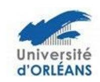
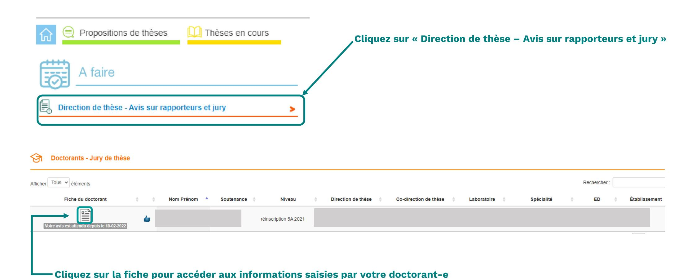
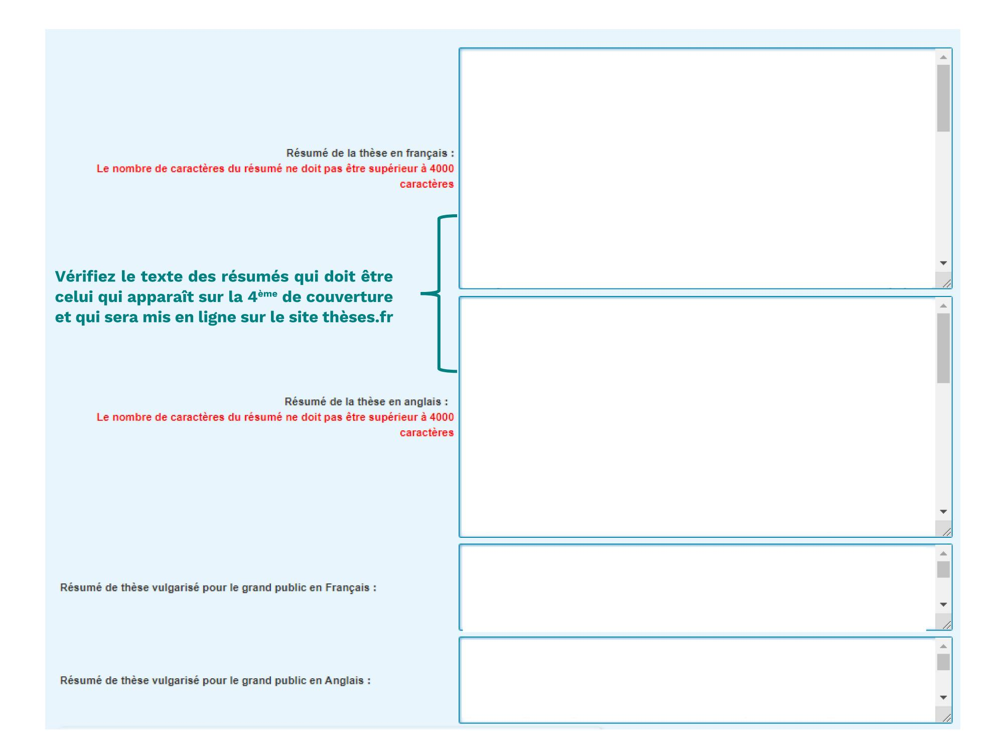
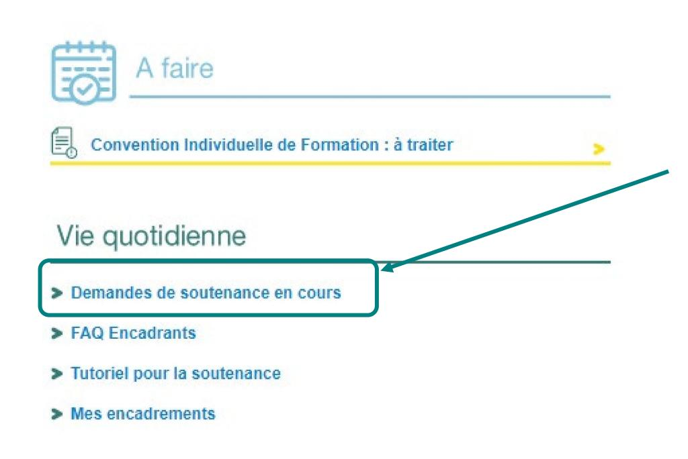
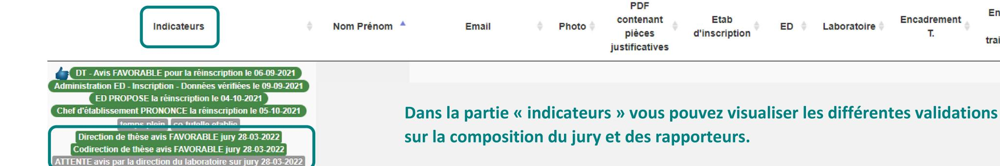
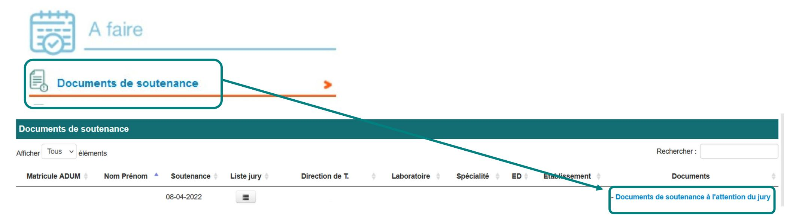
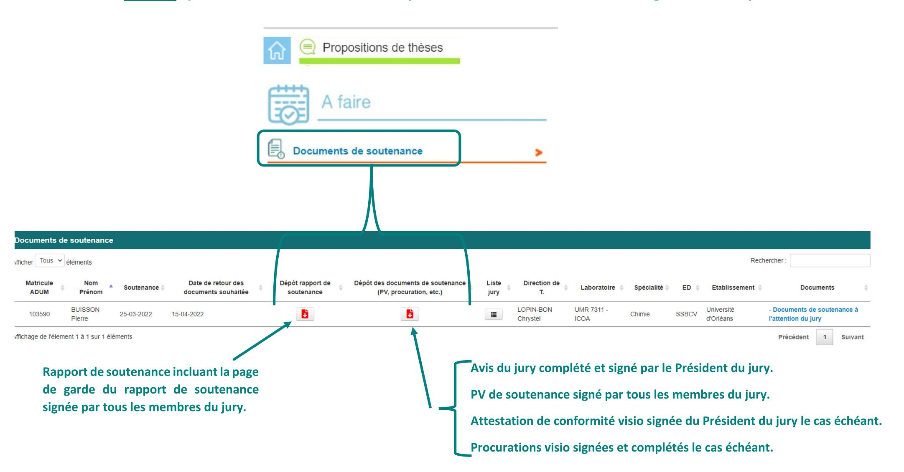

## Tutoriel de validation du jury et des rapporteurs par la Direction de thèse

→ Se connecter à son espace personnel via <u>adum.fr / intranet</u>

| ESPACE PERSONNEL                                                                                              |
|---------------------------------------------------------------------------------------------------------------|
| Ce site est optimisé pour Google Chrome, Mozilla Firefox et Safari. Merci d'utiliser un de ces navigateurs |
| Vous entrez dans une zone réservée                                                                            |
| Votre adresse email :                                                                                         |
| Mot de passe :                                                                                                |
| > SE CONNECTER                                                                                                |
| <u>J'ai oublié mon mot de passe</u>                                                                           |
| > CRÉER UN COMPTE                                                                                             |
| > CREATE AN ACCOUNT                                                                                           |

Si vous n'avez pas connaissance de votre mot de passe, nous vous invitons à cliquer sur « <u>J'ai oublié mon mot de passe</u> » afin de le réinitialiser.

# → La Direction de thèse vérifie les informations relatives à la demande de soutenance

| Avis sur la désignation des rapporteurs et des membres du jury de soutenance de thèse  |
|----------------------------------------------------------------------------------------|
| [Consulter le manuscrit de thèse ici]                                                  |
| Ecole doctorale :                                                                      |
| Unité de recherche :                                                                   |
| Spécialité :                                                                           |
| DIRECTION DE LA THÈSE                                                                  |
| Direction de thèse :                                                                   |
| Titre : Etablissement de rattachement : Unité de recherche :                           |
| Courriel:                                                                              |
| Co-direction de thèse :  Titre : Etablissement de rattachement :  Unité de recherche : |
| Téléphone : Courriel :                                                                 |
| Co-encadrant de thèse : Titre : Etablissement de rattachement : Unité de recherche :   |
| Téléphone : Courriel :                                                                 |

| Titre ∎ ■                                                 |                                                        |
|-----------------------------------------------------------|--------------------------------------------------------|
| Titre <b>≡</b>                                            |                                                        |
| Mots clés 💵                                               | 1- 4-                                                  |
|                                                           | 2 - 5 -                                                |
|                                                           |                                                        |
|                                                           | 3- 6-                                                  |
| Mots clés 🟣                                               | 14                                                     |
|                                                           | 2 - 5 -                                                |
|                                                           | 3 - 6 -                                                |
| Etablissement - Date autorisation visioconférence:        | non renseignée                                         |
| Langue de rédaction du manuscrit :                        | ✓ Date autorisation : □                                |
| Langue de soutenance de la thèse                          | ✓   Date autorisation soutenance en langue étrangère : |
| Label européen : non 🗸                                    |                                                        |
| Visibilité de la soutenance :                             | publique 🗸                                             |
| Thèse sur travaux :                                       | non 🗸                                                  |
| Date de la soutenance :                                   |                                                        |
| Heure de la soutenance :                                  | ~ H ~                                                  |
|                                                           |                                                        |
| URL de la salle virtuelle de soutenance ouverte au public |                                                        |
| URL de la salle virtuelle pour les débats du jury         |                                                        |
| Salle de la soutenance :                                  |                                                        |
|                                                           |                                                        |
| Adresse de la soutenance :                                |                                                        |

| Thèse confidentielle demandée : non   Thèse sous embargo demandée : si oui => date de fin de l'embargo  Section CNU : | ⊞ Si la date de fin de l'embargo n'est pas renseignée, l'embargo ne sera pas enregistré ✓ |
|-----------------------------------------------------------------------------------------------------------------------|-------------------------------------------------------------------------------------------|
| Membres du jury :  Membre n°1 - demande de visio-conférence :                                                         |                                                                                           |
| Civilité :  Qualité pour la soutenance :  Téléphone :                                                                 | Nom: Prénom:                                                                              |
| Etablissement de rattachement : Grade :                                                                               | PR ou equiv. :                                                                            |
| Adresse :                                                                                                             | Code postal : Ville : Pays :                                                              |
| E-mail                                                                                                                | _                                                                                         |
| HDR Identifiants                                                                                                      | ORCID: Date: V V  ORCID: -Idref:  Membre extérieur: V                                     |

Bien vérifier toutes les adresse mails car l'école doctorale communiquera uniquement par mail avec les membres du jury. S'il y a une erreur sur l'adresse mail d'un des rapporteurs, celui-ci ne pourra pas déposer son rapport sur ADUM.

| Dépôt électronique de la thèse                                                                                    |
|-------------------------------------------------------------------------------------------------------------------|
| Mémoire de thèse version archivage :  1º dépôt Nom :  Télécharger fichier   Taille :  Date de dépôt : 1er dépôt : |
| → CONSULTER LE PORTFOLIO DU DOCTORANT ←                                                                           |
| → Tableaux de vérification rapporteurs et composition du jury de soutenance                                       |
| — Si votre doctorant-e a déjà déposé son manuscrit, vous pouvez le consulter ici.                                 |
| Vous pouvez consulter le portfolio de votre doctorant-e ici.                                                      |

Les tableaux de vérification des rapporteurs et composition du jury de soutenance est à titre indicatif et ne prévaut pas de sa validation par la direction de l'école doctorale et du chef d'établissement.

| Votre avis sur la désignation des rapporteurs et la composition du jury de soutenance de thèse de Zara FRANCHESCHINI, sous réserve de l'avis des rapporteurs  * Avis favorable  * Avis défavorable                                                                                                          |  |  |  |
|-------------------------------------------------------------------------------------------------------------------------------------------------------------------------------------------------------------------------------------------------------------------------------------------------------------|--|--|--|
| ☐ Je certifie que mon/ma doctorant-e a été sensibilisé-e au plagiat, et notamment aux sanctions encourues en cas de plagiat avéré de son tapuscrit. Le plagiat constitue une fraude et peut donner lieu à des poursuites disciplinaires, sans préjuger, par ailleurs, des poursuites pénales et/ou civiles. |  |  |  |
| Vous pouvez enregistrer votre avis ou redonner la main à votre doctorant.e si des modifications sont nécessaires.                                                                                                                                                                                           |  |  |  |
| Votre proposition sur la participation partielle du doctorant et des membres du jury à la soutenance de thèse en visioconférence :   * Avis favorable * Avis défavorable  Enregistrer votre avis  Redonner la main au doctorant pour qu'il apporte des modifications                                        |  |  |  |
| retour à la liste                                                                                                                                                                                                                                                                                           |  |  |  |

co-tutelle etablie

Vous pouvez ensuite suivre le traitement du dossier de votre doctorant-e en vous rendant sur votre profil ADUM dans la partie « Vie quotidienne »

« Demandes de soutenance en cours »

En cours

de

traitement

Encadrement

T.

Lorsque la soutenance est validée par le/la représentant-e du Chef d'établissement concerné, suite au dépôt des prérapports de soutenance sur ADUM par les rapporteurs, vous recevez un mail vous invitant à télécharger les douments de soutenance sur votre profil ADUM.

Attention, les documents de soutenance sont à imprimer en mode Recto.

Pour rappel la liste des documents que vous trouerez dans le fichier PDF :

- Avis du jury sur la diffusion de la thèe
- Procès Verbal de soutenance
- Page de garde du Rapport de soutenance
- Attestation de conformité visio le cas échéant
- Note à l'attention du jury

## Dépôt des documents après soutenance sur ADUM

Au maximum 15 jours après la soutenance, vous devez déposer les documents de soutenance signés sur votre profil ADUM

## Vos contacts

#### à l'université de Tours :

ED EMSTU - MIPTIS - SSBCV:
Isabelle Foulon \*\*2 + 33 2 47 36 66 75
\nisabelle.foulon@univ-tours.fr

ED H&L – SSTED :
Christèle Gaudron ☎ + 33 2 47 36 64 50

☑ christele.gaudron@univ-tours.fr

Université de Tours Service de la Recherche et des Etudes Doctorales 60 rue du Plat d'Etain – BP 12050 37020 TOURS Cedex 1 – France https://www.univ-tours.fr

### à l'INSA Centre Val de Loire:

Laura GUILLET ☎ + 33 2 48 48 07 61 ED EMSTU et MIPTIS ☑ laura.guillet@insa-cvl.fr

INSA Centre Val de Loire
Direction de la Recherche et de la
Valorisation
Etudes Doctorales

Campus de BOURGES 88 boulevard Lahitolle Technopôle Lahitolle CS 60013 18022 BOURGES CEDEX

Campus de BLOIS 3 rue de la Chocolaterie CS 23410 - 41034 BLOIS CEDEX http://www.insa-centrevaldeloire.fr

### A l'université d'Orléans:

ED secteur SST

Kathia FUSTER **2** + 33 2 38 41 73 61 ED SSTED ⊠ <u>edssted@univ-orleans.fr</u> ED H&L ⊠ <u>edhl@univ-orleans.fr</u>

Direction Recherche et Partenariats Pôle Recherche et Études Doctorales Bâtiment IRD 5 rue Carbone - BP 6749 45067 - Orléans Cedex 2 http://www.univ-orleans.fr/fr

https://collegedoctoral-cvl.fr