Création d'un compte doctorant sur ADUM

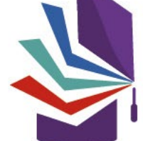

Accès Doctorat Unique Mutualisé www.collegedoctoral-cvl.fr

# Il Est Impératif D'Avoir L'Accord D'Une Direction De Thèse Avant De Commencer Cette Démarche.

Pour rappel, les dossiers de demande d'inscriptions en doctorat doivent se faire entre le 1er juin et le 15 novembre de l'année universitaire en cours. Votre profil ne doit pas être créé en dehors de ces dates sauf exception particulière à vérifier auprès de votre gestionnaire d'école doctorale avant d'entamer votre démarche de création de compte. Vous devez créer votre compte personnel sur l'application ADUM via ce lien : https://adum.fr Afin de compléter votre profil ADUM, pensez à vous munir des documents et/ou informations suivants afin de renseigner certaines données :
 Votre code INE (Identifiant National Etudiant) disponible sur votre relevé de note du Baccalauréat français, ou sur vos relevés de notes de 

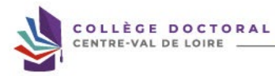

l'enseignement supérieure si vous avez obtenu un diplôme en France ultérieurement, Votre parcours de formation en études supérieures (Licence, Master 1, etc.),
 Votre diplôme de Master 2 ou équivalent (relevés de notes en sus du Master 2 si diplôme obtenu à l'étranger), Votre financement : attestation de contrat doctorale, attestation ANRT dans le cadre d'une CIFFRE, contrat de travail ou attestation de l'employeur, attestation de bourse, Votre projet de thèse, titres de thèse, mots clés et résumés, le tout en français et en anglais.

, DE SERVICES, DE COMMUNICATION DES DOCTORANTS & DOCTEURS

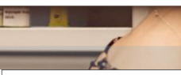

L'ADUM
MON COMPTE ADUM

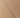

ACTU RECHERCHE

EMPLOI
espace personnel

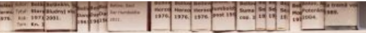

Recherchez sur ADUM ...

## Connexion Espace Personnel

 Ce site est optimisé pour Google Chrome ou Mozilla Firefox. Merci d'utiliser un de ces navigateurs.

ldentification Votre adresse e-mail Mot de passe :

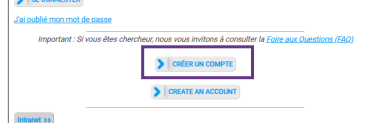

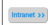

 Liespece personnel ADUM est l'espace unique dédié à toutes les démande ou de validation d'inscription, de réinscription et de soutenance de thèse.

Il permet :
 · d'accéder au dossier qui regroupe toutes les informations relatives au doctorat
 ·  de modifier ou rectifier les données vous concernant
- de déposer des pièces administratives nécessaires à l'organisation du doctorat
· d'accéder aux services du réseau ADUM :
 · offres d'emploi · actualités du doctorat
- d'enrichir votre profil de compétences
 ·  de vous inscrire aux formations
· d'assurer la diffusion en ligne des thèses sur theses.fr L'ADUM est un outil de gestion et une base de données partagés entre les acteurs des études doctorales : doctorants, docteurs, chercheurs, direction de thèses, direction de laboratoire, direction d'Ecole doctorale, gestionnaires administratifs et pédagogiques des études/écoles doctorales, responsable de bibliothèque, direction recherche, Collège Doctoral.

 La qualité des données présentes dans l'ADUM est certifiée par les personneis habilités des établissements utilisant l'outil. Les données sont gérées exclusivement par des personnels de l'établissement dédiés à cette mission.

 Cookies : En vous connectant vous transmettez un ou plusieurs cookies à votre ordinateur (ou autre appareil).

 Nous utilisons ces cookies uniquement pour faciliter votre navigation.

 Ces cookles ne sont pas conservés et ne sont pas exploités et ne servent qu'à gérer les sessions, ils sont détruits au redémarrage du navigateur.

 En cas de problème technique, vous pouvez nous contacter à l'adresse suivante : webmaster@adum.fr Vous pouvez également consulter la FAQ concernant l'espace personnel des doctorants.

 Pour toute autre demande, nous vous invitons à contacter directement l'école doctorale concernée ou à consulter leur site web.

Cliquez sur « CRÉER UN COMPTE »

## Vous Souhaitez Créer Un Compte ?

 Créer un compte vous permet de gérer et suivre vos demandes d'inscription et réinscription en thèse ou votre demande d'autorisation de soutenance. Vos données à caractère personnel seront traitées dans le cadre de l'exécution d'une mission de service public permettant la gestion du doctorat et la délivrance du diplôme Préparez les éléments nécessaires à la création de votre compte afin de ne pas perdre de temps dans la saisie de votre dossier. Ce compte permettra également :
de gagner du temps au moment des réinscriptions · de stocker les données descriptives de la thèse et du suivi du travail de recherche - de consulter et s'inscrire aux formations -   de disposer d'un portefeuille d'expériences et de compétences dans lequel sont saisis des éléments susceptibles de nourrir un CV -  d'accéder et recevoir des infrormations relatives au doctorat telles que : actualités de l'école doctorale, de Tétablissement, offres de formation, annonces des soutenan Sécurité Nous attachans une grande inportance à la qualife et il a protection des données pesonnelles. Tou doctorant ou docteur peut ainsi metro à jour à tou mornet le sinfromations publiées ou pas sur le web.

 Le traitement a pour finalité la collecte et la diffusion d'informations concernant les doctorants et les docteurs pour la gestion et l'inimation de la vie doctraile et l'a Définissez ci-dessous vos identifiants Indiquez une adresse mail valide que vous utilisez régulièrement.

m 12 caractères, dont 1 majuscule (a-Z), 1 minuscule (a-z), 1 chiffre (0-9) et 1 caractère spécial (84(1?@S*= -). Attention, choisir un mot de passe dédié à cotte applicatio Respectez les préconisations pour la création du mot de passe.

nant cette case et en soumettant ce formulaine, je comprends que les riformations saisies seunt exploitées dans le cade de la gestion du docurat. Le recomais aroin la Politi Lisez la Politique de protection des données à caractère personnel avant de cocher la case.

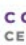

Cliquez pour créer votre profil ADUM.

 www.collegedoctoral-cvl.fr

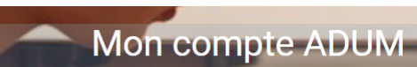

# Création Du Compte Personnel

 Votre demande de création de compte est en cours, vous allez recevoir un e-mail afin de vérfifer la validité de votre adresse e-mail. Merci de cliquer sur le lien présent dans l'e-mail afin d'activer votre compte.

 Attention : ce lien ne sera valide que 24 heures.

De : Doctorat <noreply@adum Date:
Subject: [ADUM] Création Profi To: < | Banjour, Vous avez demandé la création d'un compte dans le cadre de la gestion de votre doctorat.

En actionne vote pour ple ADVA, vous donner votre por le trailement de vous conseise à caractere personnel dans le este de l'evésution d''une misison de venision de veniste ées a t'uniève de manièm l'oysale et l'Elith, cian un priecipe de ransens les subscriment. Les cornées sont desquiement, Las cornées sont auxergird des frauliès pour la nous Pour activer votre compte, nous vous invitons à cliquer aur le lien ci-dessous um.fr/ghd/profil/nwwprofi.pl?tk=liue9x2mbK0fsLOwelyy9NbUZNKTZQU1za0Aggo01821BydrVParXD5GFI8/W
Ce lien pera actif 24 heure.

Si vous n'avez pas effectué de demande de création de compte ou si vous ne souhaitez pas poursuivre votre commonde, vous pouvez ignorer cet email Cordialement L'équipe ADUM
Madam, Sir, You have asked to create an account to manage your doot Ily activating (sou ADUH bacount, you ane giving your consent for your personal dital to be processed as part of the pablic service missien et managing dectores and monitori Des in collacted end processad hiriy and landlig, in escedures with the principle of transponsers; danig (processint). Det in udequals in vidation to tre supesse de which: N
To activate your account, click on the link below.

://edum.tr/ghd/grofil/newprofil.pl?tik=0ue9vQrabKGfsLOswLyy9lbUZNKT7QU1za0Agoc

This link will be active for 24 hours If you have not made a request to create an account or il you do not wish to continue your Regards, ADUM Team Il se peut que vous receviez ce message à des heures matinales, tardives ou le Il ne nécessite, en aucune façon, une réponse de votre part en dehors des heures Vous allez recevoir un mail de noreply@adum.fr avec le lien d'activation de votre compte.

Attention, celui-ci est valable 24 heures !

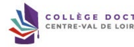

Adum vous propose ensuite de compléter votre dossier de demande d'inscription en première année de doctorat.

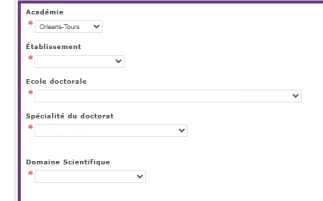

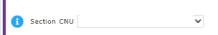

Assurez-vous d'avoir les bonnes informations pour 

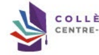

compléter cette partie auprès de votre direction de thèse !

Cliquez sur « créer mon profil » pour passer à la suite de votre dossier.

Faites passer tous les onglets au vert.

 Pour cela, vous devez compléter tous les éléments signalés d'un * rouge.

N'oubliez pas de sauvegarder à chaque étape ! 

www.collegedoctoral-cvl.fr 6 Nom de naissance 1 Nom d'usage

Deuxième prénom Prénom(s) supplémentaire(s)

Prénom d'usage Date de naissance Pays de naissance
>
Ville de naissance Nationalité Deuxième nationalité
 >
Catégorie socio-professionnelle du parent 1 v Catégorie socio-professionnelle du parent 2
>
 Genre

® O Féminin * - Masculin

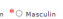

Situation de handicap (

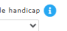

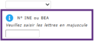

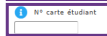

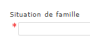

Votre nº INE se trouve sur votre dernier relevé de notes de Master ou sur votre relevé de notes du baccalauréat.

Si vous avez un baccalauréat étranger et que vous n'avez jamais été incrit·e en université française vous n'avez pas de n° INE il faut donc insérer des zéros.

Indiquez le nº de carte étudiant uniquement si vous avez déjà été inscrit dans l'établissement d'inscription de votre doctorat.

Vous devez renseigner tous les items signalés d'un * rouge !

## Www.Collegedoctoral-Cvl.Fr

Coordonnées Téléphone Portable Adresse électronique principale (identifiant de connexion ADUM)
Adresse électronique professionnelle / institutionnelle Site Internet personnel Identifiant ORCID D Identifiant IdHAL (
Compte LinkedIn Compte Twitter Compte Researchgate (

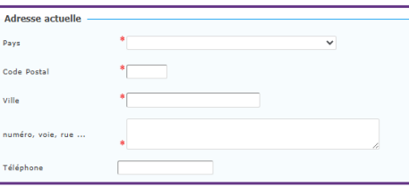

Elément indispensable pour votre connexion à votre compte ADUM et la réception des mails concernant votre parcours doctoral.

Ces identifiants seront importants en tant que chercheur/chercheuse.

Renseignez-vous auprès de votre direction de thèse pour savoir comment les créer.

Eléments nécessaire pour l'envoi de votre attestation d'inscription et votre carte d'étudiant•e.

~ Adresse professionnelle -
Pays
>
 Code Postal Ville numéro, voie, rue ...

li Téléphone
← Adresse familiale ou permanente –
Pays Code Postal Ville numéro, voie, rue ...

li Téléphone

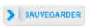

CTORAL

 >
Diplôme permettant l'accès en doctorat Pays
 &

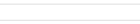

>
Ville
 & (
Etablissement SC

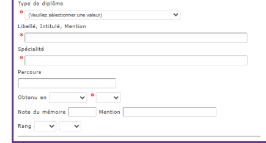

Déroulement de la scolarité Avez-vous l'agrégation ? - oui - non Dans quelle discipline ?

Avez-vous un diplôme d'ingénieur ? - oui - non
 
Année d'entrée dans l'enseignement supérieur français :

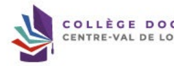

>
ORAL
Diplôme de Master 2 ou équivalent.

 Indiquer ci-dessous vos diplômes, du baccalauréat au dernier diplôme obtenu avant le diplôme permettant l'accès en doctorat. Pour supprimer un diplôme renseigné par erreur : vider le champ "Type de diplôme".

� Baccalauréat ou équivalence Ajouter n°1 Type de diplôme
* | Baccalauréat ou équivalence Catégorie x

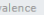

 Pays
*
Ville Etablissement

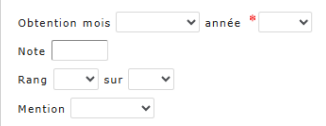

DRAL
Informations sur votre diplôme du baccalauréat ou équivalent.

www.collegedoctoral-cvl.fr

>
� Baccalauréat ou équivalence 
� Licence Ajouter n°2 Type de diplôme Licence Intitulé, Série ou Option Pays Ville Etablissement

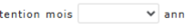

>

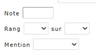

Information sur votre diplôme de Licence ou équivalent.

TORAL
>
www.collegedoctoral-cvl.fr

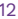

� Baccalauréat ou équivalence   - Licence 
� Master 1 Ajouter n°3 Type de diplôme Master 1 Intitulé, Série ou Option Pays Ville
>
Etablissement Obtention mois

▼ année

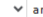

>

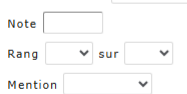

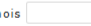

Information sur votre diplôme de Master 1 ou équivalent.

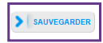

TORAL
www.collegedoctoral-cvl.fr Vérifiez toutes les informations auprès de votre direction de thèse avant de sauvegarder. 

Date prévisionnelle d'entrée en doctorat, cette date sera mise à jour lors de votre inscription administrative en 1ère année de thèse.

Vous devez être rattaché à l'établissement, école doctorale et laboratoire dont dépend votre direction de thèse principale. La spécialité du doctorat ainsi que le domaine scientifique et la CNU doivent correspondre à celles de votre direction de thèse.

Si vous cochez « Formation tout au long de la vie/Continue » n'oubliez pas de contacter le service compétent de votre établissement de rattachement en parallèle de votre dossier de demande d'inscription en doctorat, et ce avant la finalisation de celui-ci : - **INSA : laura.guillet@insa-cvl.fr** - **Université d'Orléans : sefco@univ-orleans.fr** - Université de Tours : formation-continue@univ-tours.fr Attention : il n'est pas possible de faire un doctorat en VAE au sein du collège doctoral CVL.

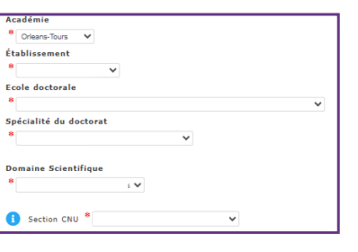

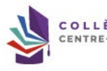

www.collegedoctoral-cvl.fr 14

Financement Conditions financières à l'entrée du doctorat
* ® Financement dédié à la préparation du doctorat
� - Financement non dédié à la préparation du doctorat Détail situation financière Statut/Type de contrat de travail
>

Employeur Faites attention de bien renseigner le type de financement, le type de contrat et l'origine des fonds ainsi que les dates qui correspondent au contrat. Vous devez obligatoirement fournir un justificatif correspondant à votre déclaration.

Si vous n'êtes pas financé pour la thèse vous devez justifier de vos ressources financières.

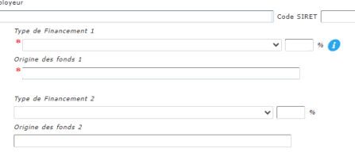

Nom de l'appel à projet Période situation du au Effectuez-vous des missions complémentaires Si vous êtes financé e pour votre thèse et que vous effectuez une mission complémentaire merci de l'indiquer et de Continuer à compléter la fiche. Sinon cliquez sur SAUVEGARDER.

Ajouter une nouvelle situation financière

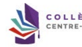

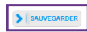

www.collegedoctoral-cvl.fr Effectuez-vous des missions complémentaires ? ® oui - non

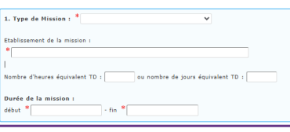

Cette partie est à compléter si vous êtes financé•e pour votre thèse et que vous effectuez une mission complémentaire.

2. Type de Mission :

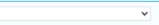

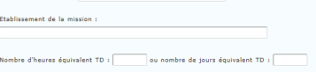

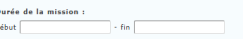

 début

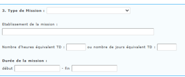

> | Ajouter une nouvelle situation financière

Déroulement du doctorat Attention ! Ces données seront publiées sur internet : http://www.theses.fr/
Votre thèse implique t-elle un traitement de données à caractère personnel ? * - Oui * - Non * ® À déterminer Merci de prendre rapidement rendez-vous avec le délégué à la protection des données de votre établissement : 
Titre de la thèse en français Titre de la thèse en anglais

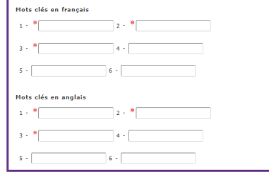

Unité de recherche
>
 Si votre unité de recherche ne se trouve pas dans la liste, vous devez contacter votre école doctorale Unité de recherche secondaire (libellé, type, Nº, URL)

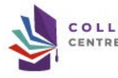

Vous devez impérativement indiquer si votre thèse implique un traitement de données à caractère personnel. Dans le doute, n'hésitez pas à prendre contact avec le délégué à la protection des données personnelles de votre établissement.

Le titre de la thèse et le mots clés doivent obligatoirement être indiqués en langue française et en langue anglaise et apparaîtrons sur le site theses.fr Pensez à vérifier le nom de votre unité de recherche auprès de votre direction de thèse.

www.collegedoctoral-cvl.fr

Pensez à vérifier les informations et notamment la quotité d'encadrement auprès de votre direction de thèse. Une codirection doit avoir l'HDR, un co-encadrement n'a pas l'HDR (Habilitation à Diriger des Recherches). Si le nom de la codirection ou du co-encadrement n'apparait pas dans la liste proposée, vous pouvez l'ajouter en renseignant les éléments demandés. ATTENTION ! Dans le cas d'une codirection, vous devez impérativement prendre contact avec votre 

 gestionnaire d'études doctorales pour faire valider cette codirection par votre établissement d'inscription. 

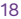

Soyez attentifs à votre résumé de projet de thèse en français et 

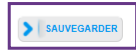

 en anglais car ce sont les données publiques qui apparaitront sur le site theses.fr et qui seront intégrés à votre tapuscrit de thèse. Ces résumés sont modifiables après l'inscription en thèse et ce jusqu'à la déclaration de soutenance de thèse.

Cotutelle internationale de doctorat [En cours d'instruction]
Période de validité de la cotutelle : date de début date de fin Pays de la cotutelle Etablissement partenaire de la cotutelle de doctorat Chef d'établissement (titre + prénom + nom)
Adresse de la cotutelle Ville Organisation de la cotutelle (descriptif + calendrier des séjours)
Préciser le calendrier des séjours par année dans les deux pays, conformément à la convention de cotutelle :
| Pêriode 1 : du .. / ... . au .. / .. / ... a (établissement) : .

Période 2 : du ../../.... au ../../.... à (établissement) : .

 $ | Période 3 : du .. / .. / ... au .. / .. / ..

Etablissement de la soutenance Propriété intellectuelle et confidentialité
--> Recherche pouvant déboucher sur un titre de propriété intellectuelle - oui ® non
--> Recherche nécessitant une attention particulière à la confidentialité - ou! ® non Service en charge de l'établissement et du suivi de la cotutelle au sein de l'institution partenaire Nom du service Nom de la personne responsable des cotutelles Adresse postale Email

Pour établir une cotutelle internationale il faut d'abord l'accord des deux directions de thèse, celle de l'établissement français ainsi que celle de l'établissement étranger.

La cotutelle doit être mise en place et signée entre les deux établissements avant la fin de la première année universitaire d'inscription.

Contacts pour la mise en place d'une convention de cotutelle internationale : 
-  INSA : laura.guillet@insa-clv.fr -  Université d'Orléans : cotutelles@univ-orleans.fr
-  Université de Tours : lucie.primault@univ-tours.fr Vous trouverez toutes les informations concernant la mise en place d'une cotutelle internationale sur notre site :
https://collegedoctoral-cvl.fr/as/ed/page.pl?site=CDCVL&page=la_cotutelle

Ecole doctorale à l'étranger si existant : Responsable de l'Ecole Doctorale ou du programme doctoral de l'institution partenaire : qualité + prénom + nom Spécialité du doctorat à l'étranger Unité de recherche à l'étranger
-  Convention et avenants de cotutelle –
Date de la signature de la convention Date de fin de l'avenant 1 Date de fin de l'avenant 2 Date de fin de l'avenant 3

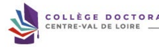

ORAL
www.collegedoctoral-cvl.fr

## Collaboration Industrielle

 Société
*
Référent :

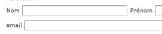

Adresse

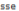

li

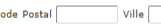

>
Descriptif Dans le cadre d'une collaboration industrielle, vous devez indiquer les informations concernant cette collaboration ici.

COLLÈGE DOCTORAL

CENTRE-VAL DE LOIRE

Langues Vivantes Renseigner Obligatoirement la langue anglaise
*
Langue Maternelle :
>
- Autres langues -

| Langue   |  Niveau   |    |
|----------|-----------|----|
| w        |           |    |
| 1-       | >         | >  |
| 2-       | >         | >  |
|          | >         |    |
| 3-       | >         |    |

TOEIC obtenu - oui ☺ non - Passé le Date TOEFL obtenu - oui ☺ non - Passé le Date Autre test obtenu - oui - non

Note
>
note :
>

TORAL

 Vous pouvez publier sur internet les informations relatives à votre thèse en préparation i titre de la thèse, direction de thèse, école doctorale, ilbellé du diplôme, mots- Ces informations senont publiées (après enngistement de votre inscription ou mise à jour de vos données por votre établissement) sur les sites theses.fr, de votre école doc La s'golannet d'une thèse en préparator est une des bonnes protiques diks à la visitilie de la vishtité de la récheriser la poblication des données relatives à vote thèse e Je souhaite publier sur internet les informations relatives à ma thèse *○ non  *® oui Si vous cochez non, votre thèse ne sera pas visible sur le site theses.fr Le signéemet parès soutennet de la hine sur beses fre de quart à lair difigure conformément à l'arrêtie meditie du 25 mai 205 fixant le cade modolités condoismat i la déliv

## Paramétrage De Mon Profil Sur Internet

 Si vous souhaltez afficher davantage d'informations sur votre profil en l'gne (CV, publications, etc.), merci de bien voulor le spècifer dans la parte ci-dessous en cochant

| Diplôme permettant l'accès au doctorat  Par défaut   |            |
|------------------------------------------------------|------------|
| Informations relatives à la thèse                    | Par défaut |
| Adresse professionnelle                              | 0          |
| Adresse e-mail principale                            | O          |
| Adresse e-mail secondaire                            | 0          |
| Site internet personnel                              | 0          |
| Situation professionnelle                            | 0          |
|                                                      |            |
| Publications                                         |            |
| Compétences et portfolio                             | 0          |
| Photo                                                | 0          |
| cv                                                   | 0          |

Vous pouvez paramétrer les informations visibles sur internet ici.

Nous pouver à bout manet modifie rotoc chot. Copendate, i ra qed que la mise à juar ne set spoiméduie au niveu de l'Sifièboge de résitus des rateurs de redeursent de rédulat maîtrisons pas les délais.

"22 bone thevant ett alimentle yas an transfer automotique des infermations whiles chement voter thém déclaires les déclièves les de vous («lipseptitute dans VIDUR (ques, pé établissement de cotutelle le cas échéant, date de première inscription, mots-clés, résumés).

 Plus d'informations sur la site de l'ABES (Agence Bibliographique de l'Enseignement Supériour) : https://abea.fr/eseau-thoses/outlis-at-services-theses/autils-at-services-t

## Compétences Et Portfolio

 lleus sous invitors à tenir à jour cet onglet rout au long de voze docaret. Veze portfolio comprend vos spolitie comprend vos soblies ainsi que les cempénezes que vous alle Il sera possible de renseigner ces compétences également après votre (ré)inscription. Enseignements réalisés (établissement, nombre d'heure)
 Etes-vous en recherche d'emploi ? - non - oui Projet professionnel, plusieurs choix possibles) O Enseignement et recherche, enseignement supérieur O Recherche en milieu académique O Recherche en entreprise, R&D du secteur privé □ Pilotage de la recherche et de l'innovation, gestion de projets innovants, pilotage de structures innovantes
□ Nétiers d'accompagnement et de support à la recharche, à l'innovation et à la valorisation, au développement des Spin Off at Start-up innovantes
□ Expartise, études et consells dans des organisations, cabinets ou scédés founissant des prestations intellectuelles, des expetties scientliques, pospectives ou stratégique
□ Entreprenariat des domaines innovants
□ Médiation scientifique, communication et Journalisme scientifique, édition scientifique, relations internationales
□ Autre Compétences techniques (savoir et savoir faire directement liés à votre domaine d'expertise)
 Compétences transverses, relationnelles et personnelles (savoir et savoir-faire mobilisables dans différentes situations professionnelles)
 Pour vous aider à identifier et apprendre à valoriser vos compétences, vous pouvez !

- Suivre une formation transverse du catalogue
- Utiliser un des référentiels existants sulvants :
 Fiche RNCP du doctorat Le profil professionnel das docteurs (ABG, France Universités, Madef)
Fiche ANDES "Le Doctorat à la Loupe = Compétences développées pendant le doctorat" Fiche Adoc Metis "Les compétences des Docteurs" Illustrer chaque compétence par une formation, une activité réalisée ou une situation professionnelle vécue pendant le doctorat Evenykos communicion de (particoposis à 2 cagrès internationaux, lavide de MT38), déaction, través de projet, capolde de projet, contense du sopille, wille cémtrey, engayen Autres activités (diffusion de la culture scientifique, transfert de technologie, rôle de représentant.es des doctorant.es,...) Préciser le nombre d'heures, le concexte, le public, ..

Centres d'intérêts extra professionnels

| Expériences professionnelles ou stages   | Objet de l'expérience professionelle ou du stage   |
|------------------------------------------|----------------------------------------------------|
| -1-                                      |                                                    |
| Fonction & Mission, statut ou contrat :  |                                                    |
| Entreprise ou établissement :            |                                                    |
| Ville, Pays :                            |                                                    |
| Durée (en semaines) :                    |                                                    |
| Année :                                  | >                                                  |
| -2-                                      |                                                    |
| Fonction & Mission, statut ou contrat :  |                                                    |
| Entreprise ou établissement :            |                                                    |
| Ville, Pays :                            |                                                    |
| Durée (en semaines) :                    |                                                    |
| Année ;                                  | >                                                  |
| -3-                                      |                                                    |
| Fonction & Mission, statut ou contrat :  |                                                    |
| Entreprise ou établissement :            |                                                    |
| Ville, Pays :                            |                                                    |
| Durée (en semaines) :                    |                                                    |
| Année :                                  | >                                                  |

| Séjours à l'étranger   |
|------------------------|
| 1-                     |
| 2-                     |
| 3-                     |
| 4-                     |

TORAL

## Www.Collegedoctoral-Cvl.Fr

| -4-                                     |    |
|-----------------------------------------|----|
| Fonction & Mission, statut ou contrat : |    |
| Entreprise ou établissement :           |    |
| Ville, Pays :                           |    |
| Durée (en semaines) :                   |    |
| Année :                                 | >  |
| -5-                                     |    |
| Fonction & Mission, statut ou contrat : |    |
| Entreprise ou établissement :           |    |
| Ville, Pays :                           |    |
| Durée (en semaines) :                   |    |
| Année :                                 | >  |

li li

ORAL

Convention individuelle de formation Avant de compléter ce questionnaire, vous devez avoir échangé avec la direction de votre thève alin de vous permette de resseigner le contenu des différentus rubriques.

 Votre demande pourra être rejetée si cet échange préalable n'a pas eu lieu.

 Tous les champs de ce formulaire sont obligatoires.

 Tous les éléments nécéssaires à l'édition de votre CIF ne sont pas renseignés.

(10 caractères minimum dans chaque champ)
Votre travail de recherche est-il effectué pour tout ou partie dans un établissement autre qu'un établissement public d'ensignement supérieur et/ou de recherehe ? " ? no "® 
Quel est le temps de présence dans votre unité de recherche de rattachement ? *@ 20% * 0 40% * 0 10% * 0 100% * 0 100%
Merci de préciser comment vous organisez et répartissez vos temps de présence :
Renseignez tous les items de la Convention Individuelle de Formation (CIF) à l'aide de votre direction de thèse afin de ne pas faire d'erreur !

## Calendrier Du Projet De Recherche

 Préciser les échéances prévisionnelles des étapes principales du projet doctoral jusqu'à la soutenance
. Durée prévue (3 ans à temps complet, entre 3 et 6 ans à temps partiel)
 - Calendrier des séjours dans les deux pays si cotutelle internationale (à reporter dans le champ "Organisation de la coutelle" de l'onglet "Cotutelle" de votre profil)
-  Répartition du temps entre laboratoine académique et centre de recherche non académique (cas Cifre ou thèse en partenariat avec entreprise) · Etapes et résultats du projet dans le cas d'un contrat de recherche partenariale.

 Modalités d'encadrement, de suivi de la formation et d'avancement des recherches de la thèse Préciser :
· les modalités décidées par l'Ecole doctorale pour le comité individuel de formation
 »  les prérequis spécifiques pour la soutenance (publications, heures ou crédits doctoraux ...) ou remoyer à un réglement intérieur ED

Conditions matérielles de réalisation du projet de recherche, le cas échéant, les conditions de sécurité spécifiques Préciser :
-  Moyens et méthodes disponibles dans l'unité de recherche pour mener à bien le projet
 - Préciser si des conditions spécifiques de sécurté sont requises pour ce projet doctoral, en plus de celles évoquées dans le riglement intérieur de l'unté de recherche

## Modalités D'Intégration Dans L'Unité Ou L'Équipe De Recherche

Indiquer les méhodes d'intérograins de l'unité de recherche, telle çave d'intégrition (offecte su d'intégrition (offecte su obligstoires), les éventuelles responsibilités ci Un calendrier prévsionel du projet de recherche peut être précisé.

## Parcours Prévisionnel Individuel De Formation

A compléter : Liste des formations envisagées en lien avec votre projet professionnel : formations transversales, scientifiques et techniques et techniques…
la callige dectris ropoport les différentes écoles doctorales popose un normbe de formules siemilies de transvestes lehilinires, piritices portespanté l'inserion porésomelle début d'année universitaire et se déroulent en général au second semestre (https://collegedoctoral-cvl.fr).

D'autres formations plus spécifiques peuvent être suivies à l'extérieur et validées par l'école doctorale.

# Objectifs De Valorisation Des Travaux De Recherche De La Thèse : Diffusion, Publication Et Confidentialité, Droit À La Propriété Intellectuelle Selon Le Champ Du Programme D

Précises les objectifs de valoristions communications, pobitotion et confidentialité, brevels (avec i possible des diffes), droit à la propriété intellectuelle selon le cham

## Développement De Compétences Et Perspectives Professionelles

Expliquer vos objectifs en terme de projet professionnel personnel à l'issue du doctorat. Précisor en particulier si votre doctorat est réalisé dans le cadre d'un projet personnel s'orientant vers une insaction en milieu soclo-économique ou autre.

Les doctorants réalisant leur doctorat dans le cadre de leur activité pouvent préciser si l'obtention du doctora peut déboucher sur une réorientation ou évolution podessionn

## Ouverture Internationale

Présise les déplatisée ou pérus (sédon l'avancenent du projet dectronil que ouverent une souvetoue teternationale, etle qu'ove mibilité internationale envispée podont l'a th expérimentale, séjour dans une unité de recherche pour acquérir une compétence particulière utile au projet, conférences et colloques internationaux.

Si vous n'avez pas de modification à faire sur votre Convention Individuelle de Formation, vous devez cliquer sur « **JE SOUMETS LA** 

 CONVENTION INDIVIDUELLE DE FORMATION A MON DIRECTEUR DE THESE POUR CORRECTION ET AVIS ».

Cliquez sur « OK **» si vous avez bien saisi les informations de votre CIF avec votre** 

 direction de thèse sinon cliquez sur « Annuler »
Vous pouvez visualiser, sur votre profil ADUM, que votre CIF est en cours de révision par voter direction de thèse.

www.collegedoctoral-cvl.fr 31

Corrections demandées par la direction de thèse

Si votre direction de thèse estime que vous avez des corrections à faire vous recevrez ce mail vous invitant à faire les corrections demandées avec les commentaires de votre direction de thèse. Dans ce cas vous devrez faire les modifications demandées et redemander la validation de votre CIF.

 De : Doctorat <noreply@adum.fr>
Date:
Subject: Convention Individuelle de Formation - Document disponible To: Cc: · Bonjour, La direction de votre thèse a validé la convention individuelle de formation.

Vous pouvez dès à présent la visualiser à partir de votre espace personnel.

Ceci est un e-mail automatique, merci de ne pas y répondre.

---
Il se peut que vous receviez ce message à des heures matinales, tardives ou le week-end. Il ne nécessite, en aucune façon, une réponse de votre part en dehors des heures ouvrées.

S'il n'y a pas de correction à faire sur votre CIF, vous recevrez ce mail !

www.collegedoctoral-cvl.fr

## Convention Individuelle De Formation

Votre direction de thèse a donné son accord pour l'édition de la CIF le Retournez dans l'onglet « Convention Individuelle de Formation »
Vous pouvez consulter le document Convention individuelle de Formation Pour imprimer ou enregistrer en PDF, nous vous invitons a faire "ctir�P" sur la page du document ou à utiliser la fonction "imprimer" de votre navigateur.

Puis à le déposer ici :
 Déposer votre Convention Individuelle de Formation en PDF
Déposer votre Convention Individuelle de Formation au format PDF
(Glisser un document sur cette zone, ou cliquer le bouton en bas à droite)
 Il s'agit de la version définitive. Vous ne pourrez plus modifier le document une fois celui-ci enregistré Choisir un fichie Cliquez sur le lien de la CIF afin de la télécharger et de l'enregistrer sur votre PC.

 Il vous est fortement conseillé de la relire avant de la déposer sur ADUM.

Vous allez ensuite pourvoir déposer le PDF de votre CIF sur ADUM
en cliquant sur choisir un fichier.

## Convention Individuelle De Formation

Votre direction de thèse a donné son accord pour l'édition de la CIF le Vous pouvez consulter le document : Convention individuelle de Formation Pour imprimer ou ennegistrer en PDF, nous vous invitons à faire "ctri+P" sur la page du document ou à utiliser la fonction "Imprimer" de votre navigateur. Puis à le déposer ici :
Déposer votre Convention Individuelle de Formation en PDF
Déposer votre Convention Individuelle de Formation au format PDF
(Glisser un document sur cette zone, ou cliquer le bouton en bas à droite)
t de la version définitive. Vous ne pourrez plus modifier le document une fois celui-ci enregistrê Convention Individuelle de Formation.pdf (174528)
Choisir un fichie

Lorsque votre CIF est complétement téléchargée, vous pouvez sauvegarder !

## Espace De Dépôt De Fichiers Ma Photo D'Identité

La photo que vous déposez s'affichera sur internet dans le site web de votre école doctorale ou de votre établissement si vous avez choisi de l'afficher. Elle sera aussi susceptible de figurer sur des documents administratifs ou d'être utilisée pour votre carte d'étudiant.

Les recruteurs viennent également chercher des profils pour leurs futurs collaborateurs.

Votre photo doit être au format JPG ou PNG et faire au minimum 200px de haut et de large.

jpg (12413)
Choisir un fichier

## Mon Cv

 (Glisser un document sur cette zone, ou cliquer le bouton en bas à droite)
 pdf (15871)

Choisir un fichier Déposez obligatoirement :
- Votre photo d'identité pour votre carte d'étudiant(e)
- Votre CV à jour

Établissement - Pièces justificatives nécessaires à votre demande d'inscription Uniquement pour l'école doctorale Humanités et Langues - HL :
-  Le résumé de la thèse ; - L'exposé en quelques lignes du caractère novateur du projet ; -  Quelques références bibliographiques ; -  Un calendrier prévisionnel du travail ; -  Si cela est possible, un plan prévisionnel de la thèse peut être ajouté.

La plus grande attention devra être portée à la correction de la langue écrite employée : les projets de thèse contenant des erreurs de syntaxe, d'orthographe (grammaticale et/ou lexicale) ne seront pas examinés et seront retournés à l'auteur pour correction.

Pour les autres écoles doctorales merci de déposer une page blanche.

Vous devez rassembler toutes les pièces en un seul document PDF (ou fichier ZIP)

pdf (15871)
Choisir un fichier

## Attention !

Pour une inscription au sein de l'école Doctorale Humanités et Langues, vous devez impérativement déposer les éléments demandés en un seul PDF.

Pour une inscription au sein des 4 autres écoles doctorales, vous devez déposer un document vierge en PDF.

Établissement - Pièces justificatives relatives à l'état civil nécessaires à votre demande d'inscription Copie de la pièce d'identité, passeport ou titre de séjour en cours de validité)
à déposer en PDF uniquement Vous devez rassembler toutes les pièces en un seul document PDF (ou fichier ZIP)
... _ .. 

Cholsir un fichier Établissement - Pièces justificatives relatives à la scolarité nécessaires à votre demande d'inscription
- Copie du diplôme ou attestation de réussite au Master 2 ou DEA ; - Pour une dispense de Master 2 ou diplôme étranger équivalent Master :
e  Copie du diplôme ou attestation de réussite o  Liste des matières constitutives du dernier diplôme obtenu avec les relevés de notes (traduction certifiée conforme par un service officiel français) et éventuellement le mémoire de fin d'études
� Et/ou toute pièce prouvant que le candidat a bénéficié d'une réelle initiation à la recherche et a réalisé un travail de recherche personnel o  Et/ou la liste détaillée des publications et travaux de recherche déjà effectué A déposer en un seul PDF
 Vous devez rassembler toutes les pièces en un seul document PDF (ou fichier ZIP)

Pièces à déposer obligatoirement en un seul PDF  sur chaque espace de dépôt afin de pouvoir finaliser votre dossier de demande d'inscription en Doctorat.

.pdf (15871)

Choisir un fichier

Justificatif obligatoire à déposer en PDF afin de finaliser votre dossier de demande d'inscription. Si vous n'avez pas de financement vous devez déposer 

 une attestation indiquant que vous avez des ressources financières suffisantes pour la durée de votre thèse.

Vous devez impérativement télécharger et lire la Charte du doctorat avant de cocher la case où vous reconnaissez en avoir pris connaissance. 

 Cette validation vous engage à respecter et à vous tenir informé(e) du cadre réglementaire du collège doctoral. Vous pourrez ensuite cliquer sur « **TRANSMISSION DES DONNEES POUR INSTRUCTION DU DOSSIER** ». Votre direction de thèse recevra un mail l'invitant à vérifier et valider votre dossier de demande d'inscription en doctorat. Votre dossier sera ensuite transmis, via ADUM, à votre codirection de thèse s'il y a lieu, puis à votre direction de laboratoire, direction d'école 

 doctorale et enfin au représentant du chef d'établissement de votre inscription pour étude et validation ou non de votre autorisation d'inscription.

www.collegedoctoral-cvl.fr 39

▸ Charte du doctorat CDCVL
Signée le Non signée par la direction de thèse (
 Non signée par la direction du laboratoire (
D
INSCRIPTION - L'avis de la direction de thèse est en attente depuis le Il est normal que la Charte du doctorat ne soit pas validée par votre direction de thèse ni par votre direction de laboratoire.

Votre direction de thèse et direction de laboratoire valideront la Charte du doctorat en même temps qu'ils prendront connaissance de votre dossier sur ADUM.

Vous pouvez suivre l'instruction de votre dossier sur votre profil ADUM

O

## Procédures

▸ Charte du doctorat CDCVL
Signée le Signée par la direction de thèse ( Signée par la direction du laboratoire (

) le

INSCRIPTION - Votre dossier est en cours d'instruction par l'école doctorale depuis le TORAL
www.collegedoctoral-cvl.fr Autorisation d'inscription en doctorat - l

Doctorat <noreply@adum.fr>
À O
Cc   O
Lorsque vous serez autorisé(e) à vous inscrire en doctorat, vous recevrez un mail d'ADUM  vous indiquant la procédure à suivre afin de procéder à votre inscription administrative pour l'année universitaire en cours.

Vous devrez dans un premier temps régler les frais de CVEC Accueil - CVEC, Contribution de vie étudiante et de campus  vous devrez télécharger votre facture et votre attestation CVEC pour l'année en cours.

O Valdé > En cours ( À faire

o

S

Compétences et portfolio

S
Comité de Suivi Individuel Déroulement de carrière Publications

 ▸ Activez gratuitement mon abonnement au journal TheMetaNews

Gestionnaire :

▸ Charte du doctorat CDCVL
Signée le 15/02/2024 Signée par la direction de thèse ._.

Signée par la direction du laboratoire ...

g Déposer l'attestation CVEC

Vous devrez ensuite vous connecter à votre profil ADUM afin d'y déposer votre attestation CVEC. Vous devrez ensuite suivre les consignes indiquées dans le mail d'autorisation d'inscription afin de régler vos droits d'inscription et ainsi pouvoir être inscrit administrativement en première année de thèse.

À l'université de Tours : 

Elysa RAGOT  + 33 2 47 36 66 75 ED EMSTU - MIPTIS - **SSBCV**
@ elysa.ragot@univ-tours.fr Christèle GAUDRON  + 33 2 47 36 64 50 ED HL - **SSTED**
@ christele.gaudron@univ-tours.fr Université de Tours Service de la Recherche et des Etudes Doctorales Bâtiment A - 1er étage 60 rue du Plat d'Etain - **BP 12050**
37020 TOURS cedex 1 - **France**
 **https://www.univ-tours.fr**

Vos contacts

À l'INSA Centre Val de Loire :
Laura GUILLET  + 33 2 48 48 07 61 ED EMSTU - MIPTIS
@ laura.guillet@insa-cvl.fr
 **INSA Centre Val de Loire**
Direction de la Recherche et de la Valorisation Etudes Doctorales Campus de Bourges 88 Bd. Lahitolle Technopôle Lahitolle CS 60013 18022 BOUGES Cedex - France Campus de Blois 3 rue de la Chocolaterie CS 23410 41034 BLOIS Cedex - France
 **https://www.insa-centrevaldeloire.fr**
À l'université d'Orléans : 

Marion ALLER  **+ 33 2 38 49 49 85**
 + 33 2 38 49 48 25 ED EMSTU @ edemstu@univ-orleans.fr ED MIPTIS @ edmiptis@univ-orleans.fr ED SSBCV @ edssbcv@univ-orleans.fr Kathia FUSTER  + 33 2 38 71 73 61 ED SSTED @ edssted@univ-orleans.fr ED HL @ edhl@univ-orleans.fr
 **Direction de la Recherche et Partenariats**
Pôle Recherche et Etudes Doctorales Bâtiment IRD
5 rue Carbone - BP 6749 45067 ORLEANS Cedex 2 - **France**
 **https://www.univ-orleans.fr/fr**

