Validation réinscription

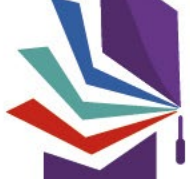

Direction de laboratoire

www.collegedoctoral-cvl.fr

 Pour vous connecter aller sur https://adum.fr/

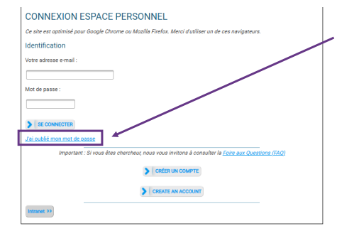

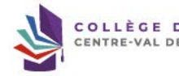

Si vous avez oublié votre mot de passe cliquer sur « J'ai oublié mon mot de passe »
afin de réinitialiser celui-ci.

RAL
Réinscription en doctorat -
Doctorat <noreply@adum.fr>

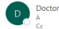

 Bonjour,
: a effectué une demande de réinscription en       année de doctorat au sein de votre unité de recherche pour l'année universitaire Nous vous informons que i ainsi que sa Convention Individuelle de Formation.

 Ernanc que responsable dinfit, cous vos vercions de bien roubli influque dés ips est cotte demande, acocorrespend de aus sur cotto dennance de de la corvention initividele La direction de thèse
---
Ceci est un e-mail automatique, merci de ne pas y répondre.

Il se peut que vous receviez ce message à des heures matinales, tardives ou le week-end.

Il ne nécessite, en aucune façon, une réponse de votre part en dehors des heures ouvrées.

Lorsqu'une direction de thèse, codirection de thèse s'il y a lieu, a validé sur ADUM un dossier de demande de réinscription en doctorat, vous recevez ce mail afin de vous indiquer que vous avez un dossier à vérifier et valider sur ADUM.

Vous devez donc vous connecter à votre profil ADUM en tant que direction de laboratoire.

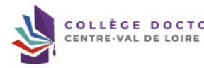

Encadrant/Gestionnaire:
- Unité de recherche ol Unité de recherche

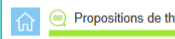

T  Thèses en cours g Soutenances Indicateurs

(Q)

Fiche Date ^
Nom Prénom Niveau demandé +
Quotité de temps >
Direction de thèse Laboratoire (
Doctorat ED
Établissement Dossier Reçu Etab Dossier Reçu ED ¿
Passé à la Scolarité +

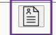

e

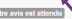

Avis favorable Cliquez sur la fiche du doctorant afin de pouvoir accéder aux informations liées à sa réinscription. Vous pouvez voir sur cet écran l'avis donné par la ou les directions de thèse.

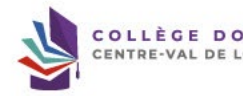

DOCTORAL
Pour voir le dossier à valider, allez dans la partie « A faire »
puis cliquez sur « Direction de laboratoire - Inscription : donner votre avis »

www.collegedoctoral-cvl.fr
.

 année de thèse en cy Vous devez vérifier les données saisies concernant votre laboratoire et les informations concernant le/la doctorant(e).

 Préparation de la thèse réalisée à Ecole doctorale Spécialité doctorale Unité de recherche Première inscription en thèse Encadrement de la thèse Régime d'inscription Thèse confidentielle ldentité Née le Genre : 
N° étudiant . ... Nationalité à E-mail: Téléphone :

CTORAL
 www.collegedoctoral-cvl.fr

## Informations Sur La Thèse

Direction de thèse Fabienne TOUPIN
 fabienne.toupin@univ-tours.fr Co-encadrant lieana SASU
ileana.sasu@univ-tours.fr Thèse impliquant un traitement de données à caractère personnel Titre en français Mots clés English title Keyswords Résumé du projet de thèse en français Résumé du projet de thèse en anglais quotité :

%

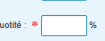

Vous devez vérifier les données saisies concernant votre laboratoire et les informations concernant le/la doctorant(e).

| Non   |     |     |
|-------|-----|-----|
| 1 -   | 2 - |     |
| 3 -   | 4 - |     |
| 5 -   | 6 - |     |
| 1 -   | 2 - |     |
| 3 -   | 4 - |     |
| 5 -   | 6 - | 0   |
|       |     | v   |
|       |     | N   |
|       |     | 0 ▷ |
|       |     | D   |

Description sur l'avancée de la thèse / DEVELOPPEMENT DE COMPETENCES ET PERSPECTIVES PROFESSIONNELLES :

ORAL

## Financement À La Préparation Du Doctorat. Le Doctorat Est Mené À Temps

Situation financière :
Statut/Type de contrat : Employeur : ו Type de financement : l Origine des fonds : Durée : du au Grille
(SIREDO, HCERES) :
Comité de thèse 1 :
2 :
Vous devez vérifier les données saisies concernant votre laboratoire et les informations concernant le/la doctorant(e) ainsi que les documents déposés par le doctorant.

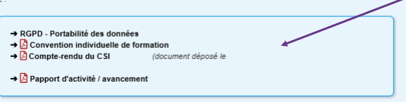

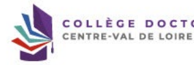

TORAL
 www.collegedoctoral-cvl.fr Conditions de finalisation acceptées par le doctorant le
 -Je certifie avoir déposé mon rapport d'avancement de thèse sur ADUM.

Je certifie que les données relatives à la Convention saisies dans mon dossier ADUM correspondent aux conditions de réalisation de mon projet doctoral.

 Je m'engage à respecter les termes de ladite Convention Individuelle de Formation.

AVIS DE LA DIRECTION DE LA THÈSE
Direction de la thèse, a donné un avis favorable sur la demande de réinscription en thèse le Remarques éventuelles / Avis circonstancié :
Conditions de finalisation acceptées par la direction de thèse le Je certifie avoir vérifié :
 - le rapport d'avancement du/de la doctorant.e pour une inscription en 2600 année de thèse, ou
- le rapport d'avancement duide la doctorant.e contenant le calendrier de soutenance pour une inscription en 3000 année de thèse et plus.

 Je certife également que les données relatives à la Convention Individuelle de Formation saisies dans le dossier ADUM correspondent aux conditions de réalisation du projet Vous pouvez visualiser les avis et éventuelles remarques que la ou les directions de thèse ont indiqué dans la finalisation du dossier.

Indiquez votre avis : - Si favorable, vous pouvez indiquer vos remarques éventuelles puis enregistrer votre avis
- **Si défavorable, vous devez obligatoirement** Expliciter le motif du refus avant de cliquer sur enregistrer

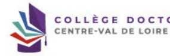

À l'université de Tours : 

Elysa RAGOT  + 33 2 47 36 66 75 ED EMSTU - MIPTIS - **SSBCV**
@ elysa.ragot@univ-tours.fr Christèle GAUDRON  + 33 2 47 36 64 50 ED HL - **SSTED**
@ christele.gaudron@univ-tours.fr Université de Tours Service de la Recherche et des Etudes Doctorales Bâtiment A - 1er étage 60 rue du Plat d'Etain - **BP 12050**
37020 TOURS cedex 1 - **France**
 **https://www.univ-tours.fr**

Vos contacts

À l'INSA Centre Val de Loire :
Laura GUILLET  + 33 2 48 48 07 61 ED EMSTU - MIPTIS
@ laura.guillet@insa-cvl.fr
 **INSA Centre Val de Loire**
Direction de la Recherche et de la Valorisation Etudes Doctorales Campus de Bourges 88 Bd. Lahitolle Technopôle Lahitolle CS 60013 18022 BOUGES Cedex - France Campus de Blois 3 rue de la Chocolaterie CS 23410 41034 BLOIS Cedex - France
 **https://www.insa-centrevaldeloire.fr**
À l'université d'Orléans : 

Marion ALLER  **+ 33 2 38 49 49 85**
 + 33 2 38 49 48 25 ED EMSTU @ edemstu@univ-orleans.fr ED MIPTIS @ edmiptis@univ-orleans.fr ED SSBCV @ edssbcv@univ-orleans.fr Kathia FUSTER  + 33 2 38 71 73 61 ED SSTED @ edssted@univ-orleans.fr ED HL @ edhl@univ-orleans.fr
 **Direction de la Recherche et Partenariats**
Pôle Recherche et Etudes Doctorales Bâtiment IRD
5 rue Carbone - BP 6749 45067 ORLEANS Cedex 2 - **France**
 **https://www.univ-orleans.fr/fr**

## Www.Collegedoctoral-Cvl.Fr 10
