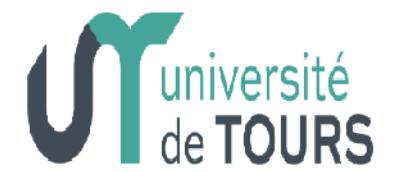
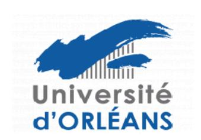

# Règlement intérieur de l'École Doctorale n° 616 Humanités et Langues

Approuvé par le conseil de l'ED Humanités et Langues, le 31 mars 2023

Le présent règlement intérieur précise les dispositions relatives au fonctionnement de l'école doctorale 616, en conformité avec (1) l'arrêté du 25 mai 2016 fixant le cadre national de la formation et les modalités conduisant à la délivrance du diplôme national de doctorat ; (2) la circulaire du 18 juillet 2016 et (3) dans le respect de la charte des thèses commune à l'ensemble des écoles doctorales des deux établissements ainsi qu'à l'INSA Centre Val de Loire.

# Titre I - Missions de l'École Doctorale 616

Les missions de l'ED 616 sont définies par l'article 3 de l'arrêté du 25 mai 2016.

# Titre II - Organisation de l'École Doctorale 616

#### II.1 - Fonctionnement du conseil

Le conseil adopte le programme d'actions de l'école doctorale. Il gère, par ses délibérations, les affaires qui relèvent de l'école doctorale. Il se réunit au moins deux fois par an en formation plénière et autant que nécessaire au bon fonctionnement de l'école doctorale. Il peut utiliser différentes modalités de réunion plénière ou restreinte (sans les personnalités extérieures). Un calendrier de réunion est établi chaque année et un ordre du jour est envoyé au moins 8 jours avant chaque réunion. Un relevé des décisions de chaque réunion est diffusé sur le site internet des écoles doctorales.

En conformité avec l'article 9 de l'arrêté du 25 mai 2016, le conseil de l'école doctorale comprend 26 membres répartis de la manière suivante :

Un premier groupe constitué par :

- Les quatre membres de la direction (le directeur, le directeur adjoint, les deux directeurs adjoints de site)
- Les dix directeurs ou leurs représentants des unités de recherche de l'école doctorale, (4 à Orléans pour les 5 unités de recherche et 6 pour les 9 de Tours)
- Les deux représentants des personnels ingénieurs, administratifs ou techniciens (1 à Orléans et 1 à Tours).

Un deuxième groupe constitué par :

- Les cinq représentants doctorants (2 à Orléans et 3 à Tours).

Un troisième groupe constitué par :

- Les cinq personnalités extérieures, du monde socio-culturel et socio-économique (2 à Orléans et 3 à Tours).

Sont invités permanents avec une voix consultative :

- Les trois directeurs ou leurs représentants des unités de recherche de l'ED 616 n'ayant pas de voix délibérative au conseil
- Les vice-présidents Recherche ou en leur absence les vice-présidents des écoles Doctorales
- Un représentant de la Région Centre Val de Loire
- Le DR du CNRS ou son représentant
- Les responsables administratives des deux sites.

Concernant le premier groupe, l'équipe de direction est désignée d'un commun accord par les chefs d'établissements accrédités. Le directeur est nommé pour la durée de l'accréditation et son mandat peut être renouvelé une fois. Ses missions sont définies par l'article 11 de l'arrêté du 25 mai 2016.

Chaque unité de recherche choisit son représentant permanent. Une rotation des titulaires représentant les unités de recherches et ayant voix délibérative se fera tous les deux ans afin que chaque unité de recherche puisse être représentée par un membre titulaire pendant le mandat quinquennal de l'ED 616 (2018-2023). Si un membre titulaire n'est ni présent ni excusé pendant trois réunions consécutives, les membres de direction pourront demander à ce qu'il soit remplacé.

Concernant le deuxième groupe, les représentants des doctorants (de la 1re année d'inscription à la soutenance) sont élus parmi et par les doctorants de site. Leur mandat s'interrompt à la fin de l'année universitaire suivant la soutenance de thèse ou si la réinscription n'a pas été réalisée. Des élections partielles sont alors organisées.

Seuls les membres présents du conseil scientifique de l'école doctorale ayant voix délibérative peuvent voter. Tout membre de ce conseil peut demander un vote à bulletins secrets. En cas d'égalité des voix, le directeur et le directeur adjoint de l'école doctorale ont voix prépondérante.

#### II.2 Missions du conseil

Ce conseil a pour missions de :

- Définir la politique scientifique et internationale de l'école doctorale
- Proposer les jurys d'audition et de statuer sur l'attribution des contrats doctoraux
- Procéder à l'évaluation annuelle de l'école doctorale et discuter les résultats
- Evaluer le bilan financier de l'école doctorale
- Examiner les demandes de dérogation d'inscription en année supplémentaire de thèse et les demandes de césure
- Réviser le présent règlement si besoin
- Préparer les évaluations à venir.

# II.3. Procédure de désignation de la direction de l'école doctorale

La procédure de désignation de la direction et de la direction adjointe de l'école doctorale « Humanités et Langues » est la suivante :

- 1) appel à candidature aux HDR de l'école doctorale initié par la direction de l'école
- 2) réception des actes de candidature (sous la forme d'une lettre de motivation et d'un CV) par la direction de l'école doctorale, au moins quinze jours avant le vote
- 3) vote par le bureau de site de l'école doctorale (élargi aux directeurs de laboratoires) puis par le bureau restreint de l'école doctorale
  - 4) présentation et vote du nom du candidat au conseil de l'école doctorale
- 5) vote à la Commission Recherche des universités de Tours et d'Orléans (le document doit avoir été reçu une semaine avant la séance de la Commission)
  - 6) nomination par le président de l'établissement dont dépend le responsable élu.
  - 7) notification à la séance suivante du collège doctoral Centre Val de Loire.

#### II.4. Rôle du bureau

Le bureau de l'école doctorale est composé du directeur, du directeur adjoint, des deux directeurs adjoints de site. Il définit un calendrier de réunions, gère les affaires courantes, prépare le travail du conseil de l'école doctorale et organise les journées de l'école doctorale. Lorsque des dossiers à traiter le nécessitent, Il peut inviter des directeurs des unités de recherche ou leurs représentants élus au conseil de l'école doctorale et /ou les représentants élus des doctorants.

Le bureau de site prépare les réunions de bureau et fait le lien avec les établissements et les unités de recherche de site concernées. Il peut s'adjoindre, lorsque les dossiers le nécessitent, les directeurs des unités de recherche ou leurs représentants élus au conseil de l'école doctorale et /ou les représentants élus des doctorants.

#### II.5. Unités de recherche rattachées à l'École Doctorale 616

L'école doctorale regroupe 14 unités de recherche :

UMR CNRS 5060 – Institut de Recherche sur les Archéomatériaux (IRAMAT) – Université d'Orléans UMR CNRS 7323 - Centre d'Etudes Supérieures de la Renaissance (CESR) – Université de Tours UMR CNRS 7224 – CITERES (Cités, Territoires, *Environnement, Sociétés*) Laboratoire Archéologie et Territoire, équipe LAT - Université de Tours

UMR CNRS 7270 - Laboratoire Ligérien de Linguistique (LLL) - Université Orléans, Tours et BNF

EA 2114 - Psychologie des Ages de la Vie et Adaptation (PAVEA)- Université de Tours

EA 4428 –DYNAMiques et enjeux de la DIVersité linguistique et culturelle (DYNADIV) - Université de Tours

EA 4709 – Réceptions et Médiations de Littératures et de Cultures Etrangères et Comparées (Remelice) - Université d'Orléans

EA 4710 - Pouvoirs, Lettres, Normes (Polen) - Université d'Orléans

EA 6297 – Interactions Culturelles et Discursives (ICD) - Université de Tours

EA 6298 - Centre Tourangeau d'Histoire et Etude des Sources (CETHIS) - Université de Tours

EA 6301 - Interactions, Transferts, Ruptures Artistiques et Culturelles (INTRU) - Université de Tours

EA7493 - Equipe de recherche Contextes et Acteurs de l'Education (ERCAE) - Université d'Orléans

EA 7505 - Education, Ethique, Santé (EES) - Université de Tours

EE 1901 - Qualité de vie et santé psychologique (Qualipsy) - Université de Tours.

Une unité de recherche peut demander à se rattacher à l'école doctorale. Une lettre présentant l'unité de recherche en question et ses motivations pour son rattachement à cette école doctorale est communiquée aux membres du conseil. Le directeur ou son représentant est invité à répondre aux questions des membres du conseil qui formulent un avis et se prononcent par un vote sur ce rattachement.

# Titre III. Modalités d'encadrement, de recrutement, de réinscription et de suivi des doctorants

# III.1 - Modalités d'encadrement

Le taux d'encadrement maximal est limité à six par directeur de thèse. Au-delà de cette limite, aucune nouvelle inscription d'étudiant(e)s en thèse n'est possible. Les enseignants-chercheurs HDR pour lesquels le nombre de doctorants est supérieur à cette limite doivent résorber rapidement cette situation.

L'école doctorale encourage les enseignants-chercheurs non habilités à passer leur HDR en leur fournissant la possibilité de co-encadrer des thèses. Une demande de dérogation pour une codirection

de thèse est possible et peut être demandée suivant des modalités définies par l'article 16 de l'arrêté du 25 mai 2016.

En dehors du périmètre du collège doctoral, si la thèse est encadrée par deux directeurs relevant de deux écoles doctorales françaises distinctes, une convention de codirection avec l'autre établissement sera établie. Les conditions d'inscription, d'admission et de soutenance sont régies par les règlements en vigueur dans l'établissement dans lequel le/la doctorant(e) est inscrite.

Concernant les conditions d'inscription, d'admission et de soutenance des cotutelles de thèse, se référer aux articles 20, 21, 22, 23 de l'arrêté du 25 mai 2016.

#### III.2 - Modalités de recrutement

Toutes les demandes de première année de doctorat sont examinées par le bureau de l'école doctorale, puis sont proposées par le directeur ou le directeur adjoint de l'école doctorale aux chefs d'établissement concernés pour validation.

Le choix des sujets de thèse et des doctorants appartient aux différentes unités de recherche et reflète les travaux poursuivis par les enseignants-chercheurs au sein de chaque unité. Sur les deux sites, l'inscription en première année de doctorat se fait à partir de l'examen d'un dossier comprenant (1) un projet de recherche élaboré par le doctorant(e) et signé par le directeur de thèse ; (2) une copie du diplôme national de master ou d'un autre diplôme conférant le grade de master d'un des pays de l'Union Européenne reconnu comme équivalent ; (3) un retour signé de la charte des thèses et de la convention formation (4) une lettre signée par le directeur de thèse établissant l'aptitude à la recherche du doctorant(e) (article 11 de l'arrêté du 25 mai 2016). Un complément de formation, notamment en méthodologie de la recherche, peut être demandé aux étudiant (e)s n'ayant pas rédigé de mémoire de recherche en master 2 par le directeur de thèse avant l'inscription du/de la candidat(e) en doctorat.

Les étudiants candidats à une inscription en doctorat qui ne sont pas titulaires d'un diplôme national de master, mais ayant effectué des études d'un niveau équivalent ou bénéficiant de la validation des acquis de l'expérience prévue à l'article L. 613-5 du code de l'éducation, sont invités à faire une demande d'inscription dérogatoire en doctorat. Le bureau de l'école doctorale examine les demandes et donne un avis circonstancié, puis celles-ci sont proposées par le directeur ou le directeur adjoint de l'école doctorale aux chefs d'établissement concernés pour inscription par dérogation.

L'unité de recherche du doctorant est l'unité de recherche du directeur de thèse appartenant à cette école doctorale.

Les doctorants peuvent être admis sans financement ni être assujettis à un niveau de ressource. Néanmoins, les directeurs de thèse et de l'unité de recherche concernée veilleront à ce que les conditions matérielles et humaines de réalisation du doctorat soient assurées. La recherche de financement est fortement encouragée par l'école doctorale.

Concernant les contrats « établissement », le processus est le suivant :

- Sur proposition du bureau de l'école doctorale,
  - Le conseil de l'école doctorale fixe le nombre de sujets qu'une unité de recherche peut faire parvenir à l'école doctorale;
  - Le conseil de l'école doctorale définit la composition du jury d'audition de site, en respectant autant que possible les équilibres disciplinaires, institutionnels et de parité de genre. Des membres du conseil de l'ED SHS SSTED peuvent éventuellement faire partie du jury.
- Un courriel est adressé à l'ensemble des HDR relevant de l'école doctorale, les invitant à faire remonter des sujets auprès de leur directeur d'unité de recherche. Ses sujets en une page indiqueront le titre, la mention du ou des directeurs de thèse ou co-encadrants, porteurs de sujet et un résumé du sujet.

- Les directeurs d'unités de recherche font ensuite remonter à l'école doctorale l'ensemble de leurs demandes classées.
- L'école doctorale vérifie que les directeurs et co-directeurs de thèse proposant un sujet ne dépassent pas le nombre autorisé de doctorants sous leur direction; dans le cas contraire, le sujet est éliminé de la liste et n'est pas remplacé.
- Les sujets sont rendus publics et font l'objet d'un appel par tous les moyens dont dispose l'école doctorale, par publication sur le site internet du collège doctoral Centre-Val de Loire.
- Les directeurs des unités de recherche sont invités à communiquer les noms des candidats correspondant aux sujets retenus à l'Ecole Doctorale.
- La liste des candidats auditionnés est établie par le bureau de l'ED et les bureaux de site, en lien avec les classements établis par les unités de recherche et en veillant à l'équilibre entre les unités.
- L'école doctorale organise les auditions pour les bourses régionales et les contrats établissement et adresse les convocations aux candidats sélectionnés. L'école doctorale leur demande les documents suivants : CV, copie d'une pièce d'identité, et relevés des notes du master année 1 et
- L'école doctorale convoque les membres du jury d'audition.
- Le jury auditionne chaque candidat pendant 10 minutes de présentation, suivies de 10 minutes d'échange avec les membres du jury souhaitant poser des questions. La règle est l'égalité de traitement des candidats.
- Le jury établit trois listes :
  - o Une liste principale non ordonnée de lauréats ;
  - Une liste complémentaire ordonnée;
  - Une liste non ordonnée comprenant les candidats ne figurant ni dans la liste principale ni dans la liste complémentaire.
- Pour les contrats établissement, sont auditionnés les candidats proposés par les unités de recherche et les candidats non retenus aux bourses régionales.

# Concernant les bourses régionales, le processus est le suivant :

- Chaque année, en fonction du nombre de bourses proposé par la Région, une répartition du nombre de bourses entre les deux sites est établie par le bureau.
- La même procédure que pour les contrats établissement est exigée. Les unités de recherche font parvenir les sujets de recherche à l'école doctorale et les noms des candidats, à une date précise, en respectant les critères de recrutement définis par la Région.
- Un jury d'audition paritaire entre les deux sites (Orléans et Tours) est constitué et une liste des lauréats est établie pour chaque site. Les auditions ont lieu alternativement à Orléans et à Tours.
- Une liste régionale ainsi qu'une liste complémentaire sont ordonnées.

Les jurys proposent les lauréats retenus pour les bourses régionales et les contrats établissement par un vote à bulletin secret, à la majorité qualifiée. Le conseil de l'école doctorale en est informé chaque année. De plus, la ventilation des bourses régionales et des contrats établissement obtenus entre les différentes unités de recherche sera affichée sur le site internet de l'école doctorale d'année en année.

# À côté de ces financements, l'école doctorale souhaite promouvoir :

- La cotutelle internationale de thèse, forme spécifique de codirection (voir articles 20, 21, 22, 23 de l'arrêté du 25 mai 2016). Elle recommande vivement au doctorant (e) d'obtenir un financement français ou étranger pour couvrir les trois années de formation doctorale et de regarder les possibilités de bourses proposées par l'Agence Campus France.
- La Convention Industrielle de Formation par la REcherche (Cifre). Les doctorants peuvent consulter la plaquette sur ANRT.

Concernant les procédures d'inscription, de réalisation et de soutenance de thèse de doctorat sur travaux, se référer au document produit par le collège doctoral Centre-Val-de-Loire.

# III.3 -Modalités de réinscription

Conformément à l'article 14 de l'arrêté du 25 mai 2016, pour les étudiants inscrits dans l'école doctorale à partir de 2016-2017 et ayant un contrat doctoral, la préparation du doctorat s'effectue en trois ans (équivalent temps plein). La prolongation de la durée du contrat doctoral peut se faire sous certaines conditions (circulaire du 18 juillet 2016). Dans les autres cas, la durée de préparation du doctorat ne peut être au plus de six ans.

Le doctorant, qu'il ait ou non un contrat doctoral, peut demander une année de prolongation à titre dérogatoire. Le doctorant peut demander aussi une césure (et une seule) insécable, d'une durée maximale de 12 mois pendant la durée de sa thèse (article 14 de l'arrêté du 25 mai 2016). À partir de la 4eme année, pour toute demande de dérogation, le doctorant devra fournir et signer conjointement avec le directeur de thèse (1) une demande argumentée; (2) un calendrier prévisionnel détaillé réaliste et (3) un engagement à soutenir dans le courant de l'année universitaire.

Ces demandes de dérogation et de césure sont traitées par le bureau, soumises à l'avis du conseil de l'école doctorale dans sa formation restreinte et proposées pour décision au chef d'établissement concerné. Elles sont transmises chaque année à la commission de la recherche du conseil académique ou à l'instance qui en tient lieu dans les établissements concernés. L'école doctorale rappelle que les demandes de dérogation doivent conserver un caractère exceptionnel.

La réinscription annuelle est obligatoire pendant la durée de la thèse. Elle est sujette à un contrôle de la qualité scientifique et de l'avancement du travail de thèse lors notamment du comité de suivi individuel de thèse. Celui-ci, conformément à l'article 13 de l'arrêté du 25 mai 2016 modifié par l'arrêté du 26 août 2022, veille au bon déroulement du cursus en s'appuyant sur la charte du doctorat et la convention de formation.

Le comité de suivi individuel du doctorant assure un accompagnement de ce dernier pendant toute la durée du doctorat. Il se réunit obligatoirement avant l'inscription en deuxième année et ensuite avant chaque nouvelle inscription jusqu'à la fin du doctorat.

Les entretiens sont organisés sous la forme de trois étapes distinctes : présentation de l'avancement des travaux et discussions, entretien avec le doctorant sans la direction de thèse, entretien avec la direction de thèse sans le doctorant.

Au cours de l'entretien avec le doctorant, le comité évalue les conditions de sa formation et les avancées de sa recherche. Lors de ce même entretien, il est particulièrement vigilant à repérer toute forme de conflit, de discrimination, de harcèlement moral ou sexuel ou d'agissement sexiste. Il formule des recommandations et transmet un rapport de l'entretien au directeur de l'école doctorale, au doctorant et au directeur de thèse.

En cas de difficulté, le comité de suivi individuel du doctorant alerte l'école doctorale, qui prend toute mesure nécessaire relative à la situation du doctorant et au déroulement de son doctorat.

Dès que l'école doctorale prend connaissance d'actes de violence, de discrimination, de harcèlement moral ou sexuel ou d'agissements sexistes, elle procède à un signalement à la cellule d'écoute de l'établissement contre les discriminations et les violences sexuelles.

Les modalités de composition, d'organisation et de fonctionnement de ce comité sont proposées par le conseil de l'école doctorale. L'école doctorale veille à ce que dans la mesure du possible, la composition du comité de suivi individuel du doctorant reste constante tout au long de son doctorat. Le comité de suivi individuel du doctorant comprend au moins un membre spécialiste de la discipline ou en lien avec le domaine de la thèse. Dans la mesure du possible, le comité de suivi individuel du doctorant comprend un membre extérieur à l'établissement. Il comprend également un membre non spécialiste extérieur au domaine de recherche du travail de la thèse. Les membres de ce comité ne participent pas à la direction du travail du doctorant. L'école doctorale veille à ce que le doctorant soit consulté sur la composition de son comité de suivi individuel, avant sa réunion.

Toutes les inscriptions et réinscriptions administratives doivent avoir été finalisées à la fin de l'année civile sauf cas particulier (exemple : cas des cotutelles/ bourses Cifre).

Si le/la doctorant(e) ne procède pas à sa réinscription ou ne fait pas une demande de césure dans les temps impartis, des relances seront effectuées. Puis, en cas de non réponse répétée, il/elle sera considéré(e) en abandon et ne pourra plus se réinscrire. Un/une doctorant(e) n'est autorisé(e) à soutenir sa thèse que s'il/elle est inscrite réglementairement.

#### III.4 - Modalités de rédaction et de soutenance de la thèse

#### Langue de rédaction

Le Code de l'Education (article L121-3) spécifie que la langue des thèses est le français.

Les thèses en cotutelle peuvent faire exception à ce principe, puisque dans ce cas la convention signée précise la langue de rédaction de la thèse. L'école doctorale accepte toutefois d'examiner d'autres types de dérogation, selon les modalités suivantes :

- La demande de dérogation doit être présentée par le directeur de thèse pressenti, et ce dès la première demande d'inscription en thèse du doctorant, ce qui fait que ce dernier s'inscrit en toute connaissance de cause.
- Elle doit revêtir un caractère exceptionnel et être précisément argumentée.
- Elle est accordée par le Bureau restreint de l'école doctorale.
- Si elle est accordée, un résumé en français de 50 pages environ accompagnera la thèse, permettant la parfaite compréhension de la démarche scientifique du doctorant, de sa méthodologie ou de ses résultats. De plus, le titre, l'introduction et la conclusion de la thèse seront traduits en français.

#### Procédure de soutenance

Conformément aux articles 17, 18 et 19 de l'arrêté du 25 mai 2016 et à la procédure relative à la soutenance de thèse établie par le collège doctoral Centre-Val de Loire, la soutenance de thèse est publique et a lieu au terme du travail de thèse et de l'acquisition des crédits doctoraux (50 crédits doctoraux1). Le jury doit être conforme à l'article 18 de l'arrêté du 25 mai 2016. Le jury (rapporteurs et composition) est proposé par le directeur de thèse (ou conjointement par les codirecteurs) pour avis au directeur ou directeur adjoint de l'école doctorale.

Les pré-rapports sont rédigés en français, mais l'école doctorale accepte aussi qu'ils soient rédigés en anglais. Pour les thèses en cotutelle, ce point et les modalités de la soutenance sont définis par la convention signée au début de la thèse. Il faudra alors veiller à ce que les pré-rapports soient parfaitement compréhensibles par les personnes amenées à autoriser la soutenance.

L'autorisation de soutenir une thèse est accordée par le chef d'établissement concerné après avis du directeur de l'école doctorale. Si, lors d'une première demande d'autorisation de soutenance, au moins l'un des rapporteurs rend un avis défavorable à la soutenance, l'école doctorale étudie, avec le directeur de thèse, l'opportunité de proposer au chef d'établissement le report de la soutenance avec un échéancier permettant au doctorant d'améliorer son manuscrit. Les rapporteurs du jury sont maintenus, sauf indication contraire écrite de leur part, et seront invités à rendre de nouveaux pré-rapports. Si lors de la deuxième demande d'autorisation de soutenance, l'école doctorale reçoit de nouveau un avis défavorable de l'un des rapporteurs, elle peut proposer au chef d'établissement, après examen des rapports, de ne pas autoriser la soutenance. En cas de refus par le chef d'établissement d'autoriser la soutenance, le doctorant ne serait plus admis à se réinscrire à l'école doctorale, quel que soit le sujet de thèse, et même en cas de changement de directeur de thèse.

Pour des cas bien précis qui lui sont soumis, l'école doctorale accepte que la soutenance de thèse puisse se faire dans une autre langue que le français (pour le cas particulier des thèses en co-tutelle, la langue de soutenance est spécifiée dans la convention signée avec l'établissement partenaire), pourvu que les conditions suivantes soient réunies :

- Le directeur de thèse s'y déclare favorable.
- Tous les membres du jury certifient comprendre cette langue.

&lt;sup>1 Uniquement pour les doctorants inscrits à partir du 1er septembre de l'année universitaire 2016/2017.

- Si de surcroît la thèse a été rédigée dans une langue autre que le français, suite à l'accord du Bureau restreint de l'école doctorale, un résumé en français de 50 pages environ accompagne la thèse, permettant la parfaite compréhension de la démarche scientifique du doctorant, de sa méthodologie ou de ses résultats. De plus, le titre, l'introduction et la conclusion de la thèse seront traduits en français.

La visioconférence, permettant qu'un des membres du jury ou un invité à ce jury soit à distance, est possible, si elle est justifiée et autorisée par le chef d'établissement. Il convient d'en faire la demande au préalable.

Les rapports de soutenance sont rédigés en français. Toutefois, si la contribution de certains membres du jury est rédigée dans une langue étrangère, il revient au président du jury d'en fournir une synthèse en français, dans un encadré placé à la fin de la contribution concernée.

En ce qui concerne le dépôt de la thèse, sa diffusion et sa conservation, se référer aux articles 24 et 25 de l'arrêté du 25 mai 2016.

\*\*\*\*\*\*