Validation Charte du doctorat et Inscription

Direction de laboratoire

[Université | Inscription en doctorat  -
-

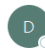

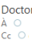

Doctorat <noreply@adum.fr>
( Répondre
« Répondre à tous

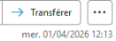

Bonjour, Nous vous informons que a effectué une demande d'inscription en 1º année de doctorat au sein de votre unité de recherche pour l'année universitaire En tant que responsable d'unité, nous vous remercions de bien vouloir indiquer dès à présent votre avis sur la qualité du projet et les conditions de sa réalisation, en vous sur votre interface : https://www.adum.fr/index.pl La direction de thèse Ceci est un e-mail automatique, merci de ne pas y répondre. ll se peut que vous receviez ce message à des heures matinales, tardives ou le week-end. Il ne nécessite, en aucune façon, une réponse de votre part en dehors des heures ouvrées.

Lorsqu'une direction de thèse, codirection de thèse s'il y a lieu, a validé sur ADUM un dossier de demande d'inscription en doctorat, vous recevez ce mail afin de vous indiquer que vous avez un dossier à vérifier et valider sur ADUM.

Vous devez donc vous connecter à votre profil ADUM en tant que direction de laboratoire.

MAJ 05/2026

 Pour vous connecter aller sur https://adum.fr/

Si vous avez oublié votre mot de passe cliquer sur « J'ai oublié mon mot de passe »
afin de réinitialiser celui-ci.

RAL
Encadrant/Gestionnaire:
o( Unité de recherche _ ____ , __ _ _ . 

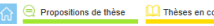

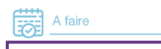

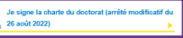

> 63 inscrits en 2024-2025

> 59 inscrits en 2025-2026
> 78 Scientifiques dont 44 HDR

Une fois connecté(e) à votre espace ADUM en tant que direction de laboratoire vous devez dans un premier temps signer la charte du doctorat 

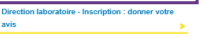

Signature de la charte du doctorat (arrêté modificatif du 26 août 2022)

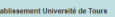

 B

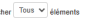

Rechercher

B

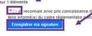

Nom

nom Niveau demandé Niveau enregistre 1A thése
- Unité de recherche Précédent

contenu de la Charte du doctorat CDCVL (du 15/10/25 à 11:35) et je m'engage à la respecter. Je m'engage également à respecter et à mitenir informé(e) du cadre régiementaire pononal et des règies internes à l'établissement qui me concernent Suivant Direction Laboratoire Votre signature de la charte du doctorat CDCVL a bien été prise en compte Signature de la charte du doctorat (arrêté modificatif du 26 août 2022)

Lorsque vous avez signé la charte du doctorat ce message apparaît pour confirmation.

Vous devez ensuite vérifier et valider le dossier de demande d'inscription en première année de thèse.

Indicateurs

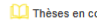

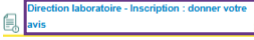

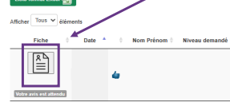

Cliquez sur « Direction de laboratoire - inscription : donner votre avis »
Puis sur la fiche du doctorant afin de vérifier les données saisies Rechercher

Quotité de temps > Direction de thèse Equipe
   
Dossier Reçu Etab | Dossier Reçu ED | Passé à la Scolarité
   
Doctorat ED

Encadrant/Gestionnaire:

| Unité de recherche   |
|----------------------|

& Samuel LETURCQ n"52550 Unité de recherche Cltés, TERritoires, Environnement et Sociétés Soutenances Indicateurs
{{ Gestion des données E Propositions de thèse

Thèses en cours

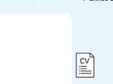

 Préparation de la thèse réalisée à Ecole doctorale Spécialité doctorale Unité de recherche Equipe d'accueil Première inscription en thèse Encadrement de la thèse Régime d'inscription Thèse confidentielle

| Genre :       | Née le :   |
|---------------|------------|
| Nº étudiant : | N° INE :   |
| Nationalité : |            |
| E-mail:       |            |
| Téléphone :   |            |

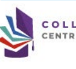

ldentité TORAL
Vous devez vérifier les données saisies concernant votre laboratoire et les informations concernant le/la doctorant(e).

Informations sur la thèse Direction de thèse quotité :
 | %
 Thèse impliquant un traitement de données à caractère personnel À déterminer Titre en français Mots clés

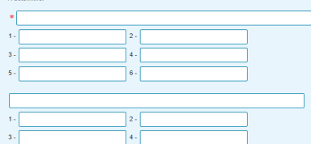

Vérifiez que les informations correspondent à votre laboratoire.

e English title Keyswords Résumé du projet de thèse en français Résumé du projet de thèse en anglais A
 e

|  Scolarité                  |         |                             |               |       |             |      |
|-----------------------------|---------|-----------------------------|---------------|-------|-------------|------|
| Obtention                   | Diplôme | Série ou Intitulé ou Option | Etablissement | Ville | Département | Pays |
| Baccalauréat ou équivalence |         |                             |               |       |             |      |
| Master                      |         |                             |               |       |             |      |
| Licence                     |         |                             |               |       |             |      |
| Master 1                    |         |                             |               |       |             |      |

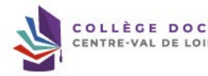

 v TORAL

Financement Situation financière :
Statut/Type de contrat : I Employeur : Type de financement : Origine des fonds :
Durée : du BU
Vous devez vérifier les informations saisies concernant votre laboratoire et la direction de thèse ainsi que les informations sur la cotutelle s'il y a lieu.

Grille 2025/2026 (SIREDO, HCERES) :

## Cotutelle En Cours

Descriptif : Période 1 : du .J. / .... au .J .. / .... à (établissement) :
. Période 2 : du .. J ... ... au .. l .... à (établissement) :
.. Période 3 : du ... J .... au .. J .... à (établissement) :
 Etablissement :
Pays :
> RGPD - Portabilité des données Consulter la convention individuell éces justificatives d'inscription en thèse relatives à l'état civil ces justificatives d'inscription en thèse relatives à la scolarité Consulter les pièces justificatives d'inscription en thèse relatives au financement Consulter les pièces justificatives d'inscription en thèse

Vous pouvez télécharger les pièces justificatives déposées par le/la doctorant(e).

AVIS DE LA DIRECTION DE LA THÈSE
 Direction de la thèse, a donné un avis favorable sur la demande d'inscription en thèse le Remarques éventuelles / Avis circonstancié : Avis favorable

 Votre avis sur la demande d'inscription en thèse de Indiquez votre avis :
-  Si favorable, vous pouvez indiquer vos remarques éventuelles puis enregistrer votre avis Si défavorable, vous devez obligatoirement explicitement le motif du refus avant de cliquer sur enregistrer vis favorable, vous pouvez indiquer votre avis circonstancié dans l'espace de commentaire ci-dessous.

En cas d'avis défavorable, veuillez justifier votre avis dans l'espace de commentaire ci-dessous Remarques éventuelles / Avis circonstancié li est héassaire de vous souver los de la assiè que vos commentaire ou avis sont adéparis, perhends et limitis à a e qui est helessoire au respete ils sont lantis et lea afm Votre commentaire ou avis ne doit dono pas étre inapproprie, subjectif ou insultant.

Charte du doctorat CDCVL signée le

adum.fr indique Vous avez sélectionné : avis défavorable, confirmez-vous ce choix ?

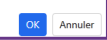

Si vous avez indiqué un avis défavorable, ADUM vous invite à confirmer votre choix pour éviter les erreurs.

À l'université de Tours : 

Elysa RAGOT  + 33 2 47 36 66 75 ED EMSTU - MIPTIS - **SSBCV**
@ elysa.ragot@univ-tours.fr Christèle GAUDRON  + 33 2 47 36 64 50 ED HL - **SSTED**
@ christele.gaudron@univ-tours.fr Université de Tours Service de la Recherche et des Etudes Doctorales Bâtiment A - 1er étage 60 rue du Plat d'Etain - **BP 12050**
37020 TOURS cedex 1 - **France**
 **https://www.univ-tours.fr**

Vos contacts

À l'INSA Centre Val de Loire :
Laura GUILLET  + 33 2 48 48 07 61 ED EMSTU - MIPTIS
@ laura.guillet@insa-cvl.fr
 **INSA Centre Val de Loire**
Direction de la Recherche et de la Valorisation Etudes Doctorales Campus de Bourges 88 Bd. Lahitolle Technopôle Lahitolle CS 60013 18022 BOUGES Cedex - France Campus de Blois 3 rue de la Chocolaterie CS 23410 41034 BLOIS Cedex - France
 **https://www.insa-centrevaldeloire.fr**
À l'université d'Orléans : 

Marion ALLER  **+ 33 2 38 49 49 85**
 + 33 2 38 49 48 25 ED EMSTU @ edemstu@univ-orleans.fr ED MIPTIS @ edmiptis@univ-orleans.fr ED SSBCV @ edssbcv@univ-orleans.fr Kathia FUSTER  + 33 2 38 71 73 61 ED SSTED @ edssted@univ-orleans.fr ED HL @ edhl@univ-orleans.fr
 **Direction de la Recherche et Partenariats**
Pôle Recherche et Etudes Doctorales Bâtiment IRD
5 rue Carbone - BP 6749 45067 ORLEANS Cedex 2 - **France**
 **https://www.univ-orleans.fr/fr**

## Www.Collegedoctoral-Cvl.Fr 10
