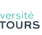

Direction de la Recherche et de la Valorisation Service de la Recherche et des Études Doctorales Tours, le 16 juin 2026 Mesdames et Messieurs les Directrices et Directeurs d'unité de recherche et de composante Objet : COLLOQUES - Année 2027

 Chères et chers collègues, Les colloques sont un élément essentiel de la recherche, permettant de mettre en avant les avancées et la valorisation de nos recherches. Ils contribuent aussi très largement au rayonnement de notre établissement au sein de la communauté scientifique nationale et internationale. Par la présente lettre, la Commission Recherche souhaite lancer le recensement des nouveaux colloques qui seront organisés par nos équipes de recherche au cours de l'année civile 2027, ainsi que les demandes de subventions afférentes (qu'elles soient adressées à l'université ou aux collectivités territoriales). Cet appel d'offre concerne donc les colloques organisés par l'université de Tours entre le 1er janvier et le 31 décembre 2027 **sur le territoire régional**. Vous trouverez ci-joint les documents à remplir pour vos demandes (formulaire de demande et BUDGET-colloque) et quelques indications ci-dessous pour vous y aider :

## Formulaire De Demande

Il est important de bien renseigner les différentes rubriques du formulaire. Notamment, un argumentaire bref et précis doit permettre à la Commission Recherche de déterminer l'importance du colloque vis-à-vis de la politique scientifique de l'unité de recherche et de l'établissement, ainsi que pour leur rayonnement respectif. Ce document devra être accompagné d'un avis du responsable de l'unité. Si plusieurs demandes sont présentées au sein d'une même unité, un classement sera impérativement effectué par les directeurs et directrices d'unité. En l'absence de classement, **les demandes ne seront pas transmises à un** rapporteur et ne seront donc pas examinées.

## Budget

Une attention particulière doit être apportée au document relatif au budget prévisionnel, qu'il vous faudra remplir avec l'aide de l'antenne financière chargée de gérer financièrement le colloque. Nous souhaitons rappeler que le budget doit être fait le plus sincèrement et rigoureusement possible, l'objectif étant le soutien prioritaire aux manifestations qui rencontreraient des difficultés à se tenir sans ce dernier. 60 BP 12050 37020 Tours Cedex 1 Enfin, il est tout à fait possible de solliciter uniquement une labellisation, un relais institutionnel aux médias pour un colloque qui aurait par ailleurs un soutien financier suffisant. **Si vous ne demandez pas de financement, merci de** spécifier clairement et visiblement la demande effectuée.

## Appui Des Collectivités Territoriales

Si vous pensez correspondre aux critères de financement de Tours Métropole Val de Loire ou de la Région Centre-Val de Loire (cf. indications ci-dessous), reportez la somme que vous comptez demander dans votre budget prévisionnel et prenez en compte les critères mentionnés dans l'argumentaire de votre manifestation scientifique. En revanche, vous ne devez pas à prendre contact directement avec Tours Métropole Val de Loire ou la Région **Centre-Val de Loire**. Il appartient à la Commission Recherche d'identifier les colloques remplissant les critères de financement de ces collectivités territoriales. Une fois ces colloques identifiés, c'est le service de la Recherche qui assure la prise de contact et le suivi de ces demandes. Les montants et conditions exactes d'attribution par la Region ont changés. Désormais, une commission à l'échelle de la Région statue sur les colloques retenus et les montants à partir des remontées faites par l'ensemble des établissements. Le cas échéant, la Commission Recherche pourra vous demander de retravailler votre argumentaire de manière à ce qu'il corresponde mieux aux critères des collectivités territoriales financeuses. Tous les dossiers doivent être envoyés au service de la Recherche par mail à caroline.vaslin@univ-tours.fr avant le 9 **septembre 2026** pour examen à la Commission Recherche. Le service de la recherche se tient à votre disposition pour tout renseignement complémentaire.

Je vous remercie de diffuser largement cette circulaire et vous prie d'agréer, chères et chers collègues, l'expression de mes sentiments cordiaux.

Le Vice Président, Chargé de la Recherche Daniel ALQUIER

## Critères De La Commission Recherche

- Organisation d'un colloque (congrès, workshop ou journées d'études) à Tours (sauf exception)
- Intérêt scientifique (exceptionnel, important, standard, ...) - Envergure nationale et internationale de la manifestations (nombre et proportion de conférenciers nationaux (hors Tours) et internationaux)
- Adéquation aux objectifs scientifiques de l'unité de recherche de l'université - Publication des actes - Clarté et réalisme du budget - Actions eco-responsables mises en œuvre Seront également pris en compte : 
- La présence de moments dédiés à la culture scientifique et technique et/ou à destination du grand public
- L'accessibilité des publications (dans le cadre de la politique de science ouverte de l'établissement)

# Critères Des Collectivités Territoriales

(à titre indicatif et sous réserves de modifications)
Mairie de Tours La Mairie de Tours accepte un accueil dans ses locaux avec éventuellement un pot et/ou un dîner, **mais la gratuité n'est désormais plus possible.** Si vous souhaitez réserver une salle, il faut le faire vous-même via un formulaire en ligne sur le site de la mairie Tours Métropole Val de Loire La Métropole est sensible à l'accueil d'un public nombreux et international sur le territoire métropolitain. Par conséquent, le soutien financier de Tours Métropole Val de Loire est lié à l'ampleur du projet (nombre significatif de conférenciers et participants extérieurs, envergure internationale, etc.) et à sa dimension économique et sociale. Région Centre-Val de Loire La Région Centre-Val de Loire s'est dotée depuis 2021 des critères explicites suivants : Critères qualitatifs
. Labellisation du colloque par la Commission Recherche de l'université de Tours . Organisation de la manifestation sur le territoire Centre-Val de Loire . Ouverture aux enjeux du territoire - culture scientifique (temps d'ouverture au grand public ; temps d'échange ou évènement organisé en parallèle avec des partenaires de la sphère socio-économique, promotion du patrimoine culturel de la Région Centre-Val de Loire, etc.)
Pour les actions de Culture scientifique et technique : possibilité d'appui sur Centre Sciences 
. Organisation éco-responsable de la manifestation (réduction de la production des déchets, réduction de l'usage des goodies et/ou usage de goodies éco-responsables ; réduction du gaspillage alimentaire, dématérialisation, réduction de l'empreinte carbone en encourageant les transports en commun par exemple)
Critères quantitatifs (à interpréter comme des ordres de grandeur et non comme des mesures fixes).

. 100 participants au minimum ; exceptionnellement, colloques de moindre effectif (à partir de 50 personnes) à condition de justifier d'une très forte participation internationale . Budget de 20 000 € minimum - pour une subvention maximale de 15 % du coût total du colloque. 

Ce plafond pourra être porté jusqu'à 20 % maximum en fonction de l'appréciation par la Région de la pertinence et de la justification des coûts des actions de culture scientifique et d'organisation éco-responsable proposées. 

Critères administratifs
. Colloque organisé sur le territoire CVL (sauf exception) . Budget prévisionnel équilibré et précis, intégrant une part d'auto-financement . Engagements financier significatif des participants sous la forme de droits d'inscription au colloque) . Engagement à publier des résultats et précision de la forme de cette publication