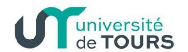
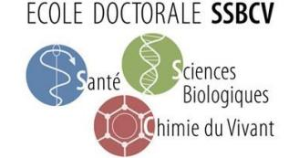
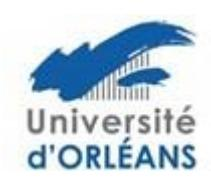

## Ecole Doctorale n° 549 Santé, Sciences Biologiques et Chimie du Vivant (SSBCV)

## Aide à la participation des doctorants à un congrès international

L'ED SSBCV peut fournir une aide financière à la participation des doctorants à un colloque ou congrès international, sous réserve <u>d'une communication orale acceptée</u>. L'ED souhaite ainsi favoriser la participation des doctorants à des colloques ou congrès internationaux à l'étranger. L'examen des demandes sera effectué par le bureau de l'ED, au fil de l'eau.

## Le dossier de demande devra comprendre :

- 1. le nom du congrès, date et lieu
- 2. l'intérêt pour la formation du doctorant
- 3. la copie de l'acception de la communication orale
- 4. l'avis du directeur de thèse

Un montant maximum est fixé en fonction du lieu du congrès international. Il est de 250 € pour un colloque international en France, de 500 € pour un colloque international en Europe et de 750 € pour un colloque international hors Europe.

La demande est à adresser par mail à votre gestionnaire d'études doctorales :

Pour l'université Orléans : edssbcv@univ-orleans.fr

Pour l'université de Tours : guillaume.fialeix@univ-tours.fr

Le Bureau de l'école doctorale étudiera le dossier et statuera sur votre demande.

Si le bureau décide l'octroi d'une aide à la mobilité, l'enveloppe allouée par l'école doctorale sera versée à votre laboratoire qui est chargé d'effectuer les dépenses associées à cette aide.

2 dispositions sont prévues :

- Le laboratoire effectue, pour le compte du doctorant, les réservations nécessaires à la mobilité.

Ou

- Le laboratoire verse l'aide au doctorant afin que celui-ci effectue lui-même les réservations nécessaires à sa mobilité.

Le/la doctorant-e devra donc s'adresser à son laboratoire pour les modalités pratiques pour le paiement des dépenses.