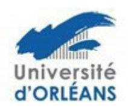

## Procédure relative à la soutenance de thèse des Ecoles Doctorales Centre Val de Loire

Arrêté du 25 mai 2016 fixant le cadre national de la formation et les modalités conduisant à la délivrance du diplôme national de doctorat (articles 18 & 19)

## Composition de jury (4 à 8 membres choisis en raison de leurs compétences scientifiques) :

- la moitié au moins doit être composée de professeurs des universités ou fonctionnaires assimilés\*
- la moitié au moins doit être composée de personnalités extérieures à l'unité derecherche et à l'écoledoctorale.
- la moitié au moins doit être composée de personnalités extérieures à l'établissement délivrant le doctorat.
- and the second second second second second second second second second second second second second second second second second second second second second second second second second second second second second second second second second second second second second second second second second second second second second second second second second second second second second second second second second second second second second second second second second second second second second second second second second second second second second second second second second second second second second second second second second second second second second second second second second second second second second second second second second second second second second second second second second second second second second second second second second second second second second second second second second second second second second second second second second second second second second second second second second second second second second second second second second second second second second second second second second second second second second second second second second second second second second second second second second second second second second second second second second second second second second second second second second second second second second second second second second second second second second second second second second second second second second second second second second second second second second second second second second second second second second second second second second second second second second second second second second second second second second second second second second second second second second second second second second second second second second second second second second second second second second second second second second second second second second second second second second second second second second second second second second second second s
- le doctorat.
- dans la mesure du possible, il doit tendre vers une représentation équilibrée de femmes et d'hommes.
- les éventuels membres invités (en nombre très limité) ne font pas partie officiellement du jury.

Un enseignant-chercheur ou fonctionnaire assimilé émérite peut participer au jury (dans la limite d'un seul par jury). Les jurys des thèses en cotutelle devront tendre vers ces consignes mais seront examinés au cas par cas.

## Désignation du jury :

Le jury de soutenance est désigné par le président/directeur de l'établissement délivrant le doctorat après avis du directeur de l'école doctorale et sur proposition du directeur de thèse.

**Autorisation de soutenance :** Elle relève de la responsabilité du président/directeur de l'établissement au vu des rapports, et après avis de la direction de l'école doctorale

**Présidence et rapport de soutenance :** Les membres du jury désignent parmi eux un président et le cas échéant un rapporteur de soutenance. Le président doit être professeur ou assimilé\*. Il sera indiqué dans le rapport de soutenance que le président du jury a signé le procès-verbal de la soutenance à la place du ou des membre(s) du jury qui a (ont) participé(s) par visioconférence.

**Déroulement de la soutenance :** A titre exceptionnel (justifié auprès du président ou directeur de l'établissement), elle pourra inclure des moyens de visioconférence. Dans ce cas, les membres du jury, à l'exception du président du jury, pourront participer à la soutenance par ces moyens, selon une procédure mise en place dans l'établissement. Dans ce cas, la désignation du président du jury se fera nécessairement en amont de la date de la soutenance. Un empêchement de dernière minute peut aussi justifier, toujours à titre exceptionnel, qu'un membre puisse participer au jury par des moyens de visioconférence.

Délibération (discussion, décision, rapport, signatures): Tous les membres du jury – incluant le ou les directeur(s) de thèse – participent à la discussion. Les membres invités ne faisant pas partie du jury, ils ne participent pas à la délibération. Le ou les directeur(s) de thèse ne participe(nt) pas à la phase de décision (évaluation de niveau, décision finale d'attribution ou non du doctorat). En revanche, il(s) cosigne(nt) le rapport de soutenance. Pour conférer le grade de docteur, le jury porte un jugement sur les travaux du candidat, leur caractère novateur, sur son aptitude à les situer dans leur contexte scientifique et sur ses qualités générales d'exposition. Lorsque les travaux de recherche résultent d'une contribution collective, la part personnelle de chaque candidat est appréciée par un mémoire qu'il présente individuellement au jury.

**Mention :** Le diplôme de doctorat ne comporte plus de mention transcrite sur le procès verbal. Cependant, toute appréciation de niveau équivalent à une mention « honorable » ou « très honorable » peut figurer dans la conclusion du rapport de soutenance.

\*Liste des corps de fonctionnaires assimilés aux Professeurs des Universités (Arrêté du 15 juin 1992 modifié – article 1er)

- les professeurs et les sous-directeurs de laboratoire du Collège de France
- les professeurs du Muséum National d'Histoire Naturelle
- les professeurs et les sous-directeurs de laboratoire du Conservatoire National des Arts et Métiers
- les directeurs d'études de l'Ecole des Hautes Etudes en Sciences Sociales
- les directeurs de l'Ecole Pratique des Hautes Etudes et de l'Ecole Nationale des Chartes
- les professeurs de l'Institut National des Langues et Civilisations Orientales
- les sous-directeurs d'Ecoles Normales Supérieures
- les astronomes et physiciens régis par le décret n° 86-434 du 12 mars 1986 modifié portant statut du corps des astronomies et physiciens et du corps des astronomes adjoints et physiciens adjoints
- les astronomes titulaires et les astronomes adjoints régis par le décret du 31 juillet 1936 relatif au statut des observatoires astronomiques
- les physiciens titulaires et les physiciens adjoints régis par le décret du 25 septembre 1936 relatif au statut des instituts et observatoires de physique du globe
- les professeurs de 1ère et de 2ème catégorie de l'Ecole Centrale des Arts et Manufactures
- les directeurs de recherche relevant du décret n° 83.1260 du 30 décembre 1983 fixant les dispositions statutaires communes aux corps des fonctionnaires des établissements publics scientifiques et technologiques (Centre National de la Recherche Scientifique, Institut national de la Recherche Agronomique, Institut National de la Santé et de la Recherche Médicale, Institut de Recherche pour le Développement, ...)

## Recommandations de l'ED SSBCV pour la constitution des jurys

A la procédure générale de soutenance de thèse des ED Centre Val de Loire, qui s'inscrit dans le cadre règlementaire de l'arrêté du 25 mai 2016, s'ajoutent quelques recommandations de l'ED SSBCV, en ce qui concerne plus spécifiquement la constitution des jurys de thèse.

Ces recommandations sont les suivantes :

- Il peut être fait appel à des rapporteurs étrangers mais quand c'est le cas, il doit avoir un statut de « full professor », que l'on peut considérer comme assimilé à un professeur des universités. Un « associate professor » est assimilé à un maître de conférences et n'est pas titulaire d'une HDR. Il ne peut donc pas être rapporteur mais peut être membre du jury.
- Les personnels des Ecoles Vétérinaires (Professeur et Maître de Conférences) et de l'Institut Pasteur (chercheurs) ne figurent pas dans la liste des personnels pouvant être assimilés à des Professeurs des Universités ou Maître de Conférences. Ils peuvent toutefois, en fonction de leurs compétences scientifiques, être rapporteur (s'ils ont l'HDR) ou membres du jury, après avis du directeur ou directeur adjoint de l'ED.
- Pour la partie du jury comprenant les membres de l'Université de Tours et d'Orléans, ceux-ci ne doivent pas tous appartenir à la même équipe de recherche et n'ayant pas co-publié avec le doctorant.

Il s'agit de limiter le caractère endogène des jurys, de limiter le nombre de membres ayant un lien d'intérêt et/ou de subordination avec le doctorant et de garantir au doctorant un jury de qualité et indépendant en vue de la délivrance et de la valorisation de son doctorat.

Le nombre de membres invités dans le jury est de deux membres invités au maximum. Un membre invité ne fait pas officiellement partie du jury et n'apparaît pas dans les documents officiels de soutenance. Il ne participe pas aux délibérations du jury.

Un jury de thèse étant par définition constitué sur mesure, sa conformité est évaluée au cas par cas par le directeur ou directeur adjoint de l'ED, qui veille au respect de ces principes de façon à garantir au jeune docteur la meilleure reconnaissance possible de son diplôme.