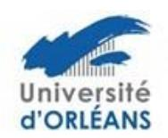

## Ecole Doctorale n° 552 : Energie - Matériaux Sciences de la Terre et de l'Univers - FMSTU

## Aide à la mobilité

Une aide à la mobilité peut être obtenue auprès de l'ED pour :

- les congrès
- les séjours dans des laboratoires étrangers dans le cadre de collaborations (excepté les thèses en cotutelles)

La demande de subvention doit être adressée à l'école doctorale au moins 2 mois avant le départ et doit comporter :

- un courrier du (de la) doctorant(e) décrivant l'opération
- un courrier de soutien du directeur de thèse
- le budget prévisionnel de l'opération
- pour les congrès : un justificatif de participation (acceptation de présentation orale ou de poster le cas échéant)
- pour les séjours à l'étranger : un courrier d'invitation du laboratoire d'accueil
- pour les formations : un justificatif d'inscription

Le dossier de demande doit être adressé par mail à votre gestionnaire d'études doctorales :

Pour l'université d'Orléans <u>edemstu@univ-orleans.fr</u> Pour l'université de Tours <u>guillaume.fialeix@univ-tours.fr</u> Pour l'INSA laura.guillet@insa-cvl.fr

Le Bureau de l'école doctorale étudiera le dossier et statuera sur votre demande.

Si le bureau décide l'octroi d'une aide à la mobilité, l'enveloppe allouée par l'école doctorale sera versée à votre laboratoire qui est chargé d'effectuer les dépenses associées à cette aide.

2 dispositions sont prévues :

- Le laboratoire effectue, pour le compte du doctorant, les réservations nécessaires à la mobilité.

Ou

- Le laboratoire verse l'aide au doctorant afin que celui-ci effectue lui-même les réservations nécessaires à sa mobilité.

Le/la doctorant-e devra donc s'adresser à son laboratoire pour les modalités pratiques pour le paiement des dépenses.