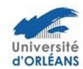

## Ecole doctorale n° 551 Mathématiques, Informatique, Physique Théorique et Ingénierie des Systèmes - MIPTIS

## Aide à la mobilité

L'école doctorale (ED) MIPTIS propose à ses doctorants une aide à la mobilité. La mobilité doit être en lien avec la thèse préparée. Elle peut être accordée entre autres pour un séjour dans un autre laboratoire, une conférence ou une école d'été/hiver. La destination peut être en France ou à l'étranger. Une demande maximum par doctorant sur la durée de la thèse pourra être acceptée.

La demande peut être envoyée toute l'année à l'ED. Vous devez compléter un dossier constitué des pièces suivantes :

- une simple description de la mobilité et de son intérêt pour la thèse
- <u>un budget prévisionnel avec le coût de l'inscription, du déplacement, du logement et autres frais annexes</u>. Vous devez également indiquer qui prendra en charge la partie non couverte par cette aide.

Ce dossier doit être adressé par mail à votre gestionnaire d'études doctorales :

Pour l'université d'orléans <u>edmiptis@univ-orleans.fr</u> Pour l'université de Tours <u>guillaume.fialeix@univ-tours.fr</u> Pour l'INSA <u>laura.guillet@insa-cvl.fr</u>

Le montant de l'aide sera compris entre 400 € et 600 €, principalement en fonction du coût global.

Le Bureau de l'école doctorale étudiera le dossier et statuera sur votre demande.

Si le bureau décide l'octroi d'une aide à la mobilité, l'enveloppe allouée par l'école doctorale sera versée au laboratoire qui est chargé d'effectuer les dépenses associées à cette aide.

## 2 dispositions sont prévues :

- Le laboratoire effectue, pour le compte du doctorant, les réservations nécessaires à la mobilité.

## Ou

- Le laboratoire verse l'aide au doctorant afin que celui-ci effectue lui-même les réservations nécessaires à sa mobilité.

Le/la doctorant-e devra donc s'adresser à son laboratoire pour les modalités pratiques pour le paiement des dépenses.