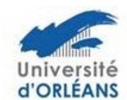
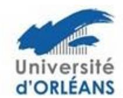

## Ecole Doctorale n° 549 Santé, Sciences Biologiques et Chimie du Vivant -SSBCV

### Aide à la mobilité internationale des doctorants

Afin de promouvoir, par une participation financière, les séjours de doctorants dans un laboratoire étranger dans un but de perfectionnement scientifique et méthodologique en relation avec leur projet de thèse, l'Ecole Doctorale « SSBCV » organise un appel à projets permanent dédié aux doctorants. Les projets doivent porter sur le séjour d'un doctorant (minimum 2 semaines, maximum 6 semaines) dans un laboratoire étranger, dont l'objectif est l'apport d'un complément de formation théorique et méthodologique ou la réalisation d'une série d'expériences spécifiques, associée à la thèse. L'Ecole Doctorale SSBCV peut participer au cofinancement de l'opération, à hauteur de 1500 € maximum, modulable selon la durée et le budget nécessaire.

Dans une moindre mesure (selon le nombre de demandes), des aides à la mobilité au sein d'un laboratoire français pourront éventuellement être prises en considération. Les projets financés le seront sur la base d'une évaluation réalisée par le Bureau de l'Ecole Doctorale SSBCV. Les demandes sont examinées au fil de l'eau et peuvent être transmises à l'ED tout au long de l'année.

Le dossier, précisant les dates du déplacement, sera à adresser par courrier électronique, sous la forme d'un fichier PDF à votre gestionnaire d'études doctorales :

Pour l'université d'Orléans <u>edssbcv@univ-orleans.fr</u> Pour l'université de Tours guillaume.fialeix@univ-tours.fr

### Le dossier comprendra:

- 1. un résumé du projet scientifique envisagé dans le cadre de la mobilité (1/2 à 1 page max) :
- 2. la faisabilité du projet
- 3. l'intérêt pour la formation du doctorant
- 4. un budget prévisionnel détaillé, indiquant les co-financements
- 5. l'avis du directeur de thèse
- 6. une lettre d'acceptation du directeur du laboratoire d'accueil

Le Bureau de l'école doctorale étudiera le dossier et statuera sur votre demande.

Si le bureau décide l'octroi d'une aide à la mobilité, l'enveloppe allouée par l'école doctorale sera versée à votre laboratoire qui est chargé d'effectuer les dépenses associées à cette aide.

### 2 dispositions sont prévues :

- Le laboratoire effectue, pour le compte du doctorant, les réservations nécessaires à la mobilité.

# Ecole Doctorale n° 549 Santé, Sciences Biologiques et Chimie du Vivant -SSBCV

Ou

- Le laboratoire verse l'aide au doctorant afin que celui-ci effectue lui-même les réservations nécessaires à sa mobilité.

Le/la doctorant-e devra donc s'adresser à son laboratoire pour les modalités pratiques pour le paiement des dépenses.

NB : cette aide peut être cumulée avec d'autres dispositifs d'aide à la mobilité des doctorants (ex : Réseaux Thématiques de Recherche : Biotechnocentre, FERI...). Dans ce cas, le préciser dans le budget.