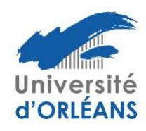
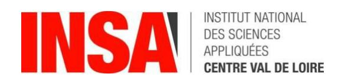

## Qui contacter en cas de besoin?

En tant que doctorant, vous avez plusieurs interlocuteurs à votre disposition pour discuter de vos préoccupations, qu'elles soient d'ordre administratif, personnel ou liées à l'avancement de votre thèse. Cette fiche recense les principaux points de contact pour chacun des trois établissements concernés: l'Université d'Orléans, l'Université de Tours et l'INSA Centre-Val de Loire (CVL). N'hésitez pas à contacter vos interlocuteurs!

### 1) Contacts pour les questions d'ordre administratif

|                                                                | Université d'Orléans                                                                                                                                                                                     | Université de Tours                                                                                | INSA-CVL                                   |
|----------------------------------------------------------------|----------------------------------------------------------------------------------------------------------------------------------------------------------------------------------------------------------|----------------------------------------------------------------------------------------------------|--------------------------------------------|
| Contact administratif (inscriptions, CSI, CD etc.)  Formations | Audrey Bourgeois et Frédérque Landais\nedemstu@univ-orleans.fr  Céline Chenault formation.doctorale@univ- orleans.fr                                                                                     | Guillaume Fialeix guillaume.fialeix@univ- tours.fr  Marie Clermonté marie.clermonte@univ- tours.fr | Laura Guillet laura.guillet@insa-cvl.fr    |
| Poursuite de carrière                                          | Isabelle Gebus isabelle.gebus@univ- orleans.fr                                                                                                                                                     | Claire Mirebeau claire.mirebeau@univ- tours.fr                                                     | -                                          |
| Représentants des doctorants                                   | Septuce ZIN / Prisca Stéphanie KANDJO NGOUBEYOU septuce.zin@univ-orleans.fr prisca-stephanie.kandjo- ngoubeyou@etu.univ- orleans.fr                                                       | Elections en cours                                                                                 | Emilien Roche\nemilien.roche@insa-cvl.fr   |
| Direction de l'école doctorale                              | Dunpin Hong direction.emstu@univ- orleans.fr                                                                                                                                                             | Cécile Grosbois cecile.grosbois@univ- tours.fr                                                     | Eric Florentin\neric.florentin@insa-cvl.fr |
| Formulaires, catalogues des formations, etc.                   | Site du Collège Doctoral Centre-Val de Loire <a href="https://collegedoctoral-cvl.fr/as/ed/page.pl?site=CDCVL&amp;page=ed552">https://collegedoctoral-cvl.fr/as/ed/page.pl?site=CDCVL&amp;page=ed552</a> |                                                                                                    |                                            |

## 2) Services de santé

Les services de santé étudiante assurent des consultations gratuites et confidentielles avec différents professionnels de santé : consultations de médecine générale, santé sexuelle / gynécologie, médecine préventive – bilan de santé, soins dentaires, consultations médicopsychologiques, tabacologie, orthophonie, consultations diététiques. Ils sont présents sur les différents sites (entre autres Blois, Chartres, etc.).

#### Université d'Orléans

Site du service de santé universitaire : https://www.univ-orleans.fr/fr/univ/vie-descampus/sante-et-accompagnement

Ecole Doctorale Énergie, Matériaux, Sciences de la Terre et de l'Univers ED n°552

Contact: Service de santé universitaire, 9 rue de Tours, 45072 Orléans cedex 2 (02 38 41 71 79) et sante@univ-orleans.fr

Horaire: du lundi au jeudi de 8h30 à 17h et le vendredi de 8h30 à 16h en journée continue.

#### Université de Tours

Site sur service de santé universitaire : <a href="https://www.univ-tours.fr/campus/sante/consultations-prise-de-rendez-vous">https://www.univ-tours.fr/campus/sante/consultations-prise-de-rendez-vous</a>

Contact: 60 rue du Plat d'Etain, Bat. H 1er étage à Tours (02 47 36 77 00), ou ssu@univ-tours.fr

Horaire : sur rdv du lundi au vendredi et un accueil infirmier tous les jours sans rdv de 8h30 à 17h.

#### **INSA-CVL**

Campus de Blois : Service de Santé étudiante de Blois, 3 place Jean Jaurès, Blois, bureaux JJ009, JJ011 et JJ013, 06 98 17 01 84, sse.blois@univ-tours.fr

Campus de Bourges : un Service de santé étudiante sera proposé prochainement aux étudiants INSA. Dans l'attente, le Centre Médico-Psychologique (CMP) peut vous accueillir gratuitement - Téléphone : 02 48 27 27 27

# 3) Cellules d'écoute et d'aide

Les assistantes sociales ont pour rôle d'écouter et conseiller pour tout type de difficulté, financier ou autre. Chaque établissement propose aussi des psychologues pour une écoute individuelle, ainsi que des cellules d'écoute/conseil pour toutes les formes de discrimination, violence et harcèlement.

#### Université d'Orléans

Service de santé universitaire, aide psychologique et service social: SSU Orléans (02 38 41 71 79) ou <a href="https://www.univ-orleans.fr/fr/univ/vie-des-campus/sante-et-accompagnement">https://www.univ-orleans.fr/fr/univ/vie-des-campus/sante-et-accompagnement</a> par courriel: <a href="mailto:service-social-etudiants@univ-orleans.fr">service-social-etudiants@univ-orleans.fr</a>

Cellule d'écoute Discrimination, violences et harcèlement : <a href="mailto:stopviolence@univ-orleans.fr">stopviolence@univ-orleans.fr</a> Cellule d'écoute Violences sexistes et sexuelles : <a href="mailto:vss@univ-orleans.fr">vss@univ-orleans.fr</a>

#### **Université de Tours**

Service social: Mission égalité (02 47 36 81 65) ou mission.egalite@uni-tours.fr

Psychologues du service de santé universitaire / prévention du risque suicidaire et des souffrances psychologiques : <a href="https://www.univ-tours.fr/campus/sante/prevention-du-suicide-et-du-mal-etre-de-et-du-mal-etre-de-et-du-mal-etre-de-et-du-mal-etre-de-et-du-mal-etre-de-et-du-mal-etre-de-et-du-mal-etre-de-et-du-mal-etre-de-et-du-mal-etre-de-et-du-mal-etre-de-et-du-mal-etre-de-et-du-mal-etre-de-et-du-mal-etre-de-et-du-mal-etre-de-et-du-mal-etre-de-et-du-mal-etre-de-et-du-mal-etre-de-et-du-mal-etre-de-et-du-mal-etre-de-et-du-mal-etre-de-et-du-mal-etre-de-et-du-mal-etre-de-et-du-mal-etre-de-et-du-mal-etre-de-et-du-mal-etre-de-et-du-mal-etre-de-et-du-mal-etre-de-et-du-mal-etre-de-et-du-mal-etre-de-et-du-mal-etre-de-et-du-mal-etre-de-et-du-mal-etre-de-et-du-mal-etre-de-et-du-mal-etre-de-et-du-mal-etre-de-et-du-mal-etre-de-et-du-mal-etre-de-et-du-mal-etre-de-et-du-mal-etre-de-et-du-mal-etre-de-et-du-mal-etre-de-et-du-mal-etre-de-et-du-mal-etre-de-et-du-mal-etre-de-et-du-mal-etre-de-et-du-mal-etre-de-et-du-mal-etre-de-et-du-mal-etre-de-et-du-mal-etre-de-et-du-mal-etre-de-et-du-mal-etre-de-et-du-mal-etre-de-et-du-mal-etre-de-et-du-mal-etre-de-et-du-mal-etre-de-et-du-mal-etre-de-et-du-mal-etre-de-et-du-mal-etre-de-et-du-mal-etre-de-et-du-mal-etre-de-et-du-mal-etre-de-et-du-mal-etre-de-et-du-mal-etre-de-et-du-mal-etre-de-et-du-mal-etre-de-et-du-mal-etre-de-et-du-mal-etre-de-et-du-mal-etre-de-et-du-mal-etre-de-et-du-mal-etre-de-et-du-mal-etre-de-et-du-mal-etre-de-et-du-mal-etre-de-et-du-mal-etre-de-et-du-mal-etre-de-et-du-mal-etre-de-et-du-mal-etre-de-et-du-mal-etre-de-et-du-mal-etre-de-et-du-mal-etre-de-et-du-mal-etre-de-et-du-mal-etre-de-etre-du-mal-etre-de-etre-de-etre-de-etre-de-etre-de-etre-de-etre-de-etre-de-etre-de-etre-de-etre-de-etre-de-etre-de-etre-de-etre-de-etre-de-etre-de-etre-de-etre-de-etre-de-etre-de-etre-de-etre-de-etre-de-etre-de-etre-de-etre-de-etre-de-etre-de-etre-de-etre-de-etre-de-etre-de-etre-de-etre-de-etre-de-etre-de-etre-de-etre-de-etre-de-etre-de-etre-de-etre-de-etre-de-etre-de-etre-de-etr

Cellule d'écoute Discrimination, violences et harcèlement : <a href="mailto:stop-discri">stop-discri</a> etu@univ-tours.fr
Cellule d'écoute Violences sexistes et sexuelles : <a href="mailto:vss@univ-tours.fr">vss@univ-tours.fr</a>

#### **INSA-CVL**

Service de santé, aide psychologique et service social: <a href="https://www.insa-centrevaldeloire.fr/sites/default/files/documents/vie\_etudiante/guide\_etudiants\_en\_difficulte\_septembre\_2021.pdf">https://www.insa-centrevaldeloire.fr/sites/default/files/documents/vie\_etudiante/guide\_etudiants\_en\_difficulte\_septembre\_2021.pdf</a>

Cellule d'écoute Discrimination, violences et harcèlement : <a href="mailto:stop-harcelement@insa-cvl.fr">stop-harcelement@insa-cvl.fr</a> Cellule d'écoute Violences Sexistes et Sexuelles : <a href="mailto:vss@insa-cvl.fr">vss@insa-cvl.fr</a>

#### Au niveau national

Centre national d'appui à la qualité de vie des étudiants en santé, avec une ligne d'écoute et de signalement : <a href="https://cnae-sante.fr">https://cnae-sante.fr</a> et par courriel <a href="mailto:soutien@cna.fr">soutien@cna.fr</a>

12 consultations gratuites avec un psychologue (en français ou en langue étrangère): <a href="https://santepsy.etudiant.gouv.fr">https://santepsy.etudiant.gouv.fr</a>

Lutte contre les addictions (tabac, alcool, cannabis, jeux d'argent et de hasard): https://www.santeaddictions.fr

Numéros d'appel direct

Souffrance et prévention du suicide : 3114 et https://3114.fr/

Violences faites aux femmes : 3939 Harcèlement : 3020 Cyberharcèlement : 3018

## 4) Intégrité scientifique et déontologie

La plupart des établissements disposent d'un comité qui offre des services d'analyse et de médiation de situations conflictuelles liées à l'atteinte à l'intégrité scientifique et à la déontologie de la recherche (plagiat, falsification de données, non respect de l'ordre des auteurs dans une publication, etc.). Toute victime peut solliciter ce comité.

#### Université d'Orléans

https://www.univ-orleans.fr/fr/univ/recherche/espace-chercheurs-et-hdr/comite-lintegrite-scientifique-et-la-deontologie-de-la ou encore par courriel: CIDR@univ-orleans.fr

#### Université de Tours

https://www.univ-tours.fr/recherche/rendre-la-science-ouverte-et-ethique/ethique-deontologie-integrite-liberte-scientifiques

Version du 18/11/2024