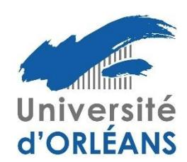

# Modalités de mise en œuvre de la procédure de soutenance

Les doctorants sont autorisés à débuter la procédure de soutenance de leur thèse à condition :

- d'avoir validé les 50 crédits doctoraux de la formation doctorale;
- de justifier de la soumission d'un article en tant que premier auteur dans une revue scientifique internationale à comité de lecture (ou d'un brevet) ET de la participation à un congrès à audience internationale (avec présentation d'un poster ou d'un exposé oral);
- d'avoir suivi les formations concernant l'intégrité scientifique et à l'éthique et sur les violences sexistes et
- d'avoir complété leur portfolio de compétences.

Toute demande d'autorisation de soutenance pour une thèse de durée inférieure à trente-deux mois devra faire l'objet d'une demande de dérogation à l'école doctorale.

#### Manuscrit de thèse

Le manuscrit de la thèse de doctorat est, hors convention internationale de cotutelle, écrit en français, sauf dérogation dont la demande argumentée sera adressée, pour avis, au Directeur.trice de l'ED ou à l'un des Directeurs adjoints, avant le début de la rédaction du manuscrit. Ces demandes de dérogation expliquant la situation du doctorant seront assorties de l'engagement pour le doctorant à compléter son manuscrit, au moment du dépôt de la demande d'autorisation de soutenance, d'un résumé substantiel de sa thèse en français: typiquement 1-2 pages par chapitre, au minimum une dizaine de pages pour le manuscrit. Le directeur.trice de thèse s'engagera à former un jury comportant au moins un rapporteur résidant à l'étranger.

La soumission de thèse consistant en une compilation d'articles déjà publiés n'est pas autorisée.

Dans le cas des manuscrits de thèses dont la diffusion n'est pas autorisée pour des raisons de confidentialité, le dépôt de la thèse sera accompagné d'un résumé non confidentiel étendu de 10 pages minimum ou, lorsque cela est possible, d'une version non confidentielle de la thèse.

La couverture du manuscrit doit être réalisée selon le modèle accessible sur le site web du collège doctoral Centre - Val de Loire.

Le manuscrit doit satisfaire aux règles élémentaires d'éthique et de déontologie. Les candidats et leur (s) directeur(s) de thèse doivent notamment s'assurer (en s'aidant si besoin de logiciel anti-plagiat) que le manuscrit référence clairement les documentations et sources utilisées pour la rédaction.

Une version électronique du manuscrit, accompagnée du formulaire de dépôt, doit être déposée au moins 7 semaines avant la date de soutenance, via l'application ADUM. En cas de non respect, l'ED ne pourra pas garantir la tenue de la soutenance à la date envisagée.

#### Autorisation de soutenance et désignation des rapporteurs

L'autorisation de soutenir une thèse est accordée par le chef d'établissement, sur proposition du directeur de thèse après avis du directeur de l'ED, au vu des rapports écrits de deux rapporteurs. Ces derniers doivent être sans implication dans le travail du doctorant ni dans le CSI, extérieurs à l'ED et à l'établissement du doctorant, titulaires de l'HDR ou appartenant à l'une des catégories suivantes :

- professeurs des Universités et personnels assimilés ou enseignants de rang équivalent, des établissements d'enseignement supérieur, des organismes publics de recherche (français ou étrangers);
- personnalités, titulaires d'un doctorat, choisies en raison de leurs compétences scientifiques par le chef d'établissement, sur proposition du directeur de l'ED et après avis de la Commission de la Recherche du Conseil académique.

La proposition des rapporteurs doit être adressée par le(les) (co)-directeur(s) au moins 2 mois avant la soutenance via l'application ADUM. Les rapporteurs doivent adresser au moins 3 semaines avant la date de la soutenance leurs rapports écrits.

## Désignation du jury

Le jury de thèse est désigné par le chef d'établissement sur proposition du (des) (co)-directeur.trice(s) de thèse après avis du directeur de l'ED (ou l'un de ses directeurs adjoints). Sa composition doit répondre aux conditions suivantes :

- il compte entre quatre et huit membres;
- il doit tendre vers une représentation équilibrée de femmes et d'hommes;
- la moitié au moins de ses membres sont des personnalités (françaises ou étrangères) extérieures à l'ED EMSTU et à l'établissement du doctorant (les personnels détachés dans un établissement dépendent administrativement de l'établissement d'accueil et doivent donc être considérés comme extérieurs à l'établissement d'origine);
- la moitié au moins sont des professeurs ou personnels assimilés, ou des enseignants de rang équivalent;
- il comprend au moins un HDR enseignant-chercheur ou assimilé de l'établissement où est inscrit le doctorant.

Pour les personnes issues d'un établissement situé à l'étranger, l'équivalence du rang sera basée sur la grille d'équivalence des carrières du ministère de l'enseignement supérieur et de la recherche (arrêté du 10 février 2011).

Un membre invité ne fait pas officiellement partie d'un jury et n'apparaît donc dans aucun document officiel de la soutenance. La présence dans le jury des encadrants du doctorant n'est pas indispensable.

Un membre émérite peut participer au jury en tant qu'examinateur mais non comme rapporteur. Il ne peut pas non plus présider le jury.

La proposition du jury doit être adressée en même temps que la proposition des rapporteurs, soit au moins 2 mois avant la date de la soutenance via l'application ADUM.

## Soutenance et délibération

Avant la soutenance, le résumé de la thèse est diffusé à l'intérieur de l'établissement pendant une période d'au moins 12 jours. La soutenance est publique, sauf dérogation accordée à titre exceptionnel par le chef d'établissement si la thèse présente un caractère de confidentialité. La langue de soutenance de thèse est le français. Toutefois, si le doctorant ne parle pas français ou si le jury comprend des membres non francophones, la soutenance peut être effectuée en anglais.

Les membres du jury désignent parmi eux un président qui est professeur ou assimilé ou un enseignant de rang équivalent (il ne peut pas être émérite). Hormis son président, les membres du jury demeurant à l'étranger peuvent à titre exceptionnel participer à la soutenance en ayant recours à la visioconférence, après accord du chef d'établissement. La demande doit être soumise en même temps que la proposition de jury.

Tous les membres du jury (incluant le ou les directeur(s) de thèse) participent à la discussion. Les membres invités, ne faisant pas partie du jury, ne participent pas à la délibération. Le directeur de thèse, ainsi que toute autre personne ayant participé à la direction de la thèse, ne prend pas part à la décision. En revanche, il(s) co- signe(nt) le rapport de soutenance. Pour conférer le grade de docteur, le jury porte un jugement sur les travaux du candidat, leur caractère novateur, sur son aptitude à les situer dans leur contexte scientifique et sur ses qualités générales de présentation orale. Lorsque les travaux de recherche résultent d'une contribution collective, la part personnelle de chaque candidat est appréciée par un mémoire qu'il présente individuellement au jury.

Le diplôme de doctorat ne comporte plus de mention transcrite sur le procès-verbal. Cependant, toute appréciation de niveau équivalent à une mention « honorable », « très honorable » ou les « félicitations du jury » peut figurer dans la conclusion du rapport de soutenance.

A l'issue de la soutenance et en cas d'obtention du doctorat, le doctorant est invité à prêter serment. Le procès- verbal de soutenance mentionnera si le doctorant a prêté serment.

Le texte du serment est le suivant :

"En présence de mes pairs. Parvenu(e) à l'issue de mon doctorat en [spécialité], et ayant ainsi pratiqué, dans ma quête du savoir, l'exercice d'une recherche scientifique exigeante, en cultivant la rigueur intellectuelle, la réflexi- vité éthique et dans le respect des principes de l'intégrité scientifique, je m'engage, pour ce qui dépendra de moi, dans la suite de ma carrière professionnelle quel qu'en soit le secteur ou le domaine d'activité, à maintenir une conduite intègre dans mon rapport au savoir, mes méthodes et mes résultats."

## Sa version anglaise est:

"In the presence of my peers. With the completion of my doctorate in [research field], in my quest for knowledge, I have carried out demanding research, demonstrated intellectual rigour, ethical reflection, and respect for the principles of research integrity. As I pursue my professional career, whatever my chosen field, I pledge, to the greatest of my ability, to continue to maintain integrity in my relationship to knowledge, in my methods and in my results."

Si le jury a demandé l'introduction de corrections dans la thèse, le nouveau docteur dispose d'un délai de trois mois pour déposer sa thèse corrigée sous forme électronique. La délivrance du diplôme de doctorat est conditionnée au dépôt de la version finale du manuscrit de thèse.