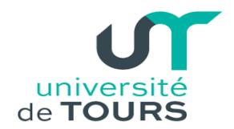
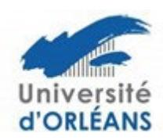

## Soutenance

Pour être autorisé à débuter la procédure de soutenance de leur thèse, les doctorants doivent avoir validé leurs CD, complété leur portfolio de compétences et suivi la formation à l'éthique de la recherche et à l'intégrité scientifique.

Les doctorants doivent également avoir réalisé au moins une production scientifique importante (revue, conférence internationale ou brevet soumis) ou à défaut fournir une justification du directeur de thèse.

Le manuscrit de la thèse de doctorat est généralement écrit en français sauf dans le cas des cotutelles où il peut être entièrement en anglais. Nous autorisons qu'il soit écrit en anglais avec une partie substantielle en français (au moins 10 pages réparties dans introduction générale, introduction des chapitres, conclusion et résumé).

Bien que peu courants dans notre ED, les mémoires sur articles sont autorisés à la discrétion du directeur de thèse.