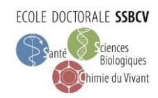
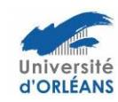

# Ecole Doctorale n° 549 Santé, Sciences Biologiques et Chimie du Vivant (SSBCV)

# Conseil de l'ED SSBCV (MàJ mars 2026)

#### Direction de l'école doctorale

- Christelle Suppo (Univ. Tours, Directrice)
- Hélène Bénédetti (CNRS Orléans, Directrice adj.)

## Représentants des Filières

- Nadia Aguillon-Hernandez (Univ. Tours)
- Emilie Allard-Vannier (Univ. Tours)
- Martine Braibant (Univ. Tours)
- Ludovic Calandreau (INRAE)
- Jean-François Dumas (Univ. Tours)
- Joëlle Dupont (INRAE)
- Stéphane Maury (Univ. Orléans)
- Joël Meunier (CNRS)

- Stéphane Mortaud (Univ. Orléans)
- Thomas Baranek (Inserm)
- Géraldine Roux (Univ. Orléans)
- Franck Suzenet (Univ. Orléans)
- Clovis Tauber (Univ. Tours)
- Sophie Tesseraud (INRAE)
- Isabelle Virlogeux-Payant (INRAE)

# Représentants des Unités de recherche

- Vincent Courdavault (Univ. Tours)
- Pierre Lafite (Univ. Orléans)

### Représentants des personnels BIATSS/ITA

- Badiâa Bouazzaoui (Univ. Tours) IR représentante BIATSS
- Guillaume Gabant (CNRS Orléans) IR représentant BIATSS

#### Représentants des doctorants élus

- Site de Tours : Laura Divoux (SIMBA), Eva Vandenbroucke-Menu (BBV), Alice Roux (IRBI)
- Site d'Orléans : Philippine Chartier (P2E)

## Représentants du secteur socio-économique

- Baptiste Mulot, Association Beauval Nature pour la Conservation et la Recherche
- Guillaume Baudouin, Cycle Farm
- Aurélien Montagu, Le Studium
- Sylvain Chamaillard, Pôle Aqua Nova

#### Membres invités permanents

- Camélia Turcu, VP Recherche, Univ. Orléans
- Patrick Vourc'h, VP Recherche SAPS Ecoles Doctorales, Univ. Tours
- Mustapha Si-Tahar, représentant es-qualité de l'INSERM
- · Ludovic Hamon, représentant es-qualité du CNRS
- Martine Migaud, représentante es-qualité de l'INRAE
- Bertrand Castaing, Biotechnocentre
- Blandine Champion, Responsable administrative ED, Univ. Orléans
- Marion Aller, Pôle APRI, Univ. Orléans
- Verónica Serrano-Ruhaut, Responsable administrative ED, Univ. Tours
- Lucie Primault, Gestion ED, Univ. Tours