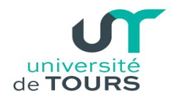
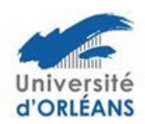

## Contrats doctoraux « Etablissement » et « Collectivités » (Région)

## **Attribution financements sur les sujets**

La direction des laboratoires transmet au bureau de l'ED une liste ordonnée par établissement concerné de sujets de thèse avec pour chaque sujet le nom du ou des directeurs de thèse et des co-encadrants éventuels.

Les laboratoires pourront se concerter au préalable pour proposer des sujets codirigés entre plusieurs laboratoires et plusieurs établissements.

À partir de ces listes, le bureau de l'ED propose une liste principale et une liste complémentaire sur les financements 100% Région et sur les financements Établissement (ex-bourses ministérielles).

Les listes provenant des laboratoires devront être transmises 2 semaines avant la date limite donnée par la Région pour envoyer les demandes sur les financements 100% Région afin de laisser le temps au bureau de se réunir et aux établissements de regrouper les demandes pour les transmettre à la Région. Si la Région garde la date du 15 janvier, la transmission des listes devra se faire avant les vacances de Noël.

## Affectation candidats sur les sujets

Les encadrants de la thèse recherchent et sélectionnent de 1 à 3 candidats pour chaque sujet. Un ou plusieurs jurys sont mis en place (généralement fin mai début juin) pour établir un classement sur chaque sujet après audition des candidats. Ces jurys sont composés au moins en partie de membres du conseil de l'ED. Sont invités aux auditions les encadrants de la thèse et le directeur (ou son représentant) du laboratoire. Les auditions des candidats qui se trouvent à l'étranger peuvent se faire en visio-conférence.

Les candidats sont informés de leur classement et le premier doit répondre dans un délai de 8 jours. S'il accepte, la procédure est finie sinon on passe au candidat suivant.

## Autres financements doctoraux

Il existe de nombreuses sources de financements des doctorants : ANR, Europe, Labex, contrats de recherche et contrats entreprise, CIFRE/DGA/ADEME, gouvernements/associations/établissements étrangers, salariés...

Il est demandé pour l'inscription en thèse un financement au moins égal à 1000 € par mois séjourné en France pour une durée de 3 ans. Ce montant minimum pourra être réévalué.

Il est aussi vérifié les diplômes (équivalence de master) et maximum d'encadrements par HDR (cf. §VII).

Pour le recrutement de doctorants sur ces financements, si une sélection est déjà réalisée par des comités scientifiques alors l'ED n'intervient pas dans la sélection, sinon (pas de sélection scientifique) il est souhaitable que l'ED auditionne les candidats comme pour les contrats doctoraux afin d'émettre un avis sur le recrutement.

Par exemple, pour les bourses CIFRE, il faudrait mettre en place cette sélection avant le dépôt du dossier à l'ANRT.

Pour les doctorants salariés du privé ou du public, la convention de formation garantira la présence du doctorant dans son laboratoire pendant un certain nombre d'heures minimum par semaine (par exemple 16h, à déterminer avec les encadrants) consacrées à son travail de thèse.

Pour l'ensemble des financements de thèse précités (contrats doctoraux et autres financements), la gestion des financements de fin de thèse est discutée entre les membres du bureau et les encadrants de thèse et se base sur l'avis du CSI pour trouver la meilleure solution au cas par cas.