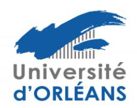

Pour les Doctorants du domaine SST (Santé, Sciences, Technologies) - Ecoles Doctorales SSBCV, EMSTU et MIPTIS.

## Comment trouver un directeur de thèse à l'université?

- 1. Constitution de votre dossier :
  - Lettre de motivation
  - CV
- 2. Documents à envoyer par mail à :

## Université de Tours

Ecoles Doctorales SSBCV, EMSTU et MIPTIS : guillaume.fialeix@univ-tours.fr

## Université d'Orléans

Ecole Doctorale SSBCV: edssbcv@univ-orleans.fr

Ecole Doctorale EMSTU: edemstu@univ-orleans.fr

Ecole Doctorale MIPTIS: edmiptis@univ-orleans.fr

3. Votre candidature sera ensuite transmise aux personnes habilitées à diriger des thèses, si votre sujet retient leur intérêt, ils vous contacteront directement afin de finaliser votre projet de thèse. Vous pourrez alors suivre la procédure de demande d'inscription en thèse.

NB : Nous vous informons qu'un financement de minimum 1100€ net/ mois est obligatoire pour s'inscrire administrativement dans l'une de ces écoles.