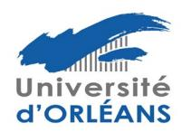
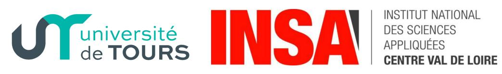
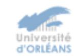
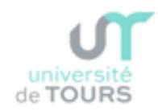
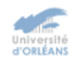
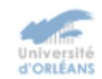
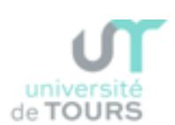

## Règlement intérieur de l'École Doctorale n° 552

## Energie, Matériaux, Sciences de la Terre et de l'Univers (EMSTU)

## Table des matières

| 1 | Organisation et fonctionnement de l'école doctorale                     | 1  |
|---|-------------------------------------------------------------------------|----|
|   | 1.1 Unités de recherche rattachées à l'école doctorale                  | 1  |
|   | 1.2 Gouvernance de l'ED                                                 | 1  |
| 2 | Recrutement                                                             | 3  |
|   | 2.1 Modalités générales de mise en œuvre de la procédure de recrutement | 3  |
|   | 2.2 Recrutement sur financement institutionnel                          | 4  |
|   | 2.3 Recrutement sur financement non-institutionnel                      | 4  |
| 3 | Inscription                                                             | 4  |
|   | 3.1 Modalités de mise en œuvre de la procédure d'inscription            | 4  |
|   | 3.2 Cas particulier : thèse sur travaux                                 | 5  |
|   | 3.3 Cas particulier : Inscription en doctorat de professeurs agrégés    | 5  |
| 4 | Formation (modalités de mise en œuvre)                                  | 6  |
| 5 | Soutenance (mise en œuvre de la procédure de soutenance)                | 7  |
| 6 | Directeur de thèse et encadrement                                       | 10 |
| 7 | International                                                           | 10 |
|   | 7.1 Cotutelle                                                           | 10 |
|   | 7.2 Doctorat Européen                                                   | 11 |
| 8 | Suivi des doctorants                                                    | 11 |
| 9 | Aide financière à la mobilité                                           | 13 |
| Α | Unités de recherche rattachées à l'école doctorale                      | 14 |
| В | Composition de l'équipe de direction                                    | 14 |
| С | Composition du bureau de l'école doctorale                              | 15 |
| Ε | Thèse de doctorat sur travaux                                           | 17 |
|   | E.1 Recevabilité du dossier du candidat                                 | 17 |
|   | E.2 Rédaction du mémoire de thèse, et suivi de formations               | 18 |
|   | E.3 Soutenance de thèse                                                 | 18 |
| F | Fiche de suivi de recrutement de doctorant                              | 19 |

Le règlement intérieur de l'école doctorale (ED) Énergie, Matériaux, Sciences de la Terre et de l'Univers (EMSTU) précise les modalités d'application des textes réglementaires relatifs au fonctionnement des écoles doctorales, parmi lesquels : le Code de l'Éducation, l'arrêté du 25 mai 2016 (qui fixe le cadre national de la formation et les modalités conduisant à la délivrance du diplôme national de doctorat), l'arrêté du 26 août 2022 (qui a mis en place diverses modifications dans les modalités de suivi et de soutenance), et enfin la Charte de thèse du collège doctoral Centre - Val de Loire, dans leur version en vigueur.

Le présent règlement intérieur est disponible sur le site web de l'école doctorale EMSTU.

\*\*\*

### 1 Organisation et fonctionnement de l'école doctorale

#### 1.1 Unités de recherche rattachées à l'école doctorale

L'école doctorale Énergie, Matériaux, Sciences de la Terre et de l'Univers (EMSTU) regroupe des unités de recherche de l'Université d'Orléans (UO), de l'Université de Tours (UT) et de l'INSA Centre-Val de Loire (INSA CVL). La liste des unités est donnée à l'annexe A. Tout changement fera l'objet d'une mise à jour de cette annexe, validée par le conseil.

#### 1.2 Gouvernance de l'ED

La gouvernance de l'ED est assurée par l'équipe de direction (assistée d'un bureau) et du Conseil de l'école doctorale.

#### Équipe de direction

L'équipe de direction est constituée du directeur de l'ED et de deux directeurs de site, représentant les trois établissements du collège doctoral Centre-Val de Loire. L'équipe de direction traite au fil de l'eau les propositions de rapporteurs, les compositions de jury et les autorisations de soutenance après examen des avis des rapporteurs, la validation des cours choisis, les premières inscriptions et les réinscriptions en 2e et 3e année.

La procédure de désignation du directeur ou du directeur de site est la suivante :

- Appel à candidature lancé par le directeur actuel aux personnes de l'ED qui sont titulaires de l'habilitation à diriger des recherches (HDR);
- Acte de candidature sous la forme d'une lettre de motivation et d'un CV envoyés au directeur actuel de l'ED qui les transmettra aux Vice-Présidents de la Commission Recherche des Universités de Tours et d'Orléans, au directeur de la recherche de l'INSA CVL, au moins quinze jours avant le vote;
- Examen et pré-sélection par le bureau de l'ED des candidatures reçues ;
- Audition par le conseil de l'ED des candidats présélectionnés. Le candidat retenu est celui qui aura la majorité de voix lors du vote par l'ensemble des membres présents et représentés ;
- Vote à la Commission Recherche ou au Conseil Scientifique des trois établissements ;
- Nomination par les présidents de l'UO et de l'UT et le directeur de l'INSA;

#### Bureau de l'ED

L'équipe de direction est assistée d'un bureau unique constitué de représentants des chercheurs et d'enseignants-chercheurs représentant les différentes thématiques de l'ED et issus des laboratoires des trois établissements. La composition du bureau est donnée à l'annexe B. Tout changement fera l'objet d'une mise à jour de cette annexe. Les missions du bureau sont de :

- Statuer sur les dispenses de diplôme de Master, les inscriptions dérogatoires, les périodes de césure du doctorat, les interruptions de thèses, les demandes de thèse sur travaux
- Proposer une répartition des financements de thèse institutionnels entre laboratoires
- Organiser les recrutements de doctorants pour les financements nécessitant une audition par l'ED
- Organiser le suivi de thèse, gérer les conflits si besoin
- Valider les formations suivies par les doctorants
- Répartir l'aide à la mobilité
- Préparer les réunions du Conseil

#### Conseil de l'ED

Le conseil de l'ED comprend 26 membres répartis comme suit :

- 16 membres (60%) pour les établissements et unités, dont :
- 3 membres représentant les établissements (directeurs et directeurs de site de l'ED);
- 13 membres représentants des unités de recherche (dont au moins 2 représentants des personnels ingénieurs, administratifs ou techniciens) désignés par les unités de recherche.
- 5 membres (20%) représentants des doctorants, dont 2 sièges pour l'université d'Orléans, 2 sièges pour l'université de Tours et 1 siège pour l'INSA CVL, élus pour 2 ans. Les représentants des doctorants sont élus.
- 5 membres (20%) représentant les domaines scientifiques de l'école doctorale (extérieurs à l'école doctorale) et du monde socio-économique désignés par le conseil de l'école doctorale, sur proposition du directeur ou de la directrice.

La composition du Conseil de l'ED est donnée à l'annexe C. Tout changement fera l'objet d'une mise à jour de cette annexe, validée par le conseil.

Le conseil invitera de façon permanente :

- Le directeur de la Recherche et de la Valorisation de l'INSA CVL
- Le vice-président recherche ou le vice-président ED de l'UT
- Le vice-président recherche de l'UO
- Le délégué régional du CNRS
- Un représentant du BRGM
- Un représentant du CNES
- Un représentant du CEA
- Le chargé de mission des écoles doctorales de l'UO
- Les responsables administratifs des services gérant les écoles doctorales dans chacun des trois établissements

- Les responsables des pôles thématiques des deux universités concernant l'ED EMSTU
- Les membres du bureau

En fonction des sujets traités, il sera possible d'inviter l'ensemble des directeurs d'unité et toutes personnes dont les compétences seront utiles aux débats du Conseil.

Les missions du conseil de l'ED sont les suivantes :

- Établir et modifier le règlement intérieur de l'ED
- Suivre le fonctionnement de l'ED : bilan quantitatif et qualitatif sur les doctorats en cours, les recrutements, les conditions et modalités de soutenance. Discussion sur les procédures de fonctionnement de l'ED dans une démarche d'amélioration continue. Débat sur des dossiers spécifiques et sur les grandes orientations de l'ED
- Organiser la formation doctorale, les dispositifs d'accompagnement (comité de suivi de thèse) et le suivi de l'insertion professionnelle des docteurs
- Tribune libre aux représentants des doctorants

Les comptes rendus de séance sont diffusés aux membres du conseil, ainsi qu'aux invités permanents. Le conseil de l'ED se réunit au moins deux fois par an, sur un des sites du collège doctoral Centre - Val de Loire.

#### 2 Recrutement

#### 2.1 Modalités générales de mise en œuvre de la procédure de recrutement

Tous les recrutements (quel que soit le type de financement) doivent respecter 3 principes et répondre aux exigences du label européen (HRS4R) (Human Resources Excellence in Research) qui a été décerné aux universités d'Orléans et de Tours :

- Ouverture du recrutement : tous les sujets doivent faire l'objet d'une publication pendant une période d'au moins un mois sur un ou plusieurs sites renommés pour la diffusion d'offres de thèse (ADUM, Euraxess, Association Bernard Grégory, Campus France, etc.). Pour une bourse institutionnelle, la publication de l'offre sur le site de l'ED EMSTU (ADUM) est obligatoire.
- Transparence du processus de recrutement, garantissant l'égalité de traitement de tous les candidats : publication claire et transparente des informations relatives au processus de sélection (étapes et planning du processus, composition du comité de sélection, modalité d'audition le cas échéant, critères de sélection, ...)
- Classement selon le **mérite du candidat** : audition des candidats par un jury et classement selon l'adéquation du profil du candidat par rapport au sujet

Pour chaque recrutement fait hors l'ED, un document type (voir annexe D) consignant le mode de recrutement (période et mode de diffusion de l'offre, processus de recrutement, statistique des candidatures, composition du comité de sélection, audition, ...) est exigé. Sont exclus de ce dispositif les candidats imposés (pour des cotutelles, pour des modes de financement spécifiques par exemple) ou impliqués dans une démarche personnelle (thèse sur travaux).

#### 2.2 Recrutement sur financement institutionnel

Ce recrutement s'effectue par l'ED et se déroule selon les étapes suivantes :

Sélection des sujets Les laboratoires définissent, chaque année, à partir de leurs priorités thématiques, un nombre suffisant de sujets de thèse classés pour, in fine, pourvoir tous les contrats proposés par les établissements et le Conseil Régional CVL. Le bureau vérifie la conformité des sujets proposés avec les règles de fonctionnement de l'ED (taux d'encadrement, historique des attributions, ...) puis, avec les directeurs d'unités de recherche, définit le nombre des financements attribués à chaque laboratoire et arrête la liste des sujets financés qui est alors diffusée sur le site de l'ED.

**Sélection des candidats** La publication de ces sujets de thèse sur ADUM est obligatoire. Les candidats intéressés par un sujet donné se manifestent auprès du directeur de thèse qui présélectionne, pour l'audition à l'ED, 3 candidats ayant déposé leur candidature via ADUM.

Audition des candidats Une commission composée d'au moins 3 personnes convoque tous les candidats sélectionnés par les directeurs de thèse pour une audition. Cette audition s'effectue en présentiel sauf cas exceptionnel (notamment pour les candidats en dehors de France métropolitaine). La commission d'audition est constituée de membres du bureau de l'ED ou si besoin de représentants de l'ED. Le directeur de thèse concerné peut assister à l'audition mais n'a pas de voix délibérative. La commission classe les candidats par ordre de mérite, sujet par sujet. Un PV de délibération, comportant le classement, signé par la commission est produit à l'issue des auditions. Les candidats sont informés par courriel de la décision du jury.

#### 2.3 Recrutement sur financement non-institutionnel

Pour tous les autres types de financement (LabEx, ANR, ERC, association, FUI, fonds propres, CIFRE, etc.) : le recrutement est organisé par les directeurs de thèse, le cas échéant en lien avec le partenaire extérieur. L'ED s'assure de la conformité des conditions de recrutement (sauf exception mentionnée plus haut) et sur la demande, elle peut prendre part au recrutement.

En préalable à la première inscription, l'ED peut demander aux candidats non francophones et non anglophones de passer un test pour vérifier le niveau de langue française ou anglaise.

## 3 Inscription

#### 3.1 Modalités de mise en œuvre de la procédure d'inscription

La gestion administrative de l'inscription se fait à l'aide du portail ADUM. L'inscription d'un candidat au doctorat se fait :

- Tous les étudiants titulaires du grade de Master peuvent se porter candidats à une inscription en thèse de doctorat, qu'ils aient obtenu un diplôme national de master ou qu'ils soient titulaires d'un titre d'ingénieur conférant le grade de Master. Toute autre situation doit faire l'objet d'une demande de dispense de master auprès de l'ED.
- L'inscription en première année de doctorat ou son renouvellement est prononcé par le chef d'établissement sur avis du directeur de l'ED, après proposition du directeur de thèse et du directeur de l'unité.

- Un financement (ou un revenu pour des personnes salariées) au moins égal au seuil de pauvreté qui est fixé par convention à 60 % du niveau de vie médian de la population, pour une durée de 36 mois ou, dans le cas des thèses en cotutelle pour toute période passée en France, est exigé. Sont exclues les ressources personnelles.
- Les doctorants signent lors de leur première inscription :
  - la charte des thèses de l'établissement, conjointement avec leur directeur de thèse, le directeur de leur laboratoire et le responsable de l'ED EMSTU de l'établissement d'inscription et le VP recherche de l'établissement
  - une convention de formation mise en place lors de la réinscription en 2e année (via ADUM).
  - le présent règlement intérieur, avec leur directeur de thèse.
- L'inscription est renouvelée au début de chaque année universitaire par le chef d'établissement, sur proposition du directeur de l'ED, après avis du directeur de thèse et du directeur de laboratoire. Tout doit être mis en œuvre pour que les thèses soient réalisées dans une période de 36 mois (nécessitant 3 ou 4 inscriptions en fonction de la date de début de contrat). Les risques de dépassement doivent être détectés le plus tôt possible, notamment par les comités de suivi individuels (CSI, voir section 8).
- Au-delà de 36 mois, les réinscriptions doivent être considérées comme exceptionnelles. Une demande de dérogation (précisant les raisons de cette réinscription, l'état d'avancement de la rédaction du manuscrit de thèse et d'un article en 1er auteur, les conditions de continuation incluant les possibilités de financement) est adressée au directeur de l'ED pour approbation par le bureau. Le Conseil de l'ED est informé annuellement de ces dérogations.

#### 3.2 Cas particulier: thèse sur travaux

Il s'agit de permettre l'obtention du doctorat sur la base de travaux de recherche personnels réalisés par le candidat antérieurement à son inscription dans l'un des trois établissements. Cette procédure permet la soutenance d'une thèse de doctorat dans l'année de première inscription dans l'un des trois établissements. Elle est distincte de l'attribution du doctorat par VAE. La procédure de thèse sur travaux comprend trois étapes (voir annexe E pour la description complète).

- 1. Recevabilité du dossier du candidat
- 2. Rédaction du mémoire de thèse, et suivi éventuel de formations dispensées par l'ED
- 3. Soutenance de thèse

#### 3.3 Cas particulier : Inscription en doctorat de professeurs agrégés

Il s'agit de permettre l'inscription en doctorat de professeurs agrégés, en lien avec les thématiques de l'ED, sans master. Il sera jugé de la pertinence du projet de recherche préalablement à la demande d'inscription en doctorat. La procédure sera la suivante :

- Recevabilité administrative du dossier du candidat (choix du laboratoire d'accueil, du directeur de thèse et modalités de déroulement du doctorat)
- Rédaction d'un document par le candidat synthétisant le projet de recherche en s'appuyant sur une recherche bibliographique détaillée et sur l'état de l'art dans le laboratoire d'accueil. Ce document permettra d'évaluer la sensibilisation du candidat à la recherche, condition préalable nécessaire à toute inscription en thèse de doctorat.
- Étude du projet de recherche par le bureau de l'ED pour autorisation d'inscription.

### 4 Formation (modalités de mise en œuvre)

Les doctorants de l'ED EMSTU, qu'ils soient inscrits à l'Université de Tours, d'Orléans ou à l'INSA CVL, ont accès aux mêmes formations, qu'ils valident dans les mêmes conditions. Chaque établissement propose un catalogue de formations, accessibles à tous les doctorants de l'ED EMSTU et dont un certain nombre sont communes. L'offre de formation et les modalités d'inscription figurent sur le site WEB du collège doctoral Centre - Val de Loire.

Les doctorants doivent justifier de 50 « Crédits Doctoraux » (CD) pour être autorisés à soutenir leur thèse. Un module d'au moins 20 heures équivaut à 10 CD. En fonction de son volume horaire, une formation peut être validée par 5, 10 ou au maximum 15 CD. Il est possible de cumuler des formations courtes et d'obtenir 5 CD quand la durée cumulée atteint 10 heures. Pour les doctorants en cotutelle, l'ED vérifiera l'obtention des 50 CD en prenant en compte les formations suivies dans les deux établissements.

Les formations proposées doivent être utiles au projet de recherche des doctorants et à leur projet professionnel ainsi qu'à l'acquisition d'une culture scientifique élargie. Ces formations doivent non seulement permettre de préparer les docteurs au métier de chercheur dans le secteur public, l'industrie et les services mais, plus généralement, à tout métier requérant les compétences acquises lors de la formation doctorale.

Les 50 CD exigés par ED EMSTU proviendront de trois catégories de formations, à raison de 20 à 30 CD pour chacune :

- 1. Les formations disciplinaires. Ces formations spécifiques, validées par l'ED, apportent des compétences en rapport avec le sujet de thèse. Les unités d'enseignement des masters ainsi que les écoles d'été sont éligibles.
- 2. Les formations transversales visant à proposer aux doctorants des activités de formation favorisant l'interdisciplinarité et l'acquisition d'une culture scientifique élargie incluant la connaissance du cadre international de la recherche. Cette catégorie de formations comprend :
  - Des formations d'ouverture scientifique, au spectre plus large, qui compléteront les formations spécifiques en sensibilisant les doctorants à des problématiques scientifiques qui ne seraient pas forcément en rapport avec leur recherche.
  - Des formations transversales générales, à vocation plus professionnelle et visant l'acquisition de compétences (initiation à l'enseignement supérieur, préparation à la recherche d'emploi, découverte de l'entreprise, entrepreneuriat, initiation au management, anglais, français pour étrangers, communication scientifique, etc.). Ceci inclut aussi la participation active à des activités de diffusion de la culture scientifique (Fête de la Science, etc.).
  - La participation active à la vie des conseils d'établissement, du conseil de l'ED ou d'un conseil de l'unité (CDU) ou à l'organisation de colloques, etc.).
- 3. Deux formations obligatoires (Ethique et Intégrité scientifique et Préventions des Violences Sexistes et Sexuelles) seront également suivies, de préférence dès la première année du doctorat, à défaut en deuxième année du doctorat. Celles-ci sont obligatoires et n'apportent pas de crédit.

Des formations peuvent être suivies hors du périmètre du collège doctoral Centre - Val de Loire, en France ou à l'étranger, dès lors qu'elles peuvent s'inscrire dans le projet professionnel du doctorant. L'ED autorise le suivi de formations à distance de type MOOC, si ceux-ci conduisent à la délivrance d'une attestation de suivi.

Les activités suivantes ne donnent pas lieu à la délivrance de CD : la participation à des conférences, des colloques ou à des ateliers, les activités d'encadrement de stagiaires, les activités d'enseignement réalisées au cours de la thèse (missions complémentaires) ainsi que les formations exigées par l'employeur ou par le laboratoire d'accueil (formation à la sécurité, à la manipulation d'instruments, etc.).

Dans tous ces cas, une demande doit être faite au préalable à la direction de l'ED pour qu'elle donne son accord sur la validation possible de la formation sous forme de CD. Le financement de la participation à ces formations externes ne peut être prise en charge par l'ED.

Le nombre maximal de CD pouvant être attribués est limité à 20 pour les MOOC, 10 pour les activités de diffusion du savoir, et 10 pour la participation dans des conseils ou dans l'organisation de colloques.

L'évaluation des cours proposées par l'ED est réalisée sur la base d'un questionnaire rempli par les doctorants ayant suivi les cours. Cette évaluation fait partie intégrante du module d'enseignement, et est donc indispensable pour la validation des crédits correspondants. Une synthèse de ces évaluations est présentée annuellement au conseil de l'ED qui valide le contenu des catalogues de formation.

Concernant le suivi et la validation des formations d'accompagnement, ceux-ci sont organisés établissement par établissement par le Directeur ou le Directeur de site de l'école doctorale correspondante. Le comité de suivi individuel (voir section 8) s'assure de la progression régulière du suivi des formations.

### 5 Soutenance (mise en œuvre de la procédure de soutenance)

Les doctorants sont autorisés à débuter la procédure de soutenance de leur thèse à condition :

- d'avoir validé les 50 crédits doctoraux de la formation doctorale ;
- de justifier de la soumission d'un article en tant que premier auteur dans une revue scientifique internationale à comité de lecture (ou d'un brevet) ET de la participation à un congrès à audience internationale (avec présentation d'un poster ou d'un exposé oral);
- d'avoir suivi les formations « Ethique et Intégrité scientifique » et « Préventions des Violences Sexistes et Sexuelles» ;
- d'avoir complété leur portfolio de compétences.

Toute demande d'autorisation de soutenance pour une thèse de durée inférieure à trente-deux mois devra faire l'objet d'une demande de dérogation.

#### Manuscrit de thèse

Le manuscrit de la thèse de doctorat est, hors convention internationale de cotutelle, écrit en français, sauf dérogation dont la demande argumentée sera adressée, pour avis, au Directeur de l'ED ou à l'un des Directeurs de site. Ces demandes de dérogation expliquant la situation du doctorant seront assorties de l'engagement pour le doctorant à compléter son manuscrit, au moment du dépôt de la demande d'autorisation de soutenance, d'un résumé substantiel de sa thèse en français : typiquement 1-2 pages par chapitre, au minimum une dizaine de pages pour le manuscrit. Le directeur de thèse s'engagera à former un jury comportant au moins un rapporteur résidant à l'étranger.

La soumission de thèse consistant en une compilation d'articles déjà publiés n'est pas autorisée.

Dans le cas des manuscrits de thèses dont la diffusion n'est pas autorisée pour des raisons de confidentialité, le dépôt de la thèse sera accompagné d'un résumé non confidentiel étendu de 10 pages minimum ou, lorsque cela est possible, d'une version non confidentielle de la thèse.

La couverture du manuscrit doit être réalisée selon le modèle accessible sur le site WEB du collège doctoral Centre - Val de Loire

Le manuscrit doit satisfaire aux règles élémentaires d'éthique et de déontologie. Les candidats et leur(s) directeur(s) de thèse doivent notamment s'assurer (en s'aidant si besoin de logiciel anti-plagiat) que le manuscrit référence clairement les documentations et sources utilisées pour la rédaction.

Une version électronique du manuscrit, accompagnée du formulaire de dépôt, doit être déposée au moins 7 semaines avant la date de soutenance, via l'application ADUM. En cas de non-respect, l'ED ne pourra pas garantir la tenue de la soutenance à la date envisagée.

#### Autorisation de soutenance et désignation des rapporteurs

L'autorisation de soutenir une thèse est accordée par le chef d'établissement, après avis du directeur de l'ED, au vu des rapports écrits de deux rapporteurs. Ces derniers doivent être sans implication dans le travail du doctorant, extérieurs à l'ED et à l'établissement du doctorant, titulaires de l'HDR ou appartenant à l'une des catégories suivantes :

- professeurs des Universités et personnels assimilés ou enseignants de rang équivalent, des établissements d'enseignement supérieur, des organismes publics de recherche (français ou étrangers);
- personnalités, titulaires d'un doctorat, choisies en raison de leurs compétences scientifiques par le chef d'établissement, sur proposition du directeur de l'ED et après avis de la Commission de la Recherche du Conseil académique;
- L'expert scientifique sollicité pour le comité de suivi individuel ne peut pas être rapporteur.

La proposition des rapporteurs doit être adressée par le(les) (co)-directeur(s) au moins 2 mois avant la soutenance via l'application ADUM. Les rapporteurs doivent adresser au moins 3 semaines avant la date de la soutenance leurs rapports écrits.

#### Désignation du jury

Le jury de thèse est désigné par le chef d'établissement sur proposition du(des) (co)-directeur(s) de thèse après avis du directeur de l'ED ou directeurs de site selon l'établissement d'inscription du doctorant. Sa composition doit répondre aux conditions suivantes :

- il compte entre quatre et huit membres ;
- il doit tendre vers une représentation équilibrée de femmes et d'hommes ;
- la moitié au moins de ses membres sont des personnalités (françaises ou étrangères) extérieures à l'ED EMSTU et à l'établissement du doctorant :
- la moitié au moins sont des professeurs ou personnels assimilés, ou des enseignants de rang équivalent ;
- il comprend au moins un HDR enseignant-chercheur ou assimilé de l'établissement où est inscrit le doctorant.

Pour les personnes issues d'un établissement situé à l'étranger, l'équivalence du rang sera basée sur la grille d'équivalence des carrières du ministère de l'enseignement supérieur et de la recherche (arrêté du 10 février 2011).

Un membre invité ne fait pas officiellement partie d'un jury et n'apparaît donc dans aucun document officiel de la soutenance. La présence dans le jury des encadrants du doctorant n'est pas indispensable.

Un membre émérite peut participer au jury en tant qu'examinateur mais non comme rapporteur. Il ne peut pas non plus présider le jury.

La proposition du jury doit être adressée en même temps que la proposition des rapporteurs, soit au moins 2 mois avant la date de la soutenance via l'application ADUM.

#### Soutenance et délibération

Avant la soutenance, le résumé de la thèse est diffusé à l'intérieur de l'établissement pendant une période d'au moins 12 jours. La soutenance est publique, sauf dérogation accordée à titre exceptionnel par le chef d'établissement si la thèse présente un caractère de confidentialité. La langue de soutenance de thèse est le français. Toutefois, si le doctorant ne parle pas français ou si le jury comprend des membres non francophones, la soutenance peut être effectuée en anglais.

Les membres du jury désignent parmi eux un président qui est professeur ou assimilé ou un enseignant de rang équivalent (il ne peut pas être émérite). Hormis son président, les membres du jury demeurant à l'étranger peuvent à titre exceptionnel participer à la soutenance en ayant recours à la visioconférence, après accord du chef d'établissement. La demande doit être soumise en même temps que la proposition de jury.

Tous les membres du jury (incluant le ou les directeur(s) de thèse) participent à la discussion. Les membres invités, ne faisant pas partie du jury, ne participent pas à la délibération. Le directeur de thèse, ainsi que toute autre personne ayant participé à la direction de la thèse, ne prend pas part à la décision. En revanche, il(s) cosigne(nt) le rapport de soutenance. Pour conférer le grade de docteur, le jury porte un jugement sur les travaux du candidat, leur caractère novateur, sur son aptitude à les situer dans leur contexte scientifique et sur ses qualités générales de présentation orale. Lorsque les travaux de recherche résultent d'une contribution collective, la part personnelle de chaque candidat est appréciée par un mémoire qu'il présente individuellement au jury.

Le diplôme de doctorat ne comporte plus de mention transcrite sur le procès-verbal. Cependant, toute appréciation de niveau équivalent à une mention « honorable », « très honorable » ou les « félicitations du jury » peut figurer dans la conclusion du rapport de soutenance.

A l'issue de la soutenance et en cas d'obtention du doctorat, le doctorant est invité à prêter serment. Le procès-verbal de soutenance mentionnera si le doctorant a prêté serment.

#### Le texte du serment est le suivant :

"En présence de mes pairs. Parvenu(e) à l'issue de mon doctorat en [spécialité], et ayant ainsi pratiqué, dans ma quête du savoir, l'exercice d'une recherche scientifique exigeante, en cultivant la rigueur intellectuelle, la réflexivité éthique et dans le respect des principes de l'intégrité scientifique, je m'engage, pour ce qui dépendra de moi, dans la suite de ma carrière professionnelle quel qu'en soit le secteur ou le domaine d'activité, à maintenir une conduite intègre dans mon rapport au savoir, mes méthodes et mes résultats."

#### Sa version anglaise est:

"In the presence of my peers. With the completion of my doctorate in [research field], in my quest for knowledge, I have carried out demanding research, demonstrated intellectual rigour, ethical reflection, and respect for the principles of research integrity. As I pursue my professional career, whatever my chosen field, I pledge, to the greatest of my ability, to continue to maintain integrity in my relationship to knowledge, in my methods and in my results."

Si le jury a demandé l'introduction de corrections dans la thèse, le nouveau docteur dispose d'un délai de trois mois pour déposer sa thèse corrigée sous forme électronique. La délivrance du diplôme de doctorat est conditionnée au dépôt de la version finale du manuscrit de thèse.

#### 6 Directeur de thèse et encadrement

#### Directeur de thèse ou co-directeur de thèse

Les (co)directeurs de thèse sont les titulaires de l'HDR ou appartenant à l'une des catégories suivantes :

- professeurs des Universités et personnels assimilés ou enseignants de rang équivalent, des établissements d'enseignement supérieur, des organismes publics de recherche (français ou étrangers);
- personnalités, titulaires d'un doctorat, choisies en raison de leurs compétences scientifiques par le chef d'établissement, sur proposition du directeur de l'ED et après avis de la Commission de la Recherche du Conseil académique.

#### Nombre maximal de thèses par HDR

Le taux minimum d'encadrement d'un (co)directeur de thèse ou d'un encadrant officiellement déclaré est de 20%. Le nombre maximal de thèses dirigées ou encadrées par une personne est de 6 pour un total maximum de 300% d'encadrement. Des dérogations peuvent être attribuées sur demande adressée au bureau de l'ED, en justifiant leur nécessité d'une part, et en démontrant le bon déroulement des thèses dirigées dans les 5 dernières années (durée des thèses et débouchés professionnels) d'autre part.

#### Nombre maximal d'encadrants par thèse

Pour une direction de thèse réalisée par un seul directeur de thèse, il sera autorisé d'avoir au maximum 2 coencadrants. Dans le cas d'une co-direction (et/ou cotutelle), il sera autorisé d'avoir au maximum 1 coencadrant si les co-directeurs appartiennent au même laboratoire (soit 3 personnes impliquées au maximum), ou 2 co-encadrants si les co-directeurs appartiennent à deux laboratoires différents (soit 4 personnes impliquées au maximum).

#### 7 International

#### 7.1 Cotutelle

Avec le dispositif de cotutelle, le doctorant est enregistré dans deux établissements (un en France et un à l'étranger); il effectue ses travaux dans deux pays de la cotutelle, avec un directeur de thèse dans chacun de ceux-ci, selon les modalités établies par une convention. Cela lui permet de pouvoir prétendre à un double doctorat. La thèse n'est soutenue qu'une seule fois devant un jury mixte. La convention de cotutelle doit être établie avant le démarrage de la thèse et ratifiée avant la fin de la première année de thèse. Le modèle de convention est disponible sur le site du collège doctoral du Centre Val de Loire.

La cotutelle diffère de la codirection. En effet, dans le cas d'une co-direction, le doctorant possède deux directeurs de thèse (qui appartiennent ou non au même établissement) et est inscrit dans un seul établissement.

Pour chaque convention de cotutelle internationale, devra figurer clairement :

1. L'intitulé de la thèse, le nom des directeurs de thèse, de l'étudiant, la dénomination des établissements d'enseignement supérieur contractants et la nature du diplôme préparé;

- 2. La langue dans laquelle est rédigée la thèse ; lorsque cette langue n'est pas le français, la rédaction est complétée par un résumé substantiel en langue française (plus de 10 pages) ;
- 3. Les modalités de reconnaissance des activités de formations effectuées dans l'un ou l'autre des établissements d'enseignement supérieur ;
- 4. Les modalités de règlement des droits de scolarité conformément aux dispositions pédagogiques retenues, sans que le doctorant puisse être contraint à acquitter les droits dans plusieurs établissements simultanément :
- 5. Les conditions de prise en charge de la couverture sociale ainsi que les conditions d'hébergement et les aides financières dont le doctorant peut bénéficier pour assurer sa mobilité. Le financement pour chaque mois passé en France doit être supérieur au seuil de pauvreté qui est fixé par convention à 60 % du niveau de vie médian de la population ;
- 6. La présence du doctorant dans chacun des deux pays sur une durée cumulée minimum de 9 mois, hors vacances universitaires, ainsi qu'un tableau prévisionnel des dates de séjour dans chacun des deux pays,
- 7. Les règles de composition du jury et les modalités de soutenance.

#### 7.2 Doctorat Européen

Le Doctorat Européen » ou « Doctor Europaeus » est un label délivré par les universités de Tours et d'Orléans, qui permet la reconnaissance de la dimension européenne du projet doctoral. Ce label concerne les doctorants des établissements d'enseignement supérieur des pays membres de la Communauté Européenne, étendue aux autres états de l'Association Européenne de Libre Échange (Suisse, Islande, Norvège, Liechtenstein).

Les conditions à remplir pour obtenir ce label sont :

- Le doctorat doit en partie avoir été préparé pendant un séjour de recherche d'au moins trois mois dans un autre pays européen.
- L'autorisation de soutenance est accordée au vu des rapports rédigés par au moins trois professeurs dont deux d'établissements d'enseignement supérieur de deux pays européens, autres que celui du pays où la soutenance a lieu. Le référent du laboratoire d'accueil ne peut pas être rapporteur.
- Au moins un membre du jury doit appartenir à un établissement d'enseignement supérieur d'un pays européen autre que celui du pays où la soutenance a lieu.
- Une partie de la soutenance doit être effectuée dans une langue officielle de la Communauté Européenne autre que celle du pays où a lieu la soutenance.

#### 8 Suivi des doctorants

Chaque doctorant est suivi par un **Comité de Suivi Individuel** (CSI) dont le rôle est de veiller au bon déroulement de sa thèse. L'avis de ce CSI est demandé lors de chaque réinscription en thèse. Ce comité se compose de trois personnes :

• Deux membres issus du bureau de l'ED ou de laboratoires relevant de l'ED. Ces personnes sont désignées par l'ED. Elles doivent être sans lien direct avec le travail du doctorant et non issues du

- même laboratoire que lui. Elles évaluent principalement les conditions dans lesquelles se déroulent la thèse. Ces deux membres forment la 1ère partie du CSI nommé « CSI ED ».
- Un troisième membre extérieur à l'établissement et au laboratoire agit en tant qu'expert de la discipline; il évalue principalement les avancées de la recherche. Son nom est proposé à l'ED par le directeur de thèse, en concertation avec le doctorant. Il pourra ultérieurement être examinateur au sein du jury de thèse mais non rapporteur. Le compte rendu de ce membre expert complète celui du « CSI ED ».

La composition doit dans la mesure du possible rester inchangée tout au long de la thèse.

L'expert scientifique et les membres du « CSI ED » rencontrent le doctorant au moins une fois par an, avant chaque réinscription en thèse. En cas de problèmes dans le déroulement de la thèse, le CSI peut se réunir sur demande du doctorant, de son directeur ou de l'ED.

La réunion avec l'expert scientifique se déroule en deux temps :

- Rencontre entre l'expert scientifique, le(s) directeur(s) de thèse et le doctorant pour une présentation des travaux de thèse ;
- Rencontre entre l'expert scientifique et le doctorant seul.

Le « CSI ED » envoie un questionnaire dédié au directeur de thèse avant l'entretien avec le doctorant seul.

Ces réunions ne sont pas publiques et le contenu des échanges reste confidentiel. Si nécessaire, les réunions peuvent se tenir en distanciel. A l'issue de chaque réunion, le CSI complète le modèle de rapport, souligne les éventuels points à surveiller et formule des recommandations. Les 2 comptes rendus (du « CSI ED » et de l'expert) sont compilés sous un seul document. Le doctorant peut émettre des remarques sur le texte portant sur la rencontre avec le « CSI ED ». Le rapport complet du CSI est ensuite diffusé, via ADUM, au doctorant, au(aux) directeur(s) de thèse, au directeur du laboratoire et à la direction de l'ED.

Le CSI évalue les conditions de réalisation de la thèse en s'assurant notamment :

- de la bonne progression des travaux au laboratoire ;
- que le doctorant bénéficie de tous les moyens (techniques, financiers) nécessaires à la réalisation de ses travaux ;
- que l'encadrement est suffisamment présent et à l'écoute ;
- de la bonne intégration dans le laboratoire ;
- que le doctorant profite du laboratoire pour acquérir une réelle « culture scientifique » élargie audelà de son sujet de thèse ;
- de la bonne progression des formations doctorales et de la validation des crédits doctoraux ;
- qu'il existe une démarche de valorisation des travaux (à partir de la deuxième année) ;
- de la connaissance des modalités de soutenance, et de l'existence d'un planning (ou au moins d'une réflexion) sur le processus de rédaction (pour les doctorants en deuxième année);
- que les objectifs d'après thèse sont définis (pour les doctorants en dernière année).

En cas de difficulté, le comité de suivi individuel du doctorant alerte l'ED.

Dès que l'ED prend connaissance d'actes de violence, de discrimination, de harcèlement moral ou sexuel ou d'agissements sexistes, elle procède à un signalement à la cellule d'écoute de l'établissement contre les discriminations et les violences sexuelles.

#### 9 Aide financière à la mobilité

Une aide à la mobilité peut être obtenue auprès de l'ED pour :

- les congrès internationaux qui se tiennent en France ou à l'étranger ;
- les séjours de recherche dans des laboratoires étrangers, dans le cadre de collaborations (à l'exception des thèses en cotutelle);

La demande de subvention ne peut être accordée qu'une seule fois au cours de la thèse. Elle doit être adressée à l'ED au moins 2 mois avant le départ et doit comporter :

- un courrier du (de la) doctorant(e) décrivant l'opération ;
- un courrier de soutien du directeur de thèse ;
- le budget prévisionnel de l'opération ;
- pour les congrès : un justificatif de participation (acceptation de présentation orale ou de poster le cas échéant) ;
- pour les séjours à l'étranger : un courrier d'invitation du laboratoire d'accueil.

### A Unités de recherche rattachées à l'école doctorale

| Unité     | Statut   | Numéro | Domaine scientifique | Établissement délivrant la thèse | Direction             |
|-----------|----------|--------|-------------------------|-------------------------------------|-----------------------|
| CEMHTI    | UPR      | 3079   | 2, 4                    | UO                                  | Michael DESCHAMPS     |
| GéHCO     | EA       | 7293   | 3                       | UT                                  | Mohammed BOUSSAFIR    |
| GREMAN    | UMR      | 7347   | 2, 8                    | UT, INSA CVL                        | Franck LEVASSORT      |
| GREMI     | UMR      | 7344   | 2, 8                    | uo                                  | Stéphane PELLERIN     |
| ICARE     | UPR      | 3021   | 2, 8                    | uo                                  | Nabiha CHAUMEIX       |
| ICMN      | UMR      | 7374   | 2, 4                    | uo                                  | Jean-François BARDEAU |
| ISTO      | UMR      | 7327   | 3                       | uo                                  | Caroline MARTEL       |
| LaMé      | EA       | 7494   | 8                       | UO, UT, INSA CVL                    | Stéphane MEO          |
| LPC2E     | UMR      | 7328   | 2, 3, 4                 | uo                                  | Valéry CATOIRE        |
| PCM2E     | EA       | 6299   | 2, 4                    | UT                                  | François TRAN-VAN     |
| PRISME    | EA       | 4229   | 8                       | UO, INSA CVL                        | Nacime RAMDANI        |
| SRN       | USR      | 704    | 3                       | uo                                  |                       |
| Info&Sols | UR INRAE | 1508   | 3                       | uo                                  | Antonio BISPO         |

#### Domaines scientifiques:

- 1 Mathématiques
- 2 Physique
- 3 Sciences de la terre et de l'univers, espace
- 4 Chimie
- 5 Biologie, médecine et santé
- 6 Sciences humaines et humanités
- 7 Sciences de la société
- 8 Sciences pour l'ingénieur

## B Composition de l'équipe de direction

Directeur Directeur de site pour l'Université de Tours Directeur de site pour l'INSA Centre-Val de Loire Dunpin HONG Cécile GROSBOIS Éric FLORENTIN

## C Composition du bureau de l'école doctorale

**Dunpin Hong** GREMI Éric Florentin LaMé Bruno Schmaltz PCM2E **Encarnacion Raymundo CEMHTI** Pierre Brequigny **PRISME** Lukas Jakabcin LaMé Laurent Arbaret ISTO Gilles Theureau LPC2E Olivier Aubry GREMI Yves Lansac **GREMAN** Cécile Grosbois GéHCO Olivier Rozenbaum CEMHTI **Arnaud Duchosal** LaMé Thomas Defforge **GREMAN** Viviana Lago **ICARE** Fabrice Muller **ICMN** 

| Repre | ésentants des établissements |          |             |                                            |
|-------|------------------------------|----------|-------------|--------------------------------------------|
| 1     | Dunpin HONG                  | UO       | GREMI       | Directeur                                  |
| 2     | Éric FLORENTIN               | INSA CVL | LaMé        | Directeur de site                          |
| 3     | Cécile GROSBOIS              | UT       | GéHCO       | Directeur de site                          |
| 4     | Jean-François BARDEAU        | UO       | ICMN        |                                            |
| 5     | Stéphane MEO                 | UT       | LaMé        |                                            |
| 6     | Michael DESCHAMPS            | UO       | CEMHTI      |                                            |
| 7     | Nabiha CHAUMEIX              | UO       | ICARE       |                                            |
| 8     | Valéry CATOIRE               | UO       | LPC2E       |                                            |
| 9     | Mohammed BOUSSAFIR           | UT       | GéHCO       |                                            |
| 10    | Nacime RAMDANI               | UO       | PRISME      |                                            |
| 11    | Franck LEVASSORT             | UT       | GREMAN      |                                            |
| 12    | François TRAN-VAN            | UT       | PC2ME       |                                            |
| 13    | Caroline MARTEL              | UO       | ISTO        |                                            |
| 14    | Stéphane PELLERIN            | UO       | GREMI       |                                            |
| 15    | Hocine BOURENNANE            | INRAE    | Info& Sols  |                                            |
|       | Aneta SLODCZYK               | UO       | ISTO/CEMHTI | Suppléant                                  |
| 16    | Laura GUILLET                | INSA CVL | ED          |                                            |
|       | Daniela NEASCA               | UT       | GREMAN      | Suppléant                                  |
| Repre | ésentants des doctorants     |          |             |                                            |
| 1     | Septuce ZIN                  | UO       | GREMI       |                                            |
|       | Prisca-Stéphanie Kandjo-     | UO       | GREMI       | Suppléante                                 |
|       | Noubeyou                     |          |             |                                            |
| 2     | Aude GAGNER                  | UO       | ICMN        |                                            |
| 3     |                              | UT       |             |                                            |
| 4     |                              | UT       |             |                                            |
| 5     | Emilien ROCHE                | INSA CVL | LaMé        |                                            |
| Perso | onnalités extérieures        |          |             |                                            |
| 1     | Christine BÉNARD             |          |             | Directrice R&D Stratégie                   |
| 2     | Jean-François ROLINAT        |          |             | STMicroelectronics                         |
| 3     | Damien HALM                  |          |             | Prof. Univ. de Poitiers, directeur de l'ED |
|       |                              |          |             | MIMME                                      |
| 4     | Benoît MERCKX                |          |             | BMH & Études Recherches Matériaux          |
| 5     | Frédéric VIDAL               |          |             | Prof. Univ. de Cergy                       |
|       |                              |          |             |                                            |

Invités permanents

Le directeur de la Recherche et de la Valorisation de l'INSA Centre-Val de Loire (Gaël GAUTIER)

La vice-présidente recherche de l'UT (Daniel ALQUIER / Patrick VOURC'H)

Le vice-président recherche de l'UO (Camélia TURCU)

Le chargé de mission collège doctoral de l'UO

Le délégué régional du CNRS (Ludovic HAMON)

La représentante du BRGM (Anne-Gaëlle Bader, Responsable du programme doctoral)

Le représentant du CEA (Philippe BELLEVILLE, Assistant scientifique au directeur, CEA Le Ripault)

Le représentant du CNES

Les responsables administratifs des services gérant les écoles doctorales dans chacun des trois établissements (Marie CLERMONTÉ, Laura GUILLET, Frédérique LANDAIS, Audrey BOURGEOIS)

Les responsables des pôles écoles doctorales (Blandine CHAMPION, Veronica RUHAUT-SERRANO)

Les membres du bureau

#### E Thèse de doctorat sur travaux

#### Thèse de doctorat sur travaux

## Procédure d'inscription, de réalisation et de soutenance (Procédure commune aux Ecoles Doctorales Centre-Val de Loire)

Il s'agit de permettre l'obtention du doctorat sur la base de travaux de recherche personnels réalisés par le candidat antérieurement à son inscription dans l'un des trois établissements.

Cette nouvelle procédure entre dans le cadre de l'arrêté du 25 mai 2016 relatif à la formation doctorale.

Elle permet la soutenance d'une thèse de doctorat dans l'année de première inscription dans l'un des trois établissements. Cette procédure est distincte de l'attribution du doctorat par VAE. La procédure de thèse sur travaux comprend trois étapes :

- 1. Recevabilité du dossier du candidat
- 2. Rédaction du mémoire de thèse, et suivi de formations dispensées par l'école doctorale
- 3. Soutenance de thèse

#### E.1 Recevabilité du dossier du candidat

Le candidat prépare un dossier de recevabilité qui comprend les documents suivants :

- un curriculum vitae détaillé décrivant la formation initiale et l'ensemble des expériences professionnelles et sociales ;
- l'attestation du diplôme de master ou une demande de dispense argumentée par d'autres titres, réalisations ou activités ;
- l'intégralité des productions pertinentes en vue du doctorat ;
- une courte note présentant les travaux de recherche et de développement réalisés, et précisant les résultats les plus significatifs ;
- l'indication d'école doctorale de rattachement ;
- une proposition de directeur de thèse titulaire d'une Habilitation à Diriger des Recherches et membre d'une unité de recherche d'un des trois établissements. Ce directeur doit garantir qu'il est disposé à assurer l'encadrement durant la phase d'élaboration du mémoire de thèse ;
- l'avis de ce directeur de thèse et du directeur de l'unité de recherche de rattachement.

Dans ce dossier de demande d'inscription le candidat devra préciser le cadre dans lequel ses travaux ont été réalisés. A ce stade, aucun mémoire de thèse n'est demandé.

La recevabilité du dossier est étudiée par le bureau de l'école doctorale qui formule une recommandation adressée au président/directeur de l'établissement concerné par la demande d'inscription. Le président/directeur décide de l'autorisation d'inscription en doctorat dans la procédure particulière de la thèse sur travaux, ou du rejet du dossier.

Lorsque l'autorisation d'inscription est accordée, le candidat s'inscrit selon la procédure en vigueur, dans l'école doctorale désignée et sous la responsabilité de son directeur de thèse.

#### E.2 Rédaction du mémoire de thèse, et suivi de formations

Encadré par son directeur de thèse, le candidat rédige un mémoire de thèse en deux parties : une partie spécifiquement rédigée, présentant de façon unifiée l'ensemble des travaux présentés en les situant par rapport à l'état des connaissances ; un choix des travaux les plus marquants, en cohérence avec la partie précédente.

De plus, en considérant les formations antérieures à son inscription et l'expérience professionnelle du candidat, l'école doctorale attribue un certain nombre de crédits doctoraux. L'école doctorale émet des recommandations au candidat pour compléter sa formation au sein de l'offre de formation de l'école doctorale ou à l'extérieur. Les règles imposées aux doctorants, dans la procédure ordinaire en matière de crédits doctoraux nécessaires pour soutenir la thèse, s'appliquent dans la situation particulière de la thèse sur travaux.

#### E.3 Soutenance de thèse

Les modalités de composition du jury, désignation des rapporteurs, autorisation de soutenance, soutenance et dépôt de la thèse sont identiques à celles imposées pour le doctorat par la voie standard.

Elles sont régies par de l'arrêté du 25 mai 2016, rappelées dans la procédure de soutenance du collège doctoral Centre - Val de Loire.

Le point spécifique à la procédure de thèse sur travaux est le fait que la thèse peut être soutenue dans l'année de première inscription, qui devient alors unique inscription. Les droits d'inscription à la thèse sur travaux correspondent aux droits d'inscription ordinaires pour une année universitaire auxquels s'ajoutent des droits spécifiques conduisant à un coût total égal à deux fois les droits d'inscription ordinaire en doctorat (justifiés par un mode d'examen préalable plus lourd et un accompagnement particulier du doctorant sur une courte période).

#### F Fiche de suivi de recrutement de doctorant

Ecole Doctorale nº 552º¶

Energie – Matériaux –¶

Sciences de la Terre et de l'Univers¶

1

¶

## Fiche-de-proposition-de-candidat-pour-admission-dans-(inscription-à)¶ l'école-doctorale-EMSTU¶

1

Cette-fiche-est-à-remplir-par-le(les)-directeur(s)-de-thèseaet-à-transmettre-après-sélection-du-candidatà-l'école-doctorale-(edemstu@univ-orleans.fr).¶

•

Conditions-à-remplir-lors-d'une-admission:-Les-établissements-associés-à-l'école-doctorale-EMSTUsont-tous-engagés-dans-la-démarche-<u>HRS4R</u>-(Human-Resources: Strategy: for-Researchers)-dont-lelabel-garantit-la-qualité-et-la-transparence-du-recrutement.-Cela-implique-notammenta:¶

- → La·publication·obligatoire·de·l'offre·d'emploi·sur·Euraxess·(https://euraxess.ec.europa.eu).·Pourles· doctorants· à· recruter· sur· contrat· CNRS,· la· publication· sur· le· Portail· Emploi· du· CNRS· (https://emploi.cnrs.fr/· )· est· elle· aussi· obligatoire.· La· publication· sur· ADUM· (https://www.adum.fr·)·est·vivement·conseillée.¶
- → L'offre-d'emploi-doit-être-diffusée-pendant-une-durée-minimum-de-4-semaines.¶
- → Les-critères-de-sélection-doivent-être-définis-clairement-dans-l'offre-d'emploi.¶
- → Les-candidatures-sont-évaluées-et-classées-uniquement-sur-la-base-des-mérites-académiques-etde-l'expérience-professionnelle.¶
- → Le·jury·d'audition-sera·composé·de·trois·personnes·au·minimum.¶

1

| Titre-de-la-thèse¤                                                  | × | Ş |
|---------------------------------------------------------------------|---|---|
| Nom·du/des·directeurs·de·thèse· +-sigle·du·laboratoire¤          | × | 5 |
| Noms·du/des·encadrants·+·sigle· du·laboratoire¤                  | × | Þ |
| Pour-les-thèse-CIFRE*:-Nom-du- partenaire-+-nom-de-l'entreprise¤ | ¥ | 5 |
| Type-de-financement#                                                | × | ţ |

-EMSTU- → ....-1 → ....-VERSION-DU-10/10/2024¶

#### Ecole Doctorale nº 552°¶ Energie – Matériaux –¶ Sciences de la Terre et de l'Univers¶

|                               |                                                                              | ]                         |                      |  |
|-------------------------------|------------------------------------------------------------------------------|---------------------------|----------------------|--|
| Mode-de-d                     | liffusion-de-l'offre-¤                                                       | ×                         |                      |  |
| Période de                    | e-diffusion-de-l'offre                                                       | ı x                       |                      |  |
| ¶ ription·des·ş            | processus·de·sélect                                                          | ion¶                      |                      |  |
| processus candidatur       | olanning-du- (présélection-des- res, entretiens- ques, -auditions)¤ | → Xx¶     → Xx¶     → Xxx |                      |  |
| Compositions sélections       | on-du-comité-de-                                                             | ×                         |                      |  |
| - Modalités- échéant¤      | d'audition-le-cas-                                                           | ×                         |                      |  |
| Critères·de candidat¤      | sélection-du                                                                 | ×                         |                      |  |
| ¶ ¶ lidats•classé: ¶ | s¶                                                                           |                           |                      |  |
| ặ Nom,∙                       | Prénom¤                                                                      |                           | Diplôme, Provenancex |  |
| 1.3 ¶                         |                                                                              |                           | ×                    |  |
| 2.3 ¶                         |                                                                              |                           | ×                    |  |
| 3.1 ¶                         |                                                                              |                           | ×                    |  |
| 4.3 ¶                         |                                                                              |                           | ×                    |  |
| 1 1 8                         |                                                                              |                           | ×                    |  |

# Ecole Doctorale nº 552°¶ Energie – Matériaux –¶ Sciences de la Terre et de l'Univers¶

| 91 |  |  |  |
|----|--|--|--|

 $\textbf{Candidat-retenu'pour-le-financement-} (\texttt{peut-diff\'erer-du-candidat-class\'e-1"-en-cas-de-d\'esistement}) \P$ 

| Nom,•Prénom¤                             | × |
|------------------------------------------|---|
| DiplômeX                                 | × |
| Université, ou école d'origine        | и |
| 1                                        |   |
| 1                                        |   |
| Expériences                              |   |
| d'initiation·à·la· recherche¶         | × |
| (master-recherche,- stage-recherche,- |   |
| ou·autres)¶                              |   |
| Ħ                                        |   |

| 1                            |
|------------------------------|
| 1                            |
| 1                            |
| Date¶                        |
| 1                            |
| 1                            |
| Signature-du/des-directeurs¶ |
| 1                            |

\_ ED-EMSTU-

-----VERSION-DU-10/10/2024¶