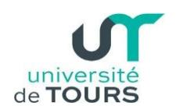
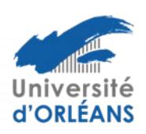

# Règlement intérieur de l'École Doctorale n° 551

# **MIPTIS**

# Mathématiques – Informatique – Physique Théorique et Ingénierie des Systèmes

#### Introduction

Le Règlement Intérieur de l'École Doctorale (ED) MIPTIS précise les modalités d'application des textes réglementaires relatifs au fonctionnement des Écoles Doctorales, parmi lesquels, le Code de l'Education, l'Arrêté du 26 août 2022 relatif à la formation doctorale, le décret du 30 août 2016 relatif aux doctorants contractuels et la Charte de thèse du collège doctoral Centre Val de Loire (CVdL).

# I. Laboratoires et instituts rattachés à l'École Doctorale

Le périmètre de l'ED MIPTIS est l'Ingénierie des Systèmes, l'Informatique, les Mathématiques, et la Physique Théorique. Y sont donc rattachés tous les laboratoires ou parties cohérentes de laboratoires relevant de ce périmètre.

L'ED MIPTIS regroupe quatre laboratoires des universités d'Orléans et Tours et de l'INSA CVL : **IDP** (sites d'Orléans et de Tours), **LIFAT**, **LIFO**, **PRISME** (Pôle IRAuS).

#### II. Gouvernance de l'ED

#### Conseil doctoral

#### Conseil à 19 membres :

- 10 enseignants-chercheurs ou chercheurs (2 pour chacun des 5 laboratoires historiques, chacun des sites de l'IDP étant considéré comme un laboratoire) appelés ci-après représentants des laboratoires. Ces membres ont aussi un rôle de correspondants de l'ED auprès des laboratoires et des masters de chaque discipline. Ils sont nommés par les conseils des laboratoires,
  - 2 BIATSS (élus parmi et par les BIATSS des 3 établissements),
- 3 doctorants, 1 par établissement, si possible de laboratoires différents. Elus parmi et par les doctorants de chaque établissement, et
  - 4 membres extérieurs nommés par le conseil doctoral.
  - Invités permanents avec voix consultative :
  - les directeurs des laboratoires,
  - les vice-présidents ou directeurs recherche des 3 établissements,
  - 1 représentant de la Région
  - 1 représentant du CNRS.

#### Le conseil doctoral

- définit la politique scientifique et pédagogique de l'ED,
- précise les règles relatives au fonctionnement de l'ED dont les dispenses partielles de formation (CIFRE, cotutelle...), et
- produit les indicateurs du fonctionnement de l'école (effectif, durée des thèses, insertion, mobilité des doctorants...) pour assurer son auto-évaluation et permettre l'adaptation des deux points précédents.

Le conseil doctoral se réunit au minimum 1 fois par an en présentiel et 2 fois par visioconférence. Chaque réunion fait l'objet d'un compte-rendu approuvé par l'ensemble des présents et diffusé avant le conseil suivant à tous les membres du conseil.

La durée maximum du mandat des doctorants élus aux conseils de l'ED est de trois ans. Les membres des conseils de l'ED sont nommés pour toute la durée de l'accréditation. Le directeur et les directeurs adjoints sont nommés pour toute la durée de l'accréditation. Leurs mandats sont renouvelables une fois.

#### **Bureau doctoral**

Le bureau est un sous-ensemble du conseil, il est constitué des représentants des laboratoires : un titulaire et un suppléant pour chacun des cinq laboratoires historiques (4 laboratoires actuels dont 1 sur 2 sites). Si un titulaire et son suppléant sont présents lors d'une réunion du bureau, seul le titulaire a le droit de vote.

Sont invités aux réunions du bureau (sans droit de vote) un représentant des doctorants (élu parmi et par les doctorants du conseil) et un représentant des personnels BIATSS (élu parmi et par les personnels BIATSS du conseil).

Le bureau se réunit toutes les 6 semaines environ (souvent en visioconférence).

Le bureau interagit avec les directions des laboratoires ou les instituts de recherche lorsque cela est nécessaire.

Les missions du bureau doctoral sont les suivantes :

- préparation des conseils et organisation des différentes étapes de recrutement de doctorants,
- inscriptions dérogatoires pour les 5ème année etplus,
- répartition des contrats doctoraux à partir des listes de sujets ordonnés fournies par les laboratoires,
- traitement des cas particuliers qui n'auront pas été traités par la direction (interruptions, maladie, problème financement, HDR dépassant le nombre maximal de thèses, diplôme étranger...).

#### Direction

La direction est composée du directeur et de ses deux adjoints appartenant à des établissements différents et si possible à des laboratoires différents. Issus des représentants des laboratoires, ils sont proposés aux établissements suite à un vote du conseil doctoral.

Au niveau de chaque établissement, le directeur local, éventuellement aidé des membres locaux du bureau, pourra traiter les dossiers courants pour :

- validation des inscriptions et réinscriptions en 1e, 2e et 3e années de doctorat et des conventions de formation doctorale,
  - accord des dérogations d'inscription en 4e année,
  - validation et dispense de crédits doctoraux,

RI ED MIPTIS - 2 - version décembre 2024

- accord de mobilités cofinancées par l'ED,
- validation des rapporteurs et du jury de thèse,
- validation de la soutenance suite aux rapports de soutenance,
- validation des dépôts de sujet de thèse et éventuellement des conventions de cotutelles, et
- gestion des comités de suivi individuel des doctorants.

## Collège doctoral

Le collège doctoral regroupera dans l'organisation pour le nouveau contrat cinq écoles doctorales co-accréditées (trois dans le domaine « Santé, Sciences, Technologies » et deux dans le domaine « Sciences de l'Homme et de la Société »). Des réunions, avec les directions des 5 ED, des représentants des doctorants, les responsables administratifs des services recherche et les VP/directeurs recherche des établissements, auront pour objectif d'échanger sur les différentes pratiques en vue d'une convergence tout en prenant en compte les spécificités de chaque domaine.

## Collège de site

C'est la version locale à un établissement du collège doctoral qui se réunit pour la répartition dans les ED des contrats doctoraux « Établissement » et « Collectivités » (Région) et pour faire évoluer l'offre locale de formation proposée aux doctorants.

# **III - Recrutement et inscription**

Sauf cas particulier des cotutelles, tous les doctorants relevant du périmètre de l'ED doivent y être inscrits.

# Contrats doctoraux « Etablissement » et « Collectivités » (Région)

#### Attribution financements sur les sujets

La direction des laboratoires transmet au bureau de l'ED une liste ordonnée par établissement concerné de sujets de thèse avec pour chaque sujet le nom du ou des directeurs de thèse et des co-encadrants éventuels.

Les laboratoires pourront se concerter au préalable pour proposer des sujets codirigés entre plusieurs laboratoires et plusieurs établissements.

À partir de ces listes, le bureau de l'ED propose une liste principale et une liste complémentaire sur les financements 100% Région et sur les financements Établissement (ex-bourses ministérielles).

Les listes provenant des laboratoires devront être transmises 2 semaines avant la date limite donnée par la Région pour envoyer les demandes sur les financements 100% Région afin de laisser le temps au bureau de se réunir et aux établissements de regrouper les demandes pour les transmettre à la Région. Si la Région garde la date du 15 janvier, la transmission des listes devra se faire avant les vacances de Noël.

#### Affectation candidats sur les sujets

Les encadrants de la thèse recherchent et sélectionnent de 1 à 3 candidats pour chaque sujet. Un ou plusieurs jurys sont mis en place (généralement fin mai début juin) pour établir un classement sur chaque sujet après audition des candidats. Ces jurys sont composés au moins en partie de membres du conseil de l'ED. Sont invités aux auditions les encadrants de la thèse et le directeur (ou son représentant) du laboratoire. Les auditions des candidats qui se trouvent à l'étranger peuvent se faire en visio-conférence.

Les candidats sont informés de leur classement et le premier doit répondre dans un délai de 8 jours. S'il accepte, la procédure est finie sinon on passe au candidat suivant.

RI ED MIPTIS - 3 - version décembre 2024

#### **Autres financements doctoraux**

Il existe de nombreuses sources de financements des doctorants : ANR, Europe, Labex, contrats de recherche et contrats entreprise, CIFRE/DGA/ADEME, gouvernements/associations/établissements étrangers, salariés...

Pour l'inscription en thèse, un financement d'au moins 1 100 € nets par mois de séjour en France, pour une durée de 3 ans, est requis. Ce montant minimum pourra être réévalué. Les financements légèrement inférieurs, mais proches de cette somme, seront soumis à l'avis du bureau.

Il est aussi vérifié les diplômes (équivalence de master) et maximum d'encadrements par HDR (cf. §VII).

Pour le recrutement de doctorants sur ces financements, si une sélection est déjà réalisée par des comités scientifiques alors l'ED n'intervient pas dans la sélection, sinon (pas de sélection scientifique) il est souhaitable que l'ED auditionne les candidats comme pour les contrats doctoraux afin d'émettre un avis sur le recrutement.

Par exemple, pour les bourses CIFRE, il faudrait mettre en place cette sélection avant le dépôt du dossier à l'ANRT.

Pour les doctorants salariés du privé ou du public, la convention de formation garantira la présence du doctorant dans son laboratoire pendant un certain nombre d'heures minimum par semaine (par exemple 16h, à déterminer avec les encadrants) consacrées à son travail de thèse.

Pour l'ensemble des financements de thèse précités (contrats doctoraux et autres financements), la gestion des financements de fin de thèse est discutée entre les membres du bureau et les encadrants de thèse et se base sur l'avis du CSI pour trouver la meilleure solution au cas par cas.

#### IV - Formations

Avant de pouvoir soutenir leur thèse, les doctorants doivent avoir validé 50 crédits doctoraux

Chaque année une réunion de rentrée est organisée où une information est donnée auxdoctorants sur les formations et moyens d'obtenir ces CD.

Des formations doctorales sont proposées par chaque établissement. Ces formations sont ouvertes à l'ensemble des doctorants même si ce sont majoritairement les doctorants de l'établissement qui y assistent.

L'évaluation des cours proposées par l'ED est réalisée sur la base d'un questionnaire rempli par les doctorants ayant suivi les cours (l'évaluation est obligatoire pour valider les crédits). Une synthèse de ces évaluations est présentée annuellement en collège de site qui valide chaque année le contenu des catalogues de formations.

En plus de ces formations, d'autres formations comme des écoles d'été ou des cours d'un master non déjà suivis par le doctorant peuvent donner des CD. Le volume est d'environ 20 heures pour valider 10 crédits doctoraux. Le doctorant doit en faire la demande avec une attestation pour les heures suivies et la direction peut valider les CD. Les formations proposées doivent être utiles au projet de recherche des doctorants et à leur projet professionnel ainsi qu'à l'acquisition d'une culture scientifique élargie. Ces formations doivent non seulement permettre de préparer les

docteurs au métier de chercheur dans le secteur public, l'industrie et les services mais, plus généralement, à tout métier requérant les compétences acquises lors de la formation doctorale.

Des actions comme la participation active à l'organisation d'un évènement scientifique peuvent aussi permettre de valider des CD. La participation à une conférence ne rapporte pas de CD.

Suivant les cas, le bureau peut accorder une partie de ces CD, par exemple les doctorants CIFRE obtiennent 30 CD car nous estimons qu'ils sont déjà bien formés à l'insertion professionnelle.

Une formation portant sur l'éthique de la recherche et l'intégrité scientifique, ainsi qu'une formation portant sur la sensibilisation aux VSS (Violences Sexistes et Sexuelles) seront également suivies par tous les doctorants, de préférence dès la première année du doctorat, ou à défaut en deuxième année du doctorat. Ces formations obligatoires n'apporteront pas de CD. Cependant, les doctorants qui souhaitent approfondir ces sujets peuvent suivre une seconde formation, laquelle pourra être créditée.

# V. Comité de suivi individuel (CSI) et rencontre annuelle

L'ED a mis en place le dispositif du comité de suivi individuel de thèse (CSI) conformément à l'arrêté du 26 août 2022.

Ce dispositif ne remplace pas les « comités de thèse scientifiques » tels qu'ils se pratiquent dans certains laboratoires. Les CSI pourront prendre en compte les rapports éventuels de ces comités scientifiques. Une rencontre annuelle peut être proposée en complément de ces dispositifs.

#### Rôle

S'assurer que le travail des doctorants se déroule normalement en étant vigilant sur les avancées scientifiques mais également sur l'environnement matériel et humain du doctorant. Le CSI aura notamment pour mission de détecter toute forme de conflit impliquant le doctorant dans son milieu professionnel, de s'assurer qu'il n'est pas victime de harcèlement moral, sexuel ou d'agissements sexistes. En cas de problème, le CSI informera l'école doctorale qui examinera la situation lors d'une réunion de bureau. Dans la mesure du possible, elle proposera des solutions au doctorant, en essayant de l'aider au mieux soit directement, en ayant par exemple un rôle de médiateur lors d'un conflit, ou indirectement en le mettant en contact avec des personnes susceptibles de l'aider.

# Composition et échéances

Composition du CSI: au moins deux chercheurs de préférence HDR. L'un doit être spécialiste de la discipline du doctorant et un autre doit être extérieur à cette discipline. Il doit notamment appartenir à un autre laboratoire que celui du doctorant. La composition du CSI est proposée par le directeur de thèse et sera soumise à l'approbation du doctorant avant la fin de la première année. Le comité doit être validé par l'ED avant la première réunion et reste le même

première année. Le comité doit être validé par l'ED avant la première réunion et reste le même tout au long du doctorat.

Les membres de ce comité ne participent pas à la direction du travail du doctorant.

Les membres du comité ne peuvent pas être rapporteur de la thèse. Cependant, ils peuvent être examinateurs.

Le comité se réunit avant chaque réinscription en thèse. Cette réunion est obligatoire pour la réinscription dès la 2ème année.

#### Réunions du CSI

Les réunions du CSI sont organisées par le/les directeur(s) de thèse en trois étapes distinctes : 1) présentation de l'avancement des travaux, et discussions en présence de la direction de thèse, 2) entretien avec le doctorant sans la direction de thèse, 3) entretien avec la direction de thèse sans le doctorant.

Préalablement à l'entretien, le doctorant transmettra au CSI son portfolio et d'une à trois pages de résumé sur les travaux de thèse accomplis et les perspectives envisagées.

## **Rapport**

Un rapport est établi par le CSI à l'issue de chaque réunion et transmis à l'école doctorale. Il est signé par les membres du CSI, le doctorant, la direction de thèse.

#### Rencontre annuelle

L'ED MIPTIS propose à chaque doctorant qui le souhaite, en complément du dispositif de CSI prévu par l'arrêté du 26 aout 2022, une rencontre annuelle. Elle consistera en un entretien court (une dizaine de minutes) entre le doctorant et un membre d'un laboratoire rattaché à l'école doctorale MIPTIS, différent de celui du doctorant. Cet entretien, non axé sur l'aspect scientifique, vise à vérifier le suivi des formations obligatoires et à détecter d'éventuels conflits, harcèlements ou comportements sexistes. La particularité est qu'il se déroule avec une personne sans lien avec la direction de thèse. Tout problème détecté est traité comme lors des CSI.

#### VI - Soutenance

Pour être autorisé à débuter la procédure de soutenance de leur thèse, les doctorants doivent avoir validé leurs CD (cf. § IV), complété leur portfolio de compétences et suivi la formation à l'éthique de la recherche et à l'intégrité scientifique.

Les doctorants doivent également avoir réalisé au moins une production scientifique importante (revue, conférence internationale ou brevet soumis) ou à défaut fournir une justification du directeur de thèse.

Le manuscrit de la thèse de doctorat est généralement écrit en français sauf dans le cas des cotutelles où il peut être entièrement en anglais. Nous autorisons qu'il soit écrit en anglais avec une partie substantielle en français (au moins 10 pages réparties dans introduction générale, introduction des chapitres, conclusion et résumé).

Bien que peu courants dans notre ED, les mémoires sur articles sont autorisés à la discrétion du directeur de thèse.

# VII - Limitation du nombre de thèses par HDR

Le nombre maximum de thèses simultanées pour un HDR est de 3 sachant que les thèses codirigées ou co-encadrées comptent pour 0,5 (quel que soit le taux d'encadrement). Donc un HDR peut au maximum diriger simultanément 6 doctorants sauf dérogation exceptionnelle.

#### VIII - Aide à la mobilité

L'école doctorale (ED) MIPTIS propose à ses doctorants une aide à la mobilité. La mobilité doit être en lien avec la thèse préparée. Elle peut être accordée entre autres pour un séjour dans un autre laboratoire, une conférence ou une école d'été/hiver. La destination peut être en France ou à l'étranger.

Une demande maximum par doctorant sur la durée de la thèse pourra être acceptée. La demande peut être envoyée toute l'année à l'ED (par l'intermédiaire des représentants des laboratoires), elle consiste en une simple description de la mobilité, son intérêt pour la thèse et un budget prévisionnel (inscription, déplacement, logement, autres frais) en précisant qui prendra en charge la partie non couverte par l'aide.

L'aide de l'ED sera généralement comprise entre 300 € et 600 €, en fonction du coût global.