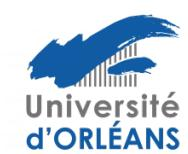
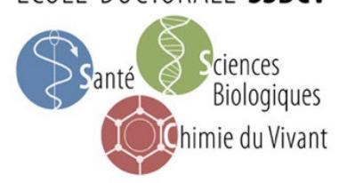
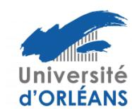

### ECOLE DOCTORALE **SSBCV**

### Règlement intérieur de l'Ecole Doctorale

Santé – Sciences Biologiques – Chimie du Vivant

# Version 3.0- document Validé par le Conseil de l'Ecole doctorale SSBCV du 7 décembre 2022

### Introduction

Le Règlement Intérieur (RI) de l'école doctorale « Santé – Sciences Biologiques – Chimie du Vivant » (l'ED SSBCV) précise les modalités d'application des textes réglementaires relatifs au fonctionnement des Ecoles Doctorales, parmi lesquels, le Code de l'Education, l'Arrêté du 26 août 2022 relatif à la formation doctorale, le décret du 30 août 2016 relatif aux doctorants contractuels et la Charte de thèse du collège doctoral Centre Val de Loire (CVdL). Il tient compte des particularités des établissements co-accrédités de l'Ecole Doctorale ainsi que de celles des unités de recherche rattachées à l'ED. Le RI précise également certaines dispositions spécifiques relatives au fonctionnement de l'ED SSBCV.

#### 1. Gouvernance de L'ED SSBCV

L'école doctorale est dirigée par un directeur et un directeur adjoint assistés d'un conseil.

Le directeur et le directeur adjoint de l'ED sont nommés par les présidents des Universités de Tours et Orléans après avis des commissions recherche, pour toute la durée de l'accréditation.

Le directeur et directeur adjoint doivent être choisis, au sein de l'ED, parmi les membres HDR professeurs et personnels assimilés.

La procédure de désignation d'un Directeur et d'un Directeur adjoint d'une ED est la suivante :

- Appel à candidature lancé aux HDR de l'ED par le Directeur actuel de l'ED
- Acte de candidature sous la forme d'une lettre de motivation et d'un CV envoyés au Dir ED actuel, aux Vice-Présidents de la Commission Recherche des Universités de Tours et d'Orléans, au chargé de mission Collège doctoral de l'Université d'Orléans au moins quinze jours avant le vote des directeurs d'unité

- Présentation et vote du nom du candidat au conseil de l'ED
- Vote à la Commission Recherche des universités de Tours et d'Orléans (le document doit avoir été reçu une semaine avant la séance de la Commission)
- Nomination par le président de l'établissement dont dépend le responsable élu.
- Notification à la séance suivante du Collège Doctoral CVL ».

La procédure de désignation d'un responsable de filière est la suivante : Les responsables des filières sont proposés par la direction et direction adjointe de l'ED, Leur nomination est validée par le conseil élargi de l'ED pour la durée de l'accréditation

Le conseil de l'école doctorale adopte le programme d'actions de l'école doctorale. Il gère, par ses délibérations, les affaires qui relèvent de l'école doctorale

Le conseil de l'ED SSBCV a deux composantes l'une élargie et l'autre restreinte.

Le conseil de l'école doctorale élargi a pour mission de définir la politique de formation et d'animation de l'ED. Il évalue chaque année les différents bilans de l'école doctorale et il approuve le règlement intérieur de l'ED.

Le Conseil de l'école doctorale restreint a pour mission de gérer les affaires courantes de l'ED (validation des inscriptions, demandes d'équivalence de Master, suivi des doctorants, aides à la mobilité, organisation des jurys d'attribution des allocations doctorales, analyse des rapports des comités de suivi individuel des doctorants, organisation et suivi des rencontres annuelles des doctorants).

Le Conseil doctoral élargi est composé de membres permanents :

- -Le directeur et le directeur adjoint de l'ED.
- Les responsables des filières (nommés par le directeur de l'ED) .
- -Deux représentants des unités de recherche : un pour le site de Tours et un pour le site d'Orléans (proposés par le directeur de l'ED)
- -Un représentant des BIATSS/ ITA du site de Tours et du site d'Orléans (nommés par les universités de Tours et d'Orléans)
- -Les représentants élus des doctorants 3 titulaires et 3 suppléants pour le site de Tours, 2 titulaires et 2 suppléants pour le site d'Orléans)
- -Quatre représentants du secteur socio-économique (proposés par le directeur de l'ED)
- -Le représentant du RTR Biotechnocentre
- Plusieurs invités permanents : Le VP Recherche Orléans, le VP Recherche chargé des Écoles doctorales de Tours, le Chargé de mission Collège Doctoral Orléans, un représentant du CNRS, de l'INSERM, de l'INRAE. Les responsables du Service RED, de l'université de Tours et de l'université d'Orléans sont présents et assistent aux présentations et aux décisions.

Le conseil doctoral élargi se réunit 2 fois par an sur convocation du directeur de l'école doctorale qui fixe les ordres du jour des réunions en concertation avec le directeur adjoint. Chaque réunion fait l'objet d'un compte rendu approuvé par l'ensemble des présents et diffusé aux membres du conseil, aux chefs des établissements accrédités et associés, aux directions des unités rattachées. Le compte rendu est publié sur le site de l'école doctorale et rendu ainsi accessible à tous.

Le Conseil de l'ED restreint est composé :

- -Du directeur et du directeur adjoint de l'ED et des responsables des Filières.
- -Des représentants élus des doctorants
- -Les responsables du service RED, de l'université de Tours et de l'université d'Orléans sont présents et assistent aux présentations et aux décisions.

Le conseil restreint de l'ED se réunit tous les mois sur convocation du directeur de l'école doctorale qui fixe les ordres du jour des réunions en concertation avec le directeur adjoint.

La durée maximum du mandat des doctorants élus aux conseils de l'ED est de trois ans

Les membres des conseils de l'ED sont nommés pour toute la durée de l'accréditation.

Le directeur et directeur adjoint sont nommés pour toute la durée de l'accréditation. Leurs mandats sont renouvelables une fois.

#### 2. Procédure d'attribution des allocations doctorales institutionnelles

Les financements institutionnels concernent des allocations doctorales « Université » (Université de Tours ou d'Orléans), des bourses 100% Région Centre Val de Loire et des bourses cofinancées par la Région Centre Val de Loire ou par un des établissements universitaires. Pour les bourses co-financées, le co-financement peut provenir d'un grand organisme (Inserm, INRAE, IFCE, CNRS...), d'une société privée, d'une part de financement dédiée provenant d'un projet de recherche (ANR, Europe...) ou d'un Laboratoire d'Excellence (Labex).

#### Première étape

A la fin de chaque année civile, les unités de recherche adossées à l'ED font remonter au sein de leur filière thématique, un certain nombre de sujets en fonction de leur politique propre et de leurs priorités. Le nombre de sujets proposés dépend de la capacité d'encadrement de l'unité, en terme de nombre de personnes titulaires de l'HDR. Il est d'environ un sujet pour cinq HDRs. Pour ne pas les pénaliser, nous proposons aux équipes de moins de cinq HDR de faire remonter un sujet.

#### Deuxième étape

Les sujets de thèse font l'objet d'une présentation par l'HDR porteur du sujet ou par le coencadrant, lors d'une réunion spécifique de chaque filière thématique en fin d'année civile. Chaque présentation est suivie d'une séance de questions animée par les HDRs présents, puis d'une délibération pour définir les priorités de financement. Après audition de l'ensemble des sujets (entre 10 et 15 sujets environ selon les filières), chaque filière délibère et définit des priorités de financement de thèses.

#### Troisième étape

En fonction du nombre d'allocations «Université» et 100% Région Centre VdL affectées à l'ED SSBCV, le conseil restreint attribue en tout début d'année, les bourses Région 100% et la majeure partie des allocations « Universités » en fonction des priorités définies par chaque filière. Quelques allocations Université sont attribuées plus tardivement de façon à maintenir cet équilibre en fonction des possibilités de co-financement qui sont en générals variables et différentes d'une filière à l'autre.

Dès l'obtention d'un financement, les sujets concernés sont diffusés sur la plateforme ADUM (http://adum.fr) par l'HDR responsable, selon un calendrier défini par l'ED.

### Quatrième étape

Les sujets de thèse qui peuvent faire l'objet d'un co-financement avec la Région Centre VdL sont transmis par les établissements de rattachement des HDRs (Université de Tours ou d'Orléans, CNRS, INRAE Centre VdL, INSERM etc..) à la Région qui priorise les sujets pouvant être co-financés, au sein des cinq Ecoles Doctorales du collège doctoral Centre Val de Loire. A cette réunion d'arbitrage (fin mars-début avril) sont conviés les directeurs d'ED et les représentants des tutelles.

Selon le nombre de bourses co-financées obtenues dans chaque filière de l'ED SSBCV, les bourses « Université » qui restent disponibles sont attribuées dans l'une ou l'autre filière de façon à maintenir un ratio bourses/HDR aussi proche que possible d'un même pourcentage et/ou pour maintenir un équilibre entre les équipes. La mise à jour des obtentions de financement de thèse est faite sur le site Web de façon à susciter des candidatures.

En parallèle, l'Université de Tours propose le financement de trois bourses de doctorat les « Bourses Rabelaisiennes». L'objectif des bourses Rabelaisiennes est de soutenir les recherches doctorales interdisciplinaires et favoriser les interactions entre les différentes EDs de l'université de Tours ou des unités de recherche extérieures à l'université de Tours. Les projets retenus sont sélectionnés par une commission constituée du président de l'Université, de 2 vice-président.es, d'un.e représentant.e de la commission Recherche et de 2 représentant.es des directeur.trices d'ED (1 SST et 1 SHS, désigné.es chaque année par les directeur.trices d'ED).

Pour l'université d'Orléans l'ED propose au président de l'université une liste de 2 sujets finançables à 100% et 2 sujets finançables à 50% pour l'attribution d'une bourse ou d'une demibourse présidentielle.

#### 3. Inscription en thèse

Diplômes permettant l'inscription en thèse :

- Diplôme français conférant le grade de Master dans un parcours Recherche (Master 2 Recherche ou diplôme d'ingénieur incluant un stage de fin d'études dans un laboratoire de recherche).
- Diplôme étranger de niveau Master, correspondant à 5 années d'études universitaires et incluant une formation à la recherche. Dans ce cas, le conseil restreint de l'ED se prononce sur une équivalence de diplôme avant de donner l'autorisation d'inscription. Une attention particulière est portée à la durée de la formation à la recherche suivie par le candidat au cours de son cursus.

Aucune inscription en thèse n'est possible dans l'ED SSBCV sans financement. Le justificatif de

l'obtention d'un financement de 3 ans de thèse doit figurer dans le dossier d'inscription. Le montant minimum doit être de 1000 € par mois. Dans le cas des thèses en cotutelle, le minimum de 1000 € par mois concerne la période où le doctorant séjourne en France.

#### 4. Recrutement des doctorants

L'ED est particulièrement attentive au recrutement des futurs doctorants. Le candidat effectue sa thèse, sous la responsabilité d'un directeur de thèse, titulaire de l'HDR, rattaché à l'ED SSBCV. La co-direction peut être envisagée, par un co-directeur également titulaire de l'HDR (ou diplôme équivalent), appartenant à la même équipe/unité, à une autre équipe du périmètre du collège doctoral CVdL, à une autre université, française ou étrangère ou appartenant au secteur industriel.

Afin de garantir aux doctorants une bonne qualité d'encadrement, le taux d'encadrement du directeur de thèse ne devra pas dépasser 300 % en même temps (soit 3 thèses encadrées à 100% ou 5 thèses co-dirigées, la co-direction étant considérée correspondre à 50 %).

Le co-encadrement d'une thèse, par un encadrant sans HDR, est possible dans la limite de un co-encadrant, à un taux de co-encadrement de la thèse ne pouvant dépasser 50 %.

Le co-encadrement est reconnu officiellement par l'ED et l'indication figure comme telle sur la page de couverture du manuscrit de thèse. Toutefois, l'ED n'autorise que deux co-encadrements « officiels », soit pour deux thèses en même temps, soit pour deux thèses successives. Ceci pour inciter les jeunes collègues désireux de participer à la formation doctorale, à soutenir l'HDR. L'ED n'accepte pas le co-encadrement d'une thèse par un post-doctorant ou par une personne non titulaire.

Dans le cas d'une direction de thèse avec un directeur de thèse et un co-directeur de thèse appartenant à deux unités différentes, chacun peut s'entourer d'un co-encadrant.

Dans l'éventualité où le co-encadrant obtient l'HDR avant le début de la 3ème année de la thèse dont il assure le co-encadrement, il peut en accord avec le directeur de thèse et le doctorant, prendre la direction de la thèse. Dans ce cas, la demande co-signée de toutes les parties, doit être adressée à l'ED.

Il est rappelé que dans la situation particulière de co-encadrement, le directeur de thèse reste responsable de la thèse, en particulier au regard des droits et devoirs figurant dans la charte de thèse.

Dans tous les cas de figure, l'encadrement de la thèse (directeur de thèse, co-directeur(s)/co-encadrant(s)) doit être défini dès le démarrage de la thèse et mentionné dans le formulaire d'inscription du doctorant.

**Tous** les recrutements doivent respecter trois principes (**quel que soit le type de financement** à l'exception des allocations nominatives, voir fin de paragraphe) :

• **Ouverture** du recrutement : **tous** les sujets doivent faire l'objet d'une publication pendant une période d'au moins un mois sur le site de l'école doctorale SSBCV (Français et/ou Anglais) et sur le site Euraxess (Anglais uniquement).

- Transparence du processus de recrutement, garantissant l'égalité de traitement de tous les candidats : publication claire et transparente des informations relatives au processus de sélection (étapes et planning du processus, composition du comité de sélection, modalité d'audition le cas échéant, critères de sélection ...)
- Classement selon le **mérite** du candidat : audition des candidats par un jury et classement selon le mérite du candidat et son adéquation par rapport au sujet

#### 4.1. Sur financement Institutionnel

L'HDR porteur du sujet est informé par l'ED de l'obtention d'un financement, et présélectionne des candidats en fonction de leur cursus, motivation, capacité à mener à bien le sujet de thèse... Une première campagne d'audition des candidats a lieu début mai pour les sujets attributaires d'un financement en début d'année et une seconde campagne est organisée fin juin-début juillet pour les sujets ayant bénéficié d'un financement plus tardivement (en particulier les co-financements avec la Région CVdL ou des fiancements Université). L'ED demande à l'HDR de présenter 3 candidats qui sont auditionnés par un jury de 3-4 personnes issues du Conseil de l'ED ou des HDRs de l'ED , sur la base de 30 minutes par candidat (présentation et questions). Les candidats sont classés par ordre de mérite et informés dès la fin de l'audition. Dans des cas très exceptionnels, si pour différentes raisons, le recrutement n'a pas abouti, une ultime série d'audition est organisée mi-septembre.

#### 4.2. Sur financement non institutionnel

S'agissant des recrutements de doctorants sur allocations non institutionnelles, l'ED SSBCV a fait le choix de déléguer le recrutement du doctorant au porteur du projet de thèse selon une procédure se déroulant en 3 phases.

Dans la phase 1, l'HDR attributaire d'un financement de thèse informe l'ED de l'obtention d'un financement de thèse, concomitamment à la publication de l'offre de thèse sur la plateforme ADUM. L'HDR constitue ensuite un comité de sélection (jury) de 3 personnes (2 membres du jury ne doivent pas appartenir à la même équipe que le directeur de thèse) et précise les critères de sélection du candidat et les modalités d'audition. Ces éléments sont transmis à l'ED pour validation, accompagnés du sujet de thèse et de la fiche récapitulative selon le modèle disponible sur le site Web de l'ED.

Dans la phase 2, le jury constitué auditionne au minimum 3 candidats de bon niveau, présélectionnés par l'HDR. Après audition, le directeur de thèse transmet à l'ED, 3 dossiers de candidats auditionnés avec le classement associé (1, 2, 3) ainsi que la fiche récapitulative de l'ensemble de la procédure de recrutement (fiche disponible sur le site Web de l'ED) comportant l'argumentaire détaillé justifiant le choix du candidat retenu pour mener à bien le projet de thèse.

En dernier lieu (phase 3), l'ED examine les éléments transmis, pour validation avant inscription du doctorant.

Sont exclus de cette procédure de recrutement de doctorant, les financements pour lesquels la demande se fait de façon strictement nominative pour un candidat (bourse CIFRE, bourse ANRS, bourse Handicap, bourse pour thèse en cotutelle...) ainsi que les doctorants salariés (médecins, pharmaciens, enseignants, autres...)

Dans le cas d'une demande de bourse nominative auprès de fondations, associations etc., l'ED considère que le financeur s'est assuré de l'évaluation du candidat et de son aptitude à mener à bien la thèse sur laquelle il a candidaté.

Dans le cas des bourses CIFRE, la direction de l'ED est amenée, à la demande de l'ANRT, à formuler un avis sur le dossier du candidat à la thèse mais c'est l'ANRT qui prend la décision finale. Dans ces deux derniers cas, l'ED peut conseiller en amont, les collègues qui le souhaitent, pour sélectionner les candidats à ces bourses nominatives.

En application des dispositions des articles 1 et 4 du décret n° 2021-1233 du 25 septembre 2021 prévu par l'article L. 412-3 du code de la recherche autorise une entreprise privée peu recourir à un contrat doctoral de droit privé pour l'embauche doctorant. Une convention devra être établit pour de définir les modalités suivant lesquelles les Parties collaborent afin de garantir l'encadrement scientifique du Salarié doctorant, sa formation doctorale, la réalisation et le suivi du projet doctoral et afin de fixer les droits et obligations respectifs des Parties. Le projet doctoral s'inscrit dans un projet de recherche intitulé porté par une unité de recherche en partenariat une entreprise. Le doctorat sera encadré par un HDR réferent de l'ED SSBCV et un representant de l'entreprise.

L'ED peut refuser une candidature ou une inscription en thèse si le niveau académique du candidat est jugé trop faible ou si la formation du candidat à la recherche n'est pas jugée suffisante ou pas en adéquation avec le projet de thèse.

### 5. Suivi des doctorants et réinscription en thèse

#### 5.1. Suivi des doctorants

L'ED a mis en place une procédure de comité de suivi individuel de thèse (CSI), conformément à l'arrêté du 26 aout 2022. Cette procédure est affichée sur le site Web de l'ED et diffusée aux doctorants à chaque rentrée universitaire.

Le comité de suivi individuel du doctorant veille au bon déroulement du cursus en s'appuyant sur la charte du doctorat et la convention de formation.

Il évalue les conditions de sa formation et les avancées de sa recherche. Lors de ce même entretien, le comité est particulièrement vigilant à repérer et prévenir toute forme de conflit, de discrimination ou de harcèlement moral ou sexuel ou d'agissement sexiste.

En cas de difficulté, le comité de suivi individuel du doctorant alerte l'école doctorale, qui prend toute mesure nécessaire relative à la situation du doctorant et au déroulement de son doctorat.

Dès que l'école doctorale prend connaissance d'actes de violence, de discrimination, de harcèlement moral ou sexuel ou d'agissements sexistes, elle procède à un signalement à la cellule d'écoute de l'établissement contre les discriminations et les violences sexuelles.

Le comité de suivi individuel du doctorant assure un accompagnement de ce dernier pendant toute la durée du doctorat.

Il se réunit obligatoirement avant l'inscription en deuxième année et ensuite avant chaque nouvelle inscription jusqu'à la fin du doctorat.

Le directeur de thèse organise le CSI. Le doctorant participe et valide la composition du comité Le comité doit être validé par l'ED avant la première réunion et reste le même tout au long du

doctorat.

Un rapport est rédigé après chaque CSI, signé par ses membres, le doctorant et le directeur de thèse et est adressé au directeur de l'ED chaque année avant la réinscription du doctorant.

Le CSI comprend au moins 3 membres :

- Deux membres spécialistes de la discipline dont au moins un membre spécialiste est extérieur à l'établissement
- Un membre non spécialiste extérieur au domaine de recherche du travail de la thèse.

Les membres de ce comité ne participent pas à la direction du travail du doctorant.

Les membres du comité ne peuvent pas être rapporteur de la thèse. Cependant, ils peuvent être examinateurs.

Le CSI est organisé en trois étapes distinctes : 1) présentation de l'avancement des travaux, et discussions en présence du directeur de thèse, 2) entretien avec le doctorant sans la direction de thèse, 3) entretien avec la direction de thèse sans le doctorant.

L'ED SSBCV a mise en place une rencontre annuelle du doctorant

La rencontre annuelle du doctorant a pour objectif que l'ED évalue avec le doctorant les conditions de déroulement de sa thèse et de suivi des formations. Cet entretien entre des membres du conseil restreint de l'ED et le doctorant et sans le directeur de thèse a une durée de 30 minutes.

2 membres du conseil restreint de l'ED participent à ces rencontres.

Les rencontres ont lieu 2 fois au cours de la thèse :

- avant la fin de la 1ère année (au plus tard fin septembre de chaque année pour les inscriptions en début d'année universitaire)
- avant la fin de la 2ème année

Si le doctorant s'inscrit en 4ème année pour une soutenance prévue au-delà de 40 mois, la rencontre a lieu une 3ème fois entre le 40ème et 42ème mois pour évaluer les conditions permettant d'envisager la soutenance de thèse.

Un rapport est établi. Il est basé sur la discussion avec le doctorant. Le doctorant peut s'il le souhaite porter ses propres remarques au rapport.

Ce rapport, confidentiel, signé par les membres du conseil de l'ED et par le doctorant, est ensuite joint au dossier du candidat. L'examen de l'ensemble des rapports de rencontre annuelle du doctorant se fait en conseil restreint de l'ED après chaque campagne.

Si des problèmes dans le déroulement de la thèse sont révélés par la rencontre annuelle du doctorant ou apparaissent à d'autres moments, le conseil restreint de l'ED discute de l'opportunité de convoquer une nouvelle rencontre pour un entretien avec le directeur de thèse, seul d'une part, et le directeur de thèse et le doctorant ensemble d'autre part. Durant l'entretien, le comité propose de possibles solutions pour résoudre les problèmes éventuels et un échéancier de leur mise en œuvre qui devra être accepté par les différentes parties.

### 5.2. Réinscriptions

Le doctorant doit se réinscrire administrativement chaque année jusqu'à la soutenance de thèse

via son compte personnel dans la plateforme ADUM. Aucune soutenance ne peut avoir lieu sans un minimum de deux inscriptions administratives en doctorat. Dans le cas d'une thèse en cotutelle, le doctorant devra s'inscrire au minimum une fois dans l'établissement français (Université de Tours ou Université d'Orléans), voire deux fois, en fonction des termes de la convention de cotutelle.

L'inscription en quatrième année n'est accordée que sur dérogation après avis du directeur de thèse, du directeur d'unité et du directeur ou directeur adjoint de l'ED. La demande de dérogation doit être argumentée. Elle doit notamment préciser l'état d'avancement de la thèse et de l'écriture du manuscrit de thèse ainsi que la date estimée de soutenance que s'engage à respecter le doctorant et son directeur de thèse. La direction de l'ED peut convoquer le doctorant pour évaluer la faisabilité et le financement de cette 4ème année.

Les doctorants en situation particulière, telle que thèse démarrée en milieu d'année universitaire ou cotutelle internationale dont la durée spécifiée dans la convention est de quatre ans, doivent se réinscrire en quatrième année selon la même procédure.

L'inscription en 5ème et 6ème année de thèse nécessite, outre l'avis du directeur de thèse et du directeur d'unité, un avis du conseil restreint de l'ED qui tiendra compte des situations particulières (arrêt maladie, congé maternité...).

L'arrêté du 26 août 2022 autorise durant la thèse une période de césure insécable d'une durée maximale d'une année. L'ED n'encourage pas cette possibilité, qui doit rester très exceptionnelle et qui doit faire l'objet d'une demande motivée pour obtenir l'autorisation par le chef d'établissement, après avis du directeur de thèse et du directeur ou directeur adjoint de l'ED. Le doctorant peut rester inscrit durant la période de césure mais celle-ci n'est pas comptabilisée dans la durée de la thèse.

### 6. Aide financière à la mobilité internationale et à la participation à des congrès

L'ED propose sur son propre budget, deux types d'aides financières aux doctorants : l'une concerne une aide à la mobilité, l'autre la participation à un congrès scientifique international ou à un colloque. Au cours de sa thèse, un doctorant ne peut bénéficier qu'une seule fois de chacune de ces aides.

La mobilité du doctorant dans un laboratoire hors de son université d'origine, peut être nécessaire, pour aller acquérir une technique spécifique ou pour y mener des travaux en lien avec sa thèse, ne pouvant pas être réalisés dans son laboratoire d'origine. L'ED encourage, grâce à cette aide, plafonnée à 1500 euros, la mobilité des doctorants pour des séjours relativement courts (3-5 semaines) dans un laboratoire à l'étranger. La mobilité dans un laboratoire situé en France n'est pas exclue, en fonction de la nature du projet scientifique.

Le doctorant candidat à une aide à la mobilité, pourra faire une demande auprès de l'ED (formulaire à télécharger sur le site de l'ED), en transmettant un dossier de trois pages maximum précisant les dates de déplacement et faisant apparaître:

- 1. l'objectif précis du projet et sa faisabilité
- 2. l'intérêt pour la formation du doctorant
- 3. un budget prévisionnel indiquant le montant demandé à l'ED
- 4. l'avis du directeur de thèse et du directeur du laboratoire d'accueil à l'étranger

L'appel à projet est permanent. Les demandes sont examinées au fil de l'eau par le conseil restreint de l'ED qui accorde ces aides en fonction de l'évaluation qu'elle fait de chaque dossier. Au retour de la mission, un compte-rendu (1 page maximum) de la mobilité est demandé au doctorant.

NB : dans le cas de thèse en cotutelle, ce dispositif n'est pas destiné à financer les voyages du doctorant vers l'un ou l'autre de ses laboratoires d'accueil.

Le second type d'aide concerne le soutien financier à la participation des doctorants à un colloque ou congrès sous réserve d'une communication orale acceptée. L'ED souhaite favoriser la participation des doctorants à des colloques ou congrès internationaux à l'étranger. L'examen des demandes (formulaire à télécharger sur le site de l'ED) sera effectué par le conseil restreint de l'ED.

Le dossier de demande devra comprendre :

- 1. le nom du congrès, date et lieu
- 2. l'intérêt pour la formation du doctorant
- 3. la copie de l'acception de la communication orale`
- 4. l'avis du directeur de thèse

Un montant maximum est fixé en fonction du lieu du congrès international. Il est de 250 € pour un colloque international en France, de 500 € pour un colloque international en Europe et de 750 € pour un colloque international hors Europe.

### 7. Formations et portfolio de compétences

Les Ecoles Doctorales ont, dans le cadre de leur mission d'organisation de la formation doctorale, le devoir d'apporter aux doctorants une culture pluridisciplinaire, de leur proposer des formations utiles à leur projet de recherche et à leur projet professionnel ainsi que des formations nécessaires à l'acquisition d'une culture scientifique élargie. Une convention de formation discutée entre le doctorant et son directeur de thèse doit être déposée à l'ED dûment signée par les parties avant la fin de la 1ère année.

Les doctorants de l'ED SSBCV, qu'ils soient inscrits à l'Université de Tours ou à celle d'Orléans, ont accès aux mêmes formations, qu'ils valident dans les mêmes conditions. Chaque université a son catalogue de formations, proposées et accessibles à tous les doctorants de l'ED SSBCV.

Deux types de formations sont proposés: des formations transversales et des formations disciplinaires.

Pour pouvoir soutenir sa thèse, le doctorant doit, durant la période de thèse, effectuer un minimum de 100 heures de formation, validées par 50 crédits doctoraux (1 CD correspondant à 2 heures de formation). En fonction du volume horaire, une formation peut être validée par 5, 10 ou au maximum 20 CD, de manière non sécable. La moitié au moins des CD doit être obtenue dans les formations transversales.

L'ED offre la possibilité de valider par des CD, le suivi d'une unité complète d'enseignement de Master ainsi que des actions collectives ou de diffusion de la culture scientifique.

D'autres formations peuvent être suivies hors du périmètre du collège doctoral CVdL, en France ou à l'étranger, dès lors qu'elles peuvent s'inscrire dans le projet professionnel du doctorant et être

utiles à son insertion professionnelle future.

A titre d'exemple, les cours du Collège de France peuvent être suivis dans le cadre de la convention signée entre le Collège de France et chacune des deux universités, Orléans et Tours ainsi que les écoles d'été et formations proposées par l'INRAE, l'Inserm, le CNRS.... L'ED autorise le suvi de formations à distance de type MOOC, dans la limite de 2 formations de ce type.

Dans tous ces cas, une demande doit être faite au préalable à la direction de l'Ecole Doctorale pour qu'elle donne son accord sur la validation possible de la formation sous forme de CD. Le financement de la participation à ces formations externes est pris en charge par l'équipe d'accueil du doctorant. L'ED ne valide pas sous la forme de CD, la participation du doctorant à des colloques, congrès, workshops... ni les activités d'encadrement de stagiaires effectuées par le doctorant, ni les activités d'enseignement réalisées au cours de la thèse.

Conformément à l'arrêté du 26 août 2022, l'ED dispense aux doctorants une formation à l'éthique et à l'intégrité scientifique, qui ne donne pas lieu à l'attribution de crédits doctoraux. Le suivi de cette formation est obligatoire pour délivrer l'autorisation de soutenance. Les compétences acquises et les formations suivies durant la thèse sont listées par le doctorant au fur et à mesure de leur obtention dans le portfolio de compétences selon le modèle proposé par le collège doctoral Centre Val de Loire. Ce portfolio doit être complété et visé par le directeur ou directeur adjoint de l'ED avant la délivrance de l'autorisation de soutenance.

La validation et le suivi des formations des doctorants sont organisés, établissement par établissement, par le Directeur ou le Directeur adjoint de l'ED en lien avec la cellule administrative de site. Il est demandé au doctorant de fournir les justificatifs nécessaires (volume horaire, certificat de participation) accompagnés de la fiche de demande de validation disponible sur le site Web de l'ED.

Les doctorants salariés (hors emplois d'appoint), notamment les internes en pharmacie ou en médecine, les ingénieurs d'étude, inscrits en thèse dans l'ED SSBCV, peuvent à leur demande, être dispensés du suivi de ces formations.

Les doctorants inscrits en thèse dans le cadre d'une convention CIFRE doivent valider un minimum de 25 CD, au lieu de 50 CD.

La formation à l'intégrité scientifique et à l'éthique reste obligatoire pour les doctorants salariés comme pour les doctorants en convention CIFRE.

#### 8. Soutenance de thèse

Ces procédures décrites ci-dessous sont établies par les universités sur avis de leurs Conseils. Ce texte rappelle la pratique au moment où il est rédigé.

Un(e) doctorant(e) peut être autorisé à soutenir sa thèse que s'il/elle a pris au moins deux inscriptions administratives. Toute demande d'autorisation de soutenance pour une thèse de durée inférieure à trente mois devra faire l'objet d'une demande de dérogation auprès de l'ED.

### 8.1. Procédure de soutenance

Les prérequis à la soutenance d'une thèse de doctorat sont les suivants :

- validation de 50 crédits doctoraux correspondant à 100 heures de formation (voir paragraphe sur les formations)

- avoir suivi la formation obligatoire à l'intégrité scientifique et à l'éthique
- le portfolio de compétences dûment complété et visé par la direction de l'ED
- l'acceptation de la publication d'un article en position de 1er auteur dans une revue internationale indexée à comité de lecture, ou la participation effective à un brevet, en qualité de co-inventeur.

L'ED n'est pas opposée à la signature d'articles par le doctorant en position de co-premier auteur. Toutefois si le doctorant a un seul article, où il signe en co-premier auteur, le conseil restreint sera amené à se prononcer sur l'opportunité d'engager le processus de soutenance. Dans cette situation, il convient donc d'anticiper et d'en informer l'ED dès que possible.

Le principe d'une publication soumise, au moment d'initier la procédure administrative de soutenance, peut-être envisagé, sous conditions, au cas par cas et sur avis du directeur ou directeur adjoint de l'ED. Cette situation particulière n'est pas encouragée par l'ED et nécessite une prise de contact anticipée avec la direction de l'ED, au risque de devoir reporter la soutenance.

- l'avis favorable à la soutenance de deux rapporteurs (titulaires de l'HDR ou diplôme équivalent)

La soutenance est publique conformément à la loi. Elle peut avoir lieu à huis clos si la nature confidentielle des travaux l'exige mais doit faire l'objet d'une demande préalable auprès de la direction de l'ED.

Il est demandé aux doctorants et aux encadrants de respecter les délais relatifs à la procédure de soutenance, précisés sur le site Web de l'ED. En cas de non-respect, l'ED ne pourra pas garantir la tenue de la soutenance à la date envisagée.

Le jury de soutenance doit être établi conformément aux textes officiels (Arrêté du 26 août 2022) et aux règles spécifiques à l'ED SSBCV: Il est désigné par le chef d'établissement sur proposition du(des) (co)-directeur(s) de thèse après avis du directeur de l'ED ou du directeur adjoint.

Les membres du jury et sa composition doit répondre aux conditions suivantes :

- il compte entre quatre et huit membres ;
- il doit tendre vers une représentation équilibrée de femmes et d'hommes ;
- la moitié au moins de ses membres sont des personnalités (françaises ou étrangères) extérieures à l'Unviersité de Tours et d'Orléans
- la moitié au moins sont des professeurs ou personnels assimilés;
- il comprend au moins un enseignant-chercheur HDR ou assimilé, de l'établissement où est inscrit le doctorant, hors (co)directeur de thèse et encadrant.
- Il peut être fait appel à des rapporteurs étrangers mais quand c'est le cas, il doit avoir un statut de « full professor », que l'on peut considérer comme assimilé à un professeur des universités. Un « associate professor » est assimilé à un maître de conférences et n'est pas titulaire d'une HDR. Il ne peut donc pas être rapporteur mais peut être membre du jury.
- Les personnels des Ecoles Vétérinaires (Professeur et Maître de Conférences) et de l'Institut Pasteur (chercheurs) ne figurent pas dans la liste des personnels pouvant être assimilés à des

Professeurs des Universités ou Maître de Conférences. Ils peuvent toutefois, en fonction de leurs compétences scientifiques, être rapporteur (s'ils ont l'HDR) ou membres du jury, après avis du directeur ou directeur adjoint de l'ED.

• Pour la partie du jury comprenant les membres de l'Université de Tours et d'Orléans, ceux-ci ne doivent pas tous appartenir à la même équipe de recherche et n'ayant pas co-publié avec le doctorant.

Il s'agit de limiter le caractère endogène des jurys, de limiter le nombre de membres ayant un lien d'intérêt et/ou de subordination avec le doctorant et de garantir au doctorant un jury de qualité et indépendant en vue de la délivrance et de la valorisation de son doctorat.

• Le nombre de membres invités dans le jury est de deux membres invités au maximum. Un membre invité ne fait pas officiellement partie du jury et n'apparaît pas dans les documents officiels de soutenance. Il ne participe pas aux délibérations du jury.

Un jury de thèse étant par définition constitué sur mesure, sa conformité est évaluée au cas par cas par le directeur ou directeur adjoint de l'ED, qui veille au respect de ces principes de façon à garantir au jeune docteur la meilleure reconnaissance possible de son diplôme.

### 8.2. Langue de rédaction de la thèse

Le manuscrit de la thèse doit être obligatoirement écrit en français. Il pourra être rédigé en anglais, si le doctorant n'est pas francophone, si la thèse ou la soutenance se déroule dans un contexte international ou si la thèse s'effectue en co-tutelle en respectant les termes inscrits dans la convention de co-tutelle. Dans tous les cas, une demande préalable devra être adressée au directeur ou directeur adjoint de l'ED, avant le début de la rédaction, en précisant également si la soutenance se fait en anglais. Pour être en conformité avec la loi, le manuscrit de thèse devra comporter une introduction, un résumé de chaque chapitre et une conclusion en français.

#### 8.3. Thèse sur travaux

Cette disposition vise à permettre l'obtention du doctorat sur la base de travaux de recherche personnels réalisés par le candidat, antérieurement à son inscription dans l'ED SSBCV. Elle concerne le plus souvent des personnels en poste qui ont pu dans le cadre de leurs activités professionnelles, mener des travaux de recherche en investigateur principal, travaux ayant donné lieu à des publications scientifiques.

La procédure détaillée est indiquée dans la fiche correspondante disponible sur le site Web du Collège doctoral Centre Val de Loire. Elle comprend trois phases dont la première concerne la recevabilité du dossier qui est examiné par le Conseil de l'ED. Après accord de l'ED, le candidat prépare un manuscrit de thèse sous la direction d'un directeur de thèse, titulaire de l'HDR et membre d'une équipe de recherche adossée à l'ED. La soutenance de thèse a lieu comme dans la voie standard.

#### 8. Thèse en cotutelle

Les établissements adossés au collège doctoral CVdL participent à de nombreux échanges internationaux et soutiennent notamment les cotutelles internationales de thèse.

La cotutelle de thèse, est officialisée, de manière nominative, par la signature d'une convention de cotutelle entre l'Université de Tours ou d'Orléans et un établissement d'enseignement supérieur étranger, habilité à délivrer le doctorat. Le doctorant est encadré par un directeur de thèse dans chacun des établissements partenaires et doit passer au minimum 12 mois, dans l'une des équipes, en France ou à l'étranger, durant les trois ou quatre années de cotutelle. Pour que la cotutelle soit effective, le doctorant doit être inscrit dans les deux établissements. Il est rappelé que le doctorant doit justifier d'un revenu de 1000 € nets par mois, pour les séjours en France. La convention de cotutelle précise les conditions de préparation de la thèse, les dates prévisionnelles de présence dans chacun des laboratoires, le paiement des droits d'inscription ainsi que les modalités de soutenance et de délivrance du diplôme. La thèse donne lieu à une soutenance unique qui se doit d'être conforme aux règles de l'ED SSBCV, quelque soit le lieu de soutenance. Toute période de présence au delà des dates précisées dans la convention initiale doit faire l'objet d'un avenant à la convention de cotutelle.

Un doctorant en cotutelle doit également valider un volume de 100 heures de formation, soit en France, soit dans son pays d'origine ou les deux selon les cas. Les doctorants en cotutelle sont fortement incités à suivre les formations de français, dans la mesure du possible, lors de leurs séjours en France.

### 9. Serment du docteur relatif à l'intégrité scientifique (arrêté du 26 août 2022)

A l'issue de la soutenance et en cas d'admission, le docteur prête serment, individuellement en s'engageant à respecter les principes et exigences de l'intégrité scientifique dans la suite de sa carrière professionnelle, quel qu'en soit le secteur ou le domaine d'activité.

Le serment des docteurs relatif à l'intégrité scientifique est le suivant :

"En présence de mes pairs. Parvenu(e) à l'issue de mon doctorat en [xxx], et ayant ainsi pratiqué, dans ma quête du savoir, l'exercice d'une recherche scientifique exigeante, en cultivant la rigueur intellectuelle, la réflexivité éthique et dans le respect des principes de l'intégrité scientifique, je m'engage, pour ce qui dépendra de moi, dans la suite de ma carrière professionnelle quel qu'en soit le secteur ou le domaine d'activité, à maintenir une conduite intègre dans mon rapport au savoir, mes méthodes et mes résultats."

Dans le procès-verbal de la soutenance, il sera indiqué si le docteur a prêté serment