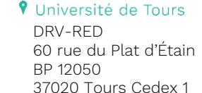
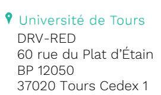

# Règlement de l'Habilitation à Diriger des Recherches (HDR) Université de Tours

Proposé le 24 juin 2025 par la Commission Recherche Adopté le 07 juillet 2025 par le Conseil d'Administration

(Arrêté du 23 Novembre 1988 modifié)

"L'habilitation à diriger des recherches sanctionne la reconnaissance du haut niveau scientifique du candidat, du caractère original de sa démarche dans un domaine de la science, de son aptitude à maitriser une stratégie de recherche dans un domaine scientifique ou technologique suffisamment large et de sa capacité à encadrer de jeunes chercheurs".

#### Informations à l'attention des candidats

le Service de la Recherche et des Etudes Doctorales (RED) au sein de la Direction de la Recherche et de la Valorisation (DRV) est en charge de l'accompagnement des candidats, de l'instruction administrative des dossiers d'Habilitation à Diriger des Recherches, de la mise en œuvre des décisions de la CR Restreintes, jusqu'à l'édition des diplômes d'HDR. Pour toute question d'ordre scientifique, le candidat est invité à se rapprocher de son référent.

#### Lien reglement HDR 

https://www.univ-tours.fr/medias/fichier/reglement-hdr-cr-24-06-25-ca-07-07-25_1752062828074-pdf?ID_FICHE=374670&INLINE=FALSE

## **Contact:**

Service de la Recherche et des Etudes Doctorales

Aurélie Pétereau

**a** 02 47 36 64 12 aurelie.petereau@univ-tours.fr

Adresse: 60 rue du Plat d'Etain

BP 12050 - 37020 TOURS Cedex 1

Bâtiment A - 1er étage - Bureau 1360

02 47 36 64 12

 $\triangle$ 

red@univ-tours.fr

# I - AUTORISATION D'INSCRIPTION

Les dossiers de candidature doivent être examinés en Commission Recherche Restreinte aux HDR. Cet examen peut être inscrit à l'ordre du jour de chacune des séances de la Commission Recherche. Les dates des commissions recherche sont disponibles sur le site de l'université et mises à jour annuellement.

## A - TITRES REQUIS (arrêté du 23 novembre 1988 modifié)

• Diplôme de doctorat

ou

• Diplôme de docteur permettant l'exercice de la médecine, de l'odontologie, de la pharmacie et de la médecine vétérinaire et titulaire d'un Diplôme d'Etudes Approfondies, ou d'un Master Recherche,

ΩU

• justifier d'un diplôme, de travaux ou d'une expérience d'un niveau équivalent au doctorat.

#### **B – APPRECIATION DU DOSSIER PAR LA COMMISSION RECHERCHE RESTREINTE**

Dans cette partie, sont repris les éléments prérequis au dépôt de dossier d'autorisation d'inscription. Ils sont donnés à titre indicatif et ont été définis par la Commission Recherche afin de répondre largement à la diversité des thématiques de recherche de l'université de Tours. Il existe en effet des variations selon les disciplines et champs disciplinaires ; ces différences peuvent être argumentées par l'avis du directeur d'unité de recherche, de membres du CNU ou de comités nationaux INSERM, CNRS ou INRAE,

Au-delà des titres requis, il est attendu que le candidat justifie :

- d'au moins 5 ans d'activité de recherche depuis la thèse
- d'au moins une dizaine de publications postérieures aux travaux de thèse
- des expériences diversifiées en termes de recherche : portage de projets, actions SAPS, animation de réseaux, organisation de colloques, etc
- d'encadrements de recherches (thèses, masters, post-doctorats, etc.).

Ainsi, la commission recherche sera particulièrement attentive à la maturité et l'autonomie dans les recherches menées par le candidat, son aptitude à porter une stratégie et à encadrer des travaux de recherche.

#### **C - DOSSIER DE CANDIDATURE**

Le dossier de candidature doit être appuyé par un référent, chercheur HDR ou enseignant-chercheur HDR, en activité (ce référent ne doit pas être en position d'éméritat) rattaché à une Unité de Recherche de l'établissement.

Ce dossier doit permettre d'évaluer le parcours et l'activité scientifique du candidat. Il comprend :

- le formulaire de demande d'inscription à l'HDR,
- la photocopie des diplômes obtenus, à partir de Bac +5 (inclus),
- la déclaration, certifiant que le candidat n'a pas sollicité d'un autre établissement l'autorisation de s'inscrire en vue du diplôme d'Habilitation à Diriger des Recherches dans d'autres universités ou établissements d'enseignement supérieur,

- une demande d'inscription, sur papier libre, précisant les motivations du candidat,
- l'avis motivé du référent d'HDR (daté et signé)
- un dossier scientifique comportant une présentation rédigée de l'activité scientifique, résumant le parcours du candidat (5 à 10 pages), mettant en évidence, le cas échéant, le co-encadrement de doctorants (particulièrement en sciences) et de stagiaires de Master Recherche,
- un curriculum vitae (CV), incluant : la liste des publications et, le cas échéant, la liste des contrats de recherche obtenus en tant que responsable ou co-responsable.

NB: pour la liste des publications, on distinguera les différents types de travaux:

- les publications dans des revues à comité de lecture, articles de synthèse et actes de collogue, (avec le nombre de pages)
- les ouvrages et chapitres d'ouvrage,
- les communications et les conférences,
- les publications à visée de vulgarisation.

#### Conseils aux candidates et candidats à l'HDR :

- Pour la rédaction du dossier scientifique et du CV, le candidat doit veiller là encore à respecter les habitudes disciplinaires de son domaine de recherche (CNU, Comités des ONR ...).
- Il est enfin possible d'ajouter des pièces complémentaires telle qu'un avis du directeur de l'unité de recherche du candidat ou de l'école doctorale de rattachement.
- À noter que l'université de Tours est signataire de l'accord COARA et s'engage à ce titre à mettre en œuvre une évaluation plus qualitative de la recherche. (https://coara.eu/; https://coara.eu/app/uploads/2022/09/2022\_07\_19\_rra\_agreement\_final.pdf). Par conséquent, dans le cadre de l'évaluation des activités de recherche relative à la présente procédure, elle rappelle :
  - que la prise en compte des impact factor n'est pas une obligation ;
  - qu'il est nécessaire de prendre en compte, au même titre que les publications académiques :
    - a. toute production ayant suivi un processus d'évaluation et accessible en libre accès, notamment les publications déposées sur une plateforme d'archive ouverte (type HAL) ou sur une plateforme d'édition ouverte (dont PCI, Open Access Diamant)
    - b. l'ensemble des "produits" de la recherche, et pas seulement les publications scientifiques, par exemple: bases de données, actions d'interface avec la société, collaborations interdisciplinaires, diffusion des connaissances vers des publics non académiques. (Voir les guides par domaine disciplinaire publiés par l'Hcéres https://www.hceres.fr/fr/guides-des-produits-de-la-recherche-et-activites-de-recherche).
- La fiche d'expertise des candidatures par les membres de la commission recherche restreinte aux HDR est disponible sur le lien suivant :

L'ensemble du dossier doit être transmis sous format numérique au Service de la Recherche et des Etudes Doctorales, à aurelie.petereau@univ-tours.fr (un seul document au format PDF), au plus tard 15 jours avant la date de la Commission Recherche (Les dates des commissions recherche sont disponibles sur le site de l'université et mises à jour annuellement.).

#### C. AUTORISATION D'INSCRIPTION

Le dossier de candidature est examiné par la Commission Recherche en formation restreinte aux HDR

- <u>Si l'avis de la CR est FAVORABLE</u> : l'autorisation d'inscription est accordée au candidat pour une durée de 3 années calendaires à compter de la date de la commission recherche ayant statuée.
- Si l'avis de la CR est DEFAVORABLE : le candidat reçoit un avis motivé.

La Commission Recherche peut décider, pour tout cas qu'elle juge pertinent, de faire appel à un expert extérieur à l'université. Dans ce cas, le dossier sera représenté à la Commission Recherche suivante.

A compter de Janvier 2026, préalablement à leur demande d'inscription ou au plus tard avant leur autorisation de soutenance, les candidates et candidats à l'HDR devront avoir suivi une formation à l'encadrement

#### **D. INSCRIPTION ADMINISTRATIVE**

La réception de l'autorisation d'inscription permet au candidat de s'inscrire administrativement, auprès du service de la Recherche et des Etudes Doctorales L'inscription est requise au moment de la soutenance.

Comme pour les autres diplômes nationaux, l'inscription à ce diplôme donne lieu à perception d'un droit, à la charge du candidat.

# II - DEPOT du DOSSIER d'HDR

## Règles de composition du jury

Le jury, proposé par le référent, est composé d'au moins 5 membres, choisis parmi les personnels enseignants habilités à diriger des recherches des établissements d'enseignement supérieur public, les directeurs de recherche des établissements à caractère scientifique et technologique et, pour au moins la moitié, de personnalités françaises ou étrangères, extérieures à l'établissement et reconnues en raison de leur compétence scientifique. La moitié du jury au moins doit être composée de professeurs ou assimilés au sens de l'article 1er de l'arrêté du 19 février 1987 (rang A). Le jury doit comporter au moins un enseignant-chercheur HDR ou chercheur HDR de l'université de Tours en activité.

Le référent proposera au moins trois rapporteurs (dont un seul d'entre eux pourra appartenir à l'Université de Tours). Le référent peut siéger dans le jury. Dans le cas où le référent devient émérite avant la soutenance une personne HDR en activité de l'université de Tours devra être désignée pour participer au jury.

Les membres du jury avec lesquels le candidat aura eu une activité scientifique significative commune (co-publications, co-portage de projets, etc.) ne seront pas plus de deux dans le cas d'un jury à 5 ou 6 membres, et pas plus de 3 dans le cas d'un jury à 7 membres ou plus. En tout état de cause, les membres du jury concernés ne pourront pas être rapporteurs. Le candidat pourra, s'il le souhaite, apporter à la commission recherche un éclairage sur ces liens d'intérêt, commission qui restera seule juge de ceux-ci. De manière générale, il s'agit de s'assurer de l'absence de lien d'intérêt entre le candidat et les rapporteurs. Lors de sa composition, le jury devra tendre à une représentation équilibrée de femmes et d'hommes. Les personnes en position d'éméritat peuvent participer au jury mais ne peuvent en aucun cas être rapporteur ou président de jury. Il est recommandé de ne pas aller au-delà de 2 émérites dans un jury.

univ-tours.fr

#### Pièces attendues

- Le formulaire de « proposition de jury »
- Les fiches signalétiques, renseignées par les membres du jury extérieurs à l'Université de Tours
- Le(s) volume(s) d'habilitation à diriger les recherches, à fournir désormais au format numérique (PDF), qui comprendra:
- a. le **mémoire** (dit aussi, dans certaines disciplines, note de synthèse)
  - Dans tous les cas, ce mémoire doit décrire la production scientifique du candidat, la cohérence de sa démarche, son expérience dans l'animation de la recherche et les perspectives de recherche et d'encadrement de la recherche.
  - Il peut être rédigé en français ou en anglais. Dans le second cas, le mémoire devra comporter un document de synthèse d'au moins vingt pages, rédigé en français.
  - Il doit être conforme aux exigences de la discipline (disponibles auprès du référent ou du CNU, par exemple).
  - Les travaux soumis à l'attention du jury peuvent faire l'objet d'une rédaction originale et/ou être joints au mémoire quand il s'agit d'ouvrages, articles ou autres documents publiés.
- b. le CV faisant apparaître les activités d'enseignement, d'administration et de recherche, ainsi que la liste des publications et conférences.

La liste de publications distinguera clairement :

- la production d'articles, de communications (distinguer les communications réalisées lors de colloques à comité scientifique et celles sur invitation), d'ouvrages, avec leurs résumés ;
- o l'impact national et international des recherches ;
- o la valorisation (contrats, brevets), les articles de vulgarisation scientifique, la liste des contrats obtenus en tant que responsable ou co-responsable, en distinguant ceux obtenus en réponse à des appels d'offres lancés par des organismes publics ou privés, ou autres ;
- le cas échéant, la participation aux jurys de thèse et à l'encadrement de Master Recherche et de thèses.

Le dossier complet devra être remis au Service de la Recherche et des Etudes Doctorales, à l'attention d'Aurélie PETEREAU aurelie.petereau@univ-tours.fr au plus tard 15 jours avant la Commission Recherche amenée à statuer.

Celui-ci sera examiné lors d'une Commission Recherche.

- Si l'avis de la CR est FAVORABLE : le document de synthèse est envoyé aux trois rapporteurs pour évaluation du dossier.
- Si l'avis de la CR est DEFAVORABLE : le dossier est réexaminé lors d'une Commission Recherche ultérieure, après que le candidat ait apporté les modifications demandées.

## III - AUTORISATION DE SOUTENANCE

Le Président de l'Université confie le soin d'examiner les travaux du candidat à au moins trois rapporteurs. Sur la base de leurs rapports, le Président de l'Université autorise la soutenance et convoque le jury.

Avant la présentation devant le jury, un résumé des ouvrages ou des travaux, fourni par le candidat, est diffusé au sein de l'établissement.

La soutenance pourra intervenir, au minimum, trois semaines après la délivrance de l'autorisation de soutenance.

02 47 36 64 12

# **IV - SOUTENANCE**

Le jury désigne, en son sein, un président et deux rapporteurs (ces derniers doivent être extérieurs à l'établissement). Le président du jury devra être personnel de Rang A (Professeur ou assimilé) au sens de l'article 1er de l'arrêté du 15 juin 1992.

La présentation est publique (sauf dans le cas où l'objet des travaux exige d'en protéger le caractère confidentiel).

Le président du jury, après avoir recueilli l'avis des membres du jury, établit un rapport.

Ce rapport est contresigné par l'ensemble des membres du jury et communiqué au candidat.

Le Procès-Verbal de soutenance doit impérativement être retourné au Service de la Recherche et des Etudes Doctorales les jours suivant la soutenance, afin de pouvoir établir l'attestation de réussite et le diplôme.

02 47 36 64 12