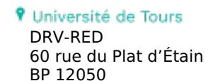

Tours, le 4 mars 2025

Le Président de l'université

à

Mesdames et Messieurs les directeurs d'unités de recherche

Mesdames et Messieurs les directeurs d'institut, d'école et d'UFR

Mesdames et Messieurs les responsables Administratifs

Mesdames et Messieurs les Correspondants Recherche International Mesdames et Messieurs les référents des chercheurs invités

**Objet** : Note sur l'accueil de chercheurs invités sur décision du conseil académique en formation restreinte

Par décision en date du 7 juillet 2014, le Conseil d'Administration a décidé de créer un statut de chercheur invité propre à l'Université de Tours s'intégrant dans les dispositions réglementaires du décret n°85-733 du 17 juillet 1985 relatif aux Maîtres de conférences et Professeurs associés ou invités.

Cette décision vise à promouvoir l'accueil de chercheurs travaillant dans des établissements d'enseignement supérieur ou de recherche étrangers dans les unités de recherche de l'Université. L'objectif est de construire ou renforcer des échanges internationaux avec des individus ou des organismes, au service de la recherche et de la circulation des cultures, savoirs et technologies.

# 1) Principes généraux.

Ce statut et cette procédure s'adressent à toute personne, de nationalité française ou étrangère, exerçant (ou ayant exercé) et résidant à l'étranger et dont les compétences et le projet associé à la demande sont jugés intéressants pour l'Université dans le domaine de la recherche, de la valorisation ou du montage de projets internationaux. Il s'agit, en particulier, de personnes exerçant des fonctions d'enseignement ou de recherche dans un établissement étranger d'enseignement supérieur ou de recherche. Les candidats doivent prouver qu'ils sont rémunérés par un organisme reconnu dans les domaines considérés.

La limite d'âge est fixée à 67 ans.

La durée des invitations proposées est de 1 à 3 mois. Une rémunération et une prise en charge des frais de séjour sont proposées. Elles seront limitées à la durée de l'invitation.

### 2) Procédure

La nomination des chercheurs invités se fait à partir d'un appel d'offres annuel géré par le Service de la Recherche et des Etudes Doctorales de l'Université.

#### a. Constitution du dossier

Les dossiers sont transmis par les unités de recherche sous couvert du Directeur de composante et comportent :

- **N**
- Un CV court du visiteur incluant la liste argumentée de ses 5 publications et de ses 5 expériences de recherche les plus significatives,
- le proposition de la company de la company de la company de la company de la company de la company de la company de la company de la company de la company de la company de la company de la company de la company de la company de la company de la company de la company de la company de la company de la company de la company de la company de la company de la company de la company de la company de la company de la company de la company de la company de la company de la company de la company de la company de la company de la company de la company de la company de la company de la company de la company de la company de la company de la company de la company de la company de la company de la company de la company de la company de la company de la company de la company de la company de la company de la company de la company de la company de la company de la company de la company de la company de la company de la company de la company de la company de la company de la company de la company de la company de la company de la company de la company de la company de la company de la company de la company de la company de la company de la company de la company de la company de la company de la company de la company de la company de la company de la company de la company de la company de la company de la company de la company de la company de la company de la company de la company de la company de la company de la company de la company de la company de la company de la company de la company de la company de la company de la company de la company de la company de la company de la company de la company de la company de la company de la company de la company de la company de la company de la company de la company de la company de la company de la company de la company de la company de la company de la company de la company de la company de la company de la company de la company de la company de la company de la company de la company de la company de la company de la company de la company de la company de la company de la company
- la durée de visite demandée doit être argumentée, et les dates de visites envisagées doivent être précisées,
- l'avis motivé du Directeur d'unité.

Les différentes demandes émanant d'une même unité de recherche devront être classées.

## b. Examen des dossiers

La sélection des demandes sera effectuée par la commission recherche en formation restreinte avant un passage devant le CAC en formation restreinte.

Les critères de sélection sont les suivants :

- proposition venant de l'unité de recherche et s'inscrivant dans sa politique scientifique
- qualité du projet et du candidat (CV)
- **D**
- intérêt pour une équipe au de-delà du seul référent
- interventions dans les formations (master et doctorat)
- justification de la durée (pour les séjours de 2 ou 3 mois)

Les unités de recherche ayant déposé un ou plusieurs dossiers seront avisées du résultat par courriel émanant du service de la recherche

Un retour d'information sera fait annuellement en réunion de la commission recherche sur cette action.

37020 Tours Cedex 1

#### C. Formalités administratives

Les composantes s'assureront que les chercheurs invités sur décision du Conseil Académique puissent jouir de toutes les facilités accessibles aux enseignants-chercheurs de l'université (ressources bibliographiques, systèmes d'information, accès salles de travail et de réunion...).

## d. Accompagnement par le Centre de Services EURAXESS

Chaque chercheur invité bénéficiera de l'accompagnement du Centre de Services EURAXESS (Direction des Relations Internationales) avant et pendant toute la durée de son séjour. En collaboration avec le référent au sein de l'unité de recherche, le Centre de Services EURAXESS accompagnera personnellement le chercheur invité dans les procédures administratives et consulaires, la recherche d'hébergement, l'aide à l'installation et toutes démarches liées à son séjour.

Le Centre de Services sera saisi le plus tôt possible et au moins deux mois avant l'arrivée du chercheur. Un dossier à compléter sera alors communiqué. Il devra être retourné, dans les meilleurs délais, accompagné des pièces justificatives. Parmi ces pièces, un accord réciproque précisant les dates et conditions d'accueil ainsi que les engagements de chaque partie, sera signé entre l'invité, le référent et le président de l'université de Tours.

- 3) Le versement du traitement et le remboursement des frais.
  - a. Les conditions de rémunération et d'indemnisation

Conformément aux dispositions en vigueur, le montant de la rémunération est fixé en référence :

- A l'un des indices bruts afférents à la 2ème ou à la 1ème classe des professeurs des universités régis par le décret du 6 juin 1984
- A l'un des indices bruts afférents à la classe normale des maîtres de conférences régis par le décret du 6 juin 1984

Lorsque le chercheur invité ne peut pas percevoir de rémunération de l'Université de Tours par décision de son établissement de rattachement principal, alors l'université de Tours peut prendre en charge le coût du transport, en partie ou intégralement.

En complément de cette rémunération, le chercheur invité bénéficie de la prise en charge de frais annexes selon les conditions exposées ci-après :

- Le chercheur invité s'engage à régler lui-même ses frais de repas. Ces frais à hauteur de 2 repas par jour lui seront remboursés par l'université de Tours de manière forfaitaire par l'Université . Une avance de 75 % du montant forfaitaire des frais de repas calculés sur la période couvrant l'intégralité du séjour sera versée dans les premiers jours après l'arrivée. Le remboursement du solde restant de ces frais s'effectuera en fin de séjour à réception du certificat administratif de service fait.
- Le chercheur invité sera prioritairement logé à la Résidence du Monde sous réserve des disponibilités au moment de sa venue. Les frais d'hébergement sont pris en charge par l'établissement sur présentation d'un justificatif et dans la limite du montant du loyer mensuel de la Résidence du Monde du CROUS à Tours en vigueur à la date de l'accueil.

Les frais d'hébergement seront remboursés à l'issue du séjour.

Les frais de transport peuvent être pris en charge, en partie ou intégralement, par l'unité de recherche d'accueil.

### b. Le versement du traitement

NA NA NA NA NA NA NA NA NA NA NA NA NA N la DRH à l'issue du séjour. Ce versement sera effectué sur la base d'un certificat administratif de « service fait » signé par le directeur de l'unité de recherche (cf.modèle joint) et transmis dans les meilleurs délais au centre de service EURAXESS.

Le versement effectif du salaire interviendra dans un délai d'un à deux mois minimums à compter de la réception de ce certificat.

Pour une invitation d'un mois, la rémunération est versée urr la base d'un forfait de travail **N** 

Le versement du traitement ne pourra intervenir qu'après signature et réception par la DRH du Procès-Verbal d'Installation (PVI).

## 4) Valorisation des séjours et rapports

Les chercheurs invités doivent donner au moins un séminaire d'intérêt général sur leur activité en collaboration avec l'université. Ils doivent, d'autre part, être encouragés à participer aux séminaires doctoraux et à la formation des doctorants de l'université.

L'apport à l'université de ces nominations de chercheurs invités doit pouvoir être valorisé par l'établissement. A A cette fin, chaque visiteur doit rendre, à l'issue de son séjour, un rapport synthétique qui doit être adressé au Service de la Recherche et des Études doctorales pour examen par la commission recherche.

Le Président de l'université de Tours,

Philippe ROINGEARD

Signé électroniquement par Le Président de l'Université de Tours Philippe Roingeard Le 06/05/2025 à

18.13

