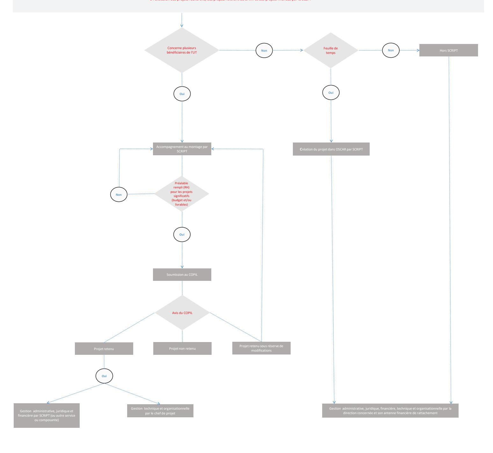
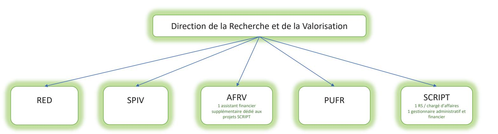

# NOTE SUR LA CREATION DE SCRIPT (ServiCe d'ingénieRle des Projets Transversaux)

#### **OBJET**

Cette note a pour but de présenter le service d'ingénierie des projets transversaux (SCRIPT), sa composition, son périmètre d'intervention et son fonctionnement.

Cette note s'applique à compter du 01/09/2023, elle a été modifiée et validée par le COPIL du SCRIPT du 25/01/2024 (sous réserve).

#### PÉRIMÈTRE ET COMPOSITION DU SERVICE

Le service aura pour mission l'aide au montage <u>des projets transversaux</u> déposés auprès d'un financeur public (ANR, FEDER ou autres) et qui concernent plusieurs bénéficiaires (composantes, unités ou directions) au sein de l'établissement. Il s'agit également d'instruire tout projet nécessitant la mise en place de feuille de temps.

Par ailleurs, il n'interviendra pas dans les projets relevant uniquement de la recherche, les projets relevant du BAIM, les projets financés par la SCSP, les contrats de prestation

À noter : Le logigramme en annexe précisera le périmètre d'intervention et le circuit décisionnel du service.

en en en en en en en en en en en en en e

A sa création, il sera composé de deux-agents : (cf. Fiches de poste en annexe 1)

- Un.e responsable de service (cat A)
- Un.e gestionnaire administratif et financier (cat c ou b)

En outre, il est dédié au sein de l'AFRV un.e assistant financier pour le suivi financier et les bilans financiers (cat b)

#### MISSIONS DU SERVICE

Le service SCRIPT a pour mission principale :

- l'aide au montage administratif, juridique et financier des projets transversaux subventionnés par un financeur public en lien avec les coordonnateurs ou coordonnatrices,
- le suivi administratif et financier et leur justification pour les projets retenus par le COPIL et attribués pour gestion au SCRIPT (voir les modalités décrites ci-dessous).

Il assure également une veille sur les appels à projets et les dispositifs de financements de son périmètre.

#### Accompagnement au montage de projets

Lorsqu'un coordonnateur ou une coordonnatrice souhaite déposer un projet transversal, celui-ci ou celle-ci doit passer par le service SCRIPT, pour être accompagné.e dans le montage juridique, financier et administratif du projet. Le service accompagnera le coordonnateur ou la coordonnatrice sur la constitution du dossier de demande de financement, fournira en lien avec le coordonnateur ou la coordonnatrice les justificatifs attendus lors du dépôt, afin de répondre aux attentes du financeur tout en respectant l'intégralité et la soutenabilité du projet.

La saisine du service est **obligatoire** en amont de tout dépôt de projet.

Pour tout dossier n'ayant pas fait l'objet d'un passage par le service et une validation de son dépôt par le Comité de pilotage et validation des projets (voir description ci-après de ce COPIL) la Présidence se réserve le droit de refuser le

projet. Le service doit être contacté au plus tôt afin de contrôler et vérifier la soutenabilité du dossier de demande de financement qui devra être validé lors du comité de pilotage.

Le coordonnateur ou la coordonnatrice devra s'assurer du pilotage sur toute la durée du projet. Pour un projet significatif en termes de budget et/ou de livrables, un chef ou cheffe de projet pourra être recruté-e ou désigné-e. Ce dernier ou cette dernière devra être, dès le démarrage du projet, soit directement recruté.e (sous réserve de son financement total par le projet) ou être un personnel présent dans l'établissement, dont la durée du contrat est a minima égale à celle du projet. En cas de recrutement d'un CDD, le lieu de travail devra être défini lors du montage.

Ce chef ou cheffe de projet assure la coordination technique et organisationnelle du projet, fonction assurée par le coordonnateur ou la coordonnatrice si un tel recrutement n'est pas prévu (ou tant que le recrutement n'est pas effectif). Tout projet ne répondant pas à ce préalable (recrutement d'un chef ou cheffe de projet et/ou désignation d'un coordonnateur ou d'une coordonnatrice) ne sera pas soumis à la validation du comité de pilotage.

### 

La ou le responsable du service SCRIPT présente les dossiers de demande de financement lors d'un comité de pilotage.

#### **Composition:**

Membres permanents avec voix décisionnelle :

- La vice-présidente en charge des moyens (finances et emplois)
- Le DGS
- La DRV ou son représentant

Membres invités selon l'ordre du jour avec voix consultative :

- Un.e ou deux vice-président.es dont le périmètre recouvre celui du projet proposé
- Une ou les directrice(s) ou un ou les directeur(s) du domaine concerné

#### Rôle:

Ce comité devra valider la faisabilité des projets sur le plan technique, organisationnel et financier, et sur les modalités de gestion des projets en cas d'accord ultérieur du financeur (tous les projets ne seront pas nécessairement gérés par le SCRIPT). Pour ce faire, le COPIL devra étudier un dossier complet, qui sera transmis quinze jours au moins avant la date de la commission.

Le dossier de soumission est composé à minima des pièces et/ou éléments suivants :

- Le cahier des charges du financeur
- Le descriptif et les objectifs du projet
- Le budget global détaillé du projet en recette et dépense
- Les livrables attendus
- La grille d'analyse du projet

Le coordonnateur ou la coordonnatrice se rendra disponible pour présenter le projet au COPIL, ainsi que le chef de projet s'il est connu et recruté à ce moment.

À la suite de la présentation du dossier, le COPIL pourra émettre trois types d'avis motivés :

- -Projet non retenu,
- -Projet retenu sous réserve de modifications,
- -Projet retenu.

La ou le responsable du service SCRIPT transmettra dans les 48 heures suivant le COPIL la décision motivée au coordonnateur ou à la coordonnatrice, qui précisera l'entité en charge du suivi du projet.

Le COPIL se réunira une fois par mois (si des projets doivent être examinés). Les dates de commissions seront définies en début d'année.

Dans le cadre des dossiers répondant à un appel à projets avec une date fixe, le COPIL devra se réunir au plus tard 15 jours avant la date butoir de remise du dossier aux financeurs. En fonction de la décision du COPIL, le service finalisera le dossier pour transmission au financeur.

## En cas de gestion des projets par le script

#### **Recrutements:**

La ou le chef(fe) de projet sera rattaché(e) fonctionnellement sur toute la durée du projet au coordonnateur ou à la coordonnatrice et rattaché(e) hiérarchiquement et administrativement au SCRIPT. Une dérogation à cette disposition pourra être validée par le COPIL, sur justification de l'intérêt d'une autre organisation.

Tous les autres personnels recrutés sur le projet seront rattachés hiérarchiquement au chef de projet et administrativement aux structures (composantes, unités de recherche ou services) dont leur activité dépend. Les structures de rattachement et lieux de travail <u>auront été</u> précisés en amont du dépôt du projet.

#### **Contractualisation des projets:**

Une fois le dossier accepté par le financeur, une convention de financement est transmise au service SCRIPT pour validation, avant mise à la signature du Président. Le service prendra également en charge la contractualisation avec les différents partenaires du projet.

La Direction des Affaires Juridiques et du Patrimoine validera tous les contrats avant signature via l'application VISA DAJ.

### or example 2 in the second of the second of the second of the second of the second of the second of the second of the second of the second of the second of the second of the second of the second of the second of the second of the second of the second of the second of the second of the second of the second of the second of the second of the second of the second of the second of the second of the second of the second of the second of the second of the second of the second of the second of the second of the second of the second of the second of the second of the second of the second of the second of the second of the second of the second of the second of the second of the second of the second of the second of the second of the second of the second of the second of the second of the second of the second of the second of the second of the second of the second of the second of the second of the second of the second of the second of the second of the second of the second of the second of the second of the second of the second of the second of the second of the second of the second of the second of the second of the second of the second of the second of the second of the second of the second of the second of the second of the second of the second of the second of the second of the second of the second of the second of the second of the second of the second of the second of the second of the second of the second of the second of the second of the second of the second of the second of the second of the second of the second of the second of the second of the second of the second of the second of the second of the second of the second of the second of the second of the second of the second of the second of the second of the second of the second of the second of the second of the second of the second of the second of the second of the second of the second of the second of the second of the second of the second of the second of the second of the second of the second of the second of the second of the second of the second of

Le service SCRIPT effectuera la saisie complète du dossier dans l'application **OSCAR** afin d'effectuer le suivi des projets et également le paramétrage des feuilles de temps pour les projets le nécessitant.

Le suivi des projets au niveau financier (bons de commande, prise en charge financière...) sera effectué par ce service avec une validation de l'assistant financier dédié.

Ce dernier effectuera le suivi financier, la réalisation des bilans financiers et la mise en signature de l'Agent Comptable et du Président.

Si nécessaire, les frais de structures prévus pourront permettre le recrutement de gestionnaires administratifs et financiers supplémentaires rattachés au SCRIPT.

Le suivi de la saisie des feuilles de temps ainsi que leur validation et leur archivage seront effectués conformément à la note sur l'utilisation d'OSCAR.

Les coordonnateur(trices)s assureront la réalisation du projet (pilotage du projet, réalisation du ou des livrables (hors bilan financier).

En cas d'audit des financeurs, le coordonnateur ou coordonnatrice en lien avec le service répondra aux différentes questions. Toutes les demandes de modifications du projet devront être effectuées par le service SCRIPT, en lien avec le coordonnateur ou coordonnatrice. En cours de projet, il pourra transmettre au COPIL des restitutions sur l'avancement des projets. En fin de projet le service présentera un bilan du projet et soumettra à l'approbation du COPIL les suites à donner.

### **TEXTES DE RÉFÉRENCE**

- La note sur la gestion des feuilles de temps sous l'appli OSCAR
- La note sur la gestion des frais de structure selon la typologie de projet

# CALENDRIER DE DÉPLOIEMENT

- Passage au CSA du 22-06-2023
- Application de la note à compter du : 01-09-2023

#### **ANNEXES**

- and the service of the service of the service of the service of the service of the service of the service of the service of the service of the service of the service of the service of the service of the service of the service of the service of the service of the service of the service of the service of the service of the service of the service of the service of the service of the service of the service of the service of the service of the service of the service of the service of the service of the service of the service of the service of the service of the service of the service of the service of the service of the service of the service of the service of the service of the service of the service of the service of the service of the service of the service of the service of the service of the service of the service of the service of the service of the service of the service of the service of the service of the service of the service of the service of the service of the service of the service of the service of the service of the service of the service of the service of the service of the service of the service of the service of the service of the service of the service of the service of the service of the service of the service of the service of the service of the service of the service of the service of the service of the service of the service of the service of the service of the service of the service of the service of the service of the service of the service of the service of the service of the service of the service of the service of the service of the service of the service of the service of the service of the service of the service of the service of the service of the service of the service of the service of the service of the service of the service of the service of the service of the service of the service of the service of the service of the service of the service of the service of the service of the service of the service of the service of the service of the service of the service of the service of th
- 2. L'organigramme de la DRV
- 3. Les fiches de poste des personnels
- 4. La grille d'analyse du projet

## 

Ne porte que sur les projets transversaux déposés auprès d'un financeur public (ANR, FEDER ou autre) à l'exclusion des projets recherche, des projets relevant du BAIM et des projets financés par la SCSP.

# Organigramme de la DRV –Rentrée 2023 Création du service SCRIPT

# Grille d'analyse – Projet soumis à l'avis du COPIL du SCRIPT

| Nom et durée du projet                                                           |  |
|----------------------------------------------------------------------------------|--|
| Etablissement porteur                                                            |  |
| Partenaires                                                                      |  |
| Coordonnateur                                                                    |  |
| Financeur et appellation du financement                                          |  |
| Objectif du projet pour l'UT                                                  |  |
|                                                                                  |  |
| Subvention demandée                                                              |  |
| Apports ou cofinancements                                                        |  |
| Coût total du projet                                                             |  |
| Chaf da projet                                                                   |  |
| Chef de projet Rattachement hiérarchique et administratif / Localisation bureaux |  |
| Autres recrutements prévus  Rattachements administratifs / Localisation bureaux  |  |

# Grille d'analyse – Projet soumis à l'avis du COPIL du SCRIPT

| Nature de l'investissement                                                                 |               |
|-----------------------------------------------------------------------------------------------|---------------|
| Frais de gestion (%) et répartition                                                           |               |
| TVA                                                                                           |               |
|                                                                                               |               |
| Etudiants concernés (nombre et UFR de rattachement)                                     |               |
| Recherche                                                                                     |               |
| Bénéficiaires du projet au sein de l'UT (composantes, unités ou directions, usagers) |               |
| Acteurs impliqués au sein de l'UT                                                             |               |
| Autre aspect transversal du projet de l'UT                                                    |               |
| Besoin feuille de temps                                                                       |               |
|                                                                                               |               |
| AVIS DU SCRIPT                                                                                |               |
| AVIS DU COPIL ET SIGNATURE 25 janvier 2024                                              | Avis motivé : |